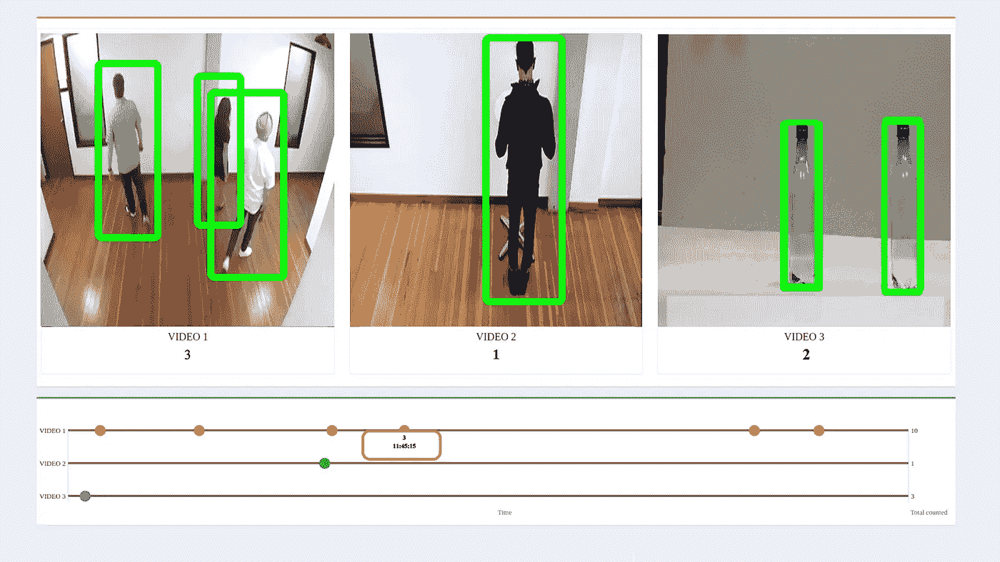
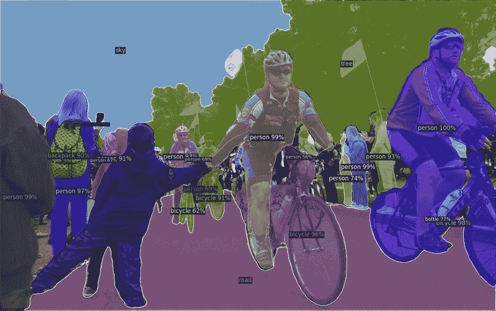

# 2020 年具有开源架构的计算机视觉

> 原文：<https://medium.com/analytics-vidhya/computer-vision-with-open-source-architectures-in-2020-8acc25042443?source=collection_archive---------20----------------------->

为计算机视觉领域的每个人介绍开源库。

深度学习有一个很好的研究社区和市场，可以为每个人的更好生活产生资源。一年前，我开始了我的深度学习之旅，在这个 3 部分系列中，我概述了 Vision 中的一些细节，一个 6 个月大的我会欣赏。

# 3 部分概述:

1.  计算机视觉领域的开源软件介绍。
2.  [用火灾探测训练一个模型和一个例子。](/@manojkesani/object-detection-using-tensorflow2-3422da78b33e)
3.  [使用卷积自动编码器的无监督图像检索](/@manojkesani/unsupervised-image-retrieval-using-convolutional-auto-encoder-9d9d6db880e5)

> 在我们开始任何 DL 模型之前，Open-CV(英特尔的一个开源库)是任何在 vision 工作的人都应该熟悉的基本库。它就像图像的 numpy。PIL 也可以用于最小的开销。

## 我们从概述提供的库开始

*   *英特尔..*(开酒)
*   *英伟达……*(深溪)
*   *谷歌……..*(张量流)
*   *脸书……..*(检测器 2)

要考虑的一个主要问题是，图像处理是在现场(边缘)进行，还是可以在异地(云)进行。这将有助于确定所需的硬件。英特尔拥有可现场部署的 CPU 和 FPGA 架构。NVIDIA 有 GPU，可以在云端使用。

1.  **英特尔的公开 Vino**

英特尔通过训练模型为行业提供解决方案，并将其公之于众。这些模型可以通过使用他们的开放 VINO 工具包来运行。该工具包经过了很好的优化，可以在他们的硬件上运行，特别是第 6 代和更高版本。我们可以在 open vino 上运行我们自己的模型，方法是将我们的模型转换成 ONNX 模型，然后用它来创建 Open Vino 可以运行的二进制文件。还提供了转换器。

2 **。NVIDIA 深流**

与 Open VINO 类似，NVIDIA 拥有自己的软件堆栈，这有利于在他们的硬件上使用。使用它的主要集合是使用 TensorRT 转换出模型。这个库有助于模型量化、剪枝和层融合。这些技术有助于提高我们模型的吞吐量

3 **。TensorFlow 对象检测 API**

TensorFlow GitHub

你可能熟悉 TensorFlow，这是一个深度学习库，由谷歌在 2016 年开源并维护。它有很好的[对象检测 API](https://github.com/tensorflow/models/tree/master/research/object_detection) 。这曾经只支持 TensorFlow 1.15，但在 2020 年 11 月 7 日支持 TF 2。*与 efficientDet(D0-D7)等型号一起发布，可能会推出更多型号。我将在本系列的下一部分讨论模型。

4.**探测器 2**

检测器 2 GitHub

Detectron2 脸书人工智能研究所的下一代软件系统，实现对象检测算法。它是在 PyTorch 中实现的，训练它的速度惊人的快。这个图书馆有著名的视网膜网络

在下一部分，我们将开始在一个简单的火灾探测数据集上训练一个来自 keras 的模型。