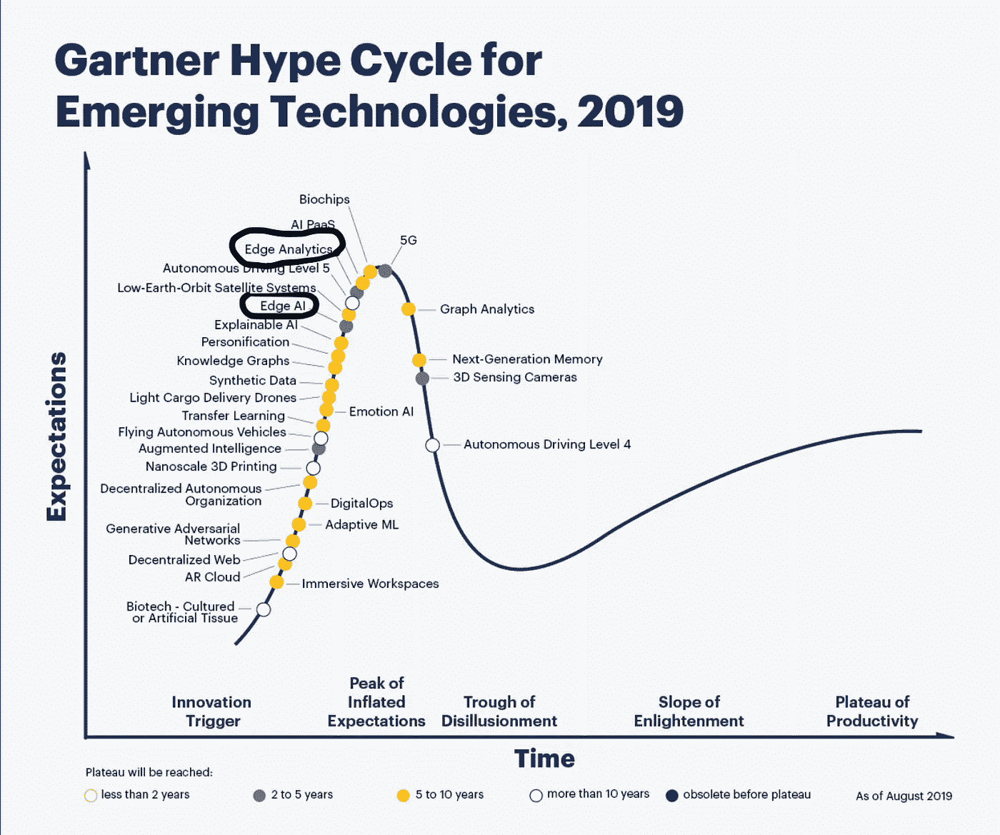
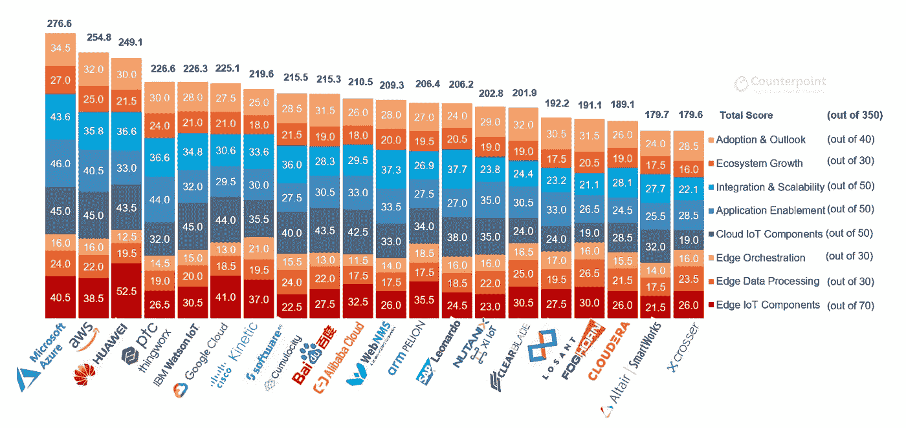
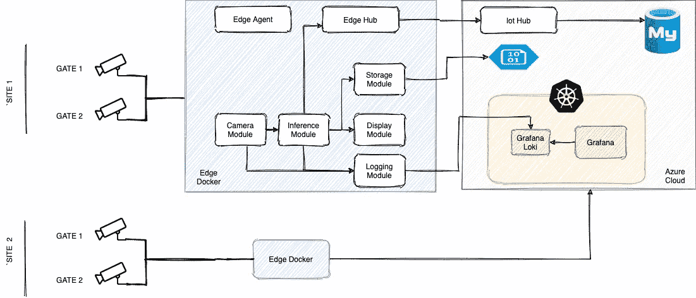

# 边缘计算

> 原文：<https://medium.com/analytics-vidhya/computing-on-the-edge-4575ad39c8f4?source=collection_archive---------11----------------------->

当今时代的大多数公司都在向云迁移，以满足他们的计算和存储需求。云为各方面的服务需求提供了一站式解决方案，无论是大规模处理、ML 模型培训和部署，还是大数据存储和分析。这同样需要将数据、视频或音频移动到云中进行处理和存储，与在客户端进行处理相比，这也有一定的缺点

*   网络延迟
*   网络成本和带宽
*   隐私
*   单点故障

从另一方面来看，云有其自身优势，我现在不会谈论它们。考虑到所有这些，那么一种混合方法怎么样呢？在这种方法中，很少的需求可以转移到客户端，而一些需求保留在云上。这就是边缘计算的用武之地。根据维基这里的定义是一样的

> "**边缘计算**是一种[分布式计算](https://en.wikipedia.org/wiki/Distributed_computing)范例，它将[计算](https://en.wikipedia.org/wiki/Computation)和[数据存储](https://en.wikipedia.org/wiki/Data_storage)带到更靠近需要的位置，以缩短响应时间并节省带宽"

Edge 有很多使用案例，例如

*   经过训练的 ML 模型(特别是视频和音频)位于推理或预测的边缘。
*   面向边缘大规模机器的物联网数据分析

*看看 Gartner 对新兴技术的炒作周期。Edge 的势头越来越大。*



炒作周期 2019

市场上有许多专门从事云解决方案边缘部署的平台，如 *azure iot hub、aws greengrass* ..、开源如 *kubeedge、edgeX-Foundary* 和第三方如 *Intellisite* 等。

*我将把这篇文章的重点放在使用面部识别在 edge 上构建“出席平台”的平台上。我会添加尽可能多的链接供您参考。*

*让我们从迈出第一步并定义需求开始*

*   从摄像机中捕捉视频
*   基于训练的 ML 模型识别人脸
*   在显示器上显示带有已识别人脸的视频内容
*   在数据库中记录出勤情况
*   收集日志和指标
*   将未识别的图像保存到中央存储库，用于重新训练和改进模型
*   多站点部署

# 选择平台

从这么多选项中选择合适的平台有点棘手。对于概念验证，我们关注了平台中的几个部分

*   定价
*   基础设施维护
*   学习曲线
*   易用性

还有其他指标，但这些是我们最关心的。就上述评估而言，Azure IoT 看起来相当不错。我们还查看了 Kubeedge，它在边缘上提供了 Kubernetes 上的部署。它是开源的，看起来很有前途。考虑到涉及维护开销的许多组件(云和边缘)，我们决定不推进开源。我们已经将 Azure cloud 用于其他云基础设施，这也使得我们在选择这个平台时更加容易。这个也有帮助



领先的平台玩家

# 设计解决方案

Azure 物联网中心提供了 2 个主要组件。一个是云组件，负责管理 edge 上的部署并从其中收集数据。另一个是边缘组件，包括

*   ***边缘代理*** :管理物联网边缘设备上模块的部署和监控
*   ***边缘集线器*** :处理物联网边缘设备上模块之间以及设备与物联网集线器之间的通信。

我就不赘述了，你可以在这里[找到更多关于 Azure IoT edge 的细节](https://docs.microsoft.com/en-us/azure/iot-edge/about-iot-edge?view=iotedge-2018-06)。简而言之，Azure edge 要求模块作为容器，可以被推到边缘。边缘设备首先需要向物联网集线器注册。一旦边缘代理与中心连接，您就可以使用一个 *deployment.json* 文件来推送您的模块。Azure Edge 使用的容器运行时是 [moby](https://mobyproject.org/) 。

我们使用 Azure 物联网免费层，这足以满足我们的概念验证。点击查看价格

根据概念验证的要求，这是我们得出的结论



边缘上的考勤平台

该解决方案由部署在边缘的各种容器以及少量云部署组成。随着我们的进展，我将详细讨论每个组件。

作为 POC 的一部分，我们假设有两个站点需要在多个入口进行考勤。为了模拟，我们创建了 4 台 ubuntu 机器。这是我们用的 [ubuntu 桌面图](https://releases.ubuntu.com/18.04.5/?_ga=2.236886082.233643260.1602845975-685238289.1601458615)。为了方便出席，我们制作了一个视频，里面有一些电影明星 T21 和运动员 T23 的静态照片。这些视频将用于考勤，以模拟摄像头，每个大门一个。

# 活动模块

## 相机模块

它捕获 IP 摄像机的输入，并推送帧以供使用

*   它使用 python *opencv* 进行捕获。对于 POC，我们读取推入容器的视频文件。
*   帧发布到 *zeromq* (无代理消息队列)。
*   使用 [python3-opencv](https://hub.docker.com/r/jjanzic/docker-python3-opencv) docker 容器作为基础映像，使用 [pyzmq](https://pypi.org/project/pyzmq/) 模块作为 mq。查看[这篇博客](https://www.pythonforthelab.com/blog/using-pyzmq-for-inter-process-communication-part-2/)了解如何将 zeromq 与 python 结合使用。

该模块被配置为使用许多环境变量，其中一个是视频帧的采样率。处理所有帧需要大量内存和 cpu，因此丢弃帧以减少 CPU 负载始终是明智的。这可以在相机模块或推理模块中完成。

## 推理模块

*   使用了一个[预先存在的人脸识别](https://www.pyimagesearch.com/2018/09/24/opencv-face-recognition/)深度学习模型来满足我们的推理需求。
*   用容易获得的*电影明星*和*运动员*图像训练模特。
*   该模型没有使用视频中出现的几幅图像进行训练，以展示未检测到的图像用例。这些未被检测到的图像被存储在 ADLS gen2 中，在存储模块中有所解释。
*   Python *pyzmq* 模块用于消耗相机模块发布的帧。
*   根据通过环境变量设置的配置，不是每个帧都被处理，只有少数帧被丢弃。
*   一旦图像被识别，出席的消息(json)就通过物联网边缘中枢被发送到云端。使用[这个](https://docs.microsoft.com/en-us/azure/iot-edge/module-composition?view=iotedge-2018-06#declare-routes)在你的部署文件中指定路线。

## 显示组件

来自推理模块的经过处理的帧被传递到显示模块以在屏幕上显示。为了从集装箱访问显示端口，几乎没有挑战。opencv 再次用于显示。下面是运行容器来访问 linux 机器上的显示端口时使用的命令。

```
docker run --privileged -e DISPLAY=${DISPLAY} -v /tmp/.X11-unix:/tmp/.X11-unix <image>
```

稍后我将展示如何通过 Edge 代理传递部署文件。

## 存储体

来自推理模块的未识别图像存储在该容器中。该模块充当本地存储，并根据配置何时将所有这些映像发送到云(ADLS 第二代存储)。我们使用预先创建的 azure blob 存储容器来满足我们的需求`*azure-blob-storage:1.3-linux-amd64*`。更多详情可以关注[这个](https://github.com/MicrosoftDocs/azure-docs/blob/master/articles/iot-edge/how-to-store-data-blob.md)和[这个](https://docs.microsoft.com/en-us/azure/iot-edge/how-to-store-data-blob?view=iotedge-2018-06)。

## 记录模块

日志模块也让我们部署云组件。因为我们已经部署了 grafana 和 loki，所以我们考虑用它们作为我们的日志基础设施。

*   Docker 提供日志记录驱动程序，将容器日志发送给驱动程序。格拉夫纳-洛基使用催情剂。Docker 官方仍然不支持这个驱动，所以我们使用 fluentd 作为日志驱动。查看[此处](https://docs.docker.com/config/containers/logging/configure/)了解详情。
*   [Fluentd 容器](https://hub.docker.com/r/fluent/fluentd/)配置为将所有容器日志发送到 grafana-loki。同样，在每个容器日志中发送必要的标记，以区分日志中的不同部署和容器。
*   Grafana 和 [loki](https://grafana.com/docs/loki/latest/installation/helm/) 是使用 AKS ( Azure kubernetes)上的舵图安装的。
*   [AKS](https://docs.microsoft.com/en-us/azure/aks/concepts-storage)(azure 文件)中的新存储类是为持久存储创建的，供 loki 用于日志存储。

## SQL 中的出勤

*   推理模块一旦检测到帧，就向云上的物联网集线器发送消息
*   这个消息以 json 的形式存储在 eventhub 中，可以配置一个保持期。
*   运行在 kube 集群中的 python 消费者解析消息并将其存储在 Azure mysql 服务中。

我不会深入消费者的细节。它是一个 python eventhub 消费者，从 eventhub 主题中读取数据并写入 mysql。

# 部署

使用部署文件管理和部署所有这些解决方案是非常容易的，在部署文件中，您可以为 edges、环境变量、docker 运行配置等定义模块。Azure 提供模板化的部署文件。下面是部署文件中显示模块的一个片段

```
"display": {
   "version": "1.0",
   "type": "docker",
   "status": "running",
   "restartPolicy": "always", 
   "settings": {
       "image": "${MODULES.display}",
       "createOptions": {
           "Env": [
              "DISPLAY=:0"
           ],
       "HostConfig": {
          "Binds": [
            "/tmp/.X11-unix:/tmp/.X11-unix"
          ],
          "Privileged": true
       }
    }}}
```

同样，门户提供了许多选项来使用 UI 配置和管理部署。部署速度也非常快，一旦安装了边缘代理，部署后几分钟机器就启动并运行了。

> 我们没有在 windows 机器上进行实验。最近在 windows 操作系统中增加了对 LCOW(Windows 上的 Linux 容器)的支持。你可以在这里阅读更多关于这个[的内容。](https://docs.microsoft.com/en-us/virtualization/windowscontainers/deploy-containers/linux-containers)

我认为 edge 在未来有巨大的潜力，特别是随着深度学习模型变得更轻更智能，将它们推到处理需求低的边缘变得很容易。