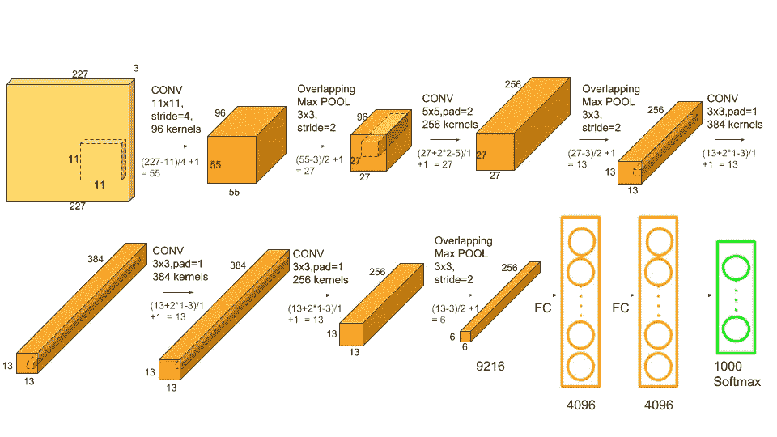
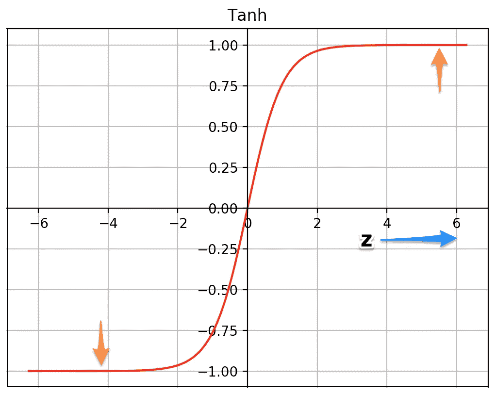

# AlexNet 的概念:-卷积神经网络

> 原文：<https://medium.com/analytics-vidhya/concept-of-alexnet-convolutional-neural-network-6e73b4f9ee30?source=collection_archive---------4----------------------->

本文包括九个部分:

1.  AlexNet 是什么？
2.  AlexNet 的架构。
3.  数据集。
4.  雷鲁。
5.  辍学。
6.  AlexNet 的优点。
7.  AlexNet 的缺点。
8.  使用 Python 的 AlexNet。
9.  结论。

# AlexNet 是什么？

一个 [lexNet](https://papers.nips.cc/paper/4824-imagenet-classification-with-deep-convolutional-neural-networks.pdf) 是一个**卷积神经网络架构**的名字，它在 **2012** 赢得了 LSVRC 竞赛。

LSVRC **(** 大规模视觉识别挑战)是一项竞赛，研究团队在一个巨大的标记图像数据集( **ImageNet** )上评估他们的算法，并竞争在几项视觉识别任务上实现更高的准确性。这对团队之后如何完成工作产生了巨大的影响。

# AlexNet 的体系结构

**AlexNet 包含 8 层**带重量；

**5 个卷积层**

**3 个全连接层**。

在每一层的末端，执行 ReLu 激活，除了最后一层，其输出具有分布在 1000 个类标签上的 softmax。前两个完全连接的层中应用了下降。如上图所示，在第一、第二和第五卷积层之后也应用最大池。第二层、第四层和第五层卷积层的内核仅连接到前一层的内核映射，这些内核映射驻留在同一个 GPU 上。第三卷积层的核连接到第二层中的所有核映射。完全连接层中的神经元连接到前一层中的所有神经元。

# 资料组

mageNet 是一个图像数据库，包含超过 1500 万张标记为 22000 个类别的高分辨率图像。该比赛使用 ImageNet 的图像子集，并要求研究人员实现最低的前 1 名和前 5 名错误率。AlexNet 的输入是大小为 256×256 的 RGB 图像。这意味着训练集中的所有图像和所有测试图像的大小都需要为 256×256。也就是说，在使用它来训练网络之前，需要将其转换为 256×256。

# 热卢

AlexNet 的一个重要特征是使用 ReLU(校正线性单元)非线性。

Tanh 或 sigmoid 激活函数曾经是训练神经网络模型的常用方法。

AlexNet 表明，使用 ReLU 非线性，深度 CNN 可以比使用饱和激活函数(如 tanh 或 sigmoid)更快地训练。

在 CIFAR-10 数据集上测试。

让我们看看为什么它用 ReLUs 训练得更快。ReLU 函数由下式给出

f(x) = max(0，x)

两个函数的曲线图—

**1。tanh**

**2。雷鲁。**

www.learnopencv.com[图片来源](http://www.learnopencv.com)

图片来源[www.learnopencv.com](http://www.learnopencv.com)

当 z 值非常高或非常低时，双曲正切函数会饱和，在这些区域，函数的斜率非常接近于零。这可以减缓梯度下降。

对于 z 的较高正值，ReLU 函数的斜率不接近零。这有助于优化更快地收敛。对于 z 的负值，斜率仍然为零，但是神经网络中的大多数神经元通常以正值结束。

**出于同样的原因，ReLU 也优于 sigmoid 函数。**

> **过拟合问题。** AlexNet 有 6000 万个参数，这是过度拟合方面的一个主要问题。

减少过度拟合的两种方法:

1.  **数据扩充**
2.  **辍学。**

# **数据扩充。**

作者生成了图像翻译和水平反射，到 2048 年增加了训练集。他们还对 RGB 像素值执行了主成分分析(PCA ),以改变 RGB 通道的强度，从而将 top-1 错误率降低了 1%以上。

# 拒绝传统社会的人

AlexNet 用来避免过度拟合的第二个技巧是辍学。它包括以 0.5 的概率将每个隐藏神经元的输出设置为零。以这种方式“退出”的神经元对正向传递没有贡献，并且不参与**反向传播**。因此，每次输入出现时，神经网络都会采样不同的架构。这项技术包括**以预定的概率关闭**神经元。这意味着每次迭代，“关闭”的神经元对正向传递没有贡献，也不参与反向传播。

# AlexNet 的优点

1.  AlexNet 是 consideredasthemistoneofcnnforimageclassification。
2.  许多方法，如 conv+池设计、dropout、GPU、并行计算、ReLU，仍然是计算机视觉的工业标准。
3.  TheuniqueadvantageofAlexNet 是分类模型的直接图像输入。
4.  进化层可以自动提取边缘图像和学习这些特征的完全连接的层
5.  理论上，visual patterns 的复杂性可以有效地提取 dbyaddingmoreconvlayer

# AlexNet 的缺点

1.  AlexNet 相对于后来的模型，比如 VGGNet、GoogLENet、ResNet，深度不够。
2.  此后不久，不鼓励使用大型卷积滤波器(5*5)。
3.  使用正态分布来初始化神经网络中的权重，不能有效地解决梯度消失的问题，后来被 Xavier 方法所取代。
4.  谷歌网络(6.7%)和 ResNet (3.6%)等更复杂的模型超越了这一表现

# 使用 Python 的 AlexNet

 [## abhijeetpujara/AlexNet

github.com](https://github.com/abhijeetpujara/AlexNet) 

# 结论

AlexNet 是一个监督学习的作品，取得了很好的效果。

选择有助于提高网络性能的方法(如删除和数据扩充)也很重要。

AlexNet 在延续至今的 ConvNets 上做了革命性的实现，比如 ReLU 和 dropout。

在没有过拟合的情况下，不容易有低分类误差。

**为了更清楚地了解，请访问此视频**

感谢您的阅读。如果您有任何反馈，请告诉我。

# 我关于机器学习算法的其他帖子

 [## 用 Python 实现随机森林算法

### 在本文中，我们将探索著名的监督机器学习算法“随机…

medium.com。](/analytics-vidhya/random-forest-algorithm-with-python-7ccfbe9bcb47)  [## 什么是支持向量机(SVM)

### 本文包括三个部分:

medium.com](/analytics-vidhya/what-is-the-support-vector-machine-svm-dc89207c011)  [## 基于 Python 的 k 近邻算法(KNN)

### 本文包括六个部分:

medium.com](/analytics-vidhya/k-nearest-neighbors-algorithm-knn-with-python-e570f6bb8aed)  [## 用 Python 实现朴素贝叶斯算法

### 本文包括五个部分:

medium.com](/analytics-vidhya/naïve-bayes-algorithm-with-python-7b3aef57fb59)  [## 利用 MobileNet 进行图像分类

### 本文包括五个部分:

medium.com](/analytics-vidhya/image-classification-with-mobilenet-cc6fbb2cd470) 

**快乐学习！！！**

**快乐编码:)**

别忘了拍手拍手拍手…

