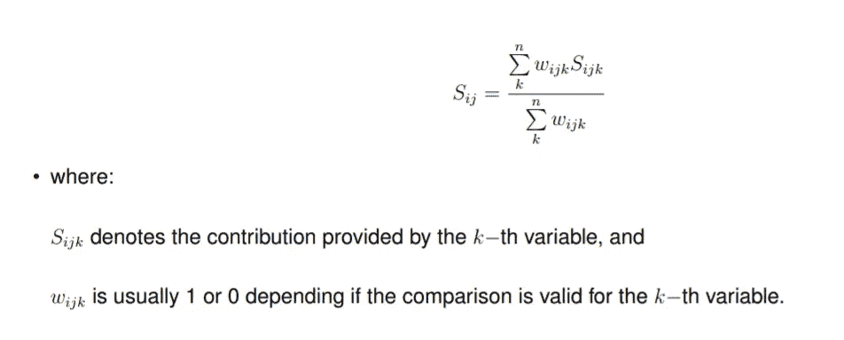
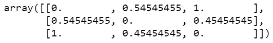

# 如何用 Python 计算高尔的距离

> 原文：<https://medium.com/analytics-vidhya/concept-of-gowers-distance-and-it-s-application-using-python-b08cf6139ac2?source=collection_archive---------2----------------------->


通常在我们的分析中，我们倾向于将相似的对象组合在一起，然后对这些组应用不同的规则和验证，而不是分别处理每个单独的点。

在机器学习领域，这种活动被称为聚类。有许多算法用于聚类的 K-Means，DBSCAN，层次聚类等。但是，如果数据集中既有数值数据又有分类数据，那么它们都不是有效的。高尔的措施旨在解决这个问题。

> 你如何衡量相似性？

你将如何区分银行存款余额为 10000 美元、平均信用卡消费为 300 美元/月、住在洛杉矶并且是餐馆老板的客户 A**与另一位银行存款余额为 11230 美元、平均信用卡消费为 1300 美元/月、住在新泽西州并且受雇于一家私人公司担任商业分析师的**客户 B** ？**

那么**的客户 C** 呢？他也是一名商业分析师，没有信用卡，住在洛杉矶，银行账户中有 50000 美元。如果你比较居住地，C 和 A 是相似的，但另一方面，如果你比较他们的职业，C 显然更像 b。

很明显，他们三个都是不同的，因为他们的三个属性都不相同。但真正的问题是我们如何定义不同？它们有多相似/不相似？如果我们需要配对一个而忽略一个，我们该如何决定？在分析中，我们应该量化一切。我们需要数字来支持我们的观察。仅根据数字特征对数据点进行分组很容易，K-Means 为我们做到了这一点。对于分类数据也是如此，K-Mode 可用于该目的。当我们既有数字特征又有分类特征时，聚类就不能很好地工作。

> **1。高尔的度量是什么**
> 
> **2。数据准备**
> 
> **3。理解计算**
> 
> **4。解读**
> 
> **5。单线实施**

## 高尔测量

*高尔的距离/测度/系数/相似度是一种寻找由混合类型属性组成的数据集的两行之间的相似性的测度。它使用连续变量的曼哈顿距离和二进制变量之间的相似性度量骰子距离的概念。*

下面是计算高尔距离的数学公式:



s’也可以说是我们有兴趣计算的相似度值。

## **数据准备**

在这篇博客中，我将使用 3 个特征(2 个数字和 1 个分类)来展示这个指标。我们将首先从导入必要的库开始。

```
import pandas as pd
import numpy as np
from sklearn.neighbors import DistanceMetric
```

构建数据框架

```
df = pd.DataFrame([[1,2.6,'A'],[12,5,'X'],[4,7,'A']])
df.columns = ['Num_1','Num_2','Cat_1']
```


数据

所以我现在需要根据每个特征找出 2 个数据点之间的相似性。我将找出公式中给出的 3 个不同的值。

**理解计算**

接下来，我将这三个相似点称为 s1、s2 和 s3。我会把所有的权重保持为 1。

s1 =基于“Num_1”的相似性

这是一个两步过程

1.  求每个点之间的曼哈顿距离
2.  归一化矩阵

```
s1 = DistanceMetric.get_metric('manhattan').pairwise(df[['Num_1']])
s1
```


基于曼哈顿距离的差异

```
# normalizing the matrix by dividing with the highest values
s1 = s1/max(np.ptp(df['Num_1']),1)
s1
```


归一化后的相似矩阵

同样，可以计算 s2。

```
#performing both the step at the same time
s2 = DistanceMetric.get_metric('manhattan').pairwise(df[['Num_2']])/max(np.ptp(df['Num_2']),1)
s2
```



现在计算 s3，不会和我们在 s1 和 s2 中处理数值一样。我们首先需要将分类值转换成虚拟变量，然后应用骰子距离。

如果你想知道什么是骰子系数，那么只需记住它也是一种计算类别之间相似性的方法。

为了在值相等时缩短它，DiceDistance = 0

当它们不相等时，这就是 sklearn 计算 DiceDistance 的方法。


```
For our problemNTF : number of dims in which the first value is True, second is False = 2.NFT : number of dims in which the first value is False, second is True = 1.

NNEQ : number of non-equal dimensions, NNEQ = NTF + NFT = 3.

NTT : number of dims in which both values are True = 0.NNZ : number of nonzero dimensions, NNZ = NTF + NFT + NTT = 3.DiceDistance = NNEQ / (NTT + NNZ) = 3/3 = 1
```

让我们用 python 代码来支持我们上面的手动计算。s3 值可以计算如下

```
s3 = DistanceMetric.get_metric('dice').pairwise(dummy_df)
s3
```


正如所料，只要找到不相等的值，矩阵就会返回值 1。

我们拥有所有的价值观。计算出的 s1、s2 和 s3，w1 = w2 = w3 = 1。

现在我们来计算高尔的度量。

```
Gowers_Distance = (s1*w1 + s2*w2 + s3*w3)/(w1 + w2 + w3) 
Gowers_Distance
```


上面的矩阵代表了任意两个数据点之间的相似性指数。

## 解释

没有对从中得出的数字的解释，任何计算/算法都是不完整的。

行 1 和行 2 之间的距离是 0.84，行 1 和行 3 之间的距离是 0.42。

这意味着与行 2 相比，行 1 更类似于行 3。直觉上，这就像我们看一下值一样有意义。这两行在分类列中具有相同的值，并且 Num_1 中的值也比第 2 行更接近。

*好极了！！！如果我们已经走了这么远，那么你已经学得很好了。*


但是等等。难道 Python 中没有任何包可以自动完成这项工作，而不是手动编写公式吗？


## 单线实施

与 R 不同，直到 2019 年 12 月才有可用的包。这可能是我们很少有人谈论这个话题的原因。

注意，该软件包没有预装 Anaconda。在开始使用它之前，您必须安装它并重启您的内核。

```
pip install gower
```

这个包的奇妙之处在于，你甚至不用做把值转换成虚拟变量的脏活。

```
import gower
gower.gower_matrix(df)
```


请注意，收到的输出与我们手动执行计算时的输出完全相同。

**结论**

基于相似性对对象进行分组是业内谈论最多的用例之一。就个人而言，我在我的一个项目中应用了这种方法，该项目的任务是根据与财务活动相关的 17 个不同的 KPI 对类似的供应商进行分组。那是我第一次按照高尔的标准着陆。

该分析可以扩展，其中输出矩阵可以被直接馈送到许多算法中，如用于维数约简、层次聚类等的 t-sne 算法。

希望你看博客的时候过得愉快。如果你喜欢我的博客，请给我的这篇文章一些掌声以示支持。

完整代码的链接可以在这里找到: [**GitHub**](https://github.com/Sreemanto/Gower-s-Distance/blob/master/Gower's%20Measure.ipynb)

我的领英简介:[领英 ](https://www.linkedin.com/in/sreemanta/)

参考资料:

[](https://pypi.org/project/gower/) [## 英国威尔士南部

### Python 中高尔的距离计算。高尔距离是一种距离测量，可以用来计算距离…

pypi.org](https://pypi.org/project/gower/)  [## scikit_learn

### 基地。BaseEstimator 基础。BaseEstimator 基础。BaseEstimator.get_params() base。BaseEstimator.set_params()…

www.apimirror.com](http://www.apimirror.com/scikit_learn/modules/generated/sklearn.neighbors.distancemetric)