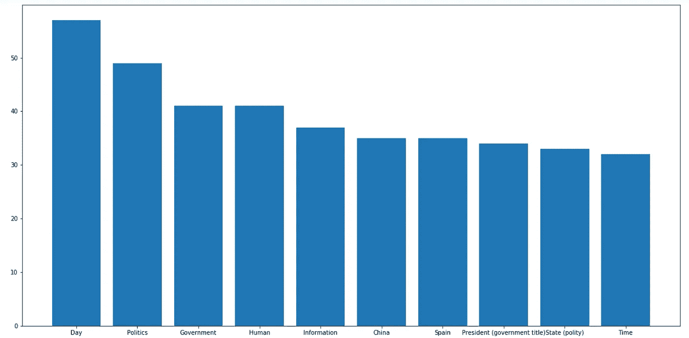
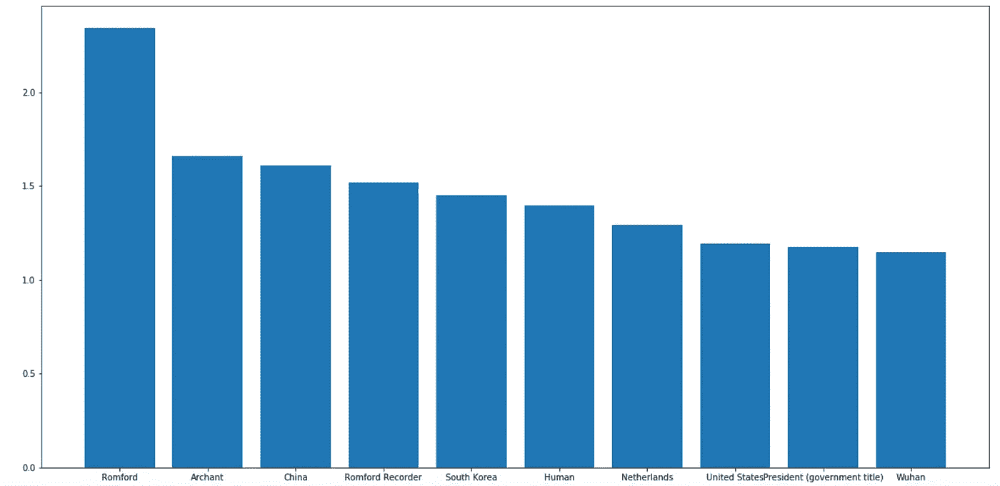

# 概念提取:我如何学会不再担心并热爱多语言数据

> 原文：<https://medium.com/analytics-vidhya/concepts-extraction-how-i-learn-to-stop-worrying-and-love-multilingual-data-b342ce13c52e?source=collection_archive---------11----------------------->


## 如何让不同语言的文本数据变得可以理解

作为人类，我们喜欢在日常生活中使用文本。作为人类，我们喜欢和计算机一起工作。但问题是计算机不喜欢和文本打交道。当处理大量的文本数据时，我们需要自动处理它们。这就是 NLP 的用武之地！

概念抽取是自然语言处理的一个领域，其重点是找出文本的语义。例如，你可以知道提到的人、地点、物体等等..它被用来更好地理解我们正在处理的数据。大多数工具只关注一小部分语言，尤其是英语。这就是为什么我们要使用中立的新闻 API。Neutral News 是一家专注于许多不同语言的 NLP 任务的公司。

*免责声明:这篇博客是由中立新闻的联合创始人写的，只是让你知道:)*

在这篇博客中，我将展示我们如何使用[中性新闻 Api](https://neutralnews.fr/) 从 8 种不同语言的文章集中突出主题。

这个 API 需要订阅才能使用，但幸运的是，我们提供 300 个请求的免费试用。这个教程就用它吧！你可以在这里注册。

# 让我们开始吧！

我们假设您已经安装了 python3。你可以在这里找到我将要使用的语料库。

让我们首先创建一个简单的函数来加载文章:

```
import jsondef get_data(path):
    return json.load(open(path, 'r'))data = get_data('articles.json')
```

# API 的第一步

中立新闻提供了一个 Python 客户端来简化 API 的使用。这很简单，让我们先安装它。

```
pip3 install PyNeutralNews
```

现在让我们创建客户机对象，它将使我们能够调用 API(您将需要用您的免费试用凭证来替换凭证):

```
from PyNeutralNews import Clientclient = Client("<email>", "<password>")
```

我们将使用下面的函数 get_concepts 从文本中获取提取的概念以及相关的权重。

```
from collections import Counterdef get_concepts(text, lang=None): res = client.nlp.semantic_analysis(text, lang, concepts_properties=["titles.en", "titles.auto"]) concepts = Counter() for concept in res.concepts: titles = concept.properties["titles"] title = titles.get("en") or titles[res.lang] concepts[title] += concept.weight return concepts
```

在这里，我们可以看到我们有一个以概念名为关键字、以其权重为值的字典。权重对应于文本中概念的语义值。高权重意味着概念在文本中具有重要意义。

```
>> get_concepts(data['ko'][0], 'ko')
Counter({'United States': 0.16974641714195385,
         'President (government title)': 0.11700783103451891,
         'Justice Party (South Korea)': 0.11516047368626284,
         'Facebook': 0.0977350464727538,
         'Diplomacy': 0.09208318129951651,
         'Washington, D.C.': 0.09057665492040855,
         'Mass media': 0.07374152731976248,
         'German reunification': 0.06379742089362807,
         'Literature': 0.06115040296658773,
         'Ambassador': 0.06047045207677463,
         'Human': 0.058530592187832624})
```

有用！很好，现在让我们创建一个函数，它将存储语料库中的每个概念及其出现次数和累积权重。

```
def get_all_concepts(corpus):
    concepts = {}
    for lang, data in corpus.items():
        print('get concepts from', lang)
        for i, article in enumerate(data):
            if (i + 1) % 10 == 0:
                print(i, '/', len(data))
                break
            res = get_concepts(article, lang)
            for concept, weight in res.items():
                if concept not in concepts:
                    concepts[concept] = (0, 0)
                c, w = concepts[concept]
                concepts[concept] = (c + 1, w + weight)
    return conceptsconcepts = get_all_concepts(data)
```

我们将首先根据出现的频率画出最常见的概念。

```
import matplotlib.pyplot as plt
import numpy as npconcepts_occ = {k: v[0] for k, v in sorted(concepts.items(), key=lambda item: item[1][0])[::-1]}def plot_concepts(concepts, limit=10):

    fig, ax = plt.subplots(figsize=(20, 10))
    ax.bar(np.arange(limit), height=list(concepts.values())[:limit], tick_label=list(concepts.keys())[:limit])plot_concepts(concepts_occ)
```



不错！我们现在开始对语料库中的主要主题有了一个很好的想法。但是我们仍然有一些词对我们没有真正的帮助。让我们看看是否可以通过考虑权重来摆脱它们，进行更精确的语义分析。



现在，我们对文章语料库中的主要主题有了更好的概述。任务完成！😃


# 下一步是什么？

现在我们有了我们的主题，我们可以做更多的事情！例如，我们可以对我们的新数据进行聚类，以找到不同语言的相关文章。