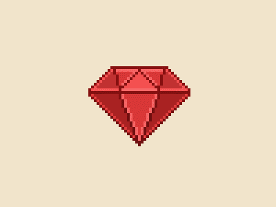
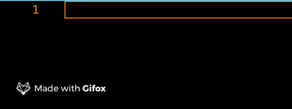
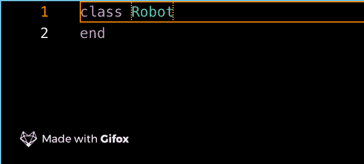
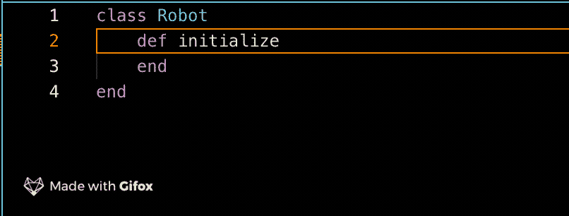
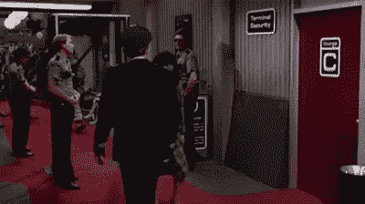
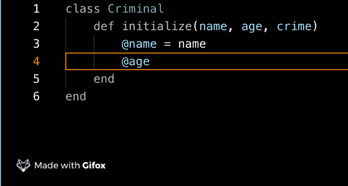
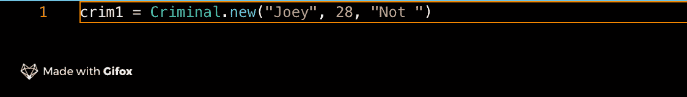
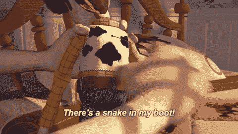
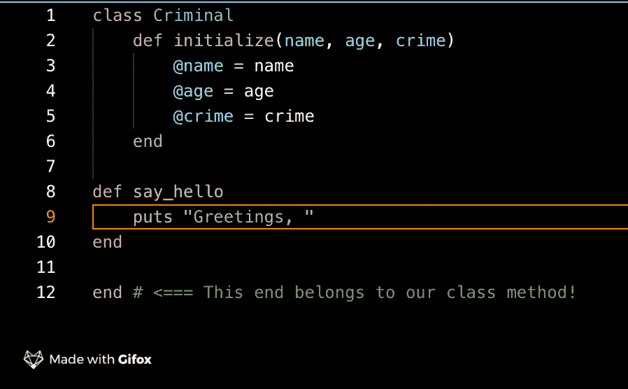
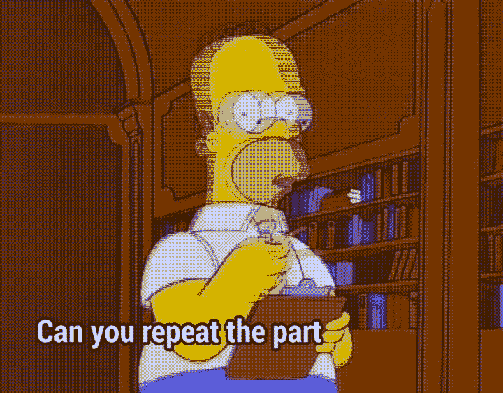

# 初学者对 Ruby 类和对象的概念性理解

> 原文：<https://medium.com/analytics-vidhya/conceptual-understanding-of-ruby-classes-and-objects-for-beginners-f956b4532884?source=collection_archive---------4----------------------->

Ruby 是一种面向对象的语言，一开始听起来可能有点混乱，但是让我们来分解一下。让我们来看看第一个词。对象。什么是对象？嗯，只是一件事。在我们的世界中，我们可以与之互动，操纵它，也许它是一个完全独特的东西，或者是许多同类事物中的一个。Ruby 的代码是通过创建虚拟对象来操作的，我们可以玩这些虚拟对象，告诉它们该做什么，并对它们进行分类。虚拟的东西。很酷吧？但是我们如何更清楚地理解这个观点呢…

正如我们所知，物体本身有组成部分。把我们之前提到的椅子想象成一个物体。这是如何结合在一起的？它有腿、座位等。所有这些组件使对象成为一个整体，有点像一个框架或蓝图！这些对象的框架在 Ruby 中被称为“类”。因此，一个类可以被认为是一个*类型*的对象，一个*实例*就是这些对象中的一个。好的，我们在这里用实例向前跳跃。让我们先总结一下组件的概念；片段如何组合在一起形成一个整体。

# 整体的一部分

好的，我们知道一个 Ruby 类是一个*类型*对象的**框架**或**蓝图**，它需要基本的部分组合在一起才能存在。让我们看看它是如何编写的，这样我们就可以将事物的语法方面和概念方面形象化。

Bzzt bzzt 智人怎么了！

就这么简单！我们组成了一个班级！在这个例子中，我们将使用一个机器人。现在记住，类是我们这里的对象的框架，所以我们还没有创建机器人。然而，我们所创造的只是机器人蓝图的开始。啊哈！

# 初始化

现在有几个步骤来完成这个蓝图的剩余部分并创建对象，所以让我们继续进行**初始化。**

别让医生不高兴了，开始吧。

把初始化想象成一种使事物启动的力量。这将是我们班级开始运行的第一件事。用机器人很容易想象，对吧？想想当你的电脑启动时会发生什么。这是我们在新类中需要的一个方法，来赋予它一些力量；一些魅力。它还将保存我们的类赖以存在的所有组件。椅子不能是没有腿的椅子，对吧？*(除非你在宜家和我一样糟糕)*

看，妈妈，我做了一个电源按钮。

很简单，对吧？这将告诉我们的类它需要的所有组件，以生成我们想要的对象。想象一个工厂车间，拿着我们的蓝图，看着所有必要的组件开始工作，然后按下“开始”按钮生产出该类型的所有对象。

嗯，差不多了。

冷静点，弗兰克，我们快到了。为了让我们的类准备好生产我们想要的东西，我们应该告诉它一些我们的机器人存在所需要的东西。在这个特定的例子中，让我们考虑我们的因素是使用我们的蓝图(类)来确保机器人的所有这些部分或参数是被认为是完整的机器人所必需的。头、躯干、胳膊和腿。一旦我们有了这些，我们就有了我们认为的机器人。这些部分中的每一个都可以在形状、大小、颜色等方面有所不同；但是我们仍然需要他们！让我们告诉我们的代码。

# 制作参数

但是一颗心呢！？:(

不错！我们拥有机器人的各个部分，我们希望确保我们满足了框架(类)的需求。现在，一旦初始化运行(我们的第一段运行代码)，它将知道要制造一个机器人我们需要一个头，一个躯干，手臂和腿！

现在，如果我们有一个类，我们想开始用它来制作单个的对象，我们该怎么做呢？如果我们认为我们的类是机器人的框架或蓝图，我们现在没有多少。我们的老板不会因为一张纸告诉我们如何制造一个完美的机器人而高兴。他们想要真正的机器人。好吧，至少我们有了我们想要的制作方法，但是让我们开始做吧。

# 对象类型

我们接下来要做的是通过一些*实例*。我喜欢把它想象成机场的安全检查站。要通过，你必须满足某些要求，否则就不会发生。如果真的发生了，我们很乐意让你通过！一个*实例*是一个单独的对象，它通过我们的蓝图生成我们想要的对象。请记住，如果我们是一个创建对象的工厂，而一个类是我们的蓝图，那么一个实例将是 factor 层上通过检查而被创建的项目之一。

一个类是一个*类型*的对象。例如，如果我们考虑一个人，我们可以排列我们创造的所有物体，它们可以独立地改变名称、高度、大小、重量和性别。

一个优等班级。

但是每次我们创建一个单独的对象，或者一个*实例*，我们通过我们的蓝图(类)拉出这些对象中的一个来创建一个单独的对象。

让我们考虑一下这里的一组罪犯，看看在我们的类中创建一个新对象的语法，并通过这个实例。假设我们创建了一个罪犯类，每个罪犯都需要姓名、年龄和罪行。还记得这在 Ruby 代码中是什么样子吗？

这里的姓名、年龄和犯罪参数是我们的*局部变量*，也是我们在 initialize 方法中需要的。现在我们已经写好了类，初始化好了，局部变量也设置好了，让我们创建一个罪犯吧！要做到这一点，我们必须想出一个名字，一个年龄，和一个罪行。

这里有一些东西需要打开，但是它们非常简单。首先，你在这里看到的“crim1”只是一个变量，我也在保存我的语法。现在没什么好担心的；它只是允许我稍后以一种更简单的方式去拜访这个罪犯。接下来，*罪犯*一词大写，用来称呼我们的罪犯*阶级*，后面跟着。新的，也就是说我们想要一个新的罪犯。

在括号内，我们有单词“乔伊”，数字“28”，以及术语“没有吃足够的油炸圈饼。”记住我们对于犯罪类的参数；我们的*姓名*，*年龄*，以及*罪行*？好了，我们在这里，创造了我们的第一个独特的罪犯，他们有自己的名字，年龄和罪行分配给他们！

# 他们也会做事！

令人印象深刻。

最后，让我们快速地承认我们类中的新对象可以做一些事情。如果我们制造机器人、罪犯或猫，我们希望能够用它们做事情，并且让它们也能够做事情，对吗？作为一种面向对象的语言，Ruby 不仅仅创建静态对象；这也使得这些物体能够行动！

让我们的罪犯打个招呼。为了做到这一点，我们在我们的类中编写了一个方法**，我们创建的任何单个罪犯都可以调用它。把它想象成我们蓝图上的扩展。当然，在 initialize 中我们有名字、年龄和罪行，但这些只是使我们的个体罪犯存在的必要组成部分。现在我们有了一个方法，我们可以在我们的类中编写方法，让我们现在的罪犯，或者我们创建的未来的罪犯也能执行！**

# 快速靠边…

想想《玩具总动员》里的伍迪娃娃。他需要所有的部件来做一个完整的木质娃娃。如果你在工厂里制造一台机器，而它没有所有的部件，它就不会通过检查，因此也就不会被制造出来。现在，一个完整的木质娃娃确实有说话的能力，当然，但是拉绳子是你的选择。想象一下在你的类中调用这个说话方法来拉动绳子，让你的对象说话。它有这个能力，并且它已经被构建到蓝图中，但是它何时或者是否对这个可用的任务采取行动取决于你。

# 回到我们的罪犯…

所以，如果我们想让我们的罪犯打招呼，我们该怎么做？语法很简单！它是作为一种新方法写在我们的犯罪类中的。

多好的罪犯啊！

我们在我们的类方法中创建了一个新方法(注意底部的结尾),叫做“say_hello ”,它将允许我们的罪犯这样做！这是一个**实例方法**,因为它在我们创建的每个罪犯身上被调用。还记得我们之前的例子吗？这不是一个类的方法，因为我们不希望每个罪犯说“你好，讨厌甜甜圈的家伙！”因为我们刚刚制造的罪犯是**独一无二的**，只有**乔伊**讨厌油炸圈饼。知道了对我们创建的每个罪犯该做什么，并为每个罪犯准备了一个单独的问候，这将在后面展开，但是现在我们在概念上知道了什么是 Ruby 类，以及我们用它创建的对象，权力是我们的了！

