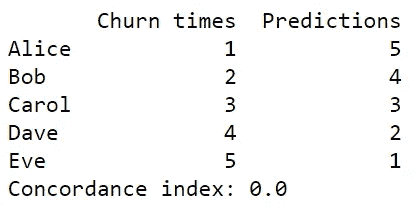

# 和谐指数作为评价指标

> 原文：<https://medium.com/analytics-vidhya/concordance-index-72298c11eac7?source=collection_archive---------0----------------------->

*所有与本帖相关的代码都可以在* [*这里*](https://github.com/alonsosilvaallende/Concordance_Index) *找到。*

*一致性指数*或 *c-index* 是评估算法所做预测的指标。它被定义为一致对的比例除以可能的评估对的总数。让我们通过一些例子来看看这个定义在实践中意味着什么。

我们首先安装库生命线和通常的导入:

假设我们是一家电信运营商，有 5 个客户(Alice、Bob、Carol、Dave 和 Eve ),我们试图预测谁将首先取消订阅我们的服务(也称为流失)。假设爱丽丝在 1 年后被搅拌，鲍勃在 2 年后，卡罗尔在 3 年后，戴夫在 4 年后，夏娃在 5 年后。我们的算法做出了如下预测:1 年后 Alice 会流失，2 年后 Bob 会流失，3 年后 Carol 会流失，4 年后 Dave 会流失，5 年后 Eve 会流失。

这是一个完美的预测。在这种情况下，和谐指数等于其最大值 1。

然而，和谐指数感兴趣的是预测的**顺序，而不是预测本身。现在假设算法预测:爱丽丝将在 2 年后流失，鲍勃在 3 年后，卡罗尔在 5 年后，戴夫在 8 年后，夏娃在 14 年后。在这种情况下，和谐指数仍然等于其最大值 1，因为预测的顺序是正确的(尽管事实上没有一个预测是孤立正确的！).**

这与其他评估方法如[均方误差](https://en.wikipedia.org/wiki/Mean_squared_error)或[平均绝对误差](https://en.wikipedia.org/wiki/Mean_absolute_error)有很大不同。实际上，对于客户流失次数的任何严格递增函数，和谐指数仍然等于 1。以下是对数函数的一个示例:

让我们考虑这样一种情况，算法得到的预测顺序完全错误。假设算法预测 1 年后 Eve 会先流失，2 年后 Dave 会先流失，3 年后 Carol 会先流失，4 年后 Bob 会先流失，5 年后 Alice 会先流失，这样顺序就完全颠倒了(虽然注意，3 年后 Carol 确实离开了！).在这种情况下，和谐指数将等于其最小值 0。

实际上，对于流失时间的每个严格递减函数，一致性指数将为零。以下是乘法反函数的一个示例:

现在有趣的部分来了。当预测的顺序既不完全正确也不完全错误时，和谐指数会做什么？你给以下预测打几分？

*预测 1*:3 年后爱丽丝会离开，2 年后鲍勃会离开，1 年后卡罗尔会离开，5 年后戴夫会离开，4 年后夏娃会离开。

那么，索引列出了所有可能的配对，在我们的例子中有 10 个潜在的配对:(爱丽丝，鲍勃)，(爱丽丝，卡罗尔)，(爱丽丝，戴夫)，(爱丽丝，夏娃)，(鲍勃，卡罗尔)，(鲍勃，戴夫)，(鲍勃，夏娃)，(卡罗尔，戴夫)，(卡罗尔，夏娃)，(戴夫，夏娃)，然后它计算这些配对预测的顺序有多少是正确的。例如，对于*预测 1* :

*   爱丽丝被预测在鲍勃之后搅动，而鲍勃在爱丽丝之后搅动。
*   爱丽丝被预测在卡罗尔之后搅动，而卡罗尔在爱丽丝之后搅动。
*   鲍勃被预测在卡罗尔之后搅动，而卡罗尔在鲍勃之后搅动。
*   戴夫被预言在夏娃之后搅动，而夏娃在戴夫之后搅动。

所有其他对的预测都是正确的。10 个可能的配对中有 6 个是一致的配对，所以一致指数等于 6/10 或 0.6。

万一出现平局呢？您的预测中的关系被计为半一致对:

索引的另一个有趣的特征是它支持正确的审查，也就是说，当研究结束时，感兴趣的事件(例如，在医学中“病人的死亡”或在我们的例子中“客户的流失”)只发生在观察的子集。注意，指定一个感兴趣的事件还没有发生给了我们一个信息:感兴趣的事件，如果发生了，它将在大于或等于指定时间的时间内发生。让我们通过一个例子来看看这一点。

到目前为止，我们从来没有指定我们的观察是否正确，因为索引默认选项是所有事件都被观察到。让我们改变这一点。

假设爱丽丝在 1 年后被搅动，鲍勃在 2 年后， ***卡罗尔在 3 年后*** 没有被搅动，戴夫在 4 年后被搅动，夏娃在 5 年后被搅动。

我们的预测如下:

*预测二*:1 年后爱丽丝会流失，2 年后鲍勃会流失，3 年后卡罗尔会流失，5 年后戴夫会流失，4 年后夏娃会流失。

请注意，Carol 在 3 年后没有搅动的事实给了我们这样的信息，即她的搅动时间，如果发生，将在大于或等于 3 年的时间内发生。因此，我们无法给两人一组(Carol，Dave)和(Carol，Eve)打分，因为我们根本不知道谁先搅拌。因此我们只有 8 个潜在的对。戴夫被预言在夏娃之后搅动，而夏娃在戴夫之后搅动。所有其他对的预测都是正确的。8 个可能对中有 7 个一致对，所以一致指数等于 7/8 或 0.875。

在我们的代码中，我们需要指定事件是否被观察到(True)或者事件是否没有被观察到(False):

让我们做随机预测，看看我们得到哪个一致指数。

随机预测的一致指数。

随机预测给出的平均和谐指数约为 0.5。所以基本上一个没有学到任何东西的模型给出的平均一致指数是 0.5。

# 图书馆之间的索引差异:生命线，scikit-survival 和 PySurvival

为了进行这种比较，我们安装了 PySurvival 和 scikit-survival:

请注意，lifelines 给出了实际事件时间和预测的*分数*之间的一致性，而 scikit-survival 给出了实际和预测的*风险*之间的一致性，因此在相同的列表中，它们是完全相反的。

和谐指数(生命线)= 1-和谐指数(sci kit-存活率)

Scikit-survival 还提供了一致对的数量、不一致对的数量、具有相同估计风险的对的数量以及共享相同时间的可比对的数量。

让我们看一个更有趣的例子:

PySurvival concordance index 需要一个模型作为输入，所以很难看到它的 concordance index 做什么。让我们用一个随机生存森林来试试:

我们注意到三个一致性指数给了我们相同的结果(注意我们在生命线的预测风险前面加了一个减号)。让我们看看 PySurvival 的和谐指数提供的额外结果:

我们注意到 PySurvival 对 pairs(Alice，Bob)和(Bob，Alice)计数两次，而 scikit-survival 只计数一次。这解释了一致对数量的差异(558+43+179=780 和 780*2=1560)。类似地，PySurvival 中一致对的数量将一致对和捆绑风险对视为半一致对(2*558+179=1295)。

# 结论

和谐指数是评估算法所做预测的有用度量。它可以考虑右删截的情况，即在研究结束时，感兴趣的事件(例如，在医学中“患者死亡”或在我们的例子中“客户流失”)只发生在观察的子集。我们已经看到三个库(lifelines、scikit-survival 和 PySurvival)实现了索引索引，但是有一些细微的差别。

# 来源

*   Harrell F.E Jr .、Lee K.L .、Mark D.B .、[“多变量预测模型:开发模型、评估假设和充分性以及测量和减少误差的问题”](https://doi.org/10.1002/(SICI)1097-0258(19960229)15:4%3C361::AID-SIM168%3E3.0.CO;2-4)，《医学统计》，15(4)，361–87，1996 年。
*   [生命线的一致性指数](https://lifelines.readthedocs.io/en/latest/lifelines.utils.html#lifelines.utils.concordance_index)
*   [sci kit-生存和谐指数](https://scikit-survival.readthedocs.io/en/latest/generated/sksurv.metrics.concordance_index_censored.html#sksurv.metrics.concordance_index_censored)
*   [PySurvival 的和谐指数](https://square.github.io/pysurvival/metrics/c_index.html)