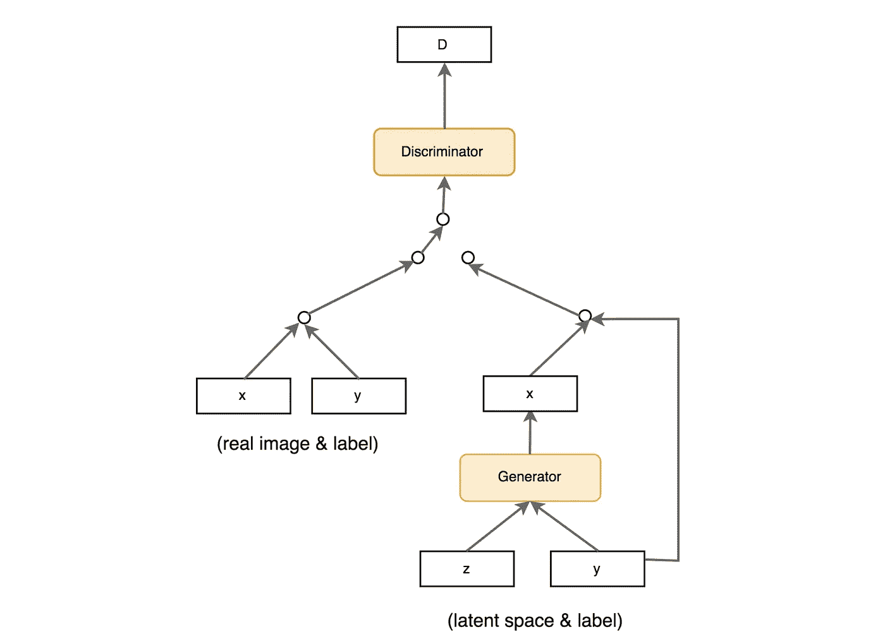

# 条件生成对抗网络

> 原文：<https://medium.com/analytics-vidhya/conditional-generative-adversarial-networks-f8f1ce025c5d?source=collection_archive---------9----------------------->

# 摘要

随着生成性对抗网络在机器学习领域变得如此突出，替代方案已经出现，作为改善这些网络的努力。一个这样的选择包括条件生成对抗网络或 cGAN。在本文中，我们旨在更好地了解 cGANs 及其与传统 gan 的关系。