# 使用 GANs 的条件图标生成

> 原文：<https://medium.com/analytics-vidhya/conditional-icon-generation-with-gans-2cc489e23d9a?source=collection_archive---------12----------------------->

最深刻的学习者 —阿尼鲁德·巴拉德瓦伊、黄查理、拉奇特·卡塔拉、李宗南

# **动机**

苹果、谷歌、麦当劳——都有永恒的图标来传达公司使命，并为对外交流定下基调。随着数字媒体的增长和移动电话的迅速普及，对高质量数字内容的需求呈指数级增长，其中一个重要组成部分是**品牌**。事实上，“77%的 B2B 营销领导者认为品牌对增长至关重要”[1]。这是有充分理由的；设计师可以提供有价值的、以人为中心的产品视图。今天，这些视图最明显的表现就是图标。

我们的主要动机是为那些想向世界发布有价值产品的创作者打破设计高质量图标的障碍。

# **问题陈述**

我们项目的目标是利用生成性对抗网络(GANs)来产生看起来合理的应用程序图标，**以期望的应用程序类型或描述为条件。**这里的新奇来自于条件反射，这将使最终的图标对我们的最终创作者更加有用。

# **高层次直觉**

对于我们特定的图标领域，一个关键的驱动直觉是图标具有非常视觉上可区分的特征。文本、形状、前景和背景分离以及颜色只是其中的一些特征。GANs 最近成功地执行了样式提取，这似乎表明混合和匹配可视图像样式是可行的，并且可以直接应用到我们的用例中。

# **数据集**

没有图标训练集存在，所以我们决定通过利用在线应用商店的现有图标来构建我们自己的健壮数据集。使用现成的 API 抓取工具，我们从苹果应用商店收集了大约 11，000 个图标的数据集[2]。我们最初想抓取 100，000 个以上的图标，然而，由于这些抓取工具的限制和苹果的 API 速率限制，我们无法做到这一点。

所有图标最初都是以 100x100x3 的分辨率作为 JPEGs 检索的，然后为了加快训练时间，我们将其缩小到 32x32x3。我们还根据图片的主要流派类型(如书籍、社交网络、旅游)和收藏类型(如顶级免费、顶级付费、顶级票房)对图片进行了分类。除了图标本身，我们还收集了每个图标的元数据，存储为 JSON 文件。对于后面的实验，不涉及从苹果应用商店检索的主要流派类型，我们创建了一个单独的扁平数据集，以减少实验设置所需的时间。

图标和元数据的示例如下所示:

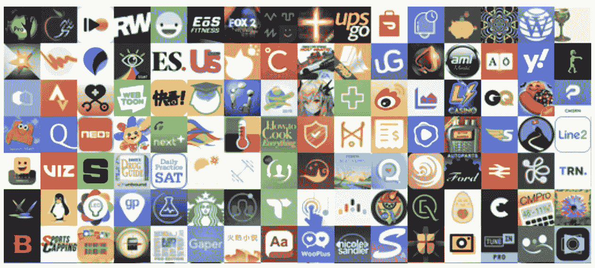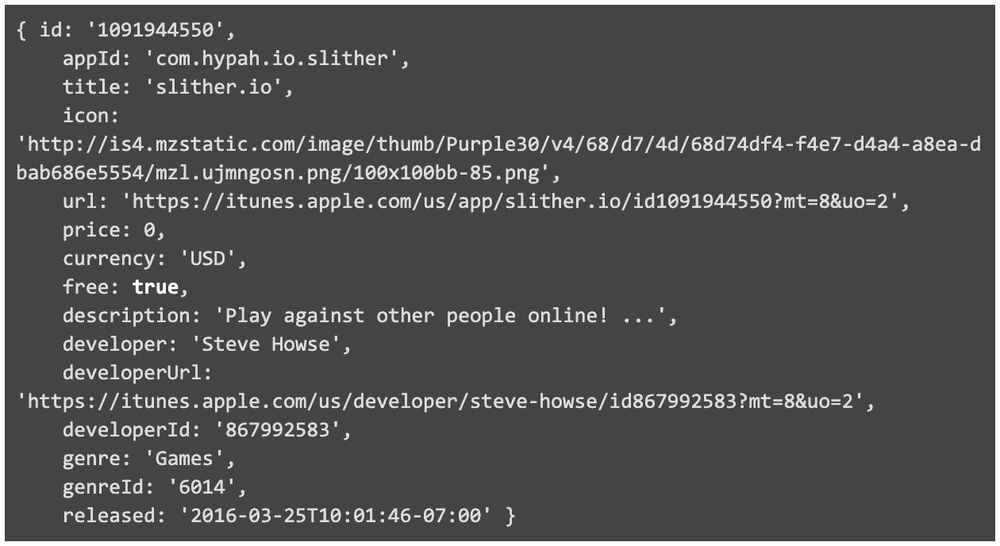

# **方法**

我们的第一个条件图标生成方法包括根据图标的主要类型对图标进行分类，并将标签(主要类型)的一次性编码作为条件向量与图标一起传递。我们在这里的直觉是，来自不同风格的图标可能具有可以学习的定义特征和特定的视觉特性，使得为不同风格生成的图标在视觉上可以彼此区分。

为了实现这种调节，我们研究了各种现有的 GAN 实施方案，并确定了一种方法，在这种方法中，我们根据每个图标的独热编码标签来调节发生器和鉴别器的损失函数，从而得出以下损失函数:

我们还通过在具有形状*(批量大小，标签数量)*的独热编码标签的矩阵和具有形状(*、标签数量、潜在维度)*从**、𝜎【𝑁(𝜇】**采样的噪声矩阵之间的附加矩阵乘法，来试验将噪声引入独热编码标签

我们的第二组新方法涉及修改我们的类型调节管道以支持额外的调节向量，包括由预训练的 ResNet-18 模型预测 ImageNet-1000 标签的结果提供的独热编码向量，以及由预训练的 BERT 语言转换器提供的嵌入向量。

在我们基于 ResNet 的方法中，我们通过预先训练的 ResNet-18 模型传递我们的 32x32x3 图标，该模型将我们的图标重新分类为 392 个不同的 ImageNet 标签。然后，我们对这些标签进行一次性编码，并将它们作为条件向量传递给我们的 GAN，我们的直觉是，ResNet，一个 SotA 识别网络，可以更紧密地对图标进行聚类，而不是根据它们的主要类型。

另一方面，在我们基于 BERT 的方法中，我们获取每个图标的描述，并将其通过一个名为 RAKE(快速自动关键词提取)的关键词提取库，以便从每个描述中检索顶级关键词。然后，我们通过 BERT 将每个关键字转换为形状为(1，1024)的嵌入向量，并对每个图标的所有嵌入向量进行平均，以获得传递给 GAN 的最终条件向量。

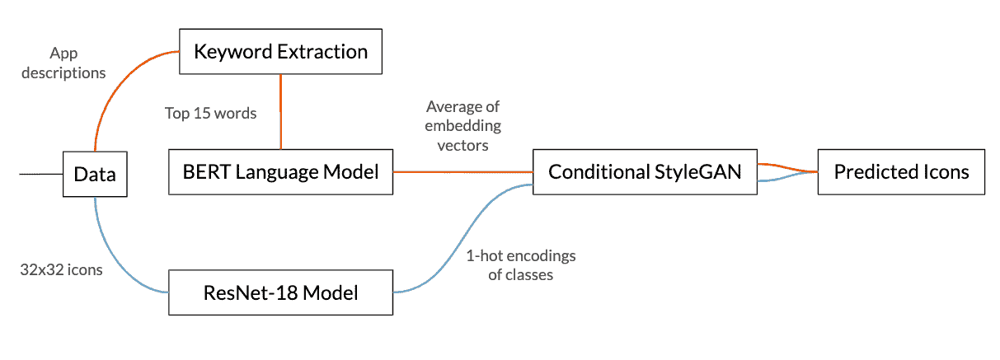

# **实验**

## DC 甘

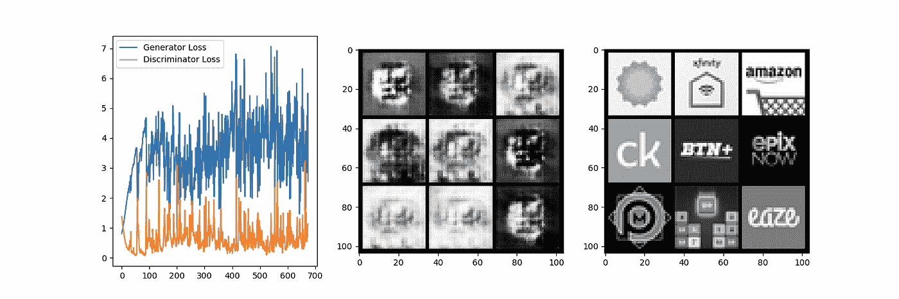

DC-甘输出

DC-GAN 作为我们的基线实验，这样我们就可以确定一个好的 GAN 架构。DC-甘的主要思想是通过使用一系列去卷积层从潜在空间进行上采样来生成图像，并通过使用一系列卷积层对生成器的输出进行下采样来验证图像。我们在这个实验中的直觉是，基于卷积的 DC-GAN 架构将从低维潜在空间中的图标数据集中捕获有意义的视觉信息，然后可以将其用作新生成图标的基础。

然而，从上面的采样输出可以看出，在 80 个周期的训练后(约 14 小时)，发电机的损耗开始较低，但随后达到峰值，并保持在 2 至 5 之间，而鉴频器的损耗开始高于发电机的损耗，但很快下降到 0 至 1 之间。这向我们表明，鉴别者很快学会了如何区分地面真相和发生器的输出，导致发生器随着时间的推移停止改善其输出的真实性。这导致图标输出既不多彩也不可识别。

## PGGAN

接下来，我们决定尝试使用 PGGANs，也称为 gan 的渐进生长。

PGGANs 有一个鉴别器和发生器，从低分辨率到高分辨率逐渐增加。随着 PGGAN 的发展，更多的层被添加到模型中，这增加了生成的图像的细节水平。我们使用 Google Colab 专门使用了在 Github 库【3】中找到的实现。

我们选择尝试 PGGANs，因为它们提供了比普通 GAN 架构更高的稳定性和速度。PGGANs 在 CIFAR-10 图像生成方面也表现得非常好，所以我们认为它在图标生成方面会很成功，因为 CIFAR-10 图像和我们收集的图标具有相似的质量和细节。我们唯一关心的是图标艺术比 CIFAR-10 数据集中的自然图像要抽象得多。

在单个 Tesla K80 GPU 上进行约 7 个小时的训练后，结果如下:

我们对 PGGAN 能够产生的质量和细节水平感到惊讶，尽管在训练模型方面投入的资源相对较少。

## 无条件风格 GAN

StyleGAN 的架构是 PGGAN 的扩展。生成器不再使用潜在空间中的点；相反，它使用映射网络和噪声层。映射网络允许模型提取图像的不同方面(例如，前景、背景),并给予模型对呈现的较高级别样式的控制。每个特征图引入的额外噪声层增加了对每个图标样式的更细粒度的、按像素的理解。

我们尝试了这种方法，因为它在过去被证明在混合面部特征以生成真实的人脸图像方面非常有效[4]。由于应用程序图标往往有不同的可控风格(如文本、颜色、形状)和细节层次，StyleGAN 似乎是最适合我们目的的 GAN。我们特别使用了 NVLabs 官方 Tensorflow 实现的 StyleGAN [5]。

我们的第一个 StyleGAN 实验旨在确定它是否可以在没有任何条件的情况下从我们的整个数据集生成高质量的合成图标。由于 DCGAN 的结果不太理想，并且 StyleGAN 的新近性优于 PGGAN，这将使我们有信心 StyleGAN 可以作为更好的基线模型，以适应未来的发展。

我们将 StyleGAN 训练为 250 个刻度，其中每个刻度对应于 32x32x3 图标输入上的 10，000 个图像的单次运行。在 Tesla V100 GPU 上进行 34 小时的训练后，我们的结果如下:

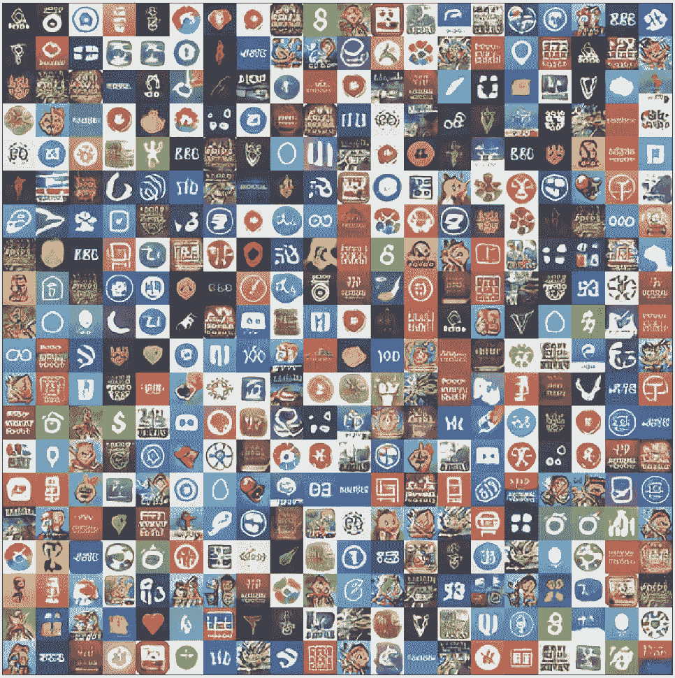

*无条件 StyleGAN 假货*

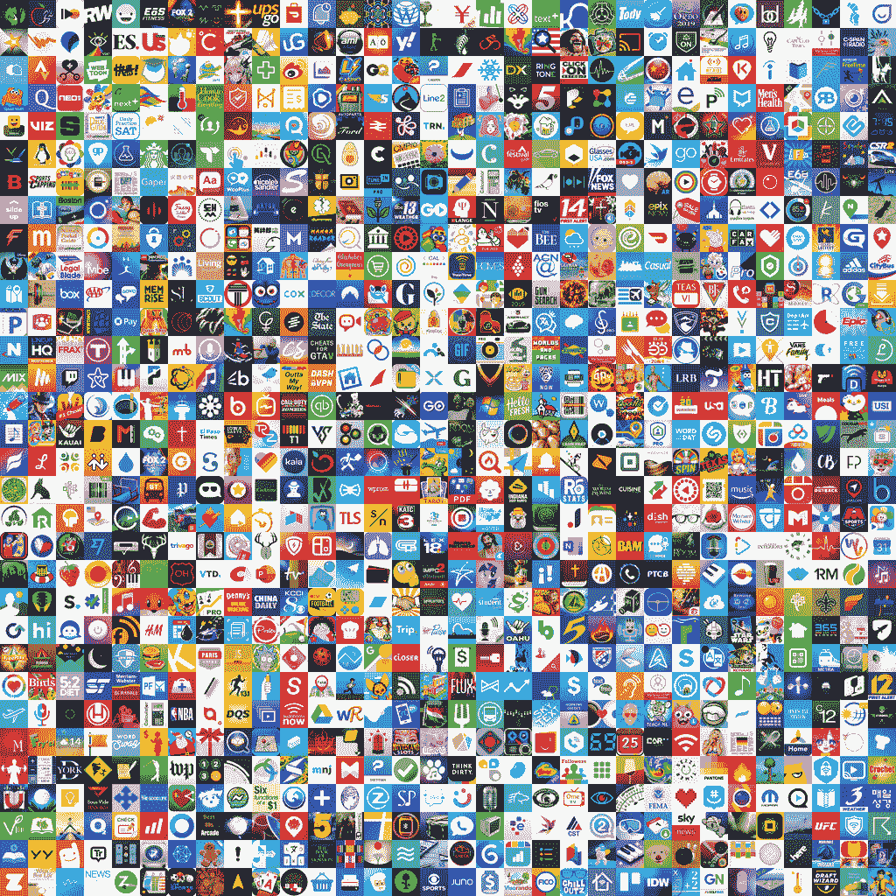

*无条件风格甘真实*

从定性的角度来看，这些输出似乎非常类似于真实的数据集图标。人们可以清楚地辨认出心形、摄像机和各种彩色背景上的文字。

## 体裁制约风格

鉴于我们的基线 StyleGAN 的有希望的输出，我们继续进行我们的第二个实验，用一个热门的编码应用类型来调节 StyleGAN。就图标输出而言，这个用例对于一个已经考虑好应用类型的设计师来说似乎更相关、更有用。

我们在 32x32x3 的图标输入上对新调整的 StyleGAN 进行了 250 次滴答的训练，分为 25 种不同的风格。在 Tesla V100 GPU 上进行 28 小时的训练后，我们的结果如下:

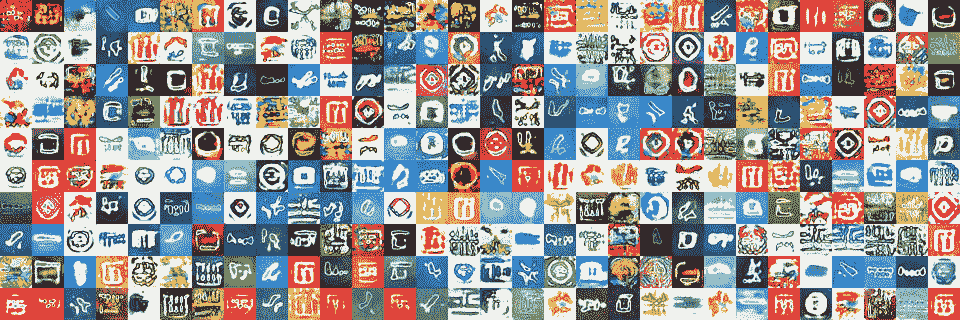

*流派制约风格根假货*

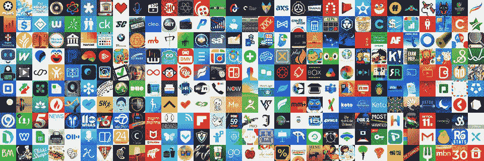

*风格条件风格真实*

(体裁顺序从上到下:*娱乐、财经、参考、教育、图片&视频、商业、健康&健身、新闻、生产力、美食&饮料*)

这些结果引发了两个关键问题:质量和分销。就质量而言，与我们的基线相比，图标在风格可识别性上明显受损。这很可能是由于 StyleGAN 训练的每个流派桶的图标数量有限。分销是我们最初没有调查的另一个问题。查看每种风格的真实数据集图标，很难在各行之间找到一组有区别的样式特征。换句话说，流派分布在视觉上都非常相似。只有*游戏*表现突出，因为该类型的应用通常有更多复杂的图形和边框。

这种区分的缺乏使得评估我们的输出是否真正反映了给定的类型或者屈服于噪声变得更加困难。

## ResNet 调节的花柱

在意识到跨流派的分布不是唯一的之后，我们考虑了基于相似性的图标分组的替代方法。由于我们数据集的规模，基于定性相似性手动分组图标是不现实的。因此，我们选择使用 ResNet 进行迁移学习，并将我们的数据集预先分类到 [ImageNet](http://www.image-net.org/) 数据库中指定的类别中[6]。具体来说，我们使用了来自 [CNTK](https://github.com/microsoft/CNTK/tree/master/Examples/Image/Classification/ResNet) 库【9】的预训练 ResNet-18 模型。我们选择 ResNet 作为我们的架构，因为它在准确性方面仍然是最好的架构之一，并且拥有最公开的预训练模型。

虽然在图标域中训练预训练的 ResNet-18 模型会产生最好的结果，但是我们决定按原样使用该模型。训练模型将涉及为图标创建“地面真相”标签，并手动将它们分配给我们数据集的一部分。这可能不是对我们时间的最佳利用，尤其是因为我们不知道 ResNet 是否会提供合理的结果。

*ResNet-Conditioned style gan Reals*

ResNet 实际上设法将相似的图标组合到 ImageNet 数据库的 392 个标签中。因为我们获得了合理的聚类，所以我们将类别转换为一个热点向量，并在来自流派条件的相同条件 StyleGAN 模型中使用它们。在使用单个 Tesla V100 GPU 进行了 34 小时的训练后，我们收集了以下结果:

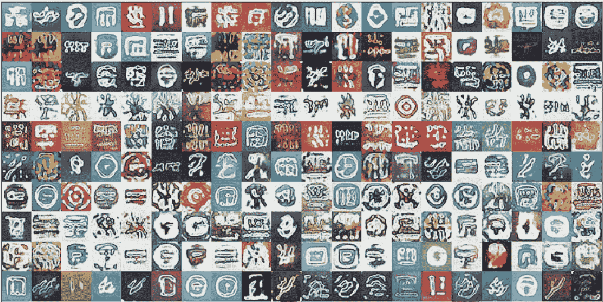

*ResNet-Conditioned style gan Fakes*

我们发现跨类的分布更加明显！正如您在上面的插图中所看到的，现实中具有一致背景色或前景形状的行在赝品中被转换为相同的、各自的背景色或前景形状(例如，第四行具有白色背景，第七行具有圆形前景)。

然而，一些行似乎不符合它们的基本事实分布，我们想知道为什么。为此，我们构建了 PCA-reduced 图标数据的 t-SNE 图。t-SNE 图降低了高维数据集的维数，以便识别聚类。下面是我们分别使用前 80 个 ResNet 标签和前 20 个 ResNet 标签时的 t-SNE 图:

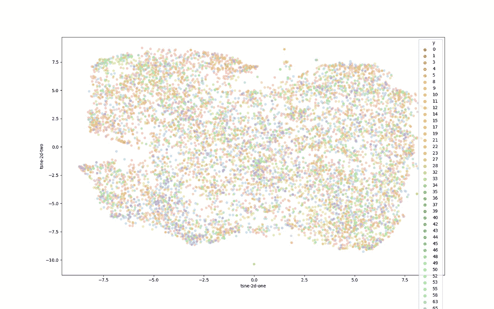

前 80 名 ResNet 标签的 t-SNE(按频率)

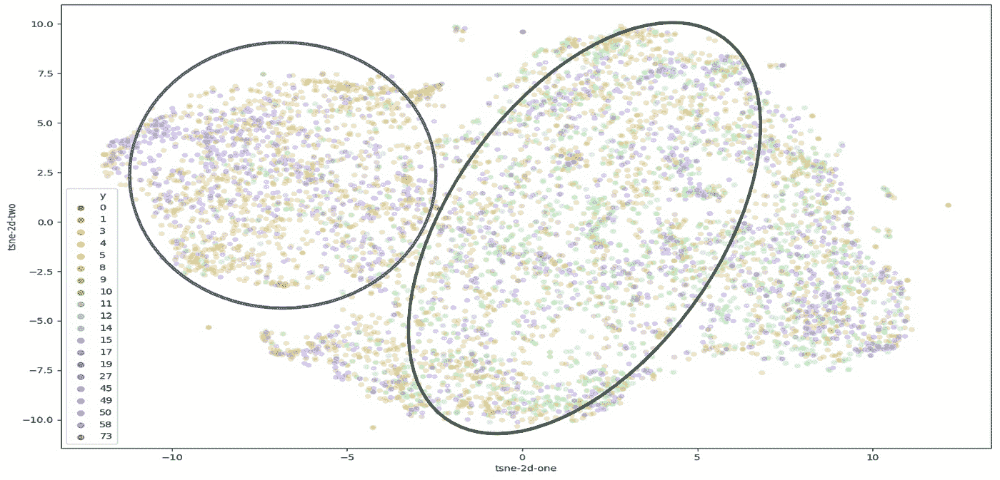

前 20 名 ResNet 标签的 t-SNE(按频率)

我们注意到，当使用 80 个标签时，数据并不是完全不能聚类。然而，当仅使用 20 个标签时，我们看到左(紫色)和右(绿色)区域通常是可分离的。

这告诉我们，通过将 ResNet 的标签桶数量从 392 个减少，我们可能会获得更好的结果。

## 伯特条件化风格

考虑到我们的 ResNet 条件化的 StyleGAN 的合理分布的输出，我们决定继续进行我们的新的第四个实验——尝试在由预训练的语言模型生成的文本嵌入向量上条件化 StyleGAN。我们在整个实验中观察到，不同的关键字通常对应不同的图标视觉效果，一个类别的图标的关键字通常不会与另一个类别的重叠。例如，手机游戏应用描述中的关键词——“多人游戏”、“皇家战役”、“枪战游戏”——很少与消息应用描述中的关键词——“聊天”、“消息”、“实时”重叠。因此，我们的直觉是，我们的 GAN 有可能以关键字的向量表示为条件，希望它可以生成其视觉特征代表其关键字的图标。我们特别选择了文本嵌入，而不是其他向量表示，因为它们捕获了语义信息和上下文，我们认为这将提高我们输出的质量。

为了实现这一点，我们决定解析每个应用描述的前 100 个单词，以去除隐私政策等不需要的描述文本，使用 RAKE 提取 4 个最重要的关键词[7]，并将每个关键词通过预先训练的 BERT 语言模型[8]。BERT 模型为我们提供了一个单词嵌入向量，每个关键字的形状为 *(1，1024)* 。然后，在我们的实验中，我们或者 **a)** 求和或者 **b)** 将所有返回的文本嵌入向量平均为一个最终的嵌入向量，表示给定图标的所有关键字，我们的 GAN 以此为条件。就图标输出而言，这个用例似乎是最相关和最有用的，因为设计师可以简单地提供一组相关的关键字，以便生成一个有代表性的应用程序图标。

我们在 32x32x3 的图标上训练了 210 个节拍，每个图标都配有一个 *(1，1024)* 文本嵌入向量。在 Tesla V100 GPU 上进行 28 小时的训练后，我们的结果如下:

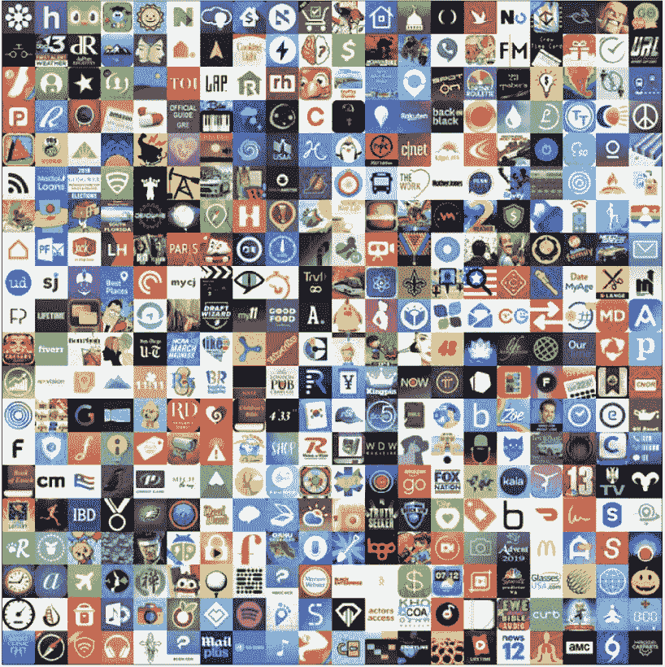

伯特·雷亚尔斯

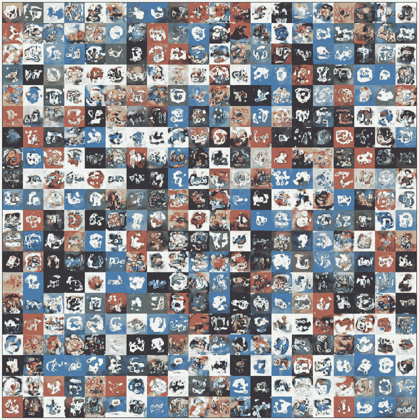

伯特假货(合计)

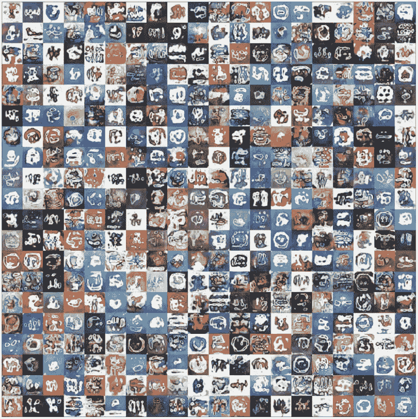

伯特假货(平均)

不幸的是，我们的伯特条件模型无法捕捉图标在关键词上的条件分布，导致大多数像斑点一样的输出缺乏结构或语义意义。我们认为这是因为关键词通常与一个单独的应用程序紧密相关，并且不同图标的关键词有很大不同。这减少了学习，因为我们的 GAN 很少看到类似的文本嵌入向量，因此没有足够的信息来学习图标在一些不太频繁的关键字上的条件分布。例如，我们的甘只看到了一次“驯鹿”、“用品”、“狩猎”和“季节”的关键字列表，因此很难有条件地在生成时创建图标。

然而，我们的 GAN 能够为某些文本嵌入条件产生一些半真实的输出(如下所示)，可能代表在不同图标描述中重复出现的几个常见关键字。

# **改进空间**

首先，我们可以生成 64x64x3 的图标，而不是 32x32x3 的图标，因为它有更好的机会捕捉低级的、可辨别的样式特征。不幸的是，由于计算资源和时间有限，我们只能生成 32x32x3 的图标。

此外，我们的第一个流派条件模型工作的前提是基于应用程序图标与其主要流派高度相关的假设。然而，根据我们的研究结果，情况似乎并非如此。这可能指出了一个潜在的问题，即图标分布与野生环境中的图像分布有很大的不同。例如，“社交网络”和“照片/视频”图标都有共同的圆形和相似的视觉特征，尽管它们来自非常不同的类型。因此，仅仅依靠类型来聚集我们的图标是不够的。

如果我们在早期阶段对我们的数据集运行 t-SNE，我们会意识到地面实况分布在视觉上不是很明显，并且可能会花更多的时间来开发不同的策略来对数据进行聚类。

# **结果**

除了我们的 t-SNE 定量分析，我们还希望对我们的结果有更定性的了解。我们尝试的第一个评估如下:(请参考下面的图片 A)左侧的两个图标是基于两个唯一的 ResNet 标签生成的，其中只有一个来自右侧的标签分布。用户的工作是根据相应的分布选择正确的图标。准确性是通过在他们尝试的测试案例总数中有多少图标和标签匹配正确来衡量的。

我们在 4 名评估人员和 1000 多次测试中取得了大约 72%到 78%的 **准确率**，这告诉我们评估人员能够从我们生成的图标中分辨出一些视觉差异。

*(图片 A)*

由于我们生成的图像的抽象性质，我们还尝试了一种替代方法来评估我们的结果。我们没有选择一个与给定标签相匹配的图标，而是给了评估者两个标签，并要求他们将它们与相应的分布相匹配。在这种情况下，答案要么是“交换”，要么是“不交换”(请参考下图 B 和 C)。

我们在 8 个评估者和 1，200 多个测试用例中取得了 82.3%的**。我们相信这些结果是有意义的，并强调当比较图标的多种条件分布时，存在显著的视觉差异。**

*(图片 B，互换)*

*(图片 C，无对换)*

# **接下来的步骤**

尽管我们能够在人工验证测试中获得相对较高的准确率，但我们对生成的图标的细节和质量并不满意，因为我们希望它们与真实图标没有区别。因此，我们接下来的步骤如下。

## 继续探索 ResNet 条件下的风格

我们观察到 ResNet 分类的一个问题是，许多标签只有一个或两个图标，这在我们的配对数据集中造成了稀疏。因此，对于这些标签，训练输出的细节和质量要差得多。我们正计划从其他应用商店，如 Android Play 商店，收集更多图标，希望能阻止这种图标的长尾分布。

另一个潜在的重大改进是将 ResNet 的域从 ImageNet 更改为我们的 icon 域。我们知道我们没有一个理想的模型来对这些图标进行分组，因为 ResNet 将它们与动物和物体的自然图像进行比较，而图标非常抽象。花时间想出特定于我们图标领域的标签(例如，圆形前景、白色背景、字母等。)并标记一小组图标，我们将能够训练我们的 ResNet 模型更加准确，并有望产生更好的条件。

我们还想减少 ResNet 可以将我们的图标分类的标签数量。正如我们上面的 t-SNE 图所示，减少标签的数量可能会导致更好的聚类。然而，需要注意的是，当调整标签数量时，我们必须在标签间的差异和标签内的差异之间取得平衡。具体来说，通过增加每个新的“压缩”存储桶中的标签数量，我们将增加每个存储桶中的差异，但也会减少存储桶之间的差异。通过试验不同的标签计数，我们希望改进我们的 ResNet 分类。

## 探索分组和调节图标的其他方法

到目前为止，我们只尝试了对类型、描述和外观的调节。虽然类型和描述并没有给我们最好的条件结果，但是我们可以用其他潜在的方法将图标组合在一起。

对应用程序开发者的条件可能会起作用，因为由同一团队或个人开发的图标通常看起来彼此相似。这种调节方法对于那些想要继续创建共享艺术主题的不同图标的开发人员来说很有帮助。

另一种方法是严格关注图标的前景和背景颜色，而不是图标的整体外观。这可能行得通，因为具有相似颜色组合的图标总体上可能共享相似的样式。这将有助于创作者快速比较各种颜色组合。

## 探索其他基线架构

除了切换我们的条件，我们还可以切换我们的基线架构。在这个项目中，我们用 StyleGAN 做了大量实验。然而，基线 GAN 架构的许多其他变体可能会带来更大的成功。也就是说，我们想试试 AttentionGAN 和 BigGAN。

AttentionGAN 突出显示输入图像的某些特征，以便在训练过程中重点关注。这种体系结构可以在调节图标的特定元素(例如，前景、背景、颜色、边界等)时有所帮助。).

使用 StyleGAN 时，我们的输出分辨率明显较低，我们不得不手动将调理纳入基本架构。然而，BigGAN 的架构中固有的条件，并产生极高分辨率的图像。此外，它在 ImageNet 图像生成方面的表现优于其他最先进的型号。因此，它可能有助于创建具有更高保真度的图标。

# **结论**

尽管我们不能产生与真实图标无法区分的图标，但我们能够生成人类能够准确分类到各自条件标签中的体面图像。我们已经学会了避免对数据集的分布做出假设，并观察到通过对基线架构进行调整，生成的图像的保真度会发生怎样的变化。我们希望继续上面提到的后续步骤，最终为创作者和设计者提供一个有效和廉价的图标生成服务。

# **链接**

[1][http://www . nvision systems . com/5-interest-facts-about-branding-your-business/](http://www.nvisionsystems.com/5-interesting-facts-about-branding-your-business/)

[2][https://github.com/facundoolano/app-store-scraper](https://github.com/facundoolano/app-store-scraper)

[https://github.com/tkarras/progressive_growing_of_gans](https://github.com/tkarras/progressive_growing_of_gans)

[4][https://github . com/NV labs/style gan/blob/master/style gan-teaser . png](https://github.com/NVlabs/stylegan/blob/master/stylegan-teaser.png)

[https://github.com/NVlabs/stylegan](https://github.com/NVlabs/stylegan)

[http://www.image-net.org/](http://www.image-net.org/)

[https://pypi.org/project/rake-nltk/](https://pypi.org/project/rake-nltk/)

[https://github.com/google-research/bert](https://github.com/google-research/bert)

[9][https://github . com/Microsoft/CNTK/tree/master/Examples/Image/Classification/ResNet](https://github.com/microsoft/CNTK/tree/master/Examples/Image/Classification/ResNet)