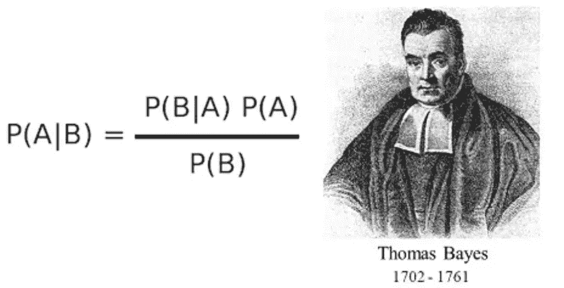
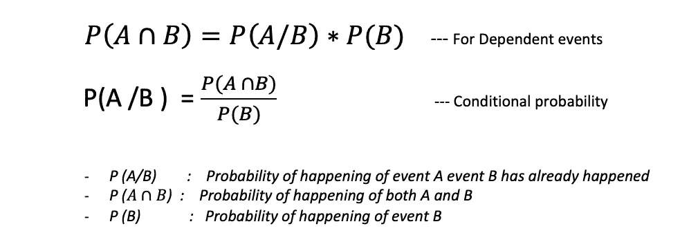
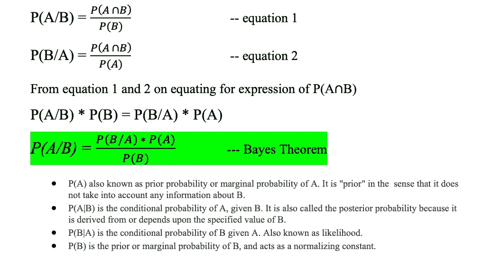
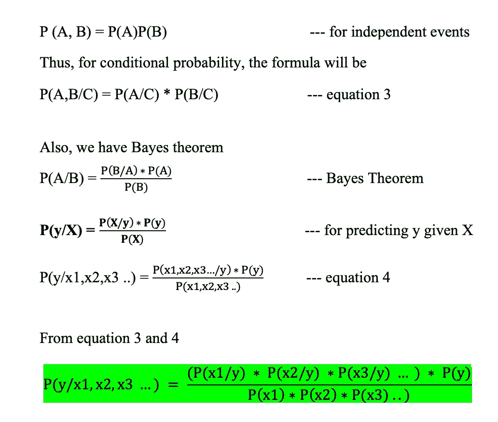
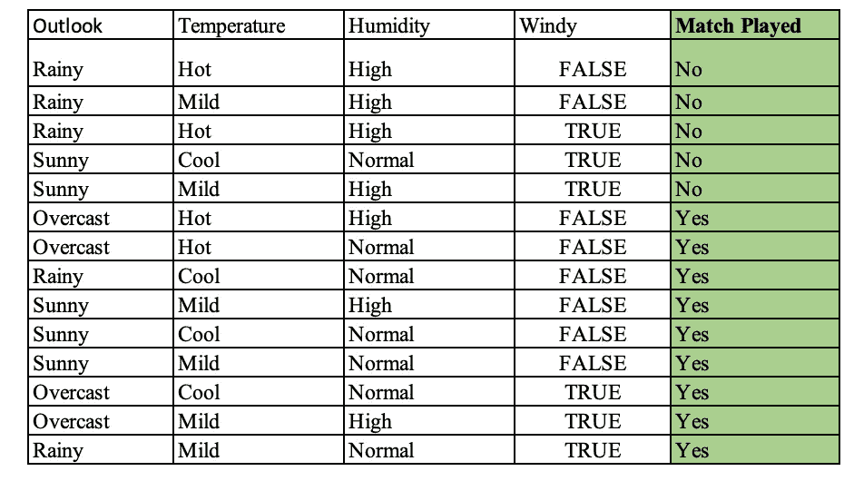
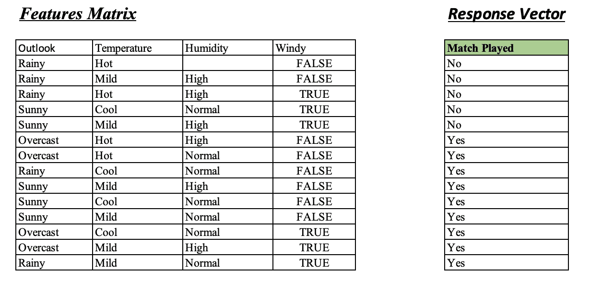
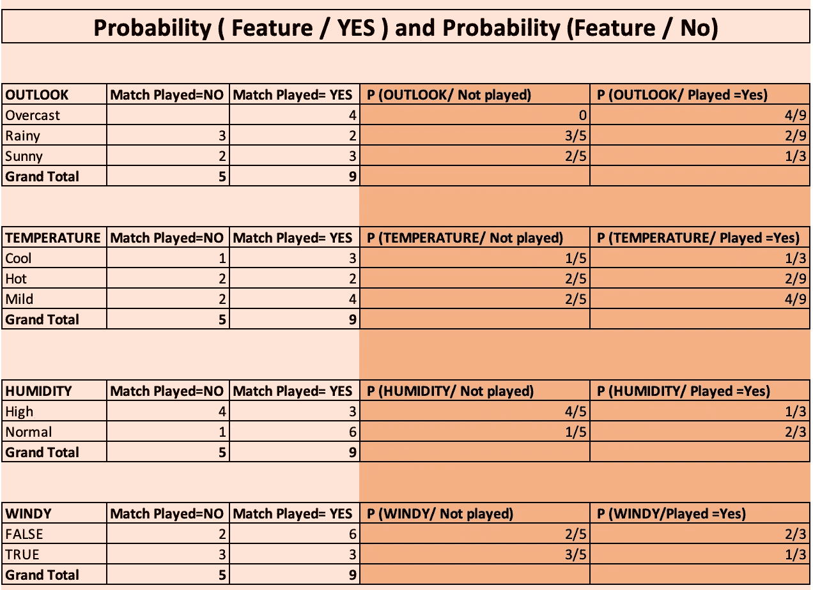
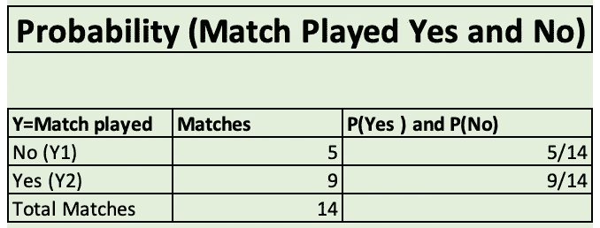
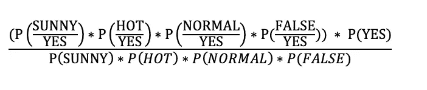
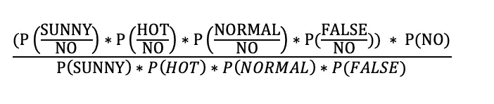

# 条件概率|贝叶斯定理|朴素贝叶斯分类器

> 原文：<https://medium.com/analytics-vidhya/conditional-probability-bayes-theorem-na%C3%AFve-bayes-classifier-152f4bbc3e0f?source=collection_archive---------2----------------------->

你有没有想过:

你的可疑/营销邮件是如何被自动放入垃圾邮件箱而不是主收件箱的？

我们如何预测今天是否会下雨？

如果你有这些问题，那就通读一下这篇文章，你就能大致了解这些预测是如何做出的，这在日常生活中非常有用。

在现实生活中，我们都面临这样的情况，即基于某些条件和先验知识，我们想要预测某个事件的发生，例如，我是一个板球迷，基于今天的天气条件，如温度和湿度水平，以及在这些条件下发生降雨的先验知识，我想计算我们是否会有比赛的概率，基于此，我想把我的赌注下在:D 身上

在这篇文章中，我将试图解开朴素贝叶斯分类器如何工作的谜团。我们将继续进行:

*   基本术语、事件和概率
*   贝叶斯定理，基础和公式推导
*   朴素贝叶斯分类及实例
*   使用朴素贝叶斯方法的优点、缺点和假设

## **基本定义和术语:**

*   **独立事件:**如果事件连续发生，第一个事件的发生不影响第二个事件的成功/失败
*   例如:如果我们掷骰子 3 次，我们想计算连续得到 3 个 6 的概率。它将是 1/6 * 1/6* 1/6，第一次掷骰子不会影响后续掷骰子得到 6 的概率。
*   相关事件:如果一个事件的发生影响了第二个事件的发生，我们称之为相关事件
*   例如:如果我们从一副 52 张牌中随机抽取 4 张牌而不替换，如果我们要计算连续得到皇后的概率，它将是 4/52 * 3/51 * 2/50 * 1/49。这里抽一张皇后牌的概率从 4/52 变为 3/51，因为我们已经拿走了一张牌，那也是一张皇后牌，同样地，在第四次抽牌时，概率下降到 1/49
*   **条件概率:**当我们试图计算一个条件下的概率，即事件 B 已经发生时，事件 A 发生的概率
*   例如，如果我们从一副牌中一张一张地抽取 2 张牌，而没有替换，并且当我们知道第一张牌是一张女王时，我们对计算抽取一张女王的概率感兴趣

# **条件概率方程:**

让我们通过一个例子有一个清晰的画面。

**问题:问题:**

一个钱包里有 4、5 和 3 卢比面值的硬币。分别是 2，5 和 10。抽取两个硬币而不替换第一个抽取的硬币。查找 P(绘制 Rs.2，然后 Rs.2)

***解决方案:***

有四个 Rs 2 硬币，总共有 12 个硬币，所以

p(第一次抽取的 2 卢比硬币)= 4/12，即 1/3

第一次抽奖的结果影响了第二次抽奖的概率，因为第一次抽奖后，我们还剩 3 枚 2 卢比的硬币，现在我们总共有 11 枚硬币。

p(第二次抽取 2 卢比硬币)= 3/11

最后 P(画 Rs。2，那么 Rs 2 ) = (4/12)*(3/11) = **1/11**

# **贝叶斯定理基础及推导:**

*   在概率论中，**贝叶斯定理**描述了基于可能与事件相关的条件的先验知识的事件概率
*   **推导:**贝叶斯定理是通过将下面提到的等式 1 和等式 2 的 P(A 和 B)等式化，通过条件概率等式推导出来的

# 朴素贝叶斯分类器；

分类问题就像我们需要预测 y 的类别，其中提供了特征向量 X，也称为特征向量(X = [x1，x2，x3，x4，...]特征)。所以基于 X，我们需要计算 y 的类，数学上，当 X 发生时，我们可以用 y 来表示。

*我们这里假设特征 x1、x2、x3 都是彼此独立的。*

如上所述，独立事件意味着不受先前事件影响的事件。在数学公式中，我们可以把独立概率写成如下。

现在我们将推导朴素贝叶斯分类器方程:

对于 Y 的所有类，我们计算概率，具有 max(P)的类作为最终类返回

Result = argmax{(Yi / x1 x2 x3..xn)}比如，如果我们有两类 Y，即 0 和 1，那么我们计算 P[Y = 1/x1 x2 x3…]和 P[Y=0 / x1 x2 x3 …]

***现在如果 P [Y=1] > P[Y=0]那么返回 1 else 0 class。***

## 通过示例实现朴素贝叶斯:

假设我们得到了一些变量温度、风、湿度和天气的数据，我们需要知道我们是否会有一场板球比赛。我们得到了以下历史数据，今天的情况是(前景=晴朗，温度=炎热，湿度=正常，风=错误)。看看我们今天是否有比赛。

给定数据:

输入数据

步骤 1:创建特征矩阵并分离出响应变量

已创建特征矩阵

步骤 2:为所有特征创建频率表以找到 P(特征/是)和 P(特征/否)，这给出了每个 outlook 给定匹配被玩或没被玩的概率，如下:

*P(Sunny / Played= Yes)会是*

*(比赛场次=是，前景=晴朗)/(总场次=是)即 4/9*

步骤 3:求 P(Y)，匹配概率=(匹配(是)/总数):

**来自朴素贝叶斯公式**

计算玩游戏的概率:

p(是/(前景=晴朗，温度=热，湿度=正常，风=假))=

p(是/(前景=晴朗，温度=热，湿度=正常，风=假)))=

=(2/9 *2/9 *6/9 *6/9 )* (9/14) / P(晴)*P(热)* P(正常)*P(F)

= 144/(10206 *常数)

*P[是]= 0.0141 *常数*

计算不玩游戏的概率:

p(否/(前景=晴朗，温度=热，湿度=正常，风=假))=

p(否/(前景=晴朗，温度=热，湿度=正常，风=假)))=

=(2/5 *2/5 *1/5 *2/5 )* (5/14) / P(晴)*P(热)* P(正常)*P(F)

= 40/(8750 *常数)

P[No]= *0.0045 *常数*

这里 P[是]> P[否]，所以最终预测的类将是***Y =是***

**朴素贝叶斯的假设:**

*   所有特征都具有同等的权重
*   所有的功能都是相互独立的

**朴素贝叶斯的优点:**

*   易于实施
*   速度快，需要更少的数据进行训练
*   如果假设成立，那么性能是伟大的

**朴素贝叶斯的缺点:**

*   对朴素贝叶斯的主要模仿是独立预测者的假设。
*   如果分类变量在测试数据集中有一个类别，但在训练数据集中没有观察到，那么模型将分配 0(零)概率，并且将无法进行预测

非常感谢你的阅读。欢迎您的建议和问题。