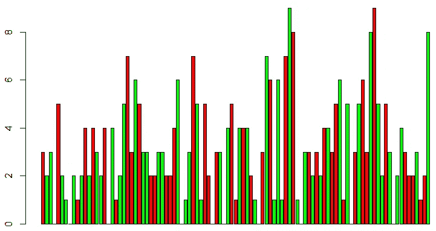

# 使用基数 R 的条件格式图

> 原文：<https://medium.com/analytics-vidhya/conditionally-formatted-plots-using-base-r-5ca3632e374a?source=collection_archive---------18----------------------->

R 中有许多优秀的软件包可以用来制作漂亮的视觉效果。仅使用 base R，我就可以在研究天气数据时快速制作一些图表。我觉得这些技巧可能会引起其他读者的兴趣，因为生成这些图形的代码很短，容易理解，因此也容易记忆。


德克萨斯州达拉斯每年达到的最高温度(1914 年至 2018 年)。颜色表示总体排名。

我正在探索德克萨斯州达拉斯的极端天气。[在这个页面](https://www.currentresults.com/Yearly-Weather/USA/TX/Dallas/extreme-annual-dallas-high-temperature.php)，你会发现从 1914 年到 2018 年，每年记录的最高温度。在制作了数据的初始图表后，我想看看哪一年的记录最高。它没有跳出一个标准的情节，所以我添加了有条件的颜色渐变。


感谢 Artursfoto:【https://pixabay.com/images/id-1744949/ 

我不相信这样做仅仅是“漂亮”。几十万年来，人类一直在关注颜色和纹理的细微差异。制作有冲击力的视觉效果就是要挖掘这些本能，减少观众的认知负荷，并确保传达的信息准确地代表潜在的统计数据。


制作上面两张彩色图表非常容易。

```
barplot(diff(YourData), 
col = ifelse(diff(YourData) > 0 ,"Green","Red"))
```

如果您希望生成类似于股票分析师所看到的东西，只需将 diff(YourData)表达式包装在 abs()中，以便负值被绘制为正值

```
barplot(abs(diff(YourData)), 
col = ifelse(diff(YourData) > 0 ,"Green","Red"))
```



为了获得颜色渐变，我决定利用可用的 rgb 函数。这允许对 r 中的颜色进行精细控制。rgb 的参数基于范围从 0 到 1 的红色、绿色和蓝色值，以及控制透明度的 alpha 值。这些数据是天气温度的数据，范围从 98 度到 112 度。为了使这些值在 0 到 1 的范围内，首先使用 rank，然后因为有 102 条记录，所以通过除以最大等级来缩小它们。

最高温度记录在一列名为 weather$HotF 的数据中(我还查看了寒冷、下雨和下雪。温度以华氏温度测量)。

```
weather$HotFScaledRank<-rank(weather$HotF)/max(rank(weather$HotF))barplot(weather$HotF, 
ylim = c(95,115), 
xpd=FALSE, 
names.arg = weather$HotYear,
col=rgb(
red = weather$HotFScaledRank, 
green = 0, 
blue = (1-(weather$HotFScaledRank)
)))
```

随着红色值下降，蓝色值上升。如果你忽略了这个表达，不要担心。下面是一个简化的例子，其中 blue = 1。你仍然得到同样的效果！

```
barplot(weather$HotF, ylim = c(95,115), xpd=FALSE, names.arg = weather$HotYear,
        col=rgb(red = weather$HotFScaledRank, green = 0, blue = 1))
```


或者你可以只修改α。以下是透明度由缩放等级值修改的红色条的示例:

```
barplot(weather$HotF, ylim = c(95,115), xpd=FALSE, names.arg = weather$HotYear,
col=rgb(red = 1, green = 0, blue = 0,
alpha = weather$HotFScaledRank))
```


…或者对点状图使用相同的配色方案:


```
plot(x=weather$HotYear, y=weather$HotF, pch=16,
col=rgb(red = 1, green = 0, blue = 0, 
alpha = weather$HotFScaledRank))
```

还有很多其他的选择可以探索。如果您有任何问题或想分享一个数据即想法，请随时与我联系。