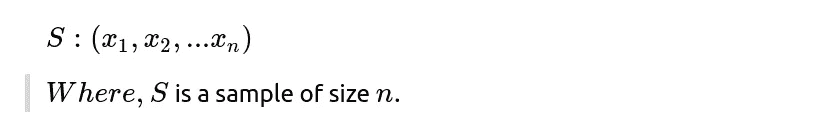
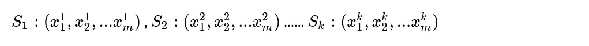
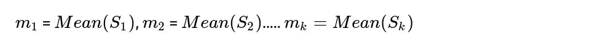
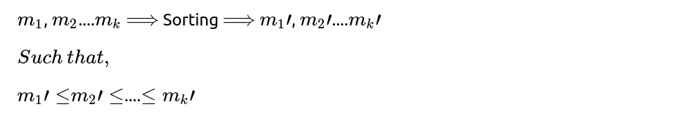
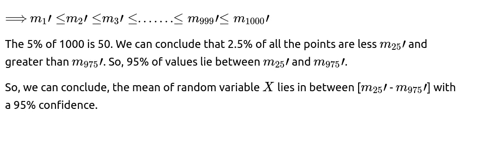

# 置信区间——温和的介绍

> 原文：<https://medium.com/analytics-vidhya/confidence-intervals-a-gentle-introduction-30efa9f82243?source=collection_archive---------22----------------------->

在**统计学**中，置信区间是数据分析和机器学习中广泛使用的最基本、最重要的概念之一。在这篇博客中，我们将首先理解为什么置信区间(CI)是重要的，然后我们将进入它背后的理论。

首先也是最重要的，

## **为什么理解置信区间(CI)很重要？**

假设，你想计算世界上所有在职专业人士的平均工资，并且希望尽可能准确。你会怎么做？

案例 1:解决这个问题的一个简单方法是从人们的工资中随机抽取合理数量的样本，然后取其平均值。但是这样，我们用样本平均值来逼近总体平均值，这不是一个好的解决方案。

> 随着样本量的增加，样本均值收敛于总体均值。

案例 2:解决这个问题的艰难方法是收集世界上所有人的工资，然后取其平均值。在这种情况下，你是直接计算人口平均数，所以你是非常准确的！但是，*你能收集世界上所有人的工资吗？一点也不！对吗？*那么，有没有一种*巧妙*的做法呢？

如果我们不直接计算精确的总体均值或通过样本均值逼近总体均值，而是返回一个区间，在该区间内找到总体均值的概率非常高，会怎么样？**更清楚地说**，**我们可以说，世界上所有在职专业人士的平均工资在 100 美元到 200 美元之间，有 95%的可能性。**

这就是置信区间帮助我们的地方！我们知道置信区间的重要性，现在让我们来讨论置信区间是如何工作的。

# 使用经验自助法的置信区间:

这个世界上所有人的工资可以被认为是一个随机变量(X)。我们想估计 X 平均值的 95% C . I，了解 X 可能有任何可能的分布是很重要的。

**步骤 1** :从 X 开始，我们采样 *n* 个数的点。

所以，现在我们有了，

**步骤 2** :从上面的样本中，我们生成大小为 *m.* 的新样本，其中 *m* ≤ *n* 。从样本中随机选取 *m* 个点，放入新的样本中(假设，S1)。

现在我们有了，

**第三步:**我们重复上述过程(我是说第二步) *k 次。因此，最后我们得到了 *k 个*样本，每个样本的大小为 *m.**

记住，每个样本的每个元素都是从 s 中随机选取的。

**第四步:**由于我们要估计均值的置信区间，所以我们计算每个样本的均值。

**步骤 5:** 我们有 k 个均值，这些均值是使用自举样本生成的。现在，我们对计算机平均值的所有 K 值进行排序。

**第六步:**现在，我们有 k 个排序后的数字，每个数字代表某个样本的平均值。假设，k = 1000。然后，我们有 1000 个排序的数字。

## 参考资料:

1.  [置信区间—维基百科](https://en.wikipedia.org/wiki/Confidence_interval#:~:text=In%20statistics%2C%20a%20confidence%20interval,is%20in%20the%20proposed%20range.)
2.  [置信区间——可汗学院](https://www.khanacademy.org/math/statistics-probability/confidence-intervals-one-sampl)