# NVIDIA Jetson 使用 Nano.img 进行深度学习和计算机视觉的配置

> 原文：<https://medium.com/analytics-vidhya/configuration-of-nvidia-jetson-using-custom-nano-img-for-deep-learning-and-computer-vision-5922d2cdb5ac?source=collection_archive---------6----------------------->

*   桑克斯·胡达尔

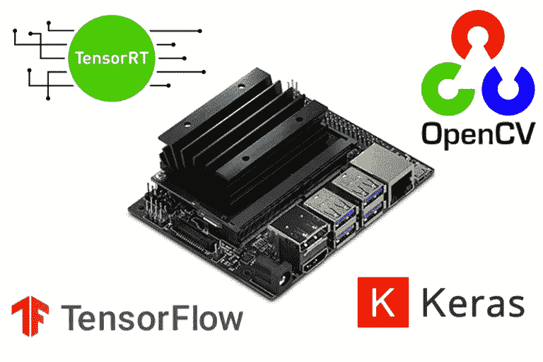

在今天的教程中，您将了解如何使用 TensorFlow、Keras、TensorRT 和 OpenCV 为计算机视觉和深度学习配置您的 NVIDIA Jetson Nano。

NVIDIA Jetson Nano 简介

在开始之前，让我们先来看看 NVIDIA Jetson Nano 的规格——CPU、GPU、内存、摄像头和视频

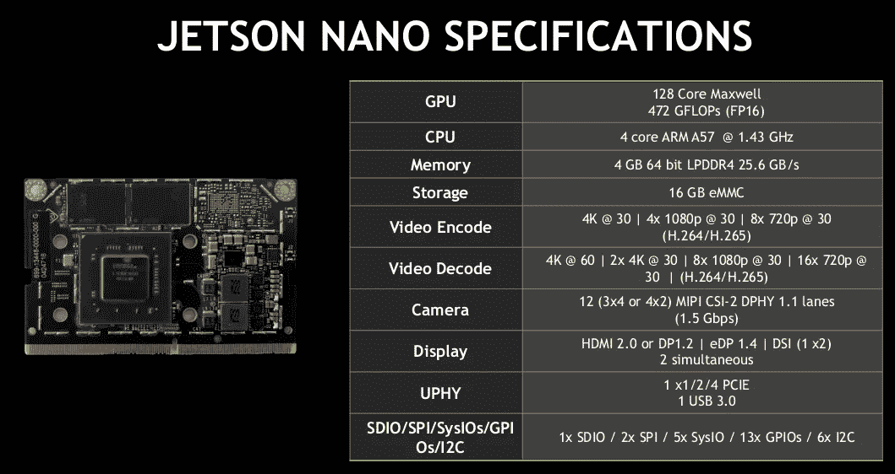

在本教程中，您将学习如何使用预配置的 NVIDIA Jetson Nano.img 进行计算机视觉和深度学习。这个。img 包括 TensorFlow，Keras，TensorRT，OpenCV 等。预装！

Adrian Rosebrock 和 PyImageSearch 对 Nano.img 的配置值得称赞

通常，设置您的 NVIDIA Jetson Nano 需要 36-48 小时，才能使其完全能够处理深度学习驱动的推理。这包括:

*   系统级包
*   从源代码编译的 OpenCV(支持 CUDA)
*   英伟达发布的 TensorFlow 1.13.1
*   滕索特
*   所需的 Python 库
*   研究时间，反复试验，从头开始，用头敲几次键盘

# 步骤#1:下载并解压归档文件

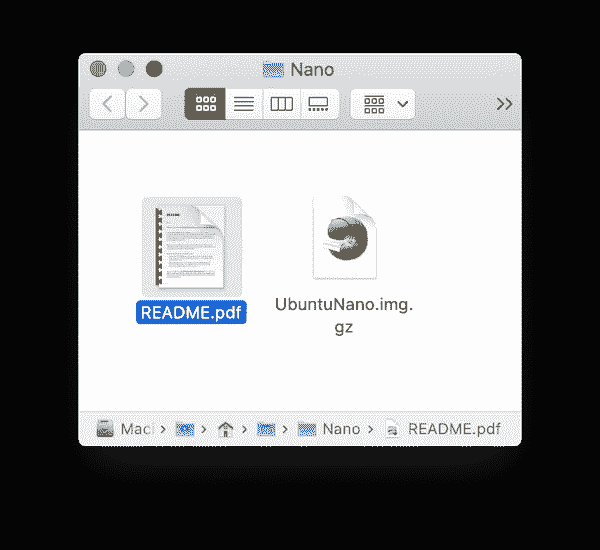

**图 1:** 下载并解压缩预配置的 NVIDIA Jetson Nano 后。img，你会看到两个文件`UbuntuNano.img.gz`和`README.pdf`。`.gz`文件已经可以用 balenaEtcher 刷新了。

继续使用你最喜欢的解压工具(7zip，Keka，WinRAR 等)解压文件。).一旦你。解压缩后，您将看到一个. img.gz 文件。*不需要提取包含的. img.gz 文件，因为我们将直接使用 balenaEtcher 对它们进行闪存。*

解压缩 UbuntuNano.zip 后，您的文件夹应该看起来像**图 1** 。

# 步骤 2:编写。使用 balenaEtcher 将 img 复制到 32GB 的 microSD

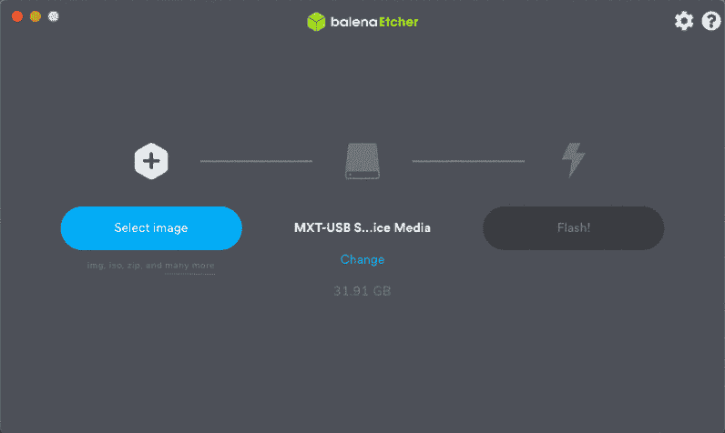

**图二:**闪着英伟达 Jetson Nano。img 针对深度学习和计算机视觉进行了预配置。

这辆杰特森·纳诺。img 将仅在 **32GB microSD 卡**上**和*工作。请勿尝试使用 8GB、16GB、64GB、128GB 或更高的卡。虽然从技术上来说，Jetson Nano 支持 32GB 和更高的 MicroSD，但我们的。img 只能闪存到 32GB 的存储卡。***

另外，我*推荐*高品质的 Sandisk 32GB 98MB/s 卡。它们可以在亚马逊 和许多在线经销商处买到。购买非品牌的廉价卡的读者经常会遇到可靠性问题。

编写预配置的 Nano。img 到你的卡，只需使用名为 [**balenaEtcher**](https://www.balena.io/etcher/) 的免费工具(兼容 Mac、Linux 和 Windows)。

**BalenaEtcher 可以处理压缩文件**比如。gz *(加载到蚀刻机之前不需要提取. img . gz)*。

遵循以下简单步骤:

1.  选择 UnuntuNano.img.gz 文件。
2.  指定目标设备(您的 **32GB microSD** )。
3.  点击*闪光灯！*按钮。

刷新可能需要大约 25-35 分钟或更长时间(远远少于手动安装软件所需的时间)。保持耐心——也许在系统闪烁的时候去散散步、读本书或喝杯茶。没有什么比看着水沸腾或等待油漆变干更好的了，所以抑制你的兴奋，离开你的屏幕。

# 第三步:第一次启动你的 NVIDIA Jetson Nano

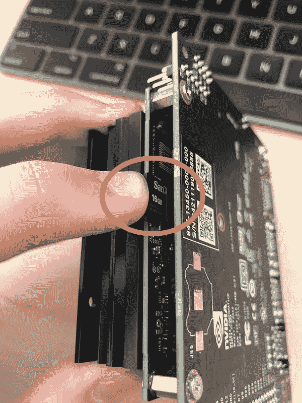

**图 3:**NVIDIA Jetson Nano 上的 microSD 读卡器插槽位于散热器下方，如图所示。只需插入 NVIDIA Jetson Nano。img 预配置深度学习和计算机视觉，并开始执行代码。

使用预先配置的 PyImageSearch 刷新您的 microSD 后。如**图 3** 所示，将卡插入散热器下的 Jetson Nano。

从那里，启动您的 Jetson Nano，并输入用户名和密码:

*   **用户名:**图片搜索
*   **密码:** pyimagesearch

如果您在登录时遇到问题，很可能是由于您的非美国键盘布局。您可能需要插入一个美国键盘，或者仔细地将您现有的键盘按键映射到用户名和密码。

在登录程序之前或之后的任何时候，继续将以太网电缆插入 Nano 和您的网络交换机—**Jetson Nano 开箱后不具备 WiFi 功能。**如果您希望使用 WiFi，请滚动到*“向 Jetson Nano 添加 WiFi 模块”*部分。

# 步骤#4:打开终端并激活预配置的虚拟环境

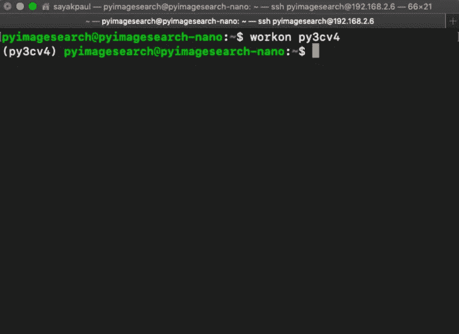

**图 4:** 要启动 Python 虚拟环境，只需在终端中使用 work on 命令。然后，您将使用 PyImageSearch 在 NVIDIA Jetson Nano 上的预配置深度学习和计算机视觉环境中工作。img

我的预配置杰特森纳米。img 配备了深度学习和计算机视觉部署所需的所有软件。您可以在名为 py3cv4 的 Python 虚拟环境下找到该软件

要访问 Python 虚拟环境，只需通过以下方式激活它:

$ workon py3cv4

注意图 4 中的 bash 提示符前面有一个环境名，用括号括起来。

# 如何在您的 Jetson Nano 上测试和使用 USB 或 PiCamera

Raspberry Pi 用户会很高兴地知道，你在抽屉里为启示录(即深度学习的僵尸对象检测)**储存的各种 **PiCamera 模块**与 Jetson Nano 兼容！**

在本节中，我们不会检测僵尸。相反，我们将使用一个简短的 Python 脚本简单地测试我们的 USB 和 PiCamera。

在我们开始之前，请前往这篇博客文章的 ***【下载】*** 部分。包含代码的 zip。

在里面，您会发现一个单独的 Python 脚本，名为

test_camera_nano.py 我们现在来回顾一下:

代码:

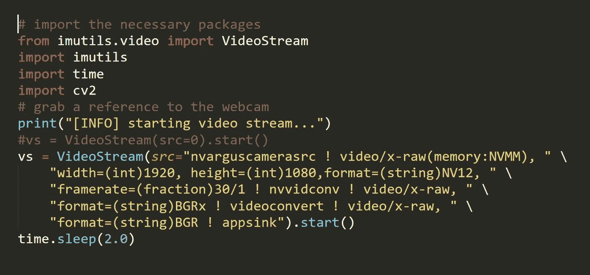

这里我们从 *imutils* 导入我们的 *VideoStream* 类。我们将使用这个类来处理(1)PiCamera 或(2)USB 摄像头。

让我们继续在第 9–14 行设置我们的流

*   **USB 摄像头:**目前已在**第 9 行**注释掉，要使用您的 USB 网络摄像头，您只需提供 *src=0* 或另一个设备序号，如果您有多个 USB 摄像头连接到您的 Nano。
*   **PiCamera:** 目前活跃在**10–14**行，一个很长的 src 字符串用于与 Nano 上的驱动程序一起工作，以访问插入 MIPI 端口的 PiCamera。如您所见，格式字符串中的宽度和高度表示 1080p 分辨率。您也可以使用您的 PiCamera 与 兼容的其他 [**分辨率。**](https://picamera.readthedocs.io/en/release-1.12/fov.html#camera-modes)

现在我们的相机流已经准备好了，我们将循环帧并用 OpenCV 显示它们:

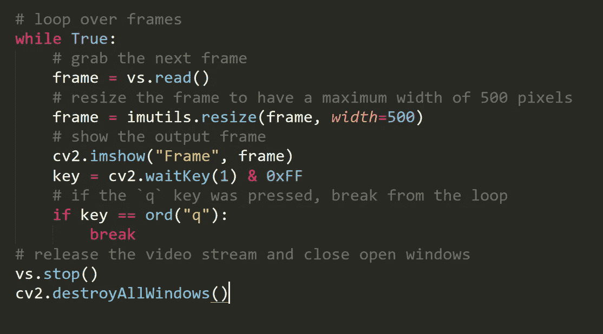

在循环内部，我们抓取一个帧并调整其大小，保持纵横比(**第 20–23 行**)。虽然您不需要调整您的框架大小，但我们这样做是为了确保它适合我们的屏幕，以防您的相机分辨率大于您的屏幕。

从那里，我们显示帧并捕捉按键；当 q 键被按下时，我们*断开*并清理。

让我们学习执行我们的 Jetson 纳米相机测试脚本。

首先，决定是使用 USB 网络摄像头还是 PiCamera。适当地注释/取消注释第 9–14 行。在脚本的当前形式中，我们选择 PiCamera。

然后，激活您的虚拟环境(它是在上预先配置的。img):

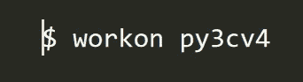

从那里，执行脚本:

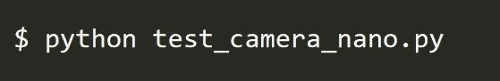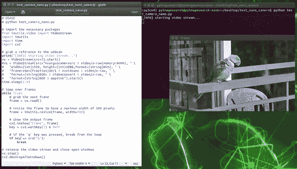

**图 9:** 使用预配置的 NVIDIA Jetson Nano 测试 PiCamera。计算机视觉和深度学习 img。

正如你在**图 9** 中看到的，NVIDIA Jetson Nano 正在使用 PiCamera 观察一只鸟**。**

考虑到 Jetson Nano 支持 PiCamera，该产品在深度学习能力方面比 Raspberry Pi 更上一层楼。

# 常见问题(FAQ)

问:如果我想自己配置我的 Jetson Nano 怎么办？

**答:**请继续关注关于如何手动配置你的 Jetson Nano 的教程。一定要安排 2-5 天的时间来安装所有的东西。

**问:手工安装深度学习和计算机视觉软件需要多长时间？**

如果你知道自己在做什么，至少需要两天时间。我们建议预算 3-5 天来解决出现的问题。

**问:其中** [***树莓为计算机视觉***](https://www.pyimagesearch.com/raspberry-pi-for-computer-vision/) **捆的是纳米。img 包含在内？**

**答:**纳米。img 仅附带*完整套装*。

问:的操作系统版本是什么？img？

答:这个。img 运行 Ubuntu 18.04。

**问:为什么我们在*完整捆绑包*中使用*两个不同版本的 Tensorflow* ？**

**答:**这主要是因为 OpenVINO(用于在 NCS 上部署模型)和 TensorRT(用于为 Jetson Nano 优化模型)都不支持 Tensorflow 2.0。在撰写这些章节时，我们发现 Tensorflow 1.13.1 是最稳定的版本。

问:在哪里可以了解更多关于 Python 虚拟环境的信息？

我最喜欢的资源和 Python 虚拟环境介绍可以在 [**这里**](https://realpython.com/blog/python/python-virtual-environments-a-primer/) 找到。我也在上半年的 [**这篇博文**](https://www.pyimagesearch.com/2016/05/02/accessing-rpi-gpio-and-gpio-zero-with-opencv-python/) 中讨论过它们。

**问:我可以购买吗？img 作为独立产品？**

的。img 文件旨在与用于计算机视觉的[***Raspberry Pi***](https://www.pyimagesearch.com/raspberry-pi-for-computer-vision/)一起使用，确保您可以开箱即用地运行文本中的示例(更不用说开发自己的项目)。

我建议 [**购买一份**](https://www.pyimagesearch.com/raspberry-pi-for-computer-vision/) 来访问. img

# 我被卖了！我怎样才能获得图片搜索。img？

PyImageSearch 购买计算机视觉 树莓派 [***的*完整套装*副本的读者获得杰特森纳米。img 作为书的一部分。***](https://www.pyimagesearch.com/raspberry-pi-for-computer-vision/)

这本书附带的所有 Jetson Nano 代码都准备在这个. img 上运行。我们为这个的用户提供全面支持。img(我们很难支持定制安装，因为我们没有坐在您自己的 Nano 前面)。

如果你刚刚开始使用嵌入式计算机视觉，并想开始使用 Raspberry Pi，只需选择一个*爱好者*或*黑客*包，这两个包都带有我们的 [**预配置的 Raspbian。img**](https://www.pyimagesearch.com/2016/11/21/raspbian-opencv-pre-configured-and-pre-installed/) 。

再说一遍，*完整套装*是唯一一款带有杰特森 Nano .img 的套装