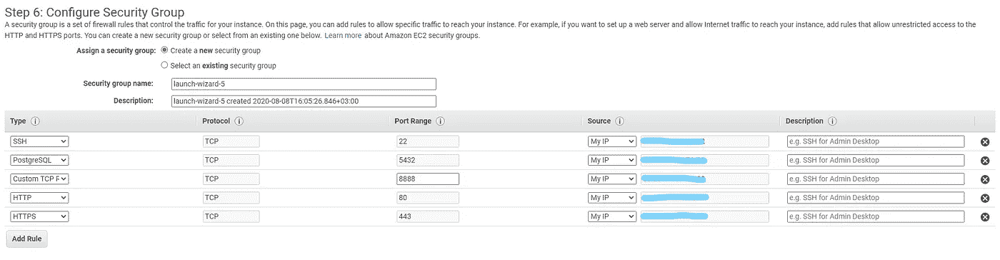
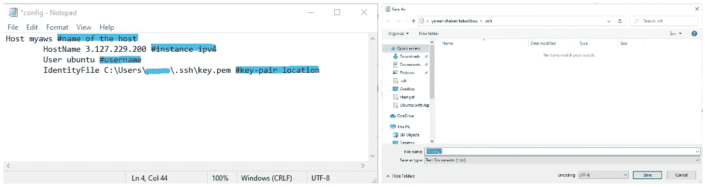
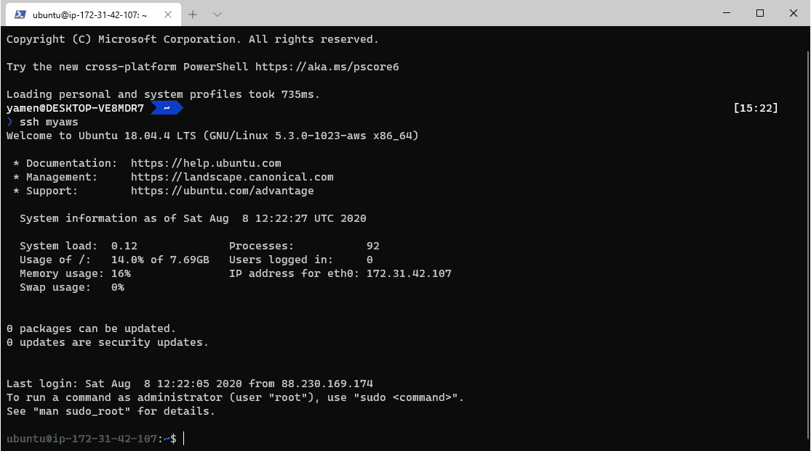
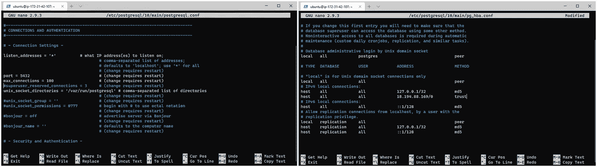

# 配置 Amazon EC2 运行 PostgreSQL、Anaconda 和 Jupyter Notebook

> 原文：<https://medium.com/analytics-vidhya/configure-amazon-ec2-to-run-postgresql-anaconda-and-jupyter-notebook-eefc0785a71f?source=collection_archive---------15----------------------->


在本教程中，我们将创建一个新的 ***Amazon EC2*** 实例，并安装 ***Anaconda*** ， ***Python*** ， ***PostgreSQL*** ，以及***Jupyter notebook***，以便在 ***EC2*** 实例 throw 上从本地机器(windows 10)运行我们的 Python 脚本

## 1-午餐 EC2 实例:

*   从 AWS 管理控制台中，我们选择了 EC2 服务，然后我们开始用一个 ***Ubuntu 服务器 AMI 启动我们的新 **EC2** 实例。***
*   出于本教程的考虑，我们将通过选择符合自由层条件的实例类型 ***t2.micro*** 来停留在 ***AWS*** 的自由层。
*   我们将保持配置细节不变，增加卷大小(可选步骤 max 30GiB)，我们将继续不添加标签，最后，我们将在 ***端口 22 上打开我们的实例到 ***SSH*** ，在 ***端口 5432 上打开 PostgreSQL*** ，在 ***端口 8888 上打开 Jupiter 笔记本*** ，在**上打开 HTTP*****



*   在验证了我们的配置之后，我们将一个新的密钥对附加到实例，或者选择一个现有的密钥对。

## 2-在本地机器上配置 SSH:

*   因为我们本地机器的操作系统可能是 windows 10🙏 ***SSH*** 默认提供了 ***CMD*** ，否则我们将需要使用 ***puTTY*** 来连接到使用 throw ***SSH 的实例。***
*   在我们的本地机器上，我们导航到***C:\ Users \ our-local-user***。\ssh 我们添加一个名为***‘config’***的新文本文件，然后填充它，如下图所示。

> (注意:要保存不带扩展名的文件，我们将文件→另存为→将文件名写在双引号内，# sympol 后面的所有内容仅用于演示)



## 3-将 Throw SSH 连接到 EC2 实例:



打开本地机器上的 ***CMD*** 或者使用(Windows 终端)，然后键入' ***ssh myaws'*** (我们在 ***config*** 文件中指定的名称)，系统会询问您是否确定要连接到实例类型 ***'yes'*** 。
***瞧，*** 现在你已经连接到实例了👌。

## 4-在 EC2 实例上安装 Anaconda:

*   转到[***Anaconda***](https://www.anaconda.com/download/#linux)→页面底部的 ***Linux*** 部分右键单击 [64 位(x86)安装程序(550 MB)](https://repo.anaconda.com/archive/Anaconda3-2020.07-Linux-x86_64.sh) →选择复制链接地址，然后在您连接到实例的 CMD 中写入(或者使用与本文不兼容的链接，但在您阅读本文时可能已经引入了新版本):

```
wget [https://repo.anaconda.com/archive/Anaconda3-5.3.0-Linux-x86_64.sh](https://repo.anaconda.com/archive/Anaconda3-2020.07-Linux-x86_64.sh)
```

*   用***‘ls’***命令找出你安装了哪个文件，然后用***‘sh’***命令运行它，对我来说是这样的:

```
sh Anaconda3–2020.07-Linux-x86_64.sh
```

*   接受许可协议，接受默认安装位置，并在询问您是否要运行`conda init.`时回答“是”
*   运行 ***源。bashrc'*** 为了保证 python 的路径被配置好，现在你处于****base***Anaconda 环境*。**
*   *运行***‘康达停用’***退出。*

## *5-在 EC2 实例上安装和配置 PostgreSQL:*

*   *要在实例上安装 PostgreSQL，请运行:*

```
*sudo apt-get install postgresql postgresql-contrib*
```

*   *使用以下命令在 AWS 上的 PostgreSQL 上设置您的用户`ubuntu`:*

```
*sudo -u postgres createuser --superuser ubuntu
createdb*
```

*   *运行“psql”命令检查安装，然后运行“\q”退出。*
*   *要配置 PostgreSQL，运行以下命令，搜索***# listen _ addresses = ' localhost '***，将其更改为***listen _ addresses = ' * '***，然后保存并退出:*

> *sudo su-postgres
> nano/etc/PostgreSQL/10/main/PostgreSQL . conf*

*   *我们将编辑另一个配置文件。在您的终端中运行以下命令*

```
*nano /etc/postgresql/10/main/pg_hba.conf*
```

*并搜索“IPv4 本地连接”。你应该有一条允许`127.0.0.1/32`连接的线路。在这一行下面，添加以下内容:*

```
*host    all             all             65.209.60.146/0         trust*
```

**

*   *最后，我们使用***【exit】***命令退出 Postgres 用户，并使用以下命令重启 Postgres 服务器:*

```
*sudo service postgresql restart*
```

## *6-在 EC2 实例上创建一个新的 Anaconda 环境:*

*   *我们用 Psycopg2、***Python***version***3 . 7 . 7***和 ***Anaconda*** 包创建一个新的 ***Anaconda*** 环境(顺序很重要)，然后我们用以下命令激活它:*

```
*conda create --name newenv Psycopg2 python=3.7.7 anaconda
conda activate newenv*
```

## *7-在 AWS EC2 上配置 Jupyter:*

*   *第一次设置机器时，我们需要配置 Jupyter 以允许远程连接，并为 Jupiter 配置一个密码。在我们的实例中，我们运行:*

```
*jupyter notebook --generate-config
jupyter notebook password*
```

## *8-在 EC2 上运行 Jupyter，并从您的本地机器创建隧道:*

*   *我们使用以下命令在我们的实例上运行 Jupyter 笔记本，并且我们指定在我们的实例上没有带有 ***no-browser*** 标志的浏览器:*

```
*jupyter notebook --no-browser*
```

*   *我们打开另一个***CMD***or(Windows 终端)并使用以下命令在我们的本地机器和 ***EC2*** 实例之间创建一个隧道:*

```
*ssh myaws -L 8212:localhost:8888*
```

*其中 ***8121*** 是我们要在本地机器上打开 Jupyter 笔记本的端口号，而***localhost:8888***是我们实例上的 out Jupyter 笔记本地址。*

## ****9-使用本地机器浏览器打开 Jupyter 笔记本:****

*   *使用您选择的网络浏览器导航到***localhost:8212***地址，您应该看到 Jupyter 要求您输入密码，输入密码并开始编码😎。*

# *在以下位置找到我:*

***LinkedIn:**[https://www.linkedin.com/in/yamenshaban/](https://www.linkedin.com/in/yamenshaban/)
**GitHub:**[https://github.com/yamenkaba](https://github.com/yamenkaba)*