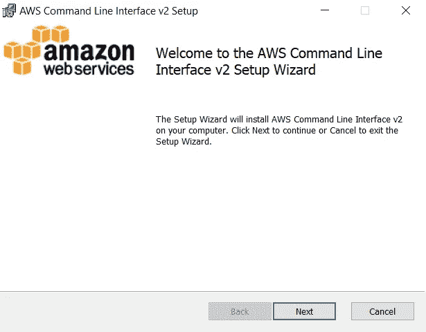
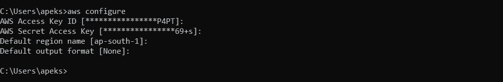
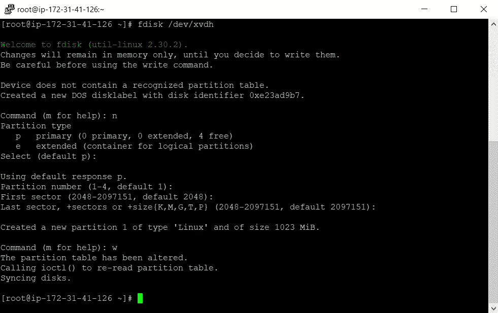
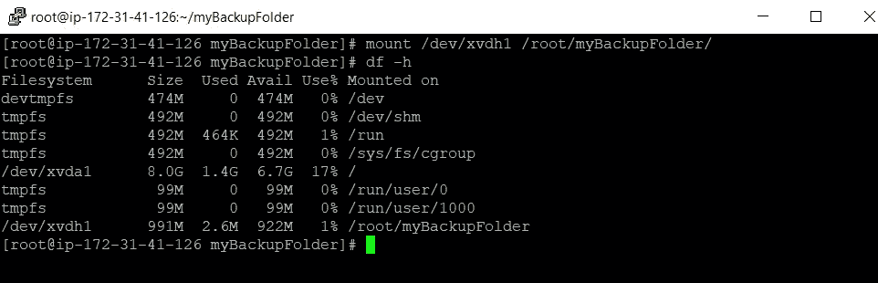
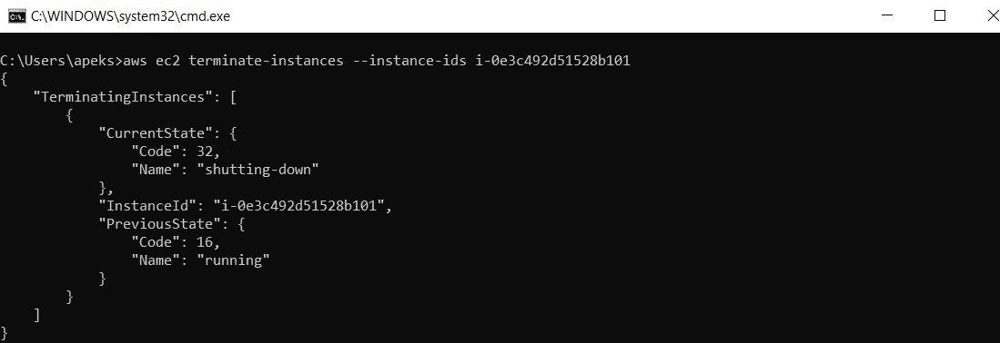

# 配置 AWS CLI 并执行命令

> 原文：<https://medium.com/analytics-vidhya/configure-aws-cli-and-execute-commands-fc16a17b0aa2?source=collection_archive---------11----------------------->


在这篇博客中，我将展示如何设置 AWS CLI 以及如何使用它执行命令。

> **AWS 命令行界面(CLI)** 是管理您的 AWS 服务的统一工具。只需下载和配置一个工具，您就可以从命令行控制多个 AWS 服务，并通过脚本实现自动化。

**因此，我们将使用 aws cli 命令做的事情将是:**

*✨安装 AWS CLI 并设置您的 AWS 配置文件
✨创建密钥对*
✨ *创建安全组
✨使用上面创建的密钥对和安全组启动一个实例。
✨Create 一个 1 GB 的 EBS 卷。
✨最后一步是将上面创建的 EBS 卷附加到您在前面步骤中创建的实例，并能够在其上挂载目录。
✨Detach 卷并终止您创建的实例。*

**执行此操作的唯一先决条件是拥有拥有编程访问和管理员权限的 AWS IAM 用户。**

因此，这里有一个逐步的程序，就如何执行上述事情。

**第一步:**从他们的 [***官方网站***](https://docs.aws.amazon.com/cli/latest/userguide/install-cliv2-windows.html) 下载 **AWS CLI SDK** 。如果您是第一次安装，我更愿意下载 CLI 版本 2，并根据您的操作系统进行下载。对于 windows 来说，安装起来非常容易。通过 msi 安装程序下载安装即可。对于**windows****可以直接从 [**这里下载最新版本。**](https://awscli.amazonaws.com/AWSCLIV2.msi)******

********

****单击“下一步”,按照他们的指导安装 aws cli。这是一个非常简单的过程。****

******第二步:**成功安装后，您可以通过下面的命令`**aws --version**`检查您的安装****

********

****如果你得到了如上的输出，这意味着你已经准备好了。****

******步骤 3:** 现在通过`**aws configure**` 命令配置您的 AWS 概要文件****

********

****在此输入创建 IAM 用户时提供的**访问密钥**和**秘密访问密钥**，然后输入您的默认区域和您可以跳过的最后一个区域。****

****现在，如果你成功地完成了所有的步骤，那么你就成功地设置了你的个人资料，你就可以开始了。****

******步骤 4 : *创建密钥对:*** 现在我们必须创建一个密钥对。您可以通过以下命令轻松完成****

```
****aws ec2 create-key-pair --key-name <name-of-your-key>****
```

********

******注意:**将此密钥复制到扩展名为**的新文件中。pem** 因为稍后会用到。通过将 **\n** 替换为下一行的**，以如下所示的类似方式格式化上述密钥。******

************

********步骤 5: *创建安全组:*** 现在，在创建安全组之前，通过下面的命令检查您的公共 IP******

```
****curl https://checkip.amazonaws.com****
```

********

****所以 CIDR 符号是`**<your-IP>/24**`。在我的例子中，49.36.150.128/24 的 CIDR 符号将是**。它将限制对您的实例的访问，除了具有类似符号的 IP。******

******下面的命令将创建安全组。******

```
******aws ec2 create-security-group --group-name <name-for-your-security-group> --description <"a short description for your security group">******
```

************

********步骤 6:** 现在在文本编辑器中复制安全组 id，因为稍后需要它们。现在，在创建安全组之后，重要的是向它添加规则，否则就像 SSH 访问，以便我们可以访问它。******

```
****aws ec2 authorize-security-group-ingress --group-id <security-group -id> --protocol tcp --port <port-of-service-you-want-to-expose> --cidr <CIDR-Notation-of-IP>****
```

****在我的例子中，我允许从我的公共 ip 进行 ssh 访问。****

********

******步骤 7: *启动 ec2 实例:*** 现在，为了启动 ec2 实例，我们需要以下信息****

*   ****由**图像 id** 表示的图像的 ami-id****
*   ****由**计数**表示的要启动的实例数量****
*   ****由**实例类型**表示的实例类型****
*   ****由**键名**表示的键名****
*   ****由**安全组标识**表示的安全组的标识号****
*   ****由 subnet-id 表示的区域的子网 id****

****因此，在收集了上述所有信息后，您可以通过下面的命令启动实例****

******注意:**我们将使用之前创建的相同的密钥对和安全组。****

```
****aws ec2 run-instances --image-id <ami-id> --count <no-of-count> --instance-type <type-of-instance> --key-name <name-of-key> --security-group-ids <security-group-id> --subnet-id <subnet-id>****
```

****下面显示的是最终的命令和结果。****

********

****这里还要记下实例的**实例 id** 。
你也可以通过下面的命令提供**标签**给你的 ec2 实例。****

```
****aws ec2 create-tags --resources <instance-id> --tags Key=Name,Value=<Name-you-want-to-give>****
```

******步骤 8: *创建 EBS 卷:*** 现在我们必须创建 EBS 卷来附加到我们的实例。您可以通过以下命令轻松创建 ebs 卷****

```
****aws ec2 create-volume --volume-type gp2 --size <storage-in-GB> --availability-zone <availability-zone-name>****
```

********

****这里也记下 **VolumeId** ，因为稍后会用到。****

******第 9 步:** ***将 EBS 卷附加到 EC2 实例:*******

```
****aws ec2 attach-volume --volume-id <volume-id> --instance-id <instance-id> --device /dev/xvdh****
```

********

****从上图中可以看到，我创建了一个 1 GB 的 EBS 卷，并挂载到我们的 ec2 实例上****

******第 10 步:*创建分区并格式化:*** 因此仅附加卷将不允许我们能够使用该卷。首先，我们必须创建分区，然后格式化它，使其可用。****

****您可以通过命令`**fdisk <device-name>**` 创建一个分区。在我们的例子中，设备名是`**/dev/xvdh**`。因此，之后`**press n**`创建新的分区，然后`**hit Enter four times**`让一切默认，`**press w**`保存并退出。你可以从下面的照片中看到。****

********

****要确认并获得更多关于您的分区的详细信息，您可以通过下面的命令`**fdisk -l**`进行检查。从那里，你可以得到你的驱动器的名字，这是格式化所需要的。从下面的照片，你可以看到我们的分区和驱动器的名称是 **/dev/xvdh1** 。****

********

****现在，分区创建成功后，您可以在挂载到任何目录之前格式化您的磁盘。以下命令将格式化您的磁盘`**mkfs.ext4 /dev/xvdh1**`。****

********

******步骤 11: *在驱动器上挂载目录:*** 要挂载任何目录或文件夹，首先它应该是空的，然后你可以通过下面的命令挂载****

```
****mount /dev/xvdh1 <path-to-your-directory>****
```

********

****`**df -h**`命令显示了系统上的所有挂载，您可以看到我们的卷已经成功挂载。****

******步骤 12: *强制分离并终止 ec2 实例:*** 为了分离，建议先卸载您的磁盘，然后分离卷。
✔卸载磁盘:`**umount -l <path-of-your-mounted-folder>**`t24】✔强制分离您的卷:`**aws ec2 detach-volume — volume-id <volume-id> — force**`****

********

****✔终止您的 ec2 实例:`**aws ec2 terminate-instances — instance-ids <instance-id>**`****

********

****这就是了。我们完成了所有我们想要达到的目标。我希望你们都能做到完美。****

> ****这就是这篇博客的内容。希望你喜欢。下一篇博客再见。快乐编码。****