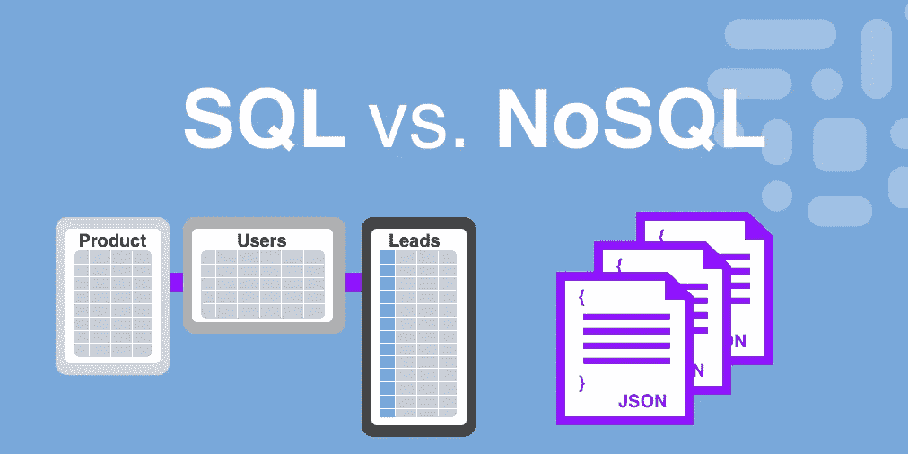

# 用姜戈配置卡珊德拉

> 原文：<https://medium.com/analytics-vidhya/configure-cassandra-with-django-1b7f5d084c6e?source=collection_archive---------13----------------------->

Cassandra 是一个开源的分布式数据库管理系统。它是为处理商用硬件或云基础设施上的大量数据而开发的。Cassandra 提供无单点故障的高可用性。

Cassandra 通过在不停机或不中断应用程序的情况下添加新机器来支持线性可伸缩性，还增加了 Cassandra 的读写吞吐量。

集群中的每个 Cassandra 节点将具有相同的角色。数据分布在整个群集中，这意味着每个节点保存不同的数据。Cassandra 支持复制和多数据中心复制，用于冗余、故障转移和灾难恢复。


如果您计划设计一个基于单片架构(垂直扩展)的应用程序，并且仍然决定使用数据库。



嗯，这取决于你，但在我看来，卡珊德拉将是一个不错的选择。

[卡珊德拉 vs MongoDB vs PostgreSQL](https://db-engines.com/en/system/Cassandra%3bMongoDB%3bPostgreSQL)

# **安装卡珊德拉(Ubuntu 18.04)**

因为 Cassandra 是用 java 实现的，所以我们需要安装一些依赖项。

**步骤 1: *这个命令提供了所使用的 apt 库的抽象。***

```
**$** sudo apt-get install software-properties-common
```

**步骤 2: *使用此命令添加个人程序包档案(PPA)以安装 oracle JRE 程序包。***

```
**$** sudo apt-add-repository ppa:webupd8team/java
```

**第三步:*从 repo 下载更新。***

```
**$** sudo apt-get update
```

**第四步:*安装 java。***

```
**$** sudo apt install oracle-java8-installer
```

卡住了！

**第五步:** ***(可选)***

```
**$** sudo apt install -y openjdk-8-jre
```

最后😎我们安装所有的依赖项，让我们安装 Cassandra。

**第一步:*添加一个 cassandra repo。***

```
**$** echo "deb http://www.apache.org/dist/cassandra/debian 311x main" |         sudo tee -a /etc/apt/sources.list.d/cassandra.sources.list
```

**步骤 2: *添加 Cassandra repo 的公钥，这样就不会遇到 GPG 错误。***

```
**$** wget https://www.apache.org/dist/cassandra/KEYS | sudo apt-key add -
```

如果你遇到 GPG 错误。

```
**$** gpg - keyserver pgp.mit.edu - recv-keys 749D6EEC0353B12C
**$** gpg --export --armor 749D6EEC0353B12C | sudo apt-key add -
**$** gpg --keyserver pgp.mit.edu --recv-keys A278B781FE4B2BDA
**$** gpg --export --armor A278B781FE4B2BDA | sudo apt-key add -
```

**第三步:*安装带网络时间协议(ntp)的 Cassandra***

```
**$** sudo apt-get install cassandra ntp
```

要检查安装是否成功，我们可以检查服务的状态。为此，请运行以下命令:

```
**$** sudo systemctl status cassandra
```

如果系统启动时尚未启用该服务，您可以使用下面的命令来启用它

```
**$** sudo systemctl enable cassandra
```

并启动卡珊德拉服务。

```
**$** sudo systemctl start cassandra
```

如果我们要在单个节点上运行 Cassandra，Cassandra 的默认配置是有效的。另一方面，如果 Cassandra 将在一个集群中使用或者由几个节点同时使用，那么对配置文件进行一些修改是很方便的。Cassandra 配置文件名为 **cassandra.yaml** ，位于 **/etc/cassandra/** 。我们可以用我们最喜欢的文本编辑器打开它，并修改一些选项:

```
**$** sudo nano /etc/cassandra/cassandra.yaml
```

首先，我们必须更改集群的名称。查找 **cluster_name** 参数，并指定您想要的名称:

```
cluster_name: [cluster_name]
```

那么，改变数据存储端口是一个好主意。为此，查找 **storage_port** 参数并分配一个。请记住，它必须是[防火墙](https://www.hostinger.com/tutorials/how-to-configure-firewall-on-ubuntu-using-ufw/)中的可用端口，这样一切才能正常工作:

```
storage_port :[port]
```

最后，我们查找 **seed_provider** 参数，在 seeds 部分，我们添加组成集群的节点的 IP 地址，用逗号分隔。

```
Seeds: [node_ip],[node_ip]...[node_ip]
```

完成后，保存文件并重新加载 Cassandra。

```
**$** sudo systemctl reload cassandra
```

> cqlsh(Cassandra 查询语言 shell)的默认用户名和密码是“Cassandra”

使用以下命令提示 cqlsh

```
$ cqlsh -u cassandra -p cassandra
$ cassandra@cqlsh>
```

让我们创建一个密钥空间(数据库)。

```
cassandra@cqlsh> CREATE KEYSPACE db WITH replication = {'class':'SimpleStrategy', 'replication_factor' : 3};
```

# 创建 Django 项目

我希望你对 python 和 django 有一点熟悉，所以这里我就不赘述了。我假设您已经创建了一个 virtualenv 并运行 django-admin 命令来启动一个项目。

需要安装一个包来开始与 Apache Cassandra 和 Django 框架的工作！

```
**$** pip install django-cassandra-engine
```

现在去你的设置文件用下面的 json 替换数据库。

```
DATABASES = {
    'default': {
        'ENGINE': 'django_cassandra_engine',
        'NAME': 'db',
        'TEST_NAME': 'test_db',
        'HOST': '127.0.0.1',
        'OPTIONS': {
            'replication': {
                'strategy_class': 'SimpleStrategy',
                'replication_factor': 3
                }
        }
    }
}
```

如果您更改了 cassandra.yaml 文件，请用您的 IP 替换 HOST。

添加您的模型并运行迁移。

谢谢😎