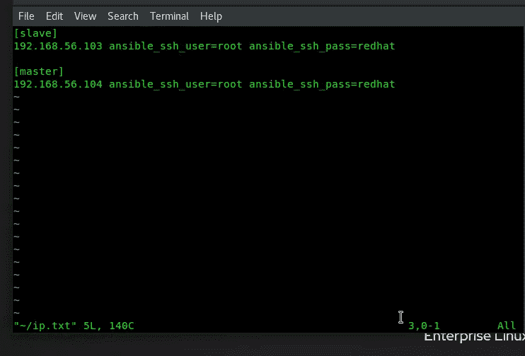

# 使用 Ansible Playbook 配置 Hadoop 并启动集群服务！！

> 原文：<https://medium.com/analytics-vidhya/configure-hadoop-and-start-cluster-services-using-ansible-playbook-fb0708488c50?source=collection_archive---------16----------------------->


首先，我们需要创建一个清单文件，ansible 可以在其中知道这些是目标节点的 IP。
库存文件意味着它包含带有认证的目标节点的 IP。其中我们给出了主节点和从节点的 IP…



存货文件

**主配置**

**1** >首先，我们将软件转移到目标节点，然后我们将安装…

在安装之前，我们首先检查是否安装了软件，因为 Ansible 中没有用于设置或安装 Hadoop 软件的模块(由于使用了额外的关键字，即强制 Hadoop 和我们正在使用的模块，即**命令**不支持 ansible 的等幂运算 **…。**

```
- hosts: master

  vars_prompt:

  - name: fold_name_hadoop_master
    private: no
    prompt: "Enter the Name for your master Folder ?"- name: port_num_for_hdfs
    private: no
    prompt: "Give the Port Num for the Master Service ?"tasks:

  - name: "Transfering the SOftware Hadoop !!"
    copy: 
     dest: "/root/hadoop-1.2.1-1.x86_64.rpm"
     src: hadoop-1.2.1-1.x86_64.rpm

  - name: "Transfering the Software Java !!"
    copy:
     dest: "/root/jdk-8u171-linux-x64.rpm"
     src: jdk-8u171-linux-x64.rpm- name: "Checking that Hadoop is INstalled or NOt !!"
    command: "rpm -q hadoop"
    register: hadoop
    ignore_errors: yes- name: "CHecking the Java is Installed or Not !!"
    command: "java -version"
    register: java
    ignore_errors: yes- name: "Installing the JAVA !!"
    command: "rpm -ivh jdk-8u171-linux-x64.rpm"
    ignore_errors: yes
    when: java.rc != 0- name: "Imstalling the Hadoop !!"
    command: "rpm -ivh hadoop-1.2.1-1.x86_64.rpm --force"
    ignore_errors: yes
    when: hadoop.rc != 0
```

现在，我们需要为主节点创建一个文件夹，以便从节点可以通过它共享存储，并将一些元数据保存到其中**和**我们需要配置配置文件，如下所示:

→ hdfs-site.xml

→核心网站. xml

```
- name: "Configuring the Conf file hdfs-site.xml  !!"
    blockinfile:
      path: "/etc/hadoop/hdfs-site.xml"
      insertafter: "<configuration>"
      block: |
            <property>
            <name>dfs.name.dir</name>
            <value> {{fold_name_hadoop_master}}</value>
            </property>

  - name: "Configuring the Conf file core-site.xml  !!"
    blockinfile:
      path: "/etc/hadoop/core-site.xml"
      insertafter: "<configuration>"
      block: |
            <property>
            <name>fs.default.name</name>
            <value> hdfs://0.0.0.0:{{port_num_for_hdfs}} </value>
            </property>- name: "Creating the DIr in the Master NOde !!"
    file:
     state: directory
     path: "//{{fold_name_hadoop_master}}"
```

然后我们需要第一次格式化那个文件夹，然后我们将根据用户给定的端口运行服务…

```
- name: "Formating that Directory !!"
    shell: "echo Y | hadoop namenode -format"- name: "Starting the Service !!"
    command: "hadoop-daemon.sh start namenode"
```

通过同样的步骤，我们也可以配置从节点…只有一件事我们需要使用我们的大脑捕捉主节点的 IP 在飞行的事实变量的帮助下…

> {{groups['slave'][0]}}

因此配置😎….

感谢您阅读本博客…