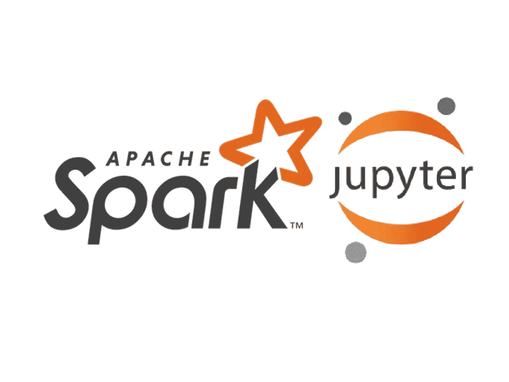
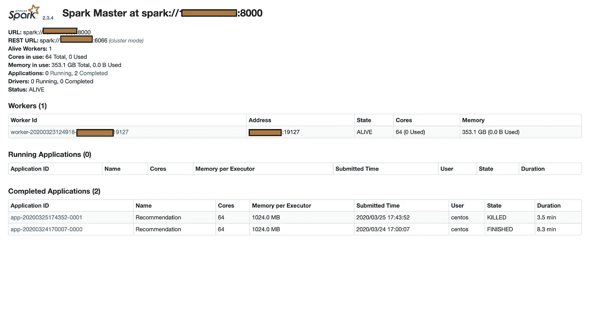
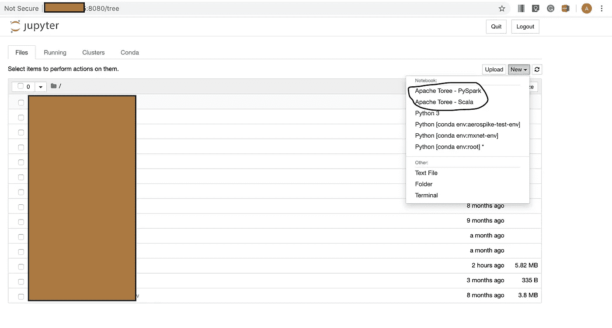

# 配置 Apache Spark 和 Jupyter 笔记本电脑

> 原文：<https://medium.com/analytics-vidhya/configuring-apache-spark-and-jupyter-notebooks-1f2c67a3ef3c?source=collection_archive---------16----------------------->



理论上，像 Scikit-learn 这样的框架可以很好地展示基于矩阵分解的推荐是如何工作的，但当涉及到为大规模受众或公司构建真正的推荐服务时，这些框架就会失败，因为现在我们正在处理 TB 或在某些情况下 PB 的数据。Apache spark 是解决这个问题的最佳方案之一。

根据定义，Spark 是一种快如闪电的集群计算技术，专为快速计算而设计。

本教程重点介绍了 Apache spark 在独立模式下的安装，虽然人们可以在 Hadoop 或 yarn 上使用 spark，但我们现在将坚持独立模式，然后配置它与 Jupyter 笔记本一起工作，并为 PySpark、Scala、SQL 内核配置 Apache Toree。所有的安装都是在 Linux 上完成的，但是在 windows 或 mac 上没有太大的区别。

**步骤 1** -安装 Apache Spark(版本- 2.3.4)

下载阿帕奇火花-

```
[temp-user@abhinav ~]$ sudo wget -o /opt/[spark-2.3.4-bin-hadoop2.7.tgz](http://www-eu.apache.org/dist/spark/spark-2.3.4/spark-2.3.4-bin-hadoop2.7.tgz) [http://www-eu.apache.org/dist/spark/spark-2.3.4/spark-2.3.4-bin-hadoop2.7.tgz](http://www-eu.apache.org/dist/spark/spark-2.3.4/spark-2.3.4-bin-hadoop2.7.tgz)
```

提取阿帕奇火花-

```
[temp-user@abhinav ~]$ sudo tar -xvf spark-2.3.4-bin-hadoop2.7.tgz
```

创建一个符号链接以备将来使用-

```
[temp-user@abhinav ~]$ ln -s /opt/spark-2.3.4-bin-hadoop2.7 /opt/spark
```

启动 Spark 集群的主机-如果安装在本地机器上，那么不需要指定网关或端口。

```
[temp-user@abhinav ~]$ cd /opt/spark/sbin
[temp-user@abhinav ~]$ sudo ./start-master.sh -host <ip> -port 8000
```

盯着星火团主的一个工人-

```
[temp-user@abhinav ~]$ sudo ./start-slave.sh spark://<Master-ip>:8000
```

这样做后，访问 http:// <ip>:8081/你会看到火花仪表板。在您的情况下，正在运行的应用程序和已完成的应用程序选项卡以及工作器选项卡将为空。</ip>



**步骤 2-** 安装 Jupyter

下载 Jupyter 笔记本-从[*https://www.anaconda.com/distribution/*](https://www.anaconda.com/distribution/)*下载最新的 anaconda 发行版使用一个[64 位(x86)](https://repo.anaconda.com/archive/Anaconda3-2020.02-Linux-x86_64.sh) 安装程序。*

*安装它是非常容易的-所有的安装位置将在过程本身被询问。*

***注意:确保 bashrc 路径条目已完成。***

```
*[temp-user@abhinav ~]$sudo ./Anaconda3–2019.03-Linux-x86_64.sh*
```

*运行它-如果在本地机器上运行它，那么不需要指定 ip，但要确保端口不会互相冲突。*

```
*[temp-user@abhinav ~]$sudo jupyter-notebook -ip=<ip> -port=8080*
```

***步骤 3-** 安装 Apache Toree(版本-0.2.0)如果您发现我们没有使用 0.3，因为默认情况下它不支持 pyspark 内核，安装它是另一项任务，所以现在我们跳过它。*

*安装它-*

```
*[temp-user@abhinav ~]$ pip install toree==0.2.0*
```

*用 Toree 内核配置 Jupyter*

```
*[temp-user@abhinav ~]$ sudo jupyter toree install -interpreters=Scala,PySpark -spark_home=/opt/spark/*
```

*现在打开 Jupyter 笔记本网址，它看起来应该是这样的*

**

*我们可以看到 Pyspark 和 Scala 笔记本现在都可以使用了。*

*这就完成了 Apache Spark 在独立模式下的安装以及 Jupyter 笔记本和 Apache Toree 的安装。*

*谢谢！！！！！*