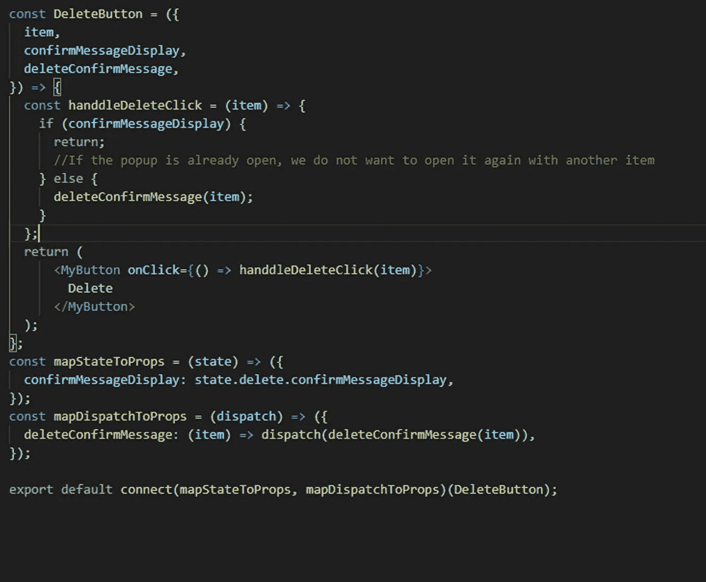

# 使用 React Redux 确认删除框

> 原文：<https://medium.com/analytics-vidhya/confirm-delete-box-using-react-redux-fbd19e1b066d?source=collection_archive---------11----------------------->

我最近开发了一个 crm 应用程序，它包含许多条目列表，可以选择删除列表中的每个条目。我想给用户弹出一个提示，询问他是否确定要删除。
起初，该应用很小，为应用中的某些页面创建消息没有问题，但慢慢地，该应用变得越来越大，添加了更多的列表和项目，尤其是删除前的更多提醒。

我发现自己一遍又一遍地编写相同的代码，流程总是相同的，用户按下 delete 按钮，状态从 false 变为 true，出现警告，项目以另一种状态存储，当用户单击 ok 按钮时，我们用项目 ID 回调相关的 delete 函数。

不好玩…

我想向您展示如何轻松有效地实现这个流程，而不用使用 Redux 编写不必要的代码。

为了进行演示，我编写了一个简单的应用程序，从服务器获取假想的信息。就像，嗯…用户。

我使用一个 reducer 来存储来自服务器的数据，并通过 mapStateToProps 函数使用它

在 UserList 中，我映射数组并返回单个用户条目，没什么大不了的。

现在，有趣的部分。我们将编写一个连接到 Redux 的删除按钮，并且能够将商品发送到商店，以及是否退回警告！太神奇了！

让我们首先编写缩减器，

我们将显示设置为 true 并存储该项目

动作…

不要忘记将项目作为有效载荷传递

单个项目，当然将该项目作为道具传递给 delete 按钮:

这是我们的按钮看起来的样子:

我们快到了，让我们写删除弹出窗口…

弹出窗口实际上激活了我们从外部传递的相关函数，当然，我们从商店传递的商品也是如此，最后，它激活了关闭它的动作。

现在我们剩下要做的就是导入弹出组件并向其传递道具。

就是这样，现在你可以在从任何地方删除之前使用警告，不管项目嵌套有多深。

但是如果我们在同一个页面上有几个列表呢？
没问题！

我们所要做的就是向删除按钮传递一个字符串，就像这样:

你可以随便叫它什么

并将其添加到 DeleteButton

稍微更新一下减速器

现在我们需要编写一个对象来保存我们发送的字符串作为函数的键。
并将其传递给我们的组件。

就这样，我知道它有点长，但这里的原理非常简单，这是一个很好的例子，说明如何使用 redux 来节省大量重复的写作。
你怎么看？