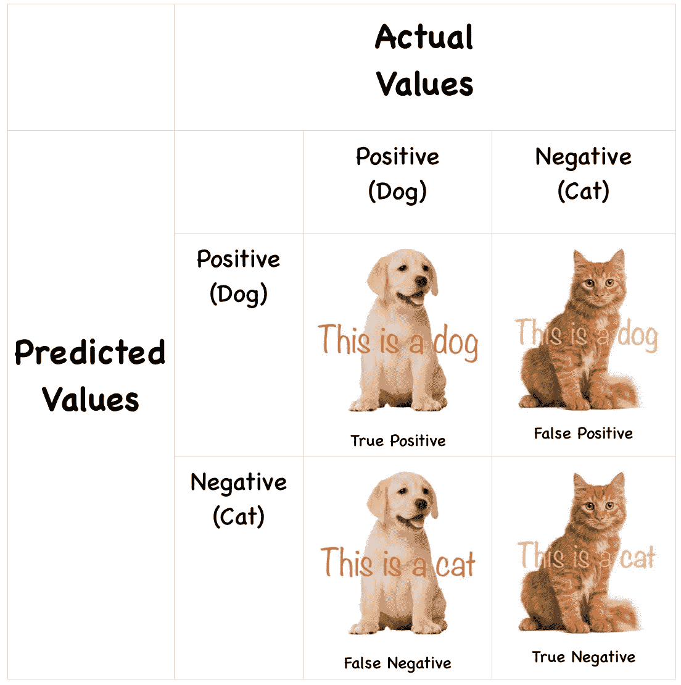

# 对混淆矩阵感到困惑？

> 原文：<https://medium.com/analytics-vidhya/confused-about-confusion-matrix-2ce7c52345dd?source=collection_archive---------14----------------------->

照片由[苏拉娅·欧文](https://unsplash.com/@traxing?utm_source=medium&utm_medium=referral)在 [Unsplash](https://unsplash.com?utm_source=medium&utm_medium=referral) 拍摄

混淆矩阵是一个 N*N 矩阵(N =目标类别的数量),由预测和实际目标值的计数组成。它有助于评估分类模型的性能。

让我们看一看二进制分类的混淆矩阵，以理解所使用的术语。

来源:作者

邮件是否是垃圾邮件，患者是否患有糖尿病，客户是否会流失，这些都是二元分类的一些例子。假设我们的分类模型告诉我们动物是狗还是猫。本例中的零假设或**正**陈述为**“狗”**和**负**陈述**“猫”**。

来源:作者

*   **真阳性:**阳性病例被正确预测为阳性，即狗被预测为“狗”。
*   **真阴性:**阴性病例被正确预测为阴性，即一只猫被预测为“猫”。
*   **假阳性:**如果阴性病例被预测为阳性，即狗被预测为“猫”。这是***I 型错误*** 。
*   **假阴性:**如果阳性病例被预测为阴性，即猫被预测为“狗”。这是 ***型二* *错误*** 。

现在让我们看看混淆矩阵中的这些值如何帮助我们评估分类器的性能。

**准确率** *分类模型多长时间预测正确一次？* 准确率 80%表示 10 个案例中，有 8 个预测正确。

**精度** *每当分类器预测为阳性时，它的正确率是多少？* 精度值 70%意味着如果 10 个案例被预测为狗，其中 3 个实际上是猫*。*

**召回/灵敏度** 它是真正的阳性率，即它回答了这个问题——
*在所有实际的阳性病例中，有多少被分类器正确预测为阳性？* 90%召回是指 10 个狗狗案例中，我们漏掉了 1 只狗狗。

**特异性** 它是真正的阴性率，即它回答了这样一个问题——
*在所有实际的阴性病例中，有多少被分类器正确预测为阴性？* 60%的特异性是指我们漏掉了 10 只猫中的 4 只，错误地把它们归类为狗。

> *先说一个老生常谈的问题—* 精准和召回的区别？或者说如何决定使用两者中的哪一个？
> 
> 当假阳性比假阴性更受关注时，使用精度。
> *例如，一个音乐推荐系统，不正确的结果会让客户不安，导致他们流失。*
> 
> 另一方面，召回用于假阳性并不真正有害，但假阴性有害的情况。*例如，分类器告诉我们患者是否患有糖尿病。如果患者被错误地归类为糖尿病(FP)，其他测试可以解决这个问题。但是想象一下，如果一个糖尿病患者被归类为非糖尿病患者(FN)，这将导致一个问题，因为患者将无人照顾。*
> 
> 在某些情况下，我们真的不知道精确和回忆哪个更重要，所以最好把两者结合起来。所以我们用 F 分数。

**F-Score/F1-Score** *是查全率和查准率的调和平均值。* F1 值——得分趋于 1 被认为是最好的，趋于 0 被认为是最差的。在真正的否定不太重要的分类中，它可能是有用的。

**AUC-ROC** ROC 曲线是受试者操作者特征曲线。AUC-ROC 是 ROC 曲线下的面积。ROC 是真阳性率(TPR)对真阴性率(TNR)的图，TPR 在 y 轴上，FPR 在 x 轴上。它给出了分类器的总体性能度量。
ROC 曲线下的面积越大，模型区分类别的能力越强。

来源:[https://www . datascience central . com/profiles/blogs/roc-curve-explained-in-one-picture](https://www.datasciencecentral.com/profiles/blogs/roc-curve-explained-in-one-picture)

*AUC 接近 1 —* 分类器擅长区分类别，即阳性和阴性病例都将被正确预测。
*AUC 约 0.5 — w* orst 情况，因为分类器根本不能区分类别。
*0—*分类器附近的 AUC 将具有互惠效应，即所有阳性将被预测为阴性，反之亦然。

*感谢阅读！*

*连接:*[https://www.linkedin.com/in/akshada-gaonkar-9b8886189](https://www.linkedin.com/in/akshada-gaonkar-9b8886189/)/