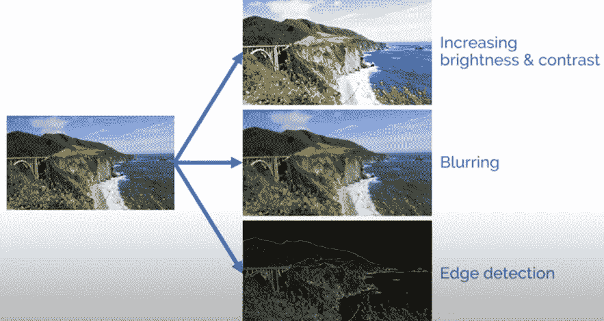
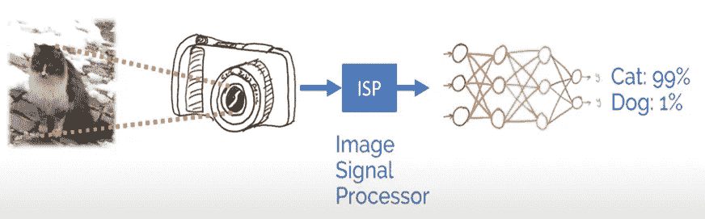
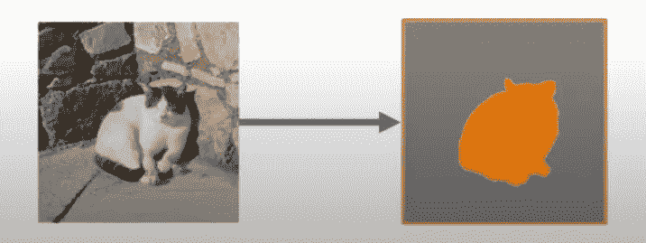

# 在计算机视觉和图像处理之间迷茫？大家一起解决吧！

> 原文：<https://medium.com/analytics-vidhya/confused-between-computer-vision-and-image-processing-lets-resolve-it-26b41cff2dd5?source=collection_archive---------12----------------------->

由 [Unsplash](https://unsplash.com?utm_source=medium&utm_medium=referral) 上的 [Element5 数码](https://unsplash.com/@element5digital?utm_source=medium&utm_medium=referral)拍摄

在处理由图像和视频组成的数据时，我们经常会遇到诸如 ***图像处理*** 和 ***计算机视觉*** 等术语。在许多情况下，这两个术语几乎可以互换使用。它们都涉及到对图像进行某种计算。有时我们最终会解释说图像处理和计算机视觉是相同的概念，但它们并不完全相同。现在，让我们来谈谈它们是什么，它们有什么不同，它们是如何相互联系的。

谈 ***图像处理*** ，是指输入输出都是图像的图像处理。图像处理算法可以通过应用各种操作来转换图像:平滑、锐化、模糊、修改亮度、边缘检测等等。图像处理是迅速发展的技术之一，形成了工程和计算机科学学科的核心研究领域。

图像处理技术

***【CV】***另一方面，计算机视觉专注于理解机器看到的东西。计算机视觉系统输入图像并输出特定于任务的知识，例如对象标签和坐标。它使计算机能够识别图像和视频中的对象，并像人脑一样处理它们。在 python 中，这是通过一个著名的库来完成的，这个库叫做 **OpenCV** 。今天，产生的大量数据是导致计算机视觉发展的主要驱动力。

使用 OpenCV 进行物体识别

图像处理和计算机视觉齐头并进。许多 CV 系统依赖于图像处理算法，反之亦然。计算机视觉系统很少使用直接从相机或传感器等设备接收的原始图像数据。相反，他们使用通过一些图像处理技术处理过的图像。早先，图像处理算法依赖于计算机视觉技术是不常见的，但是越来越多的高级图像处理工具已经开始使用 CV 技术。例如，面部美化过滤器利用计算机视觉技术来检测面部，并应用不同种类的过滤器来增强图像。他们可以做更高级的事情，例如通过识别面部标志来增强眼睛清晰度或模拟聚光灯。

图像处理和计算机视觉的结合应用

计算机视觉的另一个关键特征是使用机器学习(ML)。ML 是一个研究领域，专注于在给定一组称为训练数据的例子的情况下，教会机器如何执行特定的任务。例如，我们可以建立一个模型，在对勺子和叉子的训练数据进行训练后，可以区分勺子和叉子。今天，许多先进的图像处理方法也采用 ML 模型来完成各种任务，例如应用艺术过滤器或调整图像以获得最佳感知图像质量，从而增强细节以最大限度地提高计算机视觉任务的性能。

值得一提的是，这两个领域之间并没有真正的界限，当您进行像素到像素的转换时，这条线会变得模糊。我们举个语义切分的例子。如果模型为输入图像产生每像素标签，那么它的输出可以被认为是图像。在这种意义上，模型会做一些图像处理。另一方面，这种转换涉及图像理解，那么尝试学习输入也将被视为计算机视觉。

语义分割的一个例子

另一个观察图像处理和计算机视觉之间相互作用的例子是使用**卷积神经网络** (CNN)。它将像素强度值作为输入，并学习以一种用于执行各种 CV 任务(如图像识别)的方式处理它们，其中 CNN 的内层可以被视为具有可调参数的图像滤波器。因此，CNN 可以被视为一种自适应图像处理。尽管 CNN 的使用不仅限于图像处理，它也可以用于分析其他类型的数据。
因此，这些是图像处理和计算机视觉协同工作的一些应用，在这个领域还有很多更先进的应用和研究正在进行。
我希望这篇文章有助于你消除对这些概念的疑虑。

谢谢你抽出时间。欢迎任何意见。

快乐学习！！