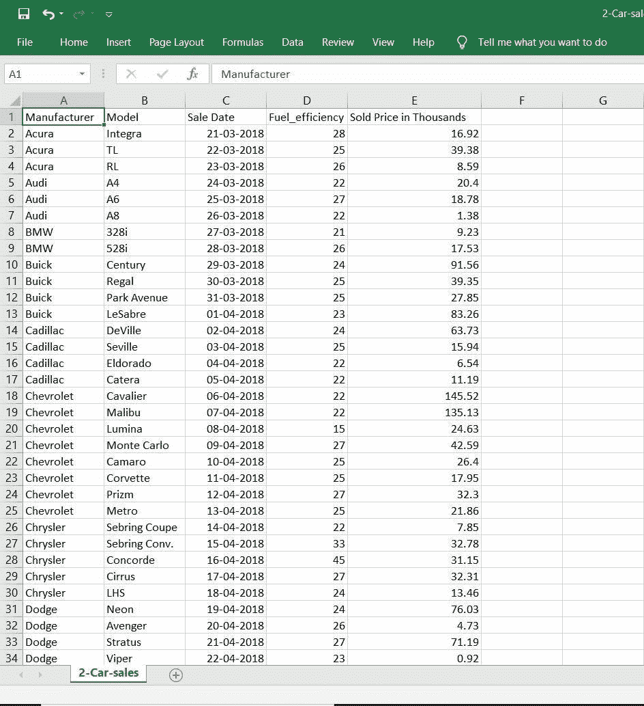
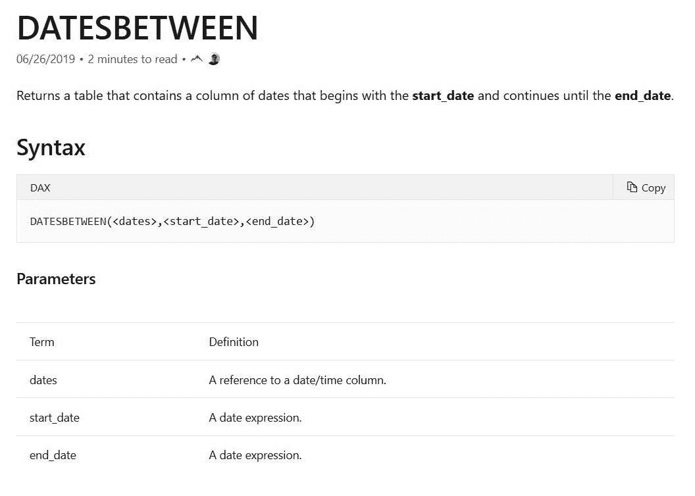
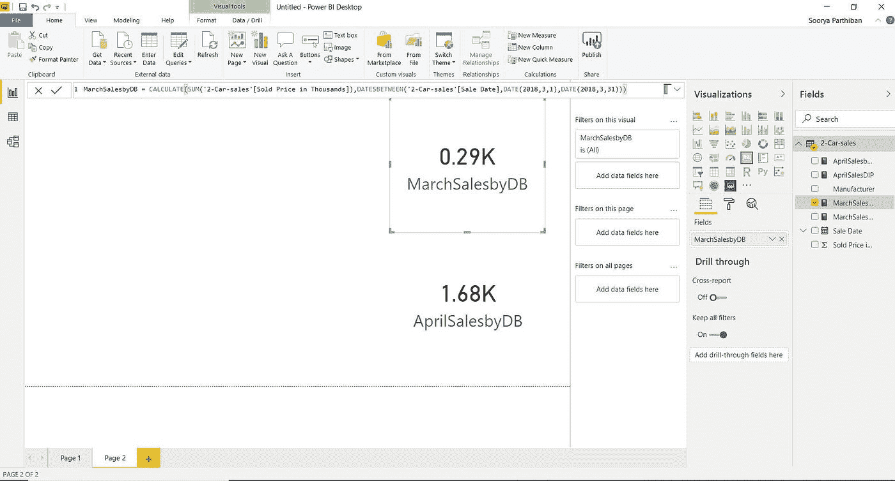
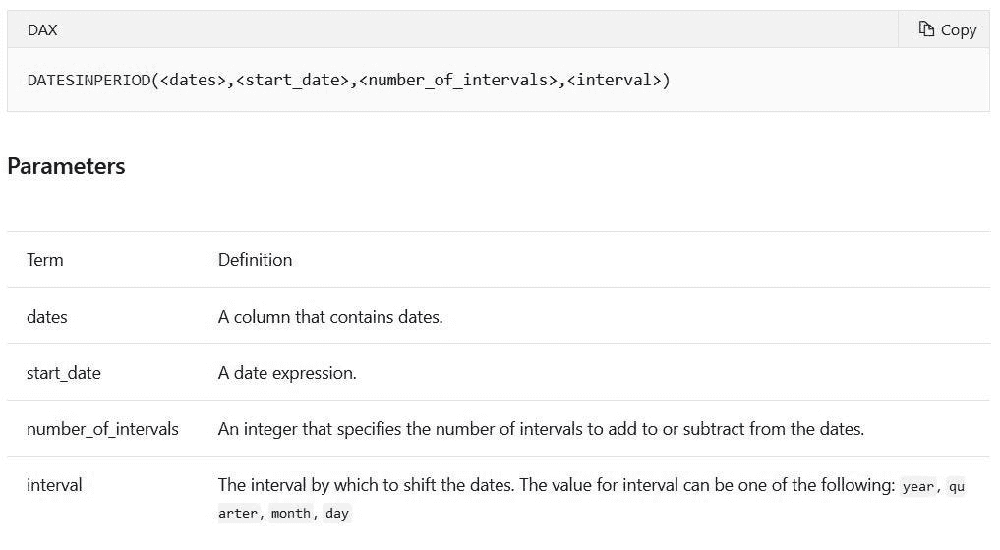
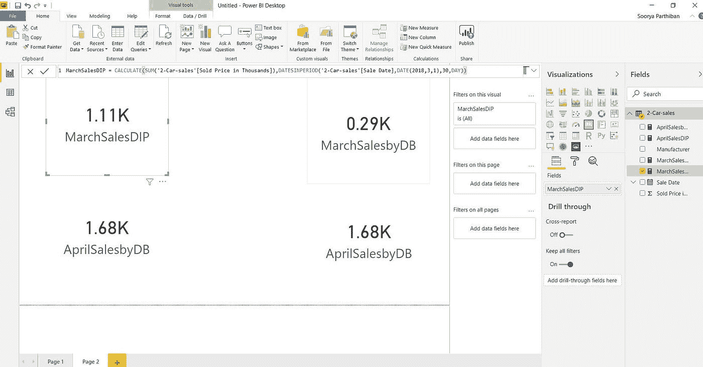
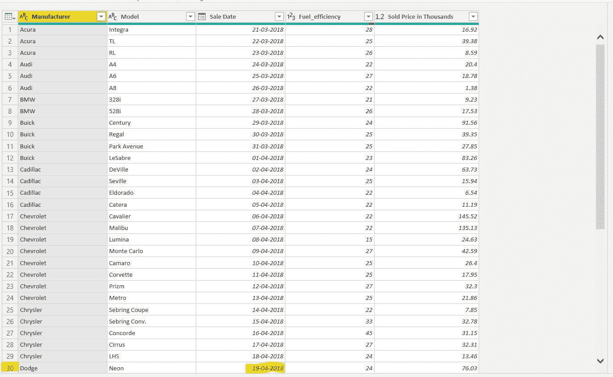
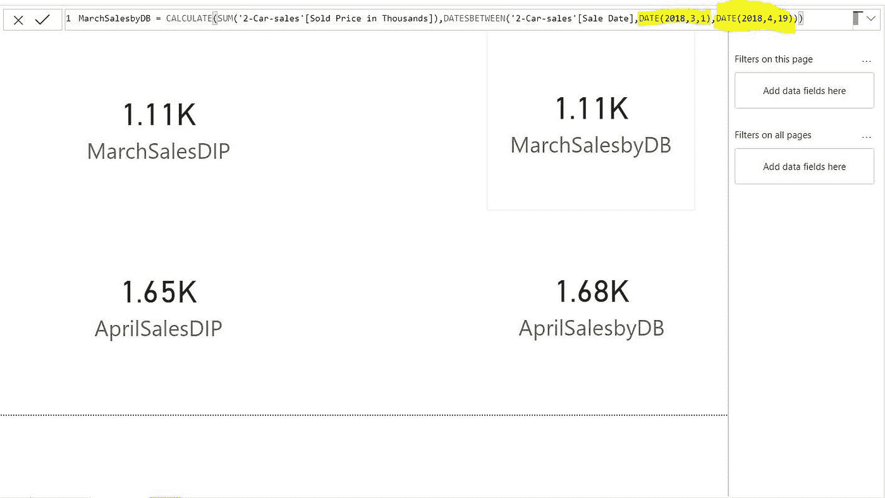
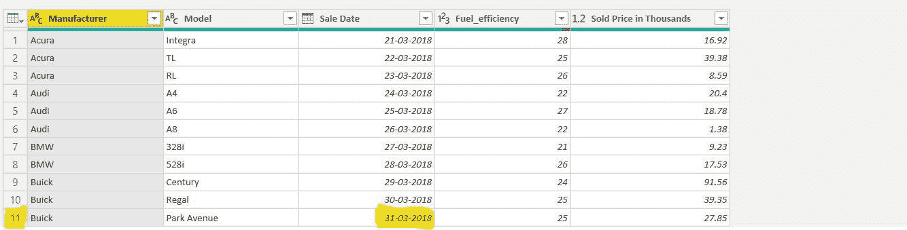
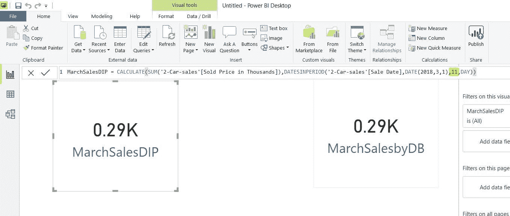
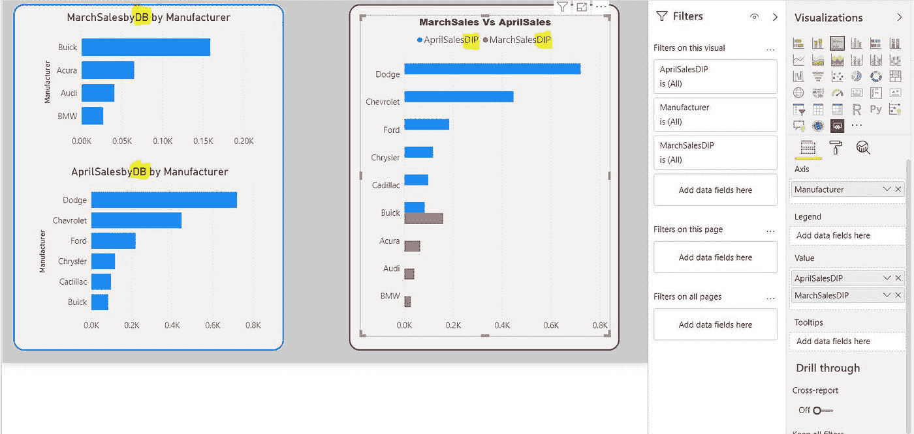

# #DataBlogSpp3:混淆了 DatesInPeriod 和 DatesBetween？NW，你被分类了！

> 原文：<https://medium.com/analytics-vidhya/confused-between-the-datesinperiod-and-the-datesbetween-nw-youre-sorted-7893cc0d4b16?source=collection_archive---------6----------------------->

大家好，很高兴在另一个博客上见到你们。

让我快速解释一下什么是 DATESINPERIOD()和 DATESBETWEEN()函数:

*   这些是微软为 POWER BI 设计的时间智能 DAX 函数。
*   两者都返回一列日期值。
*   DATESBETWEEN()需要一个**开始日期**和一个**结束日期**。
*   DATESINPERIOD()只需要**开始日期、间隔数和间隔类型**(日/月/季/年)。

我更喜欢用更简单的方式解释概念，就像你的一个朋友，他在考试那天教你所有重要的问题！归根结底，我们需要传递知识。让我们进入博客。

我有一个汽车销售数据集，其中包含不同制造商的销售额及其相应的销售日期。

这里的场景是向我们的老板提交一份关于三月和四月汽车销售的报告。所以，我们这里的第一个目标是提取三月和四月的汽车销售，对吗？

本博客的目的是解释哪种功能最适合使用。

首先，我将展示如何使用#DAX 中的 DATESBETWEEN()函数提取所有制造商在 3 月和 4 月的销售额。

看看微软怎么说……

好吧，酷。让我们开始用更简单的方式解释这些东西。

DATESBETWEEN()函数有三个参数:

*   <dates>:我们有日期的栏目。例:**表名【日期列】** — **简单！！**</dates>
*   <start_date>—你说的“约会表情”是什么意思，就当是约会好了，这是第一次约会**！！要用的格式是 **(YYYY，MM，DD)。**格式中请不要使用连字符，你必须使用一个 ***逗号*** 。**</start_date>
*   **<end_date>—有效格式中的结束**【日期】**。</end_date>**

**好吧，我们要怎么处理一列日期呢？没道理啊。我们的目标是什么？这是为了提取 3 月和 4 月的汽车销售额。酷毙了。**

**有一个简单的公式可以做到这一点，相信我，这很容易。这是一个度量(DAX，lol):**

****new column name = CALCULATE(SUM(CarSales[销售价格])，dates between(CarSales[销售日期]，日期(2018，3，1)，日期(2018，3，31 ) ) )****

**我们在这里做的只是计算从 2018 年 3 月 1 日**到 2018 年 3 月 31 日**每一个制造商的销售价格。容易吗？**

****

**我们以卡片可视化的形式得到了 3 月和 4 月的销售额，描述以**“DB”、**结尾，对吗？它表示这些值是使用 DATESBETWEEN()函数提取的。对于四月，DAX 公式是相同的，但是**的开始日期应该是(2018，4，1)** 和**的结束日期应该是(2018，4，30)。****

**现在让我们在 DATESINPERIOD()中尝试同样的事情，注意我们要尝试同样的事情。在此之前，我们先来看看我们的朋友(微软:-P)对 DATESINPERIOD()函数的看法。**

****

**DATESINPERIOD 函数有四个参数:**

*   **<dates>:我们有日期的栏目。例:**表名【日期列】** — **简单！！**</dates>**
*   **<start_date>—有效的**开始日期(YYYY-MM-DD)。**</start_date>**
*   **<number_of_intervals>—您应该添加 **28/29/30/31** 间隔，以获得一个月的最后一天和第一天。您应该在第一个月加上 12 个间隔，以得到一年中的最后一个月。容易吗？**基本上就是你要跟起始日期加减的天数/季度数/月数/年数。**</number_of_intervals>**
*   **<intervals>—您不能输入 *30 作为<间隔数>* 并选择*“月”作为<间隔>* ，因为一年中我们只有 12 个月！ **<区间>是你输入的区间数的定义，很简单。**</intervals>**

**好的，在我们的 DATESBETWEEN()示例中，我们使用 3 月 1 日的**作为开始日期<和 3 月 31 日的<结束日期>** 来计算 3 月份的总销售额，对吗？请向上滚动以交叉核对。**

**我们将在 DATESINPERIOD()中做同样的事情。让我们开始播放 DIP 函数的参数:**

*   **<dates>:汽车销售【日期栏】</dates>**
*   **<start_date>: **(2018，3，1)** — **同 DATESBETWEEN()函数**</start_date>**
*   **<number_of_intervals>: **30** 。因为**3 月 1 日+ 30 天= 3 月 31 日，接受？**</number_of_intervals>**
*   **<intervals>:我把这个选项留给你，试一试；-)</intervals>**

**我已经执行了 DAX 代码，让我们看看在我们的 POWER BI 桌面上发生了什么。**“DIP”**是指使用 DATESINPERIOD()函数计算的值。**

****

**哇哦！！为什么价值观会发生变化？？有什么猜测吗？？好吧，我告诉你发生了什么。从 PowerBI 桌面查看编辑查询。**

****

****结论:****

**如您所见，我们发现并不是三月份所有的日子都有销售额，但是 DATESBETWEEN()函数工作正常，只给出了三月份的总销售额，因为它是根据**实际日期工作的，换句话说，它是根据*日历工作的。*****

**但是，在 DATESINPERIOD()函数的情况下，如果某个特定月份的所有日期都在我们的数据集内，它就可以很好地工作，但是在我们的情况下，我们不满足要求。所以，事情是这样的，它检查**用户输入的< start_date > = (2018，3，1)** 却找不到，因为它**不存在**。在这种情况下，如果没有找到提到的数据，**第一条记录的日期值将被视为开始日期(2018，3，21)** ，并且由于日期值的不一致，基于我们给出的间隔数，它不起作用。因此，它一直计算到第 30 条记录的日期值。**

**不信我给你看证明(只要记住 30 日记录的日期 vale 是 2018 年 4 月**19 日**)。我已经在前面的截图中突出显示了它，让我们尝试将该日期作为 DATESBETWEEN()函数的 **< end_date >。****

****

**我已经证明了 **LHS( DATESINPERIOD )** 等于 **RHS( DATESBETWEEN )** ，LOL。**

**如您所见，我在这里修改了 DATESBETWEEN() dax 代码，将<end_date>更新为 **(2018，4，19) =第 30 个记录值。**</end_date>**

**DATESBETWEEN()非常出色，甚至它的工作方式与 DATESINPERIOD()类似。DB 函数无法找到用户输入的第一个日期，因此它将第一个记录日期值**作为第一个日期，但它返回了预期的值，因为我们提到了< end_date >，并且它存在于数据集中。****

**总之，我已经向你解释了概念，我已经解释了事情是如何工作的，最重要的是哪个函数将与**一致和不一致的数据集一起工作。现在，你可以从中选择一个，因为你将使用不同的数据集。****

**好了，现在你会有一个疑问，我们如何使用 DATESINPERIOD()函数而不是使用 DATESBETWEEN()函数来获得三月和四月的正确销售额，这很简单。我会告诉你怎么做。**

**让我们不要改变 DIP 函数的 **< start_date >** 值，而是让我们对**<number _ of _ intervals>做一个小的改变，使其变为 11。****

********

**任务完成了！我们想要三月份的总销售额，我们输入了数据集中不存在的<start_date>，因此第**条记录的日期值被取为**。三月的最后一个日期是**31 日**，其对应的序列号或<间隔数>是 **11** (根据我的数据集)。通过用上面的值更新 DATESINPERIOD()函数的 DAX 代码，我们成功地完成了工作，使用了两个不同的函数来实现一个共同的目标！</start_date>**

**在同一个数据集上使用两个不同的函数向我们的老板提交最终报告:**

****

**这种比较清楚地显示了哪个制造商最有前途，以及所有制造商的销售额。太棒了。**

***免责声明:这些是样本数据集，因此汽车制造商方面没有抱怨。LOL***

**谢谢你的宝贵时间。我们很快会在另一个博客上见面。**

** [## 苏丽亚·普拉卡什·帕蒂班

### Soorya Prakash Parthiban 的最新推文(@Drdataspp)。蛇💖*可视化/洞察力📈📊*数据库💾 *…

twitter.com](https://twitter.com/Drdataspp)  [## 登录* Instagram

### 欢迎回到 Instagram。登录查看您的朋友、家人和兴趣爱好捕捉和分享了什么…

www.instagram.com](https://www.instagram.com/drdata25/)**