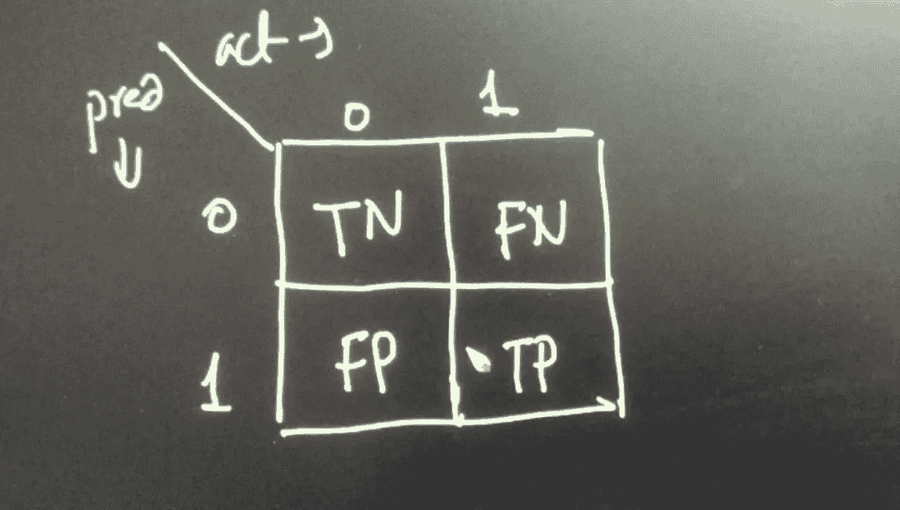
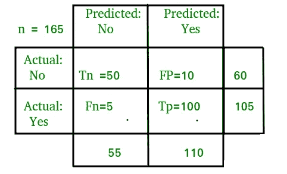
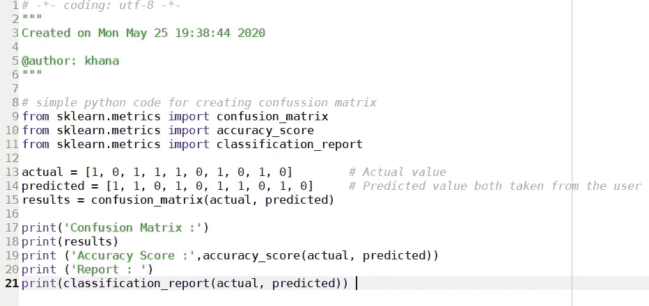
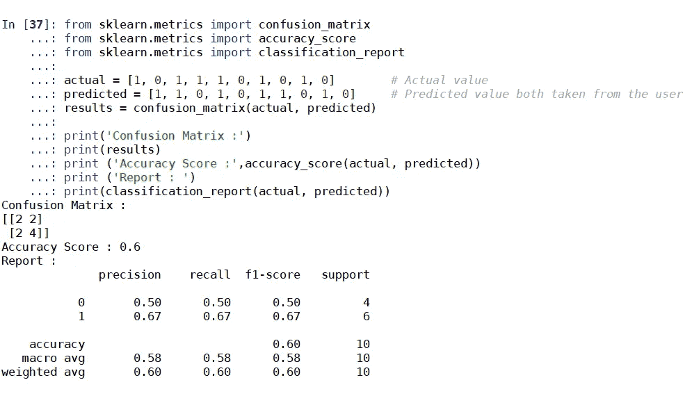

# 混淆矩阵

> 原文：<https://medium.com/analytics-vidhya/confusion-matrix-278174654a3d?source=collection_archive---------36----------------------->

混淆矩阵是用于描述分类模型的性能的表格，它允许测量监督和非监督机器学习模型的性能和可视化，它还用于测量模型的准确性和性能。混淆矩阵用于二进制类分类

真正:真正是实际值为正(1)，预测值也为正(1)这是真的

真阴性:真阴性是一个实际值是一个负数(0 ),如果人的预测是真的，预测也是负数(0)

假阴性:假阴性是指实际值为真(1)但预测值为假(0)这是假的，也称为第二类错误

假阳性:假阳性是一个实际值为负(0)但预测为正(1)如果人们的预测是假的，它也被称为类型 1 错误

正 P 总数= FN+TP

负 N= TN+FP 的总数

与混淆矩阵相关的重要术语

1.真实阳性率是真实阳性除以阳性

TPR = TP/P

2.真实负利率是真实负利率除以负利率

TNR =总氮/氮

3.假阴性率是假阴性除以阳性

FNR=FN/P

4.假阳性率是假阳性除以阴性率

FPR=FP/N

让我们通过例子来理解每个术语

[图片来源是 geeksforgeeks.org](https://www.geeksforgeeks.org/confusion-matrix-machine-learning/)

正 P = FN+TP = 5+100 = 105

负 N= TN+FP = 50+10 = 60

真实阳性率

TPR = TP/P = 100/105 = 0.952

真实负利率

TNR =总氮/氮= 50/60 = 0.8333

假阴性率

FNR=FN/P = 5/105 = 0.0476

假阳性率

FPR=FP/N = 10/60= 0.1666667

# **精确*，回忆& F-1 比分***

1 .精度

精度= TP/TP+FP

精度的定义是模型中声明/预测为正的所有点与实际上为正的点的百分比(%)之比

从上面的例子来看:PR = 100/(100+10) = 0.9090

**2。回忆一下。**

召回被定义为多少点实际上是肯定的，多少点被预测为肯定的

根据上面的例子，recall = TP/(TP+FN)= 100/(100+5)= 0.95

**关于精度和召回的解释**

精确度和召回率实际上用于信息检索，它给出关于数据集中唯一正的点的信息，换句话说，多少点被正确分类，对于一个好的模型，精确度和召回率必须尽可能高，在(0 & 1)之间，当该值为 1 或大约为 1 时，则模型的性能是好的，当该值小于 0.5 时，则模型的性能不好，精确度和召回率用于大多数数据科学和机器学习模型中，用于精确度预测。

**2。F-1 得分**

在一种方法中测量精确度和召回率被称为 f-1 分数，在我们使用 F-1 分数方法的情况下，测量精确度和召回率是复杂的

F1-measure = (2 *召回率*精确度)/(召回率+精确度)

在本例中，F1-measure =(2 * 0.95 * 0.91)/(0.91+0.95)= 0.92

F1 分数是调和平均值，取精确度和回忆的倒数，取它们的平均值，那么 f1 分数就是一种药剂

简单的 python 代码，用于以上解释

输出:

我希望给出的信息能让你对混淆矩阵有基本的了解。如果你喜欢这篇文章，请鼓掌。我希望这对你有帮助

你可以跟着我

领英[https://www.linkedin.com/in/khan-akbar-b07b7218b/](https://www.linkedin.com/in/khan-akbar-b07b7218b/)

https://github.com/khanakbar145 的 Github

谢谢你的阅读！