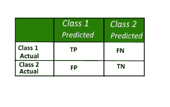
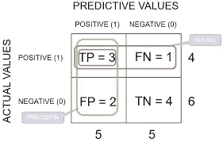
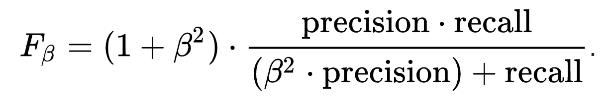

# 混淆矩阵

> 原文：<https://medium.com/analytics-vidhya/confusion-matrix-8746245dcbd7?source=collection_archive---------25----------------------->

> 当我们把**和**精度**值混淆时，这非常有用**

**在本文中将讨论混淆矩阵的必要性，它只适用于分类类型的数据，其中响应/因变量是一个类别/水平/类。**

**除此之外，还有一些重要的术语，如准确率、召回率，在分类中被称为度量标准。**

# **什么是混淆矩阵？**

****混淆矩阵**是一个表格，通常用于描述一个分类模型(或“分类器”)对一组真实值已知的测试数据的性能。它是在精确和回忆的帮助下形成的。**

****

# **为什么是混淆矩阵？**

**当您的数据不平衡时，根据模型的准确度来选择模型不是一个好方法。在这种情况下，我们需要更多的知识来做出决定。这里，混淆矩阵/分类报告对于选择哪个模型有利于预测非常有用。**

****不平衡数据**，考虑我们在响应变量中有两个类别，其中 80%的数据偏向一个类别。在这种情况下，模型将单独为该类运行良好。**

# ****PYTHON —分类报告:****

**从包 **Sklearn** ，**

```
from sklearn.metrics import classification_report
```

**假设我们有两个类(0 & 1)分类数据，它们的分类报告将是这样的，**

****输出**:**

```
 precision    recall  f1-score   support

           0       0.46      0.23      0.31      6640
           1       0.73      0.88      0.79     15305

    accuracy                           0.68     21945
   macro avg       0.59      0.56      0.55     21945
weighted avg       0.64      0.68      0.65     21945
```

**下面是对上述输出中出现的术语的解释。**

# **背景:**

1.  **精确**
2.  **回忆**
3.  **f-β**
4.  **F1-分数**
5.  **支持**

**了解精确度、回忆或 f1 分数。首先，我们必须知道一些术语，**

****

**混淆矩阵**

1.  ****真阳性率(回忆):**在全部实际阳性值中，有多少是实际阳性。公式=TP / (TP+FN)。它也被称为回忆(或)敏感性。**
2.  ****真阴性率:**在全部实际负值中，有多少是实际负值。公式= TN/(TN+FP)。它也被称为特异性。**
3.  ****假阳性率:**总实际阳性值中，有多少负值被误预测为阳性。公式= FP/(TP+FN)**
4.  ****假阴性率:**在全部实际负值中，有多少正值被错误地预测为负值。公式= FN/(FP+TN)**

**在哪里，**

**TN-真阴性，TP-真阳性，FP-假阳性，FN-假阴性。**

> **注意:高真阳性率和高真阴性率的模型会更好**

# ****1。精度:****

**对于每一类，它被定义为真阳性与真阳性和假阳性之和的比率。正面预测的准确性。**

****公式** = > TP / (TP+FP)为真正(或)TN/(TN+FN)为真负。**

**简单地说，在所有预测的正值中，有多少是实际的正值。在精确度方面，假阳性率(FP)在处理真阳性率时起主要作用。所以我们主要集中在要不要根据问题来提高或者降低 FP 率。**

****举例:正-** 非垃圾邮件**，负-** 垃圾邮件。**

**对于垃圾邮件的检测，如果我们使用 true positive 也就是说在所有预测的非垃圾邮件中有多少实际上是非垃圾邮件。这里不需要使用真负利率和计算 FN。**

# **2.回忆:**

**1.出**总的实际正值**值有多少是实际正值。也称为真阳性率和**灵敏度**。**

****公式** = > TP / (TP+FN)**

**2.在**总实际负**值中，当我们使用实际负利率时，实际负了多少。又称**特异性。****

****公式** = > TN/(TN+FP)**

****举例:** **阳性**——无癌，**阴性**——有癌。**

**考虑一个癌症预测数据，如果我们用**真阳性率**那么 FN 率是高还是低不成问题。因为他/她可以通过进一步的检查来确诊癌症。但是在这种情况下，FN 越少越好。**

**如果我们使用**真阴性率**，那么 FP 将会产生影响，即癌症患者被预测为非癌症患者，这种情况很难出现，因此我们的 FP 率应该更低。**

> **注:*精度*和*召回*即所谓的**信息检索**。**

# **3.F-Beta 分数:**

****

**精度和召回率的加权调和平均值称为 F-Beta 得分。**

# ****4。F1-分数:****

**它是从 f-beta 分数中推导出来的。具有高 f1 分数的模型被认为是最佳模型。**

**在 f-β公式中当**β= 1 时，****

****

# **5.支持:**

**支持度是位于该类中的真实响应的样本数。像值计数一样，它显示相应类中有多少值。**

> **混淆矩阵中还有一个我们在 R 编程语言中见过的重要术语，**

## **无信息率:**

**如我们所知，在不平衡数据的情况下，模型会偏向任何类别，其中无信息率会更高，这意味着模型不会平等地预测每个类别。**

# **结论:**

**工业人员利用精确度和召回率以及准确性来做出好的决策，以摆脱复杂的问题。因此，将得出结论，混淆矩阵是有用的决策，其结果总是更好。**

**希望我已经用简单的解释涵盖了混淆矩阵中的大部分术语，如果我发现了任何话题，请在评论区告诉我，以便即兴创作即将到来的内容。**

**帮我接通:[www.linkedin.com/in/Ramkumar-R23](http://www.linkedin.com/in/Ramkumar-R23)**