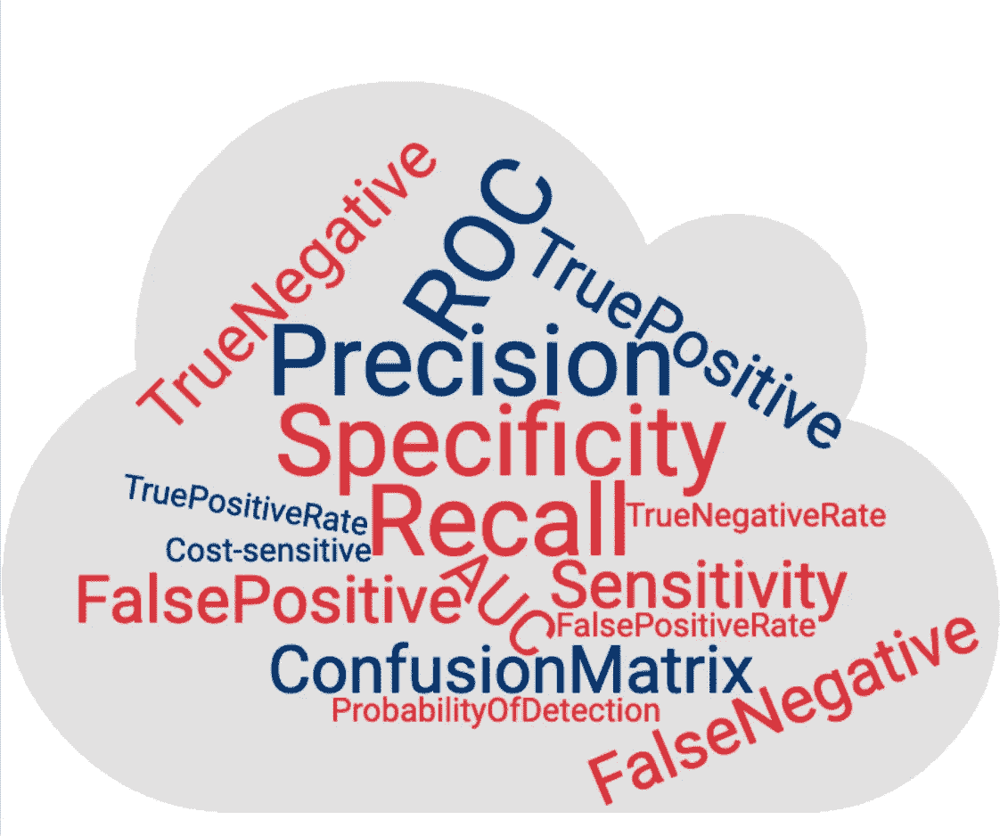
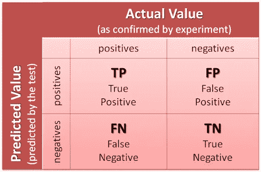
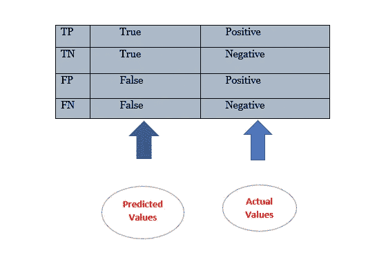
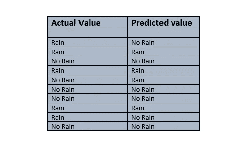
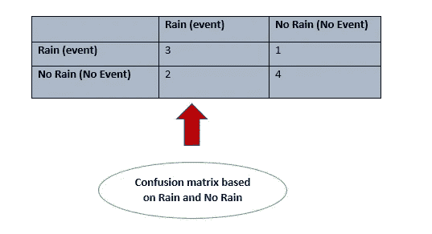
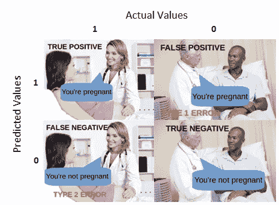
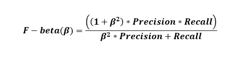
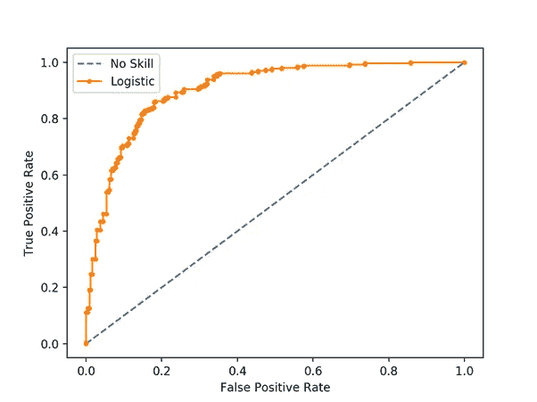
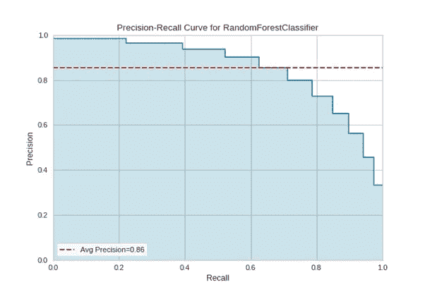

# 混淆矩阵

> 原文：<https://medium.com/analytics-vidhya/confusion-matrix-a2db318ef1f5?source=collection_archive---------7----------------------->

我们在学校和大学的课堂上都学习过矩阵和向量。Well matrix 是一种表示行和列的 N 维数组，在统计和科学领域中有多种类型。但是这里我们不是在讨论我们在数学课上学到的矩阵。

在人工智能和机器学习领域，我们的算法中使用了另一个概念和完全不同的矩阵。混乱矩阵，顾名思义，它迷惑了每个第一次尝试处理它的人。因为，给它越来越多的时间，更频繁地使用它，我们总是拥有并且能够超越困惑矩阵这个神秘的概念。混淆矩阵是数据的表格表示，用于描述基于测试数据和预测数据的分类模型的性能。它用于衡量模型的有效性。混淆矩阵有自己的术语和术语，使其更容易理解。

让我逐一解释每个术语:

**TP —真肯定** —我们问的问题有肯定的答案，我们得到了肯定的答案。

**TN —真否定** —我们问的问题有否定的答案，我们也得到了否定的答案。

**FP —误报** —我们问的问题有肯定的答案，我们得到的答案是否定的。

**FN —假阴性** —我们问的问题得到了否定的答案，我们得到了肯定的答案。

我们有两个术语精度和误差，定义如下:

**准确度** =正确预测数 **/** 预测总数

**错误** =错误预测数 **/** 预测总数

让我们举一个事件发生的例子，基于这个事件，我们将绘制一个混淆矩阵，并检查这个事件的准确性。让外面有时下雨，有时不下雨，我们的机器根据下雨和不下雨的事件来预测数值。

我们有两个术语精度和误差，定义如下:

**准确度** =正确预测数 **/** 预测总数

**误差** =错误预测数 **/** 预测总数

让我们举一个事件发生的例子，基于这个事件，我们将绘制一个混淆矩阵，并检查这个事件的准确性。让外面有时下雨，有时不下雨，我们的机器根据下雨和不下雨的事件来预测数值。

当我们在上表中看到下雨和不下雨的情况时，10 个预测中有 7 个是正确的。由此我们可以看出精确度和误差:

准确度=正确预测数 **/** 预测总数

准确度= 7/10 * 100 = 70%

**每类的正确预测数。**

降雨预测为降雨(TP) = 3

无雨预测为无雨(TN) = 4

**每类错误预测的数量。**

降雨预测为无雨(FN) = 2

无降雨预测为降雨(FP) = 1

从上面的混淆矩阵，我们可以看到有两种不同类型的错误:假阳性(FP)和假阴性(FN)。现在根据情况，我们尽量减少这些错误。在某些情况下，假阳性(FP)比假阴性(FN)风险更大，我们将 FP 最小化。类似地，在某些情况下，假阴性(FN)比假阳性(FP)风险更大，我们试图最小化 FN。

**假阳性(1 型错误)** —从上面的例子可以看出，当时没有下雨，而机器预测下雨。即预测为发生的事件没有发生。

**假阴性(2 型错误)** —下雨时，机器预测不下雨。即预测为未发生的事件的发生。

如果我们看到基于不同情况的 FP 和 FN 的例子，我们需要最小化它们。

在机场安全检查中，当钥匙或硬币被误认为是武器时，这就是所谓的误报，我们需要尽量减少 FP，而不是 FN。在质量检查中，当一个高质量的产品被剔除时被称为假阳性。

在医疗保健领域，当机器将非电晕患者诊断为电晕阳性时，称为假阳性。然而，如果机器将电晕患者诊断为电晕阴性，则称为假阴性。在这种情况下，我们需要尽量减少 FN 情况，因为它比 FP 情况风险更大。

一个非常好的假阳性和假阴性的例子可以使理解它变得更简单。

当一个孕妇被称为怀孕(TP)时。当一个男性被说成没有怀孕(TN)。当一个男性被称为怀孕(FP)和当一个孕妇被称为没有怀孕(FN)。

还有一些与混淆矩阵相关的术语需要我们理解，并根据不同的情况处理它们。

**灵敏度(或回忆)**又称**真阳性率(TPR)—**

在所有发生的事件中，有多少百分比的事件被正确识别。

**回忆(or，TPR) = TP/ (TP + FN)**

**精确度—** 在事件的总预测发生率中，被正确识别的事件发生率的百分比。

**精度= TP / (TP + FP)**

**假阳性率—** 在未发生事件总数中，未发生事件被错误识别的百分比。

**FPR = FP / (FP + TN)**

**F —测量**

f-测量值是精度和召回率的调和平均值。它通过考虑精确度和召回率来描述模型的性能。

**F — Measure = 2 *精度*召回/(精度+召回)**

根据不同的情况，我们需要尽量减少假阳性和假阴性。为了控制 FP 和 FN，我们用 F-Beta 来表示。

为了最小化假阳性，我们必须通过将β值取为 0.5 来最大化精度

为了最小化假阴性，我们必须通过将β值取为 2.0 来最大化召回

**ROC-AUC 曲线**

受试者工作特征(ROC) —曲线下面积(AUC)用于绘制 TPR 和 FPR 之间的关系。

我们的模型精度取决于对角线和曲线内的面积。面积越大，我们的模型就越精确。ROC-AUC 曲线用于平衡分类模型。

**精度—召回曲线**

针对不平衡分类模型，在查准率和查全率之间绘制查准率-查全率曲线。这里的逻辑也是一样的。曲线内的面积越大，我们的模型就越好。

希望你已经很好的理解了。为了遵循混淆矩阵和真实数据集的 ROC-AUC 曲线，您可以在我的 [**GitHub 配置文件中查看我的代码。**](https://github.com/Asit-1121130118/bookaffeine/blob/master/HealthCare%20-%20Diabetes%20Prediction.ipynb)

如果你有任何想补充的或者写错的地方，请帮忙。这对我会有很大的帮助。