# 混淆矩阵、准确度、精确度、回忆、F1 分数

> 原文：<https://medium.com/analytics-vidhya/confusion-matrix-accuracy-precision-recall-f1-score-ade299cf63cd?source=collection_archive---------0----------------------->

## **二元分类度量**

## **如何评价一个机器学习模型的性能？**

让我们考虑一个任务，对一个人是**怀孕**还是**没怀孕**进行分类。如果怀孕测试呈阳性(+ve)，那么这个人就是怀孕了。另一方面，如果怀孕测试是阴性(-ve)，那么这个人没有怀孕。

现在考虑由机器学习算法进行的上述分类(怀孕或未怀孕)。机器学习算法的输出可以映射到以下类别之一。

1.  实际怀孕(阳性)并归类为怀孕(阳性)的人。这叫**真正( *TP* )。**

图 1:真阳性。

2.实际上没有怀孕(阴性)并被归类为没有怀孕(阴性)的人。这叫做**真否定( *TN* )。**

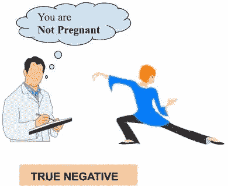

图 2:真阴性。

3.实际上没有怀孕(阴性)而被归类为怀孕(阳性)的人。这叫做**假阳性( *FP* )。**

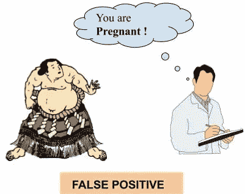

图 3:假阳性。

4.实际怀孕(阳性)并被归类为未怀孕(阴性)的人。这叫做**假阴性( *FN* )。**

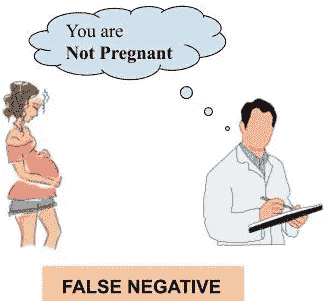

图 4。假阴性。

我们想要的是**真阳性**和**真阴性**，但是由于分类错误，我们也可能以**假阳性**和**假阴性而告终。**所以对一个人是否怀孕的分类存在混乱。这是因为没有一个机器学习算法是完美的。不久我们将在一个称为混淆矩阵的矩阵中描述这种对数据进行分类的混淆。

现在，我们选择 100 个人，其中包括孕妇，不包括孕妇和腹部肥胖的男性。让我们假设这 100 人中有 40 人怀孕，剩下的 60 人包括未怀孕的女性和腹部肥胖的男性。我们现在使用机器学习算法来预测结果。使用机器学习算法的预测结果(怀孕+ve 或-ve)被称为 ***预测标记*** ，真实结果(在这种情况下，我们从医生/专家的记录中得知)被称为 ***真实标记*** 。

现在我们将介绍 ***混淆矩阵*** ，它是计算机器学习算法在将数据分类到其相应标签中的 ***准确度*** 所需要的。

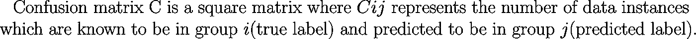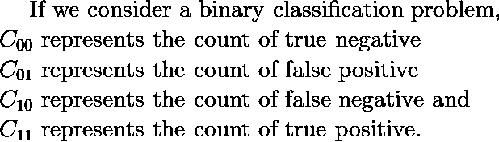

下图说明了二元分类问题的混淆矩阵。

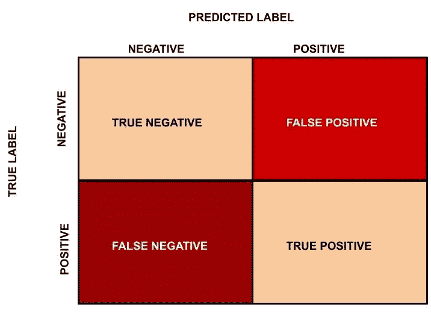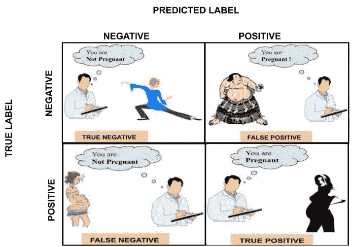

图 5:混淆矩阵。

我们现在回到先前的例子，将 100 人(包括 40 名孕妇，其余 60 名不是孕妇和腹部肥胖的男性)分类为怀孕或未怀孕。通过机器学习算法，在 40 名孕妇中，30 名孕妇被正确分类，其余 10 名孕妇被分类为未怀孕。另一方面，在未怀孕类别的 60 人中，55 人被归类为未怀孕，其余 5 人被归类为怀孕。

本例中，*= 55， ***FP*** = 5， ***FN*** = 10， ***TP*** = 30。混淆矩阵如下。*

*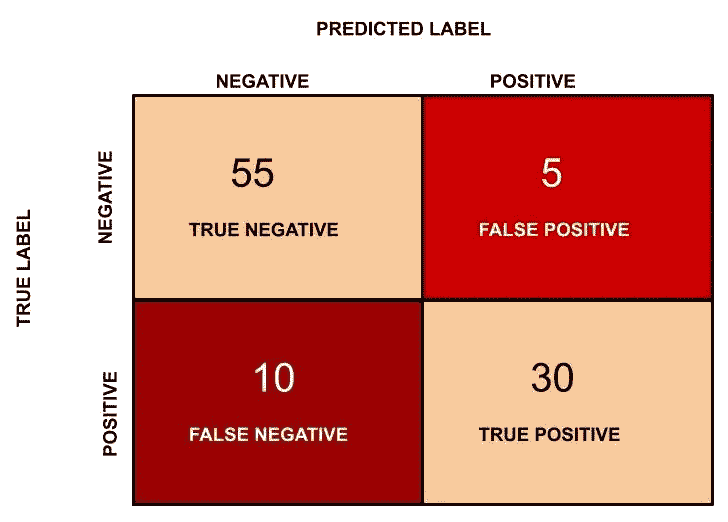*

*图 6:怀孕与未怀孕分类的混淆矩阵。*

## *这个分类任务的机器学习模型的**精度**是多少？*

*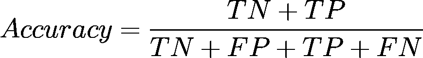*

*准确度表示正确分类的数据实例的数量占数据实例总数的比例。*

*在本例中，准确度= (55 + 30)/(55 + 5 + 30 + 10 ) = 0.85，百分比准确度为 85%。*

## *准确性是最好的衡量标准吗？*

*如果数据集不平衡(负类和正类都有不同数量的数据实例)，准确性可能不是一个好的衡量标准。我们将用一个例子来解释这一点。*

*考虑以下场景:有 90 个人健康(阴性)，10 个人患有某种疾病(阳性)。现在，假设我们的机器学习模型完美地将 90 个人分类为健康，但它也将不健康的人分类为健康。在这种情况下会发生什么？让我们看看混淆矩阵，找出准确度？*

*本例中，*= 90， ***FP*** = 0， ***FN*** = 10， ***TP*** = 0。混淆矩阵如下。**

**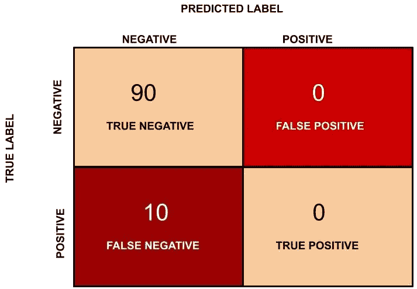**

**图 7:健康与不健康人群分类任务的混淆矩阵。**

**在这种情况下，精度将是(90 + 0)/(100) = 0.9，精度百分比为 90 %。**

## **有什么猫腻吗？**

**在这种情况下，准确度是 90 %,但是这个模型非常差，因为所有 10 个不健康的人都被分类为健康的。通过这个例子，我们想说的是，当数据集不平衡时，准确性不是一个好的衡量标准。在这种情况下使用准确性会导致对结果的误导性解释。**

**所以现在我们进一步找出另一个分类标准。我们再次回到怀孕分类的例子。**

**现在我们将在数据实例分类中找到**精度(阳性预测值)**。精度定义如下:**

**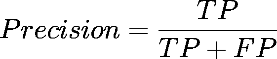**

## **精准是什么意思？**

*****精度*** 对于一个好的分类器来说理想情况下应该是 1(高)。只有当分子和分母相等时 ***精度*** 才会变为 1，即 ***TP = TP +FP*** ，这也意味着 ***FP*** 为零。随着 ***FP*** 的增加，分母的值变得大于分子而 ***的精度*** 的值减小(这是我们不希望的)。**

**所以在怀孕的例子中， ***精度*** = 30/(30+ 5) = 0.857**

**现在我们将介绍另一个重要的指标叫做 ***召回*** 。 ***召回*** 又称为 ***灵敏度*** 或 ***真阳性率*** ，定义如下:**

**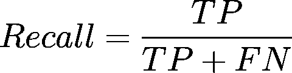**

*****回想一下*** 理想情况下应该是 1(高)为好的分类器。 ***回忆*** 只有当分子和分母相等时才变成 1，即 ***TP = TP +FN*** ，这也意味着 ***FN*** 为零。随着*FN 的增加，分母的值变得大于分子而*的值减小(这是我们不希望的)。****

***所以在怀孕的例子中，让我们看看回忆是什么。***

******回忆*** = 30/(30+ 10) = 0.75***

**所以理想情况下，在一个好的分类器中，我们希望 ***精度*** 和 ***召回*** 为一，这也意味着 ***FP*** 和 ***FN*** 为零。因此，我们需要一个同时考虑到*和 ***召回*** 的指标。***F1-分数*** 是一个同时考虑了 ***精度*** 和 ***召回*** 的指标，定义如下:***

**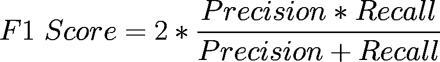**

**只有当**都为 1 时， ***F1 得分*** 才变为 1。只有当**都高时 ***F1 分*** 才会变高。 ***F1 得分*** 是 ***精度******召回*** 的调和平均值，是比 ***精度*** 更好的衡量指标。******

**在怀孕的例子中， ***F1 得分***= 2 *(0.857 * 0.75)/(0.857+0.75)= 0.799。**

## **参考书目**

**下面是 neptune.ai 的一篇关于常见二进制分类度量的有趣文章。文章的链接可以在这里找到:[https://neptune.ai/blog/f1-score-accuracy-roc-auc-pr-auc](https://neptune.ai/blog/f1-score-accuracy-roc-auc-pr-auc))**