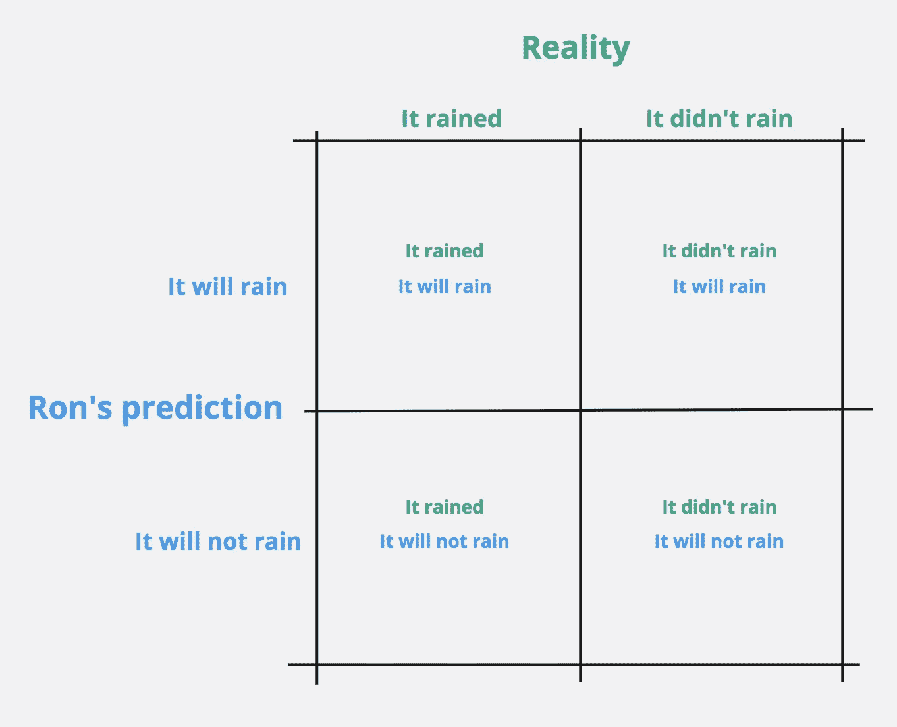
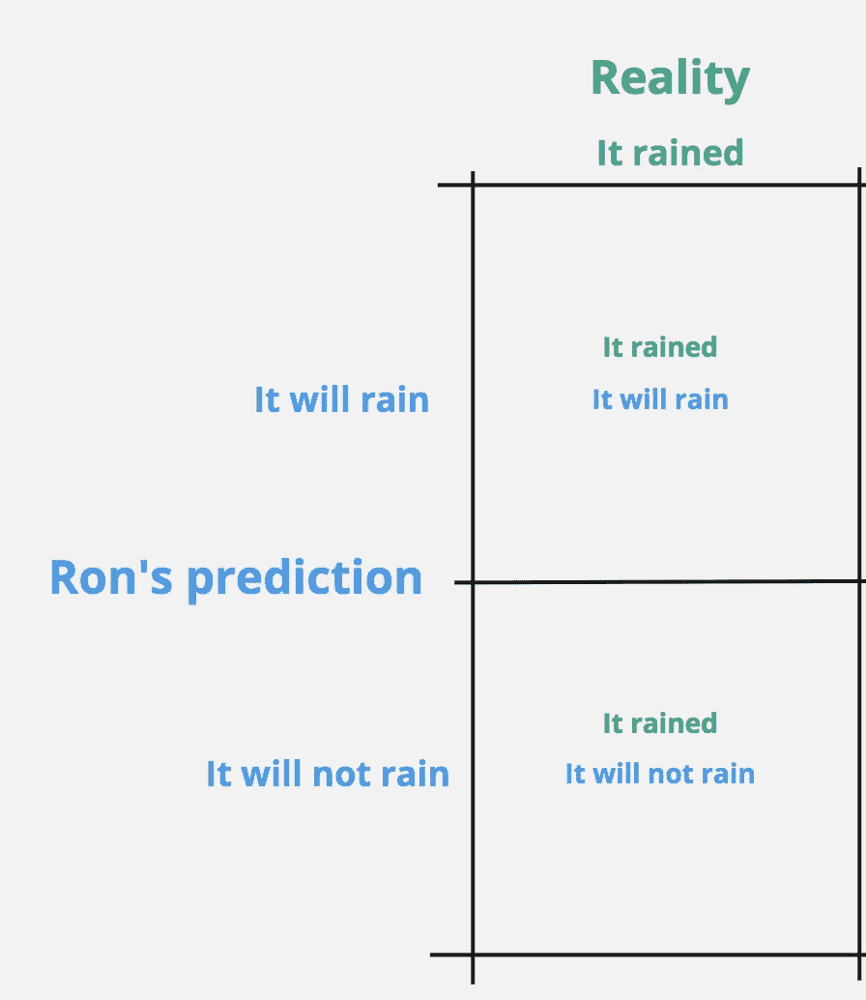
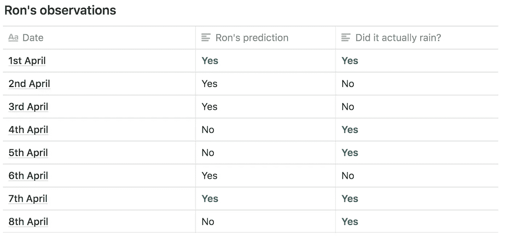
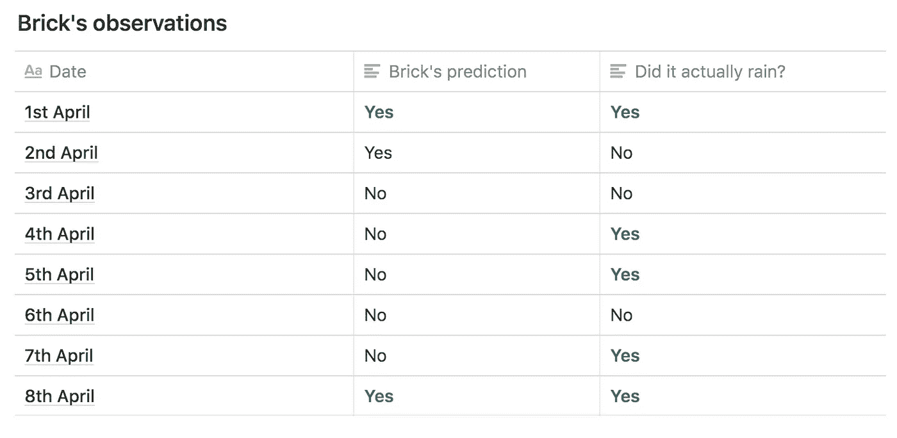
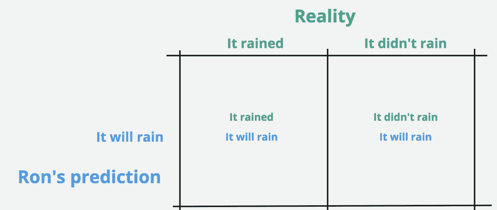
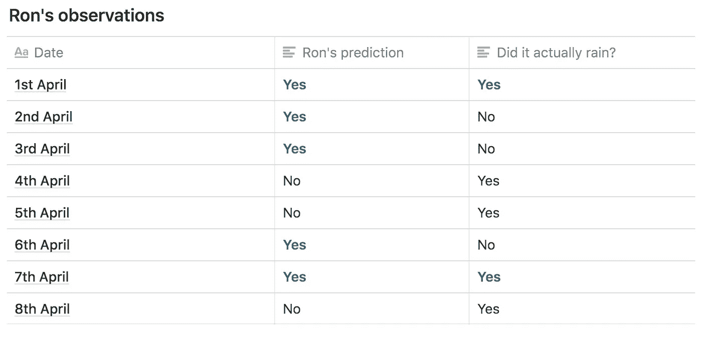
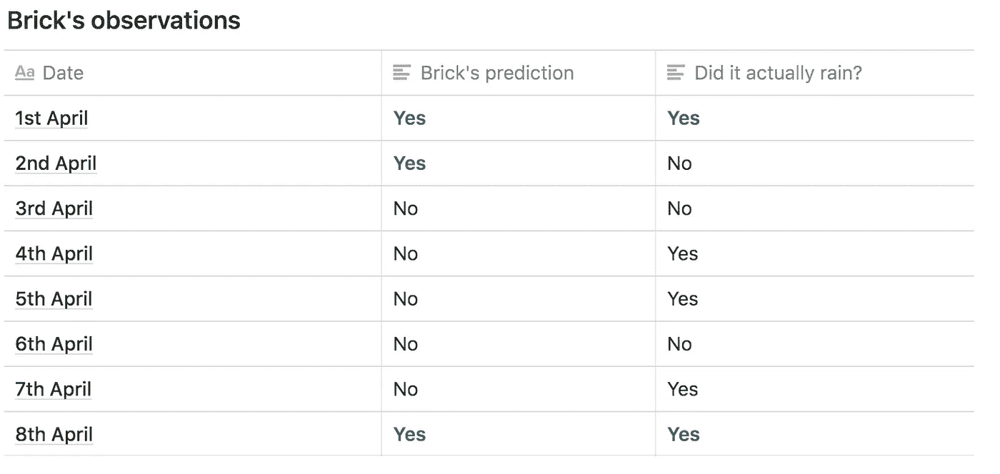
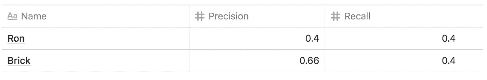

# 困惑矩阵——通过《雨和一把伞》来解释

> 原文：<https://medium.com/analytics-vidhya/confusion-matrix-explained-via-rain-an-umbrella-8a06d2679b73?source=collection_archive---------6----------------------->

奥斯曼·拉纳在 [Unsplash](https://unsplash.com?utm_source=medium&utm_medium=referral) 上拍摄的照片

罗恩的工作是让人们了解恶劣天气，以便他们能够更好地计划他们的日子。每天，罗恩醒来，观察周围的环境，并预测是否会下雨

在人们去上班之前，他们会打开收音机听罗恩的预测。根据他的预测，他们带着一把伞

## 罗恩遇到了他的仇人

一天，罗恩受到了一个名叫布里克的家伙的挑战

布里克说:“罗恩，我向你挑战，谁能更好地预测下雨，谁就赢。”

罗恩显然接受了

## 评估现实

在现实世界中，只有两种可能的结果(想想分类问题)

*   下雨了
*   没有下雨

让我们把它想象成一个 2x2 象限，在这里我们绘制现实中发生的事情和罗恩预测的事情

总共有 4 种情况

*   罗恩说“会下雨”，果然下雨了——**打**(真正)
*   罗恩说“不会下雨”，结果下雨了— **错过**(假阴性)
*   罗恩说“会下雨”，果然没下雨— **虚惊**(误报)
*   罗恩说“不会下雨”，果然没下雨— **正确拒绝**(真否定)

## 决斗时间

为了找到赢家，人们开始问这个问题:

> 在所有下雨的日子里，罗恩有几天是对的

> 命中率=(罗恩说要下雨的次数/真的下雨的次数)

根据下面的观察，罗恩的命中率= 2/5 = 0.4，这意味着在下雨的所有 5 天里，罗恩只有 2 天是对的

罗恩的记分卡

砖块记分卡

砖块的命中率= 2/5 = 0.4

> 命中率也被称为回忆或敏感度或统计能力

罗恩和布里克最终的命中率相同。有意思！

# 平局决胜

罗恩和布里克的平均命中率成为镇上的话题。然后一个好人有了一个聪明的时刻。

> 她说:“昨天，罗恩预测会下雨，但是没有！我不得不带着一把不必要的雨伞。我们是不是也该查查他们多少次虚惊一场，让我们平白无故打伞？”

这是有道理的，因为没有人喜欢在不必要的时候带着雨伞

所以现在，他们都开始问另一个问题:

> 罗恩说会下雨的那些天，真的下雨了吗

> 精度=(下雨的次数/罗恩预测会下雨的次数)

罗恩的记分卡

罗恩的精度= 2/5 = 0.4

砖块记分卡

砖块的精度= (2/3) = 0.66

## 那么，谁更擅长预测降雨呢？

看情况…

想象以下场景

*   罗恩一直说不会下雨，但还是下雨了。因此，**你会更容易淋湿**
*   罗恩一直说会下雨，但没有下雨。结果，你经常会不必要地带着雨伞(虽然你不会淋湿)

你更喜欢哪种情况？

**场景 1:**

你可以接受更频繁的淋湿

你可以接受罗恩*经常缺席*

你不那么在乎*命中率*

你关心精确

**情景二:**

你可以无缘无故地经常带着雨伞

你可以接受罗恩更频繁地发出*假警报*

你不太关心精度

你关心回忆

当然，以上是一种过度简化。有些情况下，你会既关心精确度又关心召回率。然而，这超出了本文的范围。

**阅读这篇激发了这篇冗长帖子的精彩文章，感谢阅读！强烈建议留下反馈…**

[被混淆矩阵混淆](https://towardsdatascience.com/confused-by-the-confusion-matrix-e26d5e1d74eb)