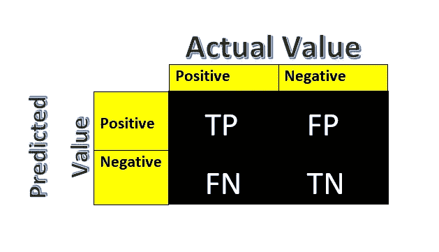
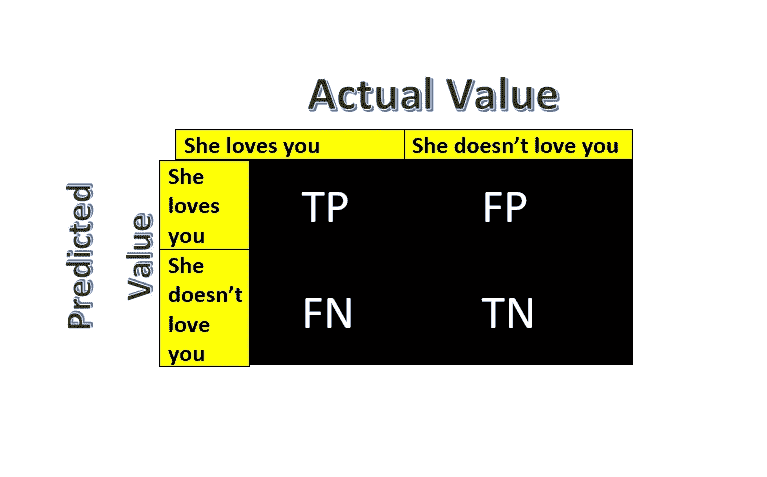

# 机器学习和统计中的混淆矩阵

> 原文：<https://medium.com/analytics-vidhya/confusion-matrix-in-machine-learning-and-statistics-daf446ec0c64?source=collection_archive---------21----------------------->

第 1 类和第 2 类错误、召回、精度和 FBeta-measure

这是初学者最困惑的话题之一。

所以，让我们用一种非常简单的方式开始学习吧。

# 目录:-

1.  **机器学习与统计中的混淆矩阵是什么？**

> a.类型 1 错误
> 
> b.类型 2 错误

**2。精度**

**3。回忆**

**4。FBeta-Measure**

**5。何时使用精度、召回率和 Fβ测量？**

1.  **机器学习与统计中的混淆矩阵是什么？**

在[机器学习](https://en.wikipedia.org/wiki/Machine_learning)领域，特别是[统计分类](https://en.wikipedia.org/wiki/Statistical_classification)的问题中，**混淆矩阵**，也称为误差矩阵[【8】](https://en.wikipedia.org/wiki/Confusion_matrix#cite_note-8)是一种特定的表格布局，允许算法性能的可视化，通常是[监督学习](https://en.wikipedia.org/wiki/Supervised_learning)算法(在[非监督学习](https://en.wikipedia.org/wiki/Unsupervised_learning)中，它通常被称为**匹配矩阵**)。矩阵[的每一行](https://en.wikipedia.org/wiki/Matrix_(mathematics))代表预测类中的实例，而每一列代表实际类中的实例(反之亦然)。这个名字来源于这样一个事实，即很容易看出系统是否混淆了两个类(即通常将一个类错标为另一个类)。~感谢维基百科的惊人定义。

**混淆矩阵**

这里 TP 代表真阳性，FP 代表假阳性，FN 代表假阴性，TN 代表真阴性。让我们深入研究一下。

**真阳性(TP):-**

如果预测值与实际值匹配，称为 **TP，**，即实际值为正值，模型预测值为正值。

**真阴性(TN):-**

如果预测值与实际值匹配，则称为 **TN，**，即实际值为负值，模型预测值为负值。

**假阳性(FP) —类型 1 错误:-**

如果预测值与实际值不匹配，称为 **FP** ，即实际值为负值，而模型预测值为正值。

**假阴性(FN) —第二类错误:-**

如果预测值与实际值不符，称为 **FN** ，即实际值为正值，但模型预测值为负值。

**让我们通过统计假设，用一种非常简单的方式来理解。**

让我们提出一个假设

> H0:她爱你
> 
> H1:她不爱你

从这个矩阵中，

TP:-我们正的实际值与正的模型预测值相匹配，因此，这里我们不拒绝零假设。因此结论是她爱你。尽情享受吧。

**TN:-** 我们的负实际值与负模型预测值相匹配，因此，我们拒绝零假设。因此结论是她不爱你。

**FP:-** 这里，当零假设为真时，我们拒绝它。因此，它创建了类型 1 错误。

**FN:-** 这里我们不拒绝当它为假时的零假设。

**2。精度:-**

精度是一个度量标准，用于量化正确的正面预测的数量。

它的计算方法是正确预测的正例数除以预测的正例总数。

*   精度=真阳性/(真阳性+假阳性)

结果是介于 0.0(无精度)和 1.0(完全或完美精度)之间的值。

**示例:-**

让我们提出一个假设

H0:一个得了癌症的人

H1:一个人不会得癌症

这里，precision 产生了一个类型 1 错误(FP ),即模型预测一个人患有癌症，但实际上一个人没有癌症，因此他/她将进行进一步的医疗处理。

**3。回忆:-**

召回率是一个度量标准，它量化了在所有可能做出的肯定预测中做出的正确肯定预测的数量。

它的计算方法是正确预测的正例数除以可预测的正例总数。

*   回忆=真阳性/(真阳性+假阴性)

结果是介于 0.0(无回忆)和 1.0(完全或完全回忆)之间的值。

**示例:-**

让我们提出一个假设

H0:一个得了癌症的人

H1:一个人不会得癌症

在这里，回忆产生了第二类错误(FP ),即模型预测一个人没有患癌症，但实际上一个人患了癌症，因此他/她不会去做进一步的医疗处理。

**4。FBeta-Measure:-**

精度和召回率衡量两种类型的错误，可能是积极的类。

*   F-Measure = (2 *精度*召回)/(精度+召回)

这是两个分数的[调和平均值](https://en.wikipedia.org/wiki/Harmonic_mean)。~感谢杰森。

结果是介于 0.0(最差 F 值)和 1.0(最佳 F 值)之间的值。

Fbeta-measure 是 F-measure 的抽象，其中在计算[调和平均值](https://en.wikipedia.org/wiki/Harmonic_mean)时精度和召回的平衡由一个称为 *beta* 的系数控制。

*   Fbeta = ((1 + beta ) *精度*召回)/ (beta *精度+召回)

β参数的选择将用于 Fbeta-measure 的名称中。β值可以变化。

**5。何时使用精度、召回率和 Fβ测量？**

> 当假阳性更重要时，我们应该使用精确度。
> 
> 当假阴性更重要时，我们应该使用回忆。
> 
> 当精确度和召回率都更重要时，我们应该使用 FBeta 度量。

# 通过以下方式联系我:-

*LinkedIn:-*[*https://www.linkedin.com/in/shivam-mishra-a03815185/*](https://www.linkedin.com/in/shivam-mishra-a03815185/)

*电子邮件:——shivammishra2186@yahoo.com*

*推特:-*[*https://twitter.com/ishivammishra17*](https://twitter.com/ishivammishra17)