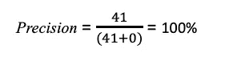

# 困惑矩阵——真的很困惑吗？

> 原文：<https://medium.com/analytics-vidhya/confusion-matrix-is-it-really-confusing-8e2ad4332af0?source=collection_archive---------9----------------------->

任何机器学习模型建立的最关键和最基本的部分是“**模型评估”阶段。**平均而言，数据科学家要花 60%的时间清理和组织数据，以确保模型更好的预测能力和性能。但是我们如何知道我们的模型是否有效呢？我们如何计算开发模型的性能？

`Fig. 1: Machine Learning process flow`

我们需要一些评估指标来衡量绩效和有效性。一个这样的度量是**混淆矩阵**。有许多分类标准，但我们现在对混淆矩阵更感兴趣。

好的，我们现在知道混淆矩阵是一个度量，但是它到底是什么呢？先说一个基本定义。

**混淆矩阵**也称为误差矩阵，是一种特定的表格，通常用于描述分类模型对一组真实值已知的测试数据的性能。

`Fig. 2: Confusion Matrix (2-class)`

例如，下表显示了两类分类问题的混淆矩阵。这里的模型通过胸部 X 射线以 100%的准确度检测 Covid 阳性患者。

`Fig. 3: [Confusion Matrix of Covid positive and Normal patients](https://github.com/SaikrishnaDandamudi/BrainStation-Capstone-Project)`

你会说，“太好了！我现在知道混乱矩阵是什么了，它看起来是什么样子。但是，我怎么读呢？”

好吧，让我们从混淆矩阵中的四个输出开始:

**1。真正(TP)** :简单来说就是你的预测是正的，是真的。

回想一下上面的例子，模型预测 82 名受试者中有 41 名受试者是 Covid 阳性，这是真的。

**2。真阴性(TN):** 表示我们预测没有，他们没有患病。

该模型预测 82 名受试者中的其余 41 名受试者没有 Covid，因此他们是正常的。

**3。假阳性(FP):** 意思是我们预测的没错，但是他们没有这个病。这也被称为“**I 型错误**”。

在我们的例子中，模型运行良好，所以我们没有 I 类错误。但是假设这个模型预测了一个病人的假阳性，这可能会导致严重的并发症。病人要接受更多的检查，有时这会给病人和医务人员带来不必要的经济和精神负担。

犯第一类错误的后果意味着做出不必要的改变或干预，从而浪费时间、资源等。

**4。假阴性(FN):** 意思是我们预测没有，但是他们有这个病。这也被称为“**II 型错误**”。

我们的病例中没有 II 型错误，但是如果我们的模型在 Covid 的病例中预测到假阴性，这将不仅对患者而且对其他人产生严重的影响，因为现在他可能会不知不觉地将它传给他可能接触的人。这些有更糟糕的影响，因为有时他们没有得到他们需要的医疗护理来阻止任何进一步的并发症。

犯第二类错误的后果是在需要改变时保持现状(即干预保持不变)。

混淆矩阵不仅仅是我们上面讨论的四个重要概念。这些有时也被称为高级分类指标，并以数学方式表达。

> **敏感度**，也称为召回率或真阳性率，是对正确识别的真阳性的衡量。

回到我们的模型，它只不过是实际患有 COVID 并被模型预测为真实的患者的比例。当然，我们希望这个值尽可能的高。

> **特异性**，也称为真阴性率，是对正确识别的真阴性的度量。

我们的病例中有 41 个真阴性，0 个假阳性，特异性为 100%。与敏感度类似，我们也希望这个数字更高。

> **精度**是真阳性数量与真阳性数量加上假阳性数量之比。

基于我们的例子，精度是 100%,因为我们的误报是 0。

> **准确度**就是当前被识别的总样本的分数。

上面的模型有 100%的准确性。但是让我们把数字放到数学表达式中，以便验证。

> **F1 得分**是精度和灵敏度的调和平均值。这是对测试准确性的一种衡量。

当你寻求精确度和召回率之间的平衡时，F1 分数是一个很好的选择。

# 利用 Python 和 scikit——为混淆矩阵获得库

在研究 Covid 阳性患者的胸部 X 射线分类问题时，我有机会使用 sci-kit 学习库来生成混淆矩阵，以分析我的模型的性能。

完整的代码和项目信息可在 [Github](https://github.com/SaikrishnaDandamudi/BrainStation-Capstone-Project/blob/master/Binary_Classification_Modeling.ipynb) 上获得

# 评估模型和分类报告

以我的经验来看，混淆矩阵是众多可用于评估我们的分类模型的优秀指标之一。作为一名数据科学家，理解一个混淆矩阵和解读一份分类报告是一项必备技能。

我希望我为您提供了对这些概念的基本理解，并向您展示了如何利用这些概念来评估您自己的模型。如果你有任何问题，请联系我。如果你喜欢文章，想分享，请随意！