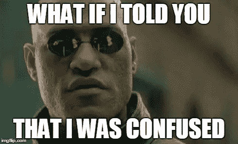
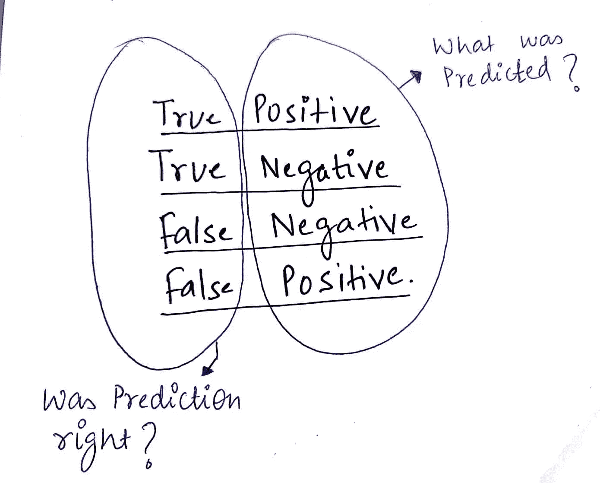
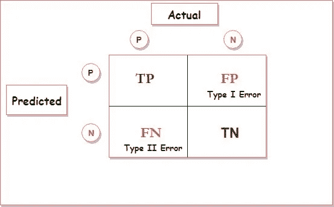
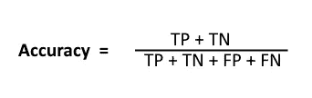
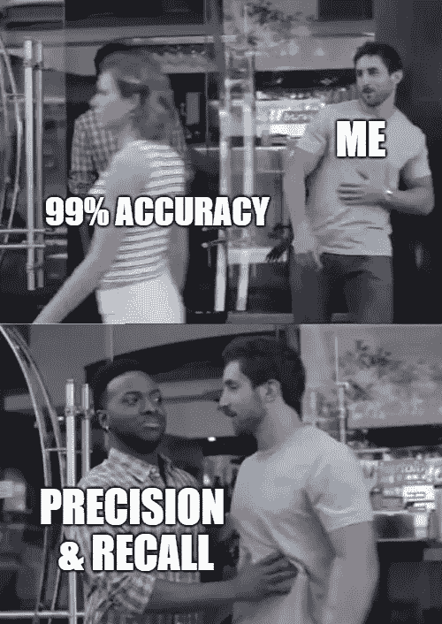
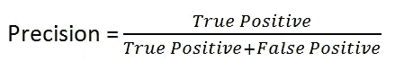
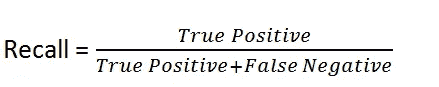
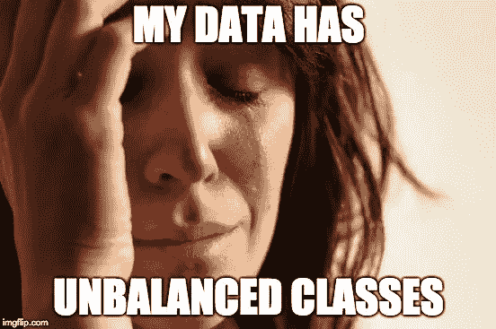

# 混乱矩阵不再混乱。

> 原文：<https://medium.com/analytics-vidhya/confusion-matrix-is-no-more-confusing-890988cf0bf3?source=collection_archive---------25----------------------->



在我们进入主题之前，让我们理解为什么我们需要考虑混淆矩阵和度量？

度量在评估模型的性能中起着重要的作用。

来自混淆矩阵的度量。

*   混淆矩阵(精确度、召回率、F 值、准确度)

> 混乱矩阵不再混乱。

假设一个数据集有两个类，比如 A 类和 b 类。可能有两种情况，你的数据集是**平衡的**和**不平衡的**。平衡数据集意味着，A 类和 B 类的记录是平衡的。假设 A 类有 50%的数据，B 类有 50%的数据或 55–45%的数据。不平衡数据集包含 90–10%的 A 类和 B 类记录，或者 80–20%和 70–30%的数据。

平衡数据集和不平衡数据集要考虑的指标是不同的。

混淆矩阵带有实际的和预测的行和列。使用的术语有真阳性、真阴性、假阳性、假阴性。

让我们分别把这些词分为正确的和积极的。

正:A 类；否定:不是 A 类(B 类)

真:预言是对的；错误:预测是错误的



图片来自谷歌。

**真正** : ***正*** :模型预测为 A 类， ***真*** 什么模型预测正确。**结论为**:实际为 A 级，模型预测为 A 级。

**真阴性** : ***阴性*** :模型预测为 B 类， ***真*** 什么模型预测正确。

结论为:实际为 B 类，模型预测为 B 类。

**假阳性(Type-1 Error)** : ***阳性*** :模型预测为 A 类， ***假*** 什么模型预测错了。**结论为**:实际为 B 级，模型预测为 a 级。

**假阴性(Type-2 Error)** : ***阴性*** :模型预测为 B 类， ***假:*** 什么模型预测错了。**结论为**:实际为 A 级，模型预测为 b 级。



图片来自谷歌。

*   实际值和模型预测值的混淆矩阵以行的形式表示。
*   对角线代表真正的积极和真正的消极。
*   FP 和 FN 是第 1 类和第 2 类误差，这意味着实际值和预测值之间存在矛盾。
*   用任何分类或集合模型训练模型。
*   通过 model.predict(y_test)预测测试数据集
*   打印混淆矩阵。

```
import pandas as pd
from sklearn.metrics import confusion_matrixdata = {'y_Actual':    [1, 0, 0, 1, 0, 1, 0, 0, 1, 0, 1, 0],
        'y_Predicted': [1, 0, 0, 1, 0, 1, 1, 0, 0, 0, 0, 0]
        }df = pd.DataFrame(data, columns=['y_Actual','y_Predicted'])confusion_matrix = pd.crosstab(df['y_Actual'], df['y_Predicted'], rownames=['Actual'], colnames=['Predicted'], margins=True)print(confusion_matrix)
----------------------------------------------------------
Output:
Predicted  0  1  All
Actual              
0          6  1    7
1          2  3    5
All        8  4   12
```

打印分类报告，了解精确度、召回率、F1 分数和准确度。

```
from sklearn.metrics import classification_reportprint("-- Classification Report --\n\n",classification_report(df['y_Actual'], df['y_Predicted']))
**----------------------------------------------------------
Output:**-- Classification Report --

               precision    recall  f1-score   support

           0       0.75      0.86      0.80         7
           1       0.75      0.60      0.67         5

    accuracy                           0.75        12
   macro avg       0.75      0.73      0.73        12
weighted avg       0.75      0.75      0.74        12
```

**让我们来看看结果:**

如前所述，对角线是 TP 和 TN

**TP** :实际为 0，模型预测为 0，满足值 6，模型预测 8 条记录为 0。在 8 个记录中，有 6 个被正确预测。

**TN** :实际为 1，模型预测为满足值 3 的 1，模型预测为 1 的 4 条记录。在 4 条记录中，有 3 条被正确预测。

让我们看看类型 1 和类型 2 错误:

**FP** :预测为 0，实际为 1，满足值 2。

**FN** :预测为 1 但实际为 0，满足值 1。

TP = 6；TN = 3；FP = 2；FN = 1

如果混淆矩阵没有让你混淆，我们可以继续。从 CM 中，我们将了解精确度、召回率、F 值、准确度等指标。

**准确率**是从整体预测记录(总记录)来看，有多少预测是实际正确的(TP+TN)。



精确度= (6+3)/(6+3+2+1)

如果准确率超过 90%，一定要怀疑你的数据集。检查数据集是平衡的还是不平衡的。



图片来自谷歌。

**精度**:从模型预测的，实际正确的有多少。



0 = 6/(6+2)的精度

1 = 3/(3+1)的精度

**回忆**:从整体实际记录来看，有多少预测是正确的。



回忆 0 = 6/(6+1)

回忆 1 = 3/(3+2)

**F-Beta 评分**是 FP 和 FN 起重要作用。


β值的范围可以从 0 到任何数字，取决于 FP 和 FN 的重要性。

*   当 FP 和 FN 同等重要时，设β=1，则表示
    F1 得分。
*   当 FP 比 FN 重要时，设β=0.5，则说 F0.5 分。
*   当 FN 比 FP 重要时，设β=2，则 F2 得分。



图片来自谷歌。

> 如果数据集包含高度不平衡的类。永远不要追求准确性。假设您的模型将 95–5%的数据分为 A 类和 b 类。模型可能会将 98%的数据预测为 A 类，此时准确率将达到 97%。对于 b 类，你只能得到 2 %的正确预测数据。
> 
> **寻找精度，对于不平衡数据集主要召回 F 分。**

点击了解更多关于[如何处理不平衡数据集](/analytics-vidhya/how-to-handle-imbalanced-dataset-b3dc05b85bf9)？

> 简单的技巧，记住什么精度和回忆。

*   精度:以字母 **P** 开头，那么，在 **P** 预测的记录中，有多少是正确的。回忆:与精确相对。从总体 A 类来看，有多少是正确的。
*   你列了一张清单，上面有 10 样东西要去商店买。但是当你走进商店，却忘记了购物清单，结果只买了 7 样东西。

精确度是:在买的 7 样东西中，有哪些东西符合你的清单。回忆是从 10 件物品中选出的，你买了哪些相匹配的物品。

> 什么时候精度优先于召回，反之亦然？

这取决于业务用例。

**当存在与假阴性相关的**高成本时，即当肿瘤实际上为恶性时系统预测为良性时，召回应优于精确度**。**

当存在与误报(即垃圾邮件检测)相关联的**高成本时，**精度应优于召回**。**

感谢阅读。继续学习。