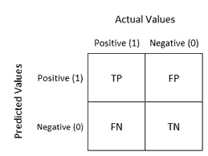
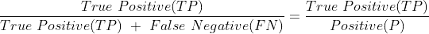
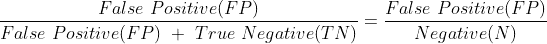
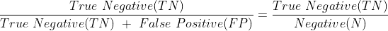
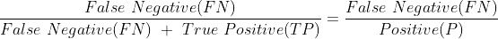
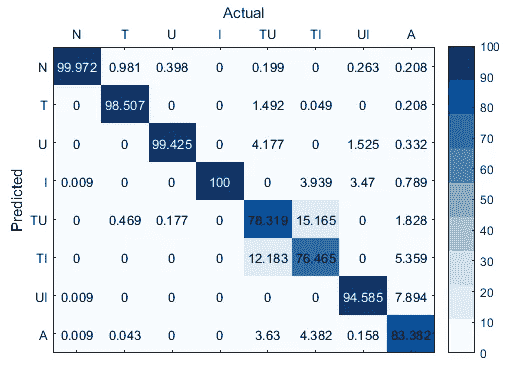
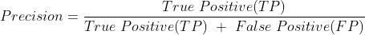
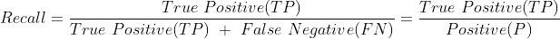
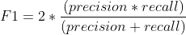

# 混淆矩阵、精确度、回忆和 F1 分数

> 原文：<https://medium.com/analytics-vidhya/confusion-matrix-precision-recall-and-f1-score-d5f340e38cca?source=collection_archive---------9----------------------->


> 为什么我们有并使用不同的机器学习指标？？

我们中的一些人，包括我自己，曾经问过这个问题“为什么有各种各样的 ML 模型？”，为什么我们不使用一个并坚持使用那个度量标准呢？？

你可以这样想，就像我们不能根据一条鱼的飞翔能力来判断它，不能根据一只鸟的游泳能力来判断它，不能根据一只蜗牛的奔跑能力来判断它，不能根据一匹马的爬树能力来判断它一样，每一种动物都有它们的长处，它们在这些地方表现得特别好，所以它们也有它们的弱点。这适用于**机器学习指标**，然后留给我们作为数据科学家或机器学习工程师来决定哪个指标最适合我们正在工作的领域。

例如，我们正在训练一个欺诈检测模型，在与利益相关者举行了几次会议后，我们得出结论，每个客户对公司来说都是宝贵的，公司希望在我们的模型不会造成问题的情况下满足所有客户的需求，然后我们作为一名数据科学家专注于将误报降至最低，因为如果我们的模型预测某项交易是欺诈交易并阻止了用户，用户就会变得愤怒，并转向另一家服务提供商、银行或我们公司可能属于的任何领域。但是等等！！！…什么是误报？，别担心，你会在这个帖子里明白的。

混淆矩阵、精确分数、召回分数和 F1 分数都是分类度量。我记得我第一次听说混淆矩阵的时候，名字中的混淆这个词让我想到了“我需要一段时间才能弄明白”。如果你和我一样，在你的头脑中，只是把其中的困惑清空，因为我们会揭开它的神秘面纱…哈哈😃

## 混淆矩阵

## 因此，作为开始，我们将解释我所谓的…**混乱矩阵的 4 根柱子** …

让我们回到我们的二元分类问题，我们可以预测欺诈或非欺诈、垃圾邮件或火腿、流失或停留、0 或 1 以及许多其他可能性，我们将以此作为四个支柱的基础，它们是:

1.  正确肯定
2.  假阳性
3.  正确否定
4.  假阴性



知道积极的是 1，消极的是 0，所以让我们深入到混淆矩阵的 4 个组成部分

**亲提示**:

```
A good trick I've employed to be able to understand immediately what this four pillars stand for and not 
get confused by how they sound is to know that, the first part i.e the part with the True and False is the 
part that tells us the "validity of the second part" while the second part i.e the part with the Positive 
and Negative tells us "what the model predicts".

So if we hear about False Positive we know that "the model predicts positive" i.e 1 but the validity of 
that is False, meaning what the model predicts is wrong. Also a True Negative means that our model predicts a Negative i.e 0 and the validity of that is True, meaning what our model predicts is correct.
```

真正的肯定:当我们的预测是肯定的，即 1，并且这是真的，那么我们就说这个预测是真正的肯定

**假阳性**当我们的预测为正(即 1)且为假时，我们称该预测为假阳性

当我们的预测是负的，即 0，并且这是真的时，我们说预测是真的负的

**假阴性**当我们的预测是负的，即 0，并且是假的时，我们说预测是假阴性

接下来，我们将讨论**费率**，包括:

*   真实阳性率
*   假阳性率
*   真实负利率
*   假阴性率

但在此之前，让我们真正领会一下**积极** & **消极**的含义:

阳性=真阳性和假阴性

阴性=真阴性和假阳性

您会发现这非常直观，因为假阴性的预测意味着数据点是正数据点，而假阳性的预测意味着数据点是负数据点

**真阳性率**:



**假阳性率**:



**真负率**:



**假阴性率**:



因此，一个好的分类器应该具有高 TPR、高 TNR、低 FPR 和低 FNR。

要知道混淆矩阵不仅限于二元分类问题，它也可以扩展到多类问题。在一个多类问题中，“主对角线”上的数字是我们想要的高度，而“非对角线”上的数字是我们想要减少到最近的最小值。

在下图中，画一条从左上角到右下角的线，这条线是**主对角线**，不在这条线上的每个部分是**非对角线**

下面是多类问题的混淆矩阵



## 优点:

1.  很好地处理不平衡。

## 缺点:

1.  不需要预测概率。

## 混乱矩阵从零开始

```
###############################
#Code Input                   #
###############################import numpy as np
from sklearn.metrics import confusion_matrix
np.random.seed(0)

targets = np.random.randint(low=0,high=2,size=100)
y_hats = np.random.randint(low=0,high=2,size=100)

print("Sklearn Confusion Matrix:",confusion_matrix(targets,y_hats),sep="\n")

def customConfusionMatrix(targets,preds):
    TP = 0
    FP = 0
    TN = 0
    FN = 0
    for y,y_hat in zip(targets,preds):
        if y==1 and y_hat==1:
            TP += 1
        elif y==0 and y_hat==0:
            TN += 1
        elif y==1 and y_hat==0:
            FN += 1
        elif y==0 and y_hat==1:
            FP += 1
    return np.array([[TN,FP],
                     [FN,TP]])
print("Custom Confusion Matrix:",customConfusionMatrix(targets,y_hats),sep="\n")###############################
#Output                       #
###############################Sklearn Confusion Matrix:
[[24 20]
 [31 25]]
Custom Confusion Matrix:
[[24 20]
 [31 25]]
```

## 精确度和召回率

精确度和召回率是非常好的信息检索指标。他们都更关心积极阶层，而不关心消极阶层。

**精度**(特异性):

精确度直观地意味着**在模型分类或声明为阳性的所有点中，有多少百分比实际上是阳性的？**



**回忆**(灵敏度):

另一方面，回忆说**在所有实际上积极的点中，模型能够检测或预测的百分比是多少？**。你可以看到，召回率与我们在混淆矩阵部分讨论的真实阳性率相同，因为 TP 和 FN 都是阳性。



回忆告诉我们**我们的模型对正类有多敏感**，我们看到它也被称为**敏感度**

精度和召回指标可以从 scikit-learn 导入，使用

精确度和召回率都在 0 到 1 之间，越高越好。

```
###############################
#Code Input                   #
###############################from sklearn.metrics import precision_score , recall_score
```

## 精确和从头开始回忆

```
###############################
#Code Input                   #
###############################import numpy as np
from sklearn.metrics import precision_score , recall_score
np.random.seed(0)

targets = np.random.randint(low=0,high=2,size=100)
y_hats = np.random.randint(low=0,high=2,size=100)

sklearn_precision = precision_score(targets,y_hats)
print("Sklearn Precision = ",sklearn_precision)

sklearn_recall = recall_score(targets,y_hats)
print("Sklearn Recall = ",sklearn_recall)

def customPrecision(targets,preds):
    TP = 0
    FP = 0
    for y,y_hat in zip(targets,preds):
        if y==1 and y_hat==1:
            TP += 1
        elif y == 0 and y_hat==1:
            FP +=1

    return TP / (TP + FP)

print("Custom Precision = ",customPrecision(targets,y_hats))

def customRecall(targets,preds):
    TP = 0
    FN = 0
    for y,y_hat in zip(targets,preds):
        if y==1 and y_hat==1:
            TP += 1
        elif y == 1 and y_hat==0:
            FN +=1

    return TP / (TP + FN)

print("Custom Recall = ",customRecall(targets,y_hats))###############################
#Output                       #
###############################Sklearn Precision =  0.5555555555555556
Sklearn Recall =  0.44642857142857145
Custom Precision =  0.5555555555555556
Custom Recall =  0.44642857142857145
```

## F1 分数

F1 分数是一个试图结合精确度和召回率的指标

f1 分数指标可从 scikit-learn 导入，使用

```
###############################
#Code Input                   #
###############################from sklearn.metrics import f1_score
```

f1 分数也在 0 到 1 之间，越高越好。

F1 分数的公式为



## F1 分数从零开始

```
###############################
#Code Input                   #
###############################import numpy as np
from sklearn.metrics import f1_score
np.random.seed(0)

targets = np.random.randint(low=0,high=2,size=100)
y_hats = np.random.randint(low=0,high=2,size=100)

sklearn_f1_score = f1_score(targets,y_hats)

def customF1Score(targets,preds):
    def customPrecision(targets,preds):
        TP = 0
        FP = 0
        for y,y_hat in zip(targets,preds):
            if y==1 and y_hat==1:
                TP += 1
            elif y == 0 and y_hat==1:
                FP +=1

        return TP / (TP + FP)

    def customRecall(targets,preds):
        TP = 0
        FN = 0
        for y,y_hat in zip(targets,preds):
            if y==1 and y_hat==1:
                TP += 1
            elif y == 1 and y_hat==0:
                FN +=1

        return TP / (TP + FN)
    precision = customPrecision(targets,preds)
    recall = customRecall(targets,preds)

    return 2 * (precision * recall) / (precision + recall)

print("Sklearn F1_Score = ",sklearn_f1_score)
print("Custom F1_Score = ",customF1Score(targets,y_hats))###############################
#Output                       #
###############################Sklearn F1_Score =  0.4950495049504951
Custom F1_Score =  0.4950495049504951
```

感谢您的阅读，我希望我已经让您对一些分类指标有了一些了解。一点点的激励将会被欣赏，你可以通过鼓掌来做到这一点👏。我也乐于接受问题和建议。你可以与朋友和其他人分享，或者在你最喜欢的社交媒体平台上发布，这样有需要的人可能会偶然发现。

您可以通过以下方式联系我:

领英:[https://www.linkedin.com/in/temiloluwa-awoyele/](https://www.linkedin.com/in/temiloluwa-awoyele/)

推特:【https://twitter.com/temmyzeus100 

github:【https://github.com/temmyzeus 