# 混乱矩阵不会再迷惑你了

> 原文：<https://medium.com/analytics-vidhya/confusion-matrix-wont-confuse-you-anymore-90424c1bdba9?source=collection_archive---------14----------------------->

[来源](https://www.google.com/search?q=train&tbm=isch&ved=2ahUKEwiE4fTy3qDtAhUGNisKHTqgBM8Q2-cCegQIABAA&oq=train&gs_lcp=CgNpbWcQAzIHCAAQsQMQQzIECAAQQzIHCAAQsQMQQzIHCAAQsQMQQzIECAAQQzIHCAAQsQMQQzIHCAAQsQMQQzIECAAQQzIFCAAQsQMyBQgAELEDULQTWLQTYMEWaABwAHgAgAGNAYgBjQGSAQMwLjGYAQCgAQGqAQtnd3Mtd2l6LWltZ8ABAQ&sclient=img&ei=uua_X4ScBobsrAG6wJL4DA&bih=657&biw=1366#imgrc=-0J_YOQG8CCRBM)

> **什么是混乱矩阵？**

混淆矩阵是一个评估矩阵，用于检查**分类模型**的准确性，基于混淆矩阵的观察，我们决定是否接受或拒绝模型用于进一步的用例。让我们用现实生活中的例子来理解它。

假设你的公司开发了**新冠肺炎**测试套件。为了检查该试剂盒的有效性，公司随机抽取了 **100 名**新冠肺炎嫌疑人，其中 **60 人**感染了新冠肺炎， **40 人**呈阴性结果。但是你的试剂盒只能检测新冠肺炎病毒感染者。让我们根据这个例子制作混淆矩阵。

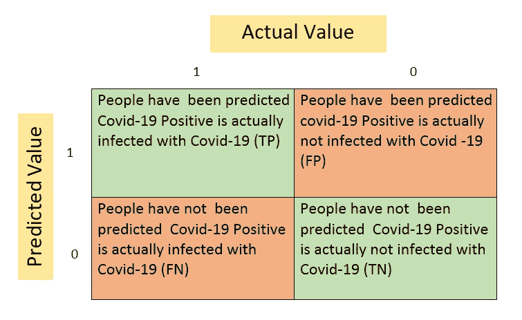

图 1

> **如何在混淆矩阵中写命名约定？**

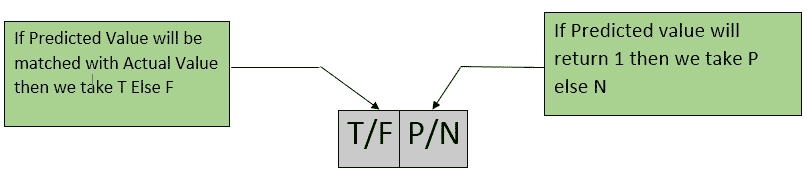

图 2

**i .真阳性(TP)** **:-** 预测没错，他们确实有这种病。

**二。假阳性(FP):-** 预测是的但他们没有这种疾病。

**三。假阴性(FN):-** 预测没有但确实有疾病。

**四。真阴性(TN):-** 预测没有，他们没有这个病。

让我们举上面的例子来更准确地理解它；

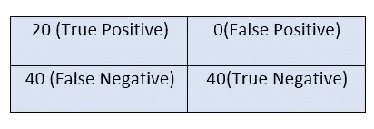

图 3

让我们了解更多可能有助于评估二元分类模型的参数。

## 1.准确(性)

它是**正确分类总数**与**正确分类总数的比值。**

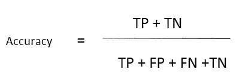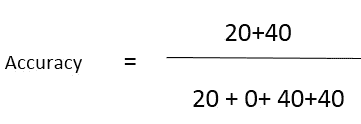

通过参考上面的例子，我们得到的准确度=60%。

## 2.回忆/敏感度

从总人数中获得正确肯定预测的结果实际上具有肯定结果。

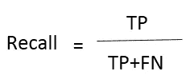

基于上述例子的理解；

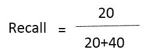

该检测试剂盒显示，从实际感染者中获得阳性预测的灵敏度为 34 %。

## 3.精确

从被预测的总人数中获得正确的肯定预测的结果是肯定的。

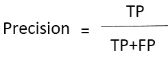

举上面的例子来更准确地理解它；

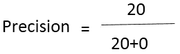

100%精度意味着混淆矩阵的**假阳性**部分存在**空值**。

## 4.F1 分数

一般来说，我们采用查全率或查准率来检查模型的准确性，但是对于一些特殊的业务需求，我们需要同时使用查全率和查准率来检查模型的准确性，因此在这种情况下，F1 分数就变成了由查全率和查准率组成的图片。

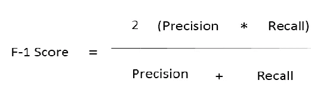

> **接收机操作员特性曲线**

当我们处理分类问题时，我们总是指定概率的阈值，并基于它将对象分类到不同的类中。让我们使用二进制类分类问题来尝试理解这一点。

设**阈值**概率值为= **0.5** ，大于 0.5 的值**被指定为积极/有利类，小于 0.5** 的值**被指定为消极/不利类。**

**R.O.C** 的主要目的是找到**阈值**值。混淆矩阵的整体概念取决于 R.O.C .的阈值。

***我们如何用 R.O.C .找到阈值？***

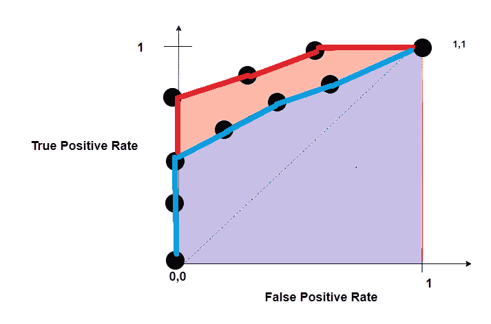

[来源](https://www.google.com/search?q=receiver+operator+characteristic+curve+with+dot&tbm=isch&ved=2ahUKEwiT1rqN-aLtAhX5hUsFHaLJD7EQ2-cCegQIABAA&oq=receiver+operator+characteristic+curve+with+dot&gs_lcp=CgNpbWcQAzoECAAQHjoECAAQGFCp_QNYr5cEYLOYBGgAcAB4AIAB1wGIAcIKkgEFMC42LjKYAQCgAQGqAQtnd3Mtd2l6LWltZ8ABAQ&sclient=img&ei=pA7BX5P0IvmLrtoPopO_iAs&bih=657&biw=1366#imgrc=LWJHOw_xvt_adM)

R.O.C 曲线是真阳性率(T.P.R)对假阳性率(F.P.R)的曲线图。这里，每个黑点代表一个在特定阈值的混淆矩阵，当我们从右向左移动时，假阳性率的值在当 F.P.R .显示困境和 T.P.R .显示一些突发时的点降低，该特定点将被视为建模的阈值，这是 R.O.c .的主要任务。

什么是曲线下面积？

A.U.C .的主要目的是从几个模型中选择最佳分类模型。

您已经采用了多种分类算法，无论哪种算法具有最大的曲线下面积，都将被视为最适合该特定问题的分类模型。

如果我们将看到上图，那么红线的模型将是最适合使用的分类模型。

## **结论:-**

这些都是我的观点，如果你有任何疑问和建议，请在下面评论。