# Twitter 情绪分析:使用 PySpark 对国会议员进行聚类

> 原文：<https://medium.com/analytics-vidhya/congressional-tweets-using-sentiment-analysis-to-cluster-members-of-congress-in-pyspark-10afa4d1556e?source=collection_archive---------3----------------------->

在我之前的项目中使用了相当多的 Python，我想处理一个大型数据集，这需要 PySpark 的并行计算能力。我在美国国会议员发的推特上发现了一个很大的数据集，看起来很有趣，我想到了一个主意…

我假设的客户:
我正在帮助游说者 4America 通过他们的推文更好地了解国会议员之间的关系:数据集由 2008 年至 2017 年间发送的推文组成。目的是利用这些情报帮助他们更好地瞄准客户在国会的游说活动。


这些国会议员中谁最像？

**假设:** 1。将会有一群志同道合的政治家，他们可以很大程度上按照党派划分。
2。在这些集群中会有客户可以瞄准的影响力中心(响亮/有影响力的声音)。
3。在这段时间里，一些主题会变得更加热门

**做法:**
1。导入数据并进行 EDA。
2。主题提取:单词袋
3。实体识别:Spark-NLP
4。情感分析:使用文本块进行情感评分
5。Spark-ML 聚集志同道合的成员。

# **第一步:导入数据，进行 EDA。**

导入 Python 库

```
import pandas as pd
import numpy as np
import matplotlib.pyplot as plt
import seaborn as sns
```

导入 Spark 函数和 Spark-NLP，在构建 SparkSession 的过程中，确保 Spark-NLP jars 文件可以在我们的模块中找到(我发现我必须这样做，否则会出现没有找到模块的错误)

```
import sparknlp
from pyspark.sql import SparkSession
spark = SparkSession.builder \
    .master("local[4]")\
    .config("spark.driver.memory","4G")\
    .config("spark.driver.maxResultSize", "2G") \
    .config("spark.jars.packages", "com.johnsnowlabs.nlp:spark-nlp_2.11:2.4.5")\
    .config("spark.kryoserializer.buffer.max", "1G")\
    .getOrCreate()
from sparknlp.pretrained import PretrainedPipeline
from pyspark.sql.functions import from_unixtime, to_date, year, udf, explode, split, col, length, rank, dense_rank, avg, sum
from pyspark.sql.window import Window
```

Spark ML 将在以后应用聚类时使用

```
from pyspark.ml.linalg import Vectors
from pyspark.ml.feature import VectorAssembler, StandardScaler
from pyspark.ml.stat import Correlation
from pyspark.ml.clustering import BisectingKMeans
from pyspark.ml.evaluation import ClusteringEvaluator
from pyspark.ml import Pipeline
from pyspark.ml.tuning import CrossValidator, ParamGridBuilder
```

我将实现的 NLP 库:

```
import nltk
from nltk.corpus import stopwords
from collections import Counter
from wordcloud import WordCloudfrom textblob import TextBlob
```

**将数据导入 Spark 数据框:**

将 JSON 文件作为 Spark 数据帧读取是相对简单的，尽管在处理数据帧时需要考虑一些因素以实现更高效的处理。
1。Spark 数据帧应被分割成 2-3 倍于 CPU 或集群中可用线程数的分区。我的机器有 4 个逻辑核心，所以我选择了 3x，即。12 个分区，基于实验。
2。然后我缓存了这些表(‘persist’)，以提高以后的查询性能:您可以检查 Spark GUI 的 Storage 选项卡，每个文件确实缓存了 12 个分区。
3。Shuffle Read partitions 参数默认为 200，我们不希望这成为瓶颈，所以我们使用 spark.sql.shuffle.partitions 将它设置为等于数据中的分区。这将特别有助于稍后可能执行的广泛的 Shuffle 转换(例如 GROUP BY 或 ORDER BY)。

```
# Tweets
tweets = spark.read.json('../Lobbyists4America1/US_PoliticalTweets/tweets.json').repartition(12).persist()# Users
users = spark.read.json('../Lobbyists4America1/US_PoliticalTweets/users.json').repartition(12).persist()
```

我使用 Spark-SQL 创建数据的不同部分，以便更好地理解它。与我的假设相关的一个观察结果是，很少有会员在 Twitter 上拥有大量追随者，这些追随者会是我客户政策的有力支持者

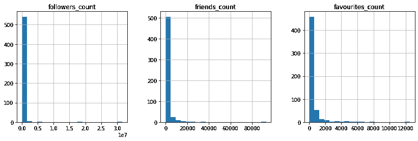

即…

```
+------------------+---------------+
|              name|followers_count|
+------------------+---------------+
|   Donald J. Trump|       31712585|
|   President Trump|       18545354|
|    Bernie Sanders|        5072538|
|       Cory Booker|        3094413|
|       Marco Rubio|        2554822|
|  Elizabeth Warren|        2412087|
|       John McCain|        2274034|
|      Nancy Pelosi|        1126205|
|       Jerry Brown|        1119275|
|  Senator Ted Cruz|         960413|
| Governor Christie|         869256|
|       John Kasich|         755475|
|     Chuck Schumer|         591618|
| Senator Tim Kaine|         553125|
|        Trey Gowdy|         552930|
|        John Lewis|         512433|
|Kirsten Gillibrand|         396587|
|     Maxine Waters|         379015|
|          Mike Lee|         314821|
|Rep. Keith Ellison|         313271|
+------------------+---------------+
only showing top 20 rows
```

# 第二步:主题提取:词汇袋

在快速浏览了数据和一些描述性的统计数据之后，我想更深入一点，理解主题是什么。

1.  NLTK 有一个停用词语料库，我下载了它来帮我从推文中删除它们。
2.  Spark RDDs 可以被操纵，这样我们就可以从一组文档/tweet 中获得字数:使用 flatMap、reduceByKey 和 sort。
3.  然后，我把它输入到 WordCloud 中，以便在数据集中显示每年的情况

*注意:我关注的是 2013 年以后的数据，因为他们有足够大的样本量*

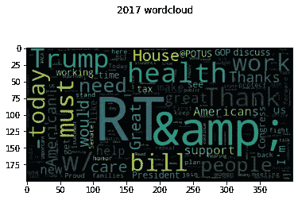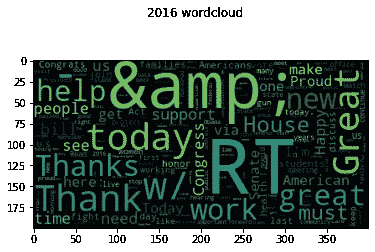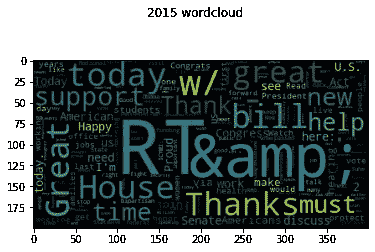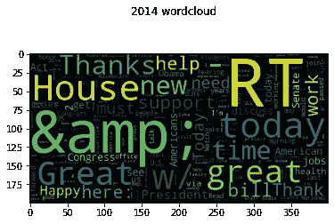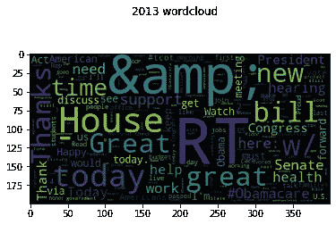

# 步骤 3:实体识别:Spark-NLP

单词袋方法的问题是有许多单词不构成主题或主题，所以我将上面生成的语料库输入到 Spark-NLP 的预训练管道中，并从本质上询问它每个单词是否是一个实体。
在这个清理过的语料库上重现文字云，可以更清晰地看到此时的热门话题:

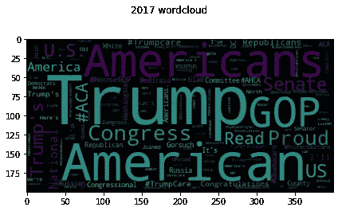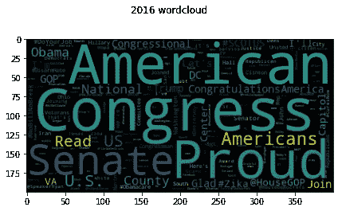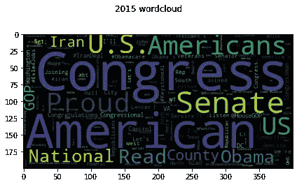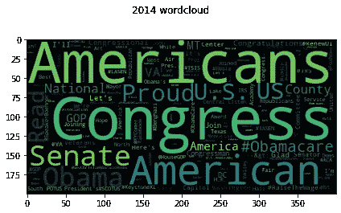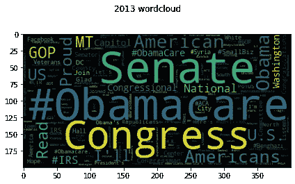

这一步让我对自己的旅行方向有了一些安慰:我将把医疗保健作为分析的主题…

# 步骤 4:情感分析:使用 TextBlob 进行情感评分

使用 TextBlob 为每条推文分配情感分数非常简单，只需 3 行代码，不到一秒钟就可以运行整个数据集:

```
sentiment = udf(lambda x: TextBlob(x).sentiment[0])
spark.udf.register(“sentiment”, sentiment)
tweets = tweets.withColumn(‘sentiment’,sentiment(‘text’).cast(‘double’))
```

我观察了情绪和推文数量的总体趋势。使用 90 天的每日移动平均线，我们可以看到，从 2013 年起，Twitter 作为国会议员沟通的媒介开始受到欢迎。有趣的是，在 2016 年底出现了非常大的增长:这可能与特朗普在推特上的高参与度有关，以及其他政客似乎对他的策略做出了回应，并增加了他们自己在推特上的存在。这种增长伴随着情绪的轻微下降，我们可以推断推文在语气上开始变得更具对抗性吗？

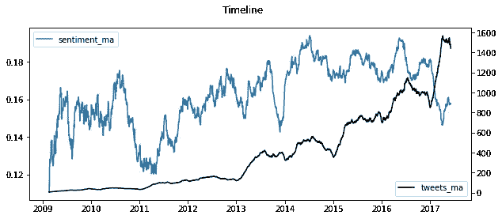

查看包含“奥巴马医改”的推文，我们看到一个有趣的趋势:在 2013 年，这些推文的数量真的开始急剧上升，并在 2014 年急剧下降，这是一种故意的策略吗？有趣的是:在这一过程中，情绪下降到中性，看起来如果你在推特上谈论“奥巴马医改”而不是“ACA ”,那么你可能会对它持负面态度。

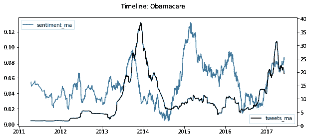

看看那些倾向于使用“奥巴马医改”的议员就可以证明这一点:他们是共和党人。
另一件有趣的事情是:“奥巴马医改”人气的下降也是这次整体人气下降的原因吗？
按主题解释情绪的整体变化可能是一种有趣的方式，可以揭示整体趋势，或许可以在主题层面上创建某种加权情绪衡量指标:但那是另一个时间了(与我的假设无关)。

# 步骤 5: Spark-ML 聚集志同道合的成员

专注于医疗保健，我想得到一个更微妙的想法，志同道合和同样充满活力的国会议员。很容易将他们分为研究和开发，但如果你想知道哪些国会议员对这个话题持有最强烈的观点，以及他们中的哪些人也受到这个问题的激励而在 Twitter 上积极讨论这个问题，会怎么样呢？这对游说者来说是有价值的情报。因此，我使用 Spark-ML 的无监督学习模型(即平分 K-Means)来创建这些集群，这些集群基于包含“ACA”或“奥巴马医改”的推文中的推文数量和成员表达的情绪

1.  用于创建功能列的 VectorAssembler
2.  将 StandardScaler 应用于所述特征列
3.  通过迭代不同的选项并使用剪影分数进行评估，在平分 K-Means 中优化 K。
4.  选择 k=6，因为它的得分最高:0.502
5.  散点图…

我选择在每一点上标注会员的名字，以及该会员基于关注者数量的排名。因此，根据追随者的数量，科里·布克似乎是他的团队中最有影响力的成员，他在 Twitter 上的追随者数量在所有国会议员中排名第四。

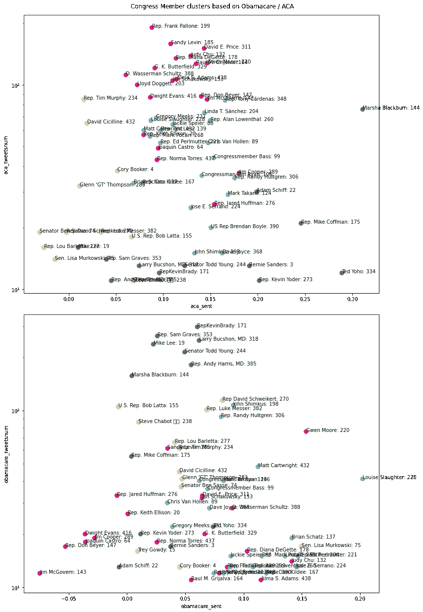

# 结论

1.  非常有趣的是，我们看到了基于医疗改革观点/观点力度的分类。这些聚类似乎有意义，给了我们一个比共和党和民主党更微妙的视角。
2.  在这里，我们现在有 6 个志同道合(情绪)的成员集群，他们也受到手头问题的类似激励(num_tweets)。
3.  绿色集群似乎高度反对奥巴马医改，其中李政颖似乎拥有最多的追随者，在这个问题上也非常直言不讳。
4.  红色群组的情绪更加消极，尽管他们发微博的次数比绿色群组的人少得多。这可能与样本规模有关:样本规模越小，越容易受到情绪极端化的影响，而样本规模越大，越倾向于中性。这是我在不同的数据切片中看到的:你越缩小，情绪就越中立。

# 假设:结论

1.  将会有一群志同道合的政治家，他们可以很大程度上按照党派划分。
    正确
2.  **在这些集群中会有客户可以瞄准的影响力中心(响亮/有影响力的声音)。** 正确
3.  **在这段时间里，一些主题会变得更加热门** 对吗

# 潜在的后续步骤

我利用政治家们对两个不同主题的观点创建了这些集群:ACA 和奥巴马医改，在外交政策、能源或税收改革问题上，有可能创建不同的集群。或者甚至是一组不同问题的集群:看看哪些成员在总体上是志同道合的，而不仅仅是在特定问题上…这可能导致我们推断…“如果政治家 A 在这个问题上和政治家 B 一样，那么他们也可能在这个问题上改变立场”

感谢阅读，对于那些感兴趣的人…你可以在我的 GitHub 上找到代码，对这位崭露头角的数据科学家的任何反馈都将不胜感激！

[](https://github.com/noahberhe/Lobbyists4America) [## Noah berhe/说客 4America

### 使用 Pyspark，Spark-NLP 在 JSON 文件上发布情绪分析，帮助游说者 4America 了解关系…

github.com](https://github.com/noahberhe/Lobbyists4America)