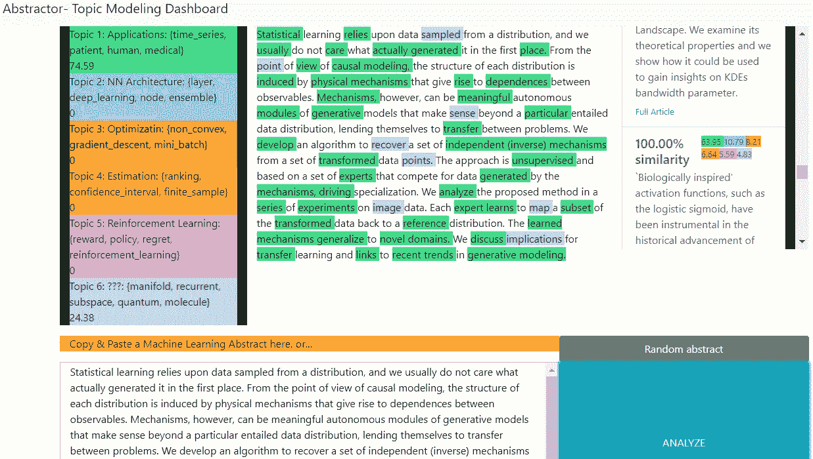

# 使用 Flask 和 React 将机器学习模型连接到 Web 仪表板

> 原文：<https://medium.com/analytics-vidhya/connecting-a-machine-learning-model-to-a-web-dashboard-using-flask-and-react-3552c1cfc780?source=collection_archive---------0----------------------->


比方说，你一直在一台 Jupyter 笔记本上埋头研究你最新最棒的 ML 模型。它可以是 scikit-learn 线性回归模型、Keras 卷积神经网络，甚至是 spaCy 命名的实体识别模型。

这在笔记本中很好，但如果您想将其与一个光滑的 web 前端集成，用户可以上传文件或输入一些文本来训练或测试模型，该怎么办？如果您想要创建一个能够允许模型充分显示其功能的仪表板，该怎么办呢？

这样做的好处是你有许多选择。我在这里介绍的只是一个选择，这是我根据自己的经验和对各种语言/框架的熟悉程度做出的选择。工作流程如下所示:

1.  使用 Jupyter 笔记本的灵活性和便利性来训练和调整模型(我将使用 gensim 库)。将最终的模型/辅助对象/转换后的数据保存到托管服务器的目录中。
2.  创建一个 Python 服务器(我将使用 Flask)并为您想要的功能设置 HTTP 端点。从 Jupyter 导入您想要的功能。
3.  创建一个 web 前端(我将使用 create-react-app)，设计 UI 并定义将与后端通信的 API 调用。
4.  在本地主机上测试，在线部署(我将使用 PythonAnywhere 和 Heroku)
5.  ???
6.  利润？？


我应该提到，这个项目来自我的大会数据科学沉浸式顶点项目。我的[模型](https://github.com/bookRa/capstoneEDA/blob/master/Technical_Report_Milestone_4.ipynb)、[服务器](https://github.com/bookRa/abstractor_server)和[前端](https://github.com/bookRa/abstractor)的源代码可以在我的 [github](https://github.com/bookRa) 上获得。请从那里分叉/克隆/跟随。

由于这三个组件中的每一个都可以单独发表一篇博文，因此我将尝试给出它们的实际实现的粗略概述，并重点关注它们如何组合在一起。

# 模型

我的机器学习应用在[主题建模](https://en.wikipedia.org/wiki/Topic_model)领域，这是自然语言处理的一个迷人而重要的分支。我们如何训练计算机来总结一个非结构化的文本体，并根据它们的主题将文档的相似性联系起来？

为此，我将使用来自流行库 [gensim](https://radimrehurek.com/gensim/) 的强大的潜在狄利克雷分配(LDA)模型。

# 数据

**数据收集**

我将从科学期刊档案馆 [arXiv](https://arxiv.org/) 搜集大约 18000 篇期刊摘要。都来自于 stat.MachineLearning 的范畴，为什么要挑一个来自同一个主题的主题建模语料库呢？为什么…当然是为了挑战！如果我的文档已经被分成生物、化学、计算机科学和经济学，那么说“正如你在这里看到的，我的 LDA 模型能够区分 4 个清晰描述的主题”可能有点琐碎此外，在现实生活的应用中，语料库经常有很大的重叠，真正的价值来自于透过表面的相似性来看它们之间真正的区别。

要查看我如何调用 arXiv 的 API 的代码，请点击这里的。

**数据清理**

要全面了解主题建模的文本处理，请查看我的[上一篇文章](/@omar.abdelbadie1/processing-text-for-topic-modeling-c355e907ab23)。清理你的文字*非常重要！*

# **拟合模型**

gensim 工作流程通常如下:

1.  收集、清理和标记你的语料库(同时删除停用词)。**可选* *使用短语器在语料库中查找常见的二元或三元(或多元)语法。
2.  创建一个映射文本-> id 的字典
3.  使用 ids 和基于您打算使用的模型选择的方法来生成语料库的数字表示。有些使用 TF-IDF 表示，有些(如 LDA)使用纯字数统计，也称为 BagOfWords。
4.  选择你想要的题目数量[* *关键一步！**]适合。然后坐下来，看着话题滚滚而来。

```
*# The raw documents:* 
abstracts = pd.read_csv('./new_hope_data/arxiv_csML.csv')['summary']
cleaned_texts = [prep_text(doc) for doc in abstracts] #see my prev post for explanation on prep_text()!*# The gensim phraser I'm using*
bigrams= gensim.utils.SaveLoad.load('./the_data_strikes_back/bigram_phrases')
bigram_texts= [bigrams[text] for text in cleaned_texts]dictionary = corpora.Dictionary(bigram_texts)bow = [dictionary.doc2bow(text) for text in bigram_texts] #bow = bagO'wordsmy_lda = LdaModel(corpus=bow, num_topics=6, id2word=dictionary, alpha = 'asymmetric', eta=0.08)
```

请注意，上面的代码是出于说明的目的。它会起作用，但不一定会产生一个伟大的模型。

在处理语料库方面还需要做更多的工作。具体来说，如果您查看字数分布，您会看到:


x:语料库中的词频；y:字数

在对最少和最常见的单词进行一些过滤后，我们可以获得一个更体面的分布，这将允许我们专注于为不同主题添加意义的单词。


这是更有价值的看看，并适合我们的模型。

这种过滤，加上对我们的 LDA 参数的进一步修改，在运行`my_lda.show_topics()`之后可以产生以下主题:

```
[(0,
  "gradient" + "optimization" + "sparse" + "solution" + "linear" + "convergence" + "rate" + "point" + "stochastic" + "signal"'),
 (1,
  "deep_neural" + "neural_network" + "inference" + "state_art" + "datasets" + "accuracy" + "complex" + "kernel" + "representation" + "existing"'),
 (2,
  "policy" + "attack" + "error" + "system" + "reinforcement_learning" + "setting" + "deep_learning" + "provide" + "test" + "behavior"'),
 (3,
  "user" + "classifier" + "dataset" + "image" + "datasets" + "multiple" + "label" + "accuracy" + "representation" + "group"'),
 (4,
  "node" + "representation" + "neural_network" + "space" + "layer" + "architecture" + "input" + "kernel" + deep" + image"'),
 (5,
  "state" + "process" + "agent" + "bayesian" + "object" + "image" + "prior" + "dynamic" + "variable" + "observation"')]
```

这些是 LDA 模型中每个主题最具代表性的单词。如果您仔细观察，并使用 [pyLDAvis](https://github.com/bmabey/pyLDAvis) 进行目视检查，您可以看到这些主题大致分为以下几个部分:

> 强化学习—策略、强化学习、代理
> 
> 梯度下降-梯度，收敛，优化，凸
> 
> 神经网络(可以将 cnn、、、GAN 组合或拆分为两个)—深度神经网络、RNN、CNN、卷积、变分
> 
> ML 或“真实生活”数据集的医疗应用——患者、用户、建议、疾病、药物
> 
> 贝叶斯/概率方法和估计——贝叶斯、潜在变量/空间、蒙特卡罗、估计

这些只是粗略的估计。LDA 不是一颗神奇的子弹:它经常会输出人类无法理解的主题。

好吧…现在我们有一个可以接受的模型。现在我们想把它部署到网络上，让世界变得更美好！

让我们想想我们想要什么…

# Web 仪表板

Gensim 有一些强大的功能，可以根据文档在模型空间中的相似性来比较文档(也就是它们的主题分布有多相似？).它还可以逐字分解主题在文档中的反映方式。让我们利用这一点，创建一个 React 控制面板，它将:

*   取一个抽象输入(或任何输入)，
*   根据主题分布给单词涂色
*   从我们的语料库中推荐 *n* 个最相似的文档，供用户浏览/研究启迪。

这很有用，对吧？我会用那个…:)

再说一遍，我不会在这里详述。我的客户端 app 是用`create-react-app`做的。假设你对 ReactJS 一无所知，你可以用任何你想要的框架或语言来制作这个应用。这里的钱$hot 是在我们如何构造我们的 HTTP 调用，在我的例子中是使用`axios`，一个很好的 npm 包:

```
import axios from "axios"let FLASK_URL = "http://localhost:5000" //the default port for Flask
//after deploying flask app, change this to the URLlet apiClass = {
    // Allows us to submit a document with which to query the Model
    postAbst: function(my_abst){
        console.log("activating axios")
        return axios.post(FLASK_URL+"/abst_subm", {
            abstract: my_abst
        })
    },
    // In case we don't have an abstract on hand, pull a random one!
    getRandom: function(){
        console.log("getting random")
        return axios.get(FLASK_URL+"/get_rand_abst")
    },
    // We want to get similar documents to our abstract   
    getSimilars: function(my_abst){
        console.log("getting similars")
        return axios.post(FLASK_URL+"/get_similars",{
            abstract: my_abst
        })
    }} export { apiClass }
```

这些 axios 调用返回 JavaScript 承诺，解析后更新 React 应用程序的状态，从而更新适当的字段(下面是一些伪代码。对于真正的交易，[这里是](https://github.com/bookRa/abstractor/blob/master/src/App.js)的链接):

```
When user has text in input field and clicks "submit":
    handleClick function calls apiClass.postAbst(inputText)
    .then(loads the json response into the app's "colorText" state property)
    // The response is an with each word in the abstract and a number associated with its color (or -1 if it has no color)When state is updated:
    React renders the "colorizedDisplay" area by mapping the array of tuples to <span className={"topic_"tuple[1]}>{tuple[0]}</span>. The "topic_#" class id informs the color given by the css
```

在一个基本的 react 应用程序中，管理组件状态和从状态进行渲染非常简单。实际上，棘手的部分是让 Flask 服务器提供前端使用的正确格式。事实上，现在让我们继续:

# 服务器后端

服务器的基本思想是，我们希望加载我们之前创建并保存在服务器内存中的模型和对象，以便当一个`request`出现时，我们调用我们的函数(将`request`作为输入)并返回一个可用的 JSON 对象，该对象将包含单词及其相关主题，以及文档的主题分布。此外，在一个单独的函数中，我们在语料库中查询 LDA 空间中最相似的文档:

```
@app.route("/abst_subm", methods=['POST'])
def about():
    if request.method =='POST':
        my_abst = request.get_json()['abstract'] 
        return colorize(my_abst) #colorize is a complicated function
    else:
        return "FLASK says: POST don't GET"@app.route("/get_similars", methods=['POST'])
def similars():
   if request.method =='POST':
        my_abst = request.get_json()['abstract']
        q= get_similar_docs(my_abst)
        results = display_similars(q)
        print("results are: ", results)
        return json.dumps(results)
   else:
        return "Nope nope nope"@app.route("/")
@app.route("/home")
def hello():
    return "Hello World"  @app.route("/get_rand_abst")def provide_rand():
    return random.choice(all_abstracts)['summary']
```

差不多就是这样。这篇文章是从高空鸟瞰的。要了解更多细节，请随时发表评论并查看 GitHub repo。最终结果看起来像这样:



主题建模仪表板

在 Heroku 上托管就像将使用 create-react-app 的 GitHub repo 链接到 Heroku 一样简单(自动或手动部署)


在 PythonAnywhere 上托管也很简单。你可以上传或者从 GitHub 克隆。然后用 WSGI for Flask(或者你正在使用的任何服务器)调整一些设置。PythonAnywhere 拥有*优秀的*文档，因此您遇到的任何问题都会得到充分解决。如果你想更快更少的麻烦，你可以考虑支付 5 美元的“黑客”级服务。

好吧，我希望这篇文章能提供一些信息。它可以让您大致了解多语言全栈应用程序的不同部分如何协同工作(答案:RESTfully)。如果你想知道更多关于实现的细节，请查看源代码，有任何问题/建议请联系我。