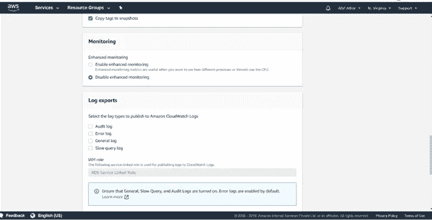
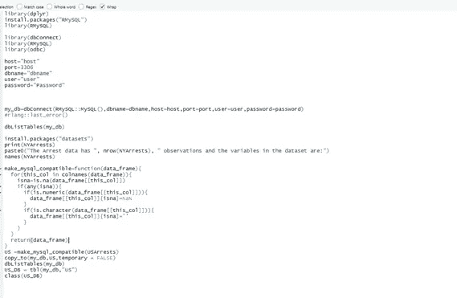

# 用 R 连接 AMAZON 关系数据库

> 原文：<https://medium.com/analytics-vidhya/connecting-amazon-relational-database-with-r-d9b800e5efb0?source=collection_archive---------5----------------------->


托拜厄斯·菲舍尔在 [Unsplash](https://unsplash.com?utm_source=medium&utm_medium=referral) 上的照片

很明显，在过去的十年中，Python 和 R 在任何地方都被广泛地用作工具和开源编程。r 被认为是统计实现的最佳选择，而 Python 则是数据分析和构建生产就绪模型的首选。以本机格式存储数据的最简单方法，但在现实世界的实现中，很少从 CSV 文件中读取数据。它要么来自数据湖，要么从数据库的数据流中获取。

当需要处理和存储大量数据时，云就出现了。凭借可扩展性和容错性的额外优势，使用云基础设施来处理和存储数据非常经济和安全。AWS 是全球广泛采用的云平台。它提供了许多数据分析师/科学家可以使用的服务(sagemaker、AWS 机器学习、Athena、S3)。

虽然这些服务是付费的，但是 AWS 提供了一个免费的使用层，每个人都可以使用——学生、企业家、小企业等等。人们可以免费探索和体验 AWS 服务。

在这个简单的教程中，我们将尝试在运行 MySql 服务器的 Amazon 数据库实例(Amazon RDS)上存储和检索分析所需的数据。

要用 R 或 Python 创建 AWS-RDS 之间的连接，我们首先需要设置关系数据库实例来连接。

Amazon RDS 有各种数据库，如 Amazon Aurora、MySQL、MariaDB、PostgreSQL、Oracle、Microsoft SQL Server。在这篇博客中，我们将用 MySQL 连接 R 和 Python，将数据传输到数据库，查询它并做一些进一步的分析。

在 AMAZON RDS 中启动 MySQL 数据库的步骤:

> 1.【https://aws.amazon.com/console/】**访问创建一个 AWS 账户。**

**2.登录后，点击“服务”并选择“数据库->RDS”**

****

**3.在“选择引擎->选择 MySQL”下，点击选择“创建数据库”。**

****

**4.在底部，就在“下一步”的上方，单击“仅启用符合 RDS 免费使用层条件的选项”复选框，然后单击“下一步”(尽管不是必需的，因为 MySql 属于免费使用层)**

****

**5.在“指定数据库详细信息”下，指定如下所示的详细信息**

****

**6.在实例规范下，选择数据库引擎版本、数据库实例、数据库存储作为给定的 20GB 类(可以增加数据库存储，但必须小心，因为您可能会超出可用限制)**

**7.接下来转到设置，然后定义您的数据库实例标识符，指定您的主用户名并填写您的数据库密码(连接数据库时需要)。**

****

**8.继续配置高级设置，在这里您需要小心指定您的网络和安全配置，数据库名称和端口。**

****

**9.给出您的数据库名称，并将端口指定为 3306**

****

**10.检查高级设置中的默认设置，然后继续**

********

**11.单击以创建数据库。**

****

**12.创建数据库实例后，您将获得**端点**(主机)，也就是说，在与数据库实例建立 R 连接时，我们将需要它。**

**13.与 R 的连接:**

**为此，您需要安装某些库。**

 **库(dplyr)【RMySQL】
库(RMySQL)**

 **库(db connect)【RMySQL】库
库(odbc)**

**host = " END-POINT "
port = 3306
DBNAME = " Your DBNAME "
USER = " USER "
PASSWORD = " PASSWORD "**

**14.要连接 AWS:**

**my_db=dbConnect(RMySQL::MySQL()，dbname=dbname，host=host，port=port，user=user，password=password)**

****

```
dbListTables(my_db)[1] “no table will be shown”Murder Assault UrbanPop RapeAlabama          13.2     236       58 21.2Alaska           10.0     263       48 44.5Arizona           8.1     294       80 31.0Arkansas          8.8     190       50 19.5California        9.0     276       91 40.6Colorado          7.9     204       78 38.7Connecticut       3.3     110       77 11.1Delaware          5.9     238       72 15.8Florida          15.4     335       80 31.9Georgia          17.4     211       60 25.8Hawaii            5.3      46       83 20.2Idaho             2.6     120       54 14.2Illinois         10.4     249       83 24.0Indiana           7.2     113       65 21.0Iowa              2.2      56       57 11.3Kansas            6.0     115       66 18.0Kentucky          9.7     109       52 16.3Louisiana        15.4     249       66 22.2[1] "Murder"   "Assault"  "UrbanPop" "Rape"dbListTables(my_db)[1] "US"  "tab"> US_DB = tbl(my_db,"US")> class(US_DB)[1] "tbl_MySQLConnection" "tbl_dbi"             "tbl_sql"             "tbl_lazy"            "tbl"
```