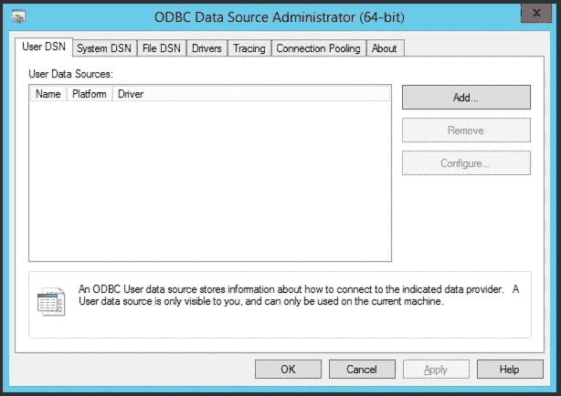
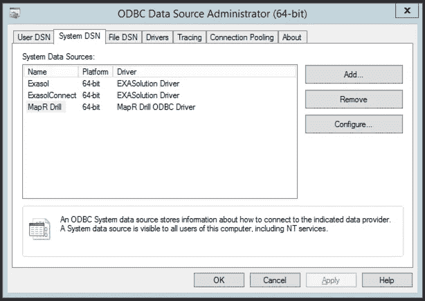
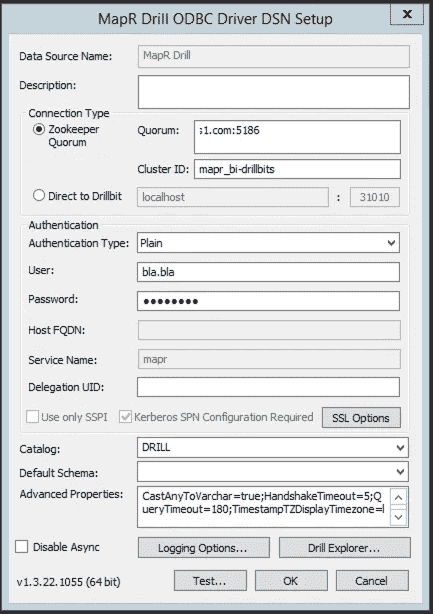

# 在 Mac 和 Windows 上将 Drill 连接到 python

> 原文：<https://medium.com/analytics-vidhya/connecting-drill-to-python-on-mac-windows-aaed59ad9385?source=collection_archive---------5----------------------->


# 介绍

Apache Drill 是一个支持大规模数据集交互分析的软件框架。几个数据库可以连接到 Drill，所有这些数据库都可以通过 python 脚本访问。这篇博客描述了如何使用 ODBC 驱动程序在 Drill 和 python 之间建立连接。

## 步骤 1:下载和安装

从提供的链接下载并安装最新的 ODBC 驱动程序→[http://package.mapr.com/tools/MapR-ODBC/MapR_Drill/](http://package.mapr.com/tools/MapR-ODBC/MapR_Drill/)

当我们从 python 访问 ODBC 连接时，还需要下载和安装一些 python 包。必备包是 pyodbc。要安装这些软件包，请在终端上使用以下命令

> pip 安装 pyodbc

## **第二步:ODBC 的配置**

一旦安装了所有必需的包，就需要配置 ODBC 驱动程序。对于 mac 和 windows，ODBC 驱动程序的配置有所不同。虽然交互式 GUI 可用于 windows，但在 mac 上，odbc.ini 文件需要手动配置。无论使用哪种操作系统，下面都给出了设置说明。

**在窗户上**

在 windows 系统的情况下，可以下载 ODBC 管理器，用于 GUI 附带的配置。它简化了这个过程，但是仍然有一些细节需要注意。

安装后，ODBC 数据源管理器如下所示:



ODBC 管理器

要连接到特定数据库，请在上面的选项卡中选择系统 DSN，并找到 MapR Drill 数据源，如果还不可用，则通过提供驱动程序详细信息来添加它。要配置设置，请选择配置选项。



添加连接

DSN 设置窗口如下所示，当连接到现有的 MapR 数据库时，选择连接类型为 Zookeeper，并提供 Quorum 和 Cluster_id 的详细信息。当使用 LDAP 用户 id 时，选择身份验证类型为 plain，这提供了输入用户和密码的选项。现在测试连接，如果一切正常，你就成功了。



配置和测试连接

**在 Mac 上**

应该在 Mac 上手动更改文件系统以进行配置。在我们连接到 Mac OS X 上的 ODBC 客户端工具 Drill through 之前，驱动程序安装程序在**/Library/mapr/Drill/Setup**中有以下配置文件。将下面提到的文件复制到您的主目录中，除非这些文件已经存在于您的主目录中(有时这些文件已经在安装过程中复制到主目录中):

*   mapr.drillodbc.ini
*   odbc.ini
*   odbcinst.ini

不需要对位置/Library/mapr/drill/Setup 中的 ini 文件进行任何更改。对主目录中的隐藏 ini 文件进行了以下所有更改。

在你的**主目录**中，将文件重命名为**隐藏文件**。如有必要，使用 sudo:

*   . mapr.drillodbc.ini
*   . odbc.ini
*   . odbcinst.ini

注意，在用户主文件夹中应该有三个隐藏的配置文件(ini 文件)。以下应该是. odbc.ini 中带有各自用户名和密码的文件的内容，其余内容应该保持原样，不做任何更改。

1.  . mapr.drillodbc.ini →

```
## - Note that this default DriverManagerEncoding of UTF-32 is for iODBC.
## DriverManagerEncoding=UTF-32
DisableAsync=0
ErrorMessagesPath=/Library/mapr/drill/lib
LogLevel=0
LogPath=
SwapFilePath=/tmp
```

2.. odbcinst.ini →

```
MapR Drill ODBC Driver=Installed[MapR Drill ODBC Driver]
Description=MapR Drill ODBC Driver
Driver=/Library/mapr/drill/lib/libdrillodbc_sbu.dylib 
```

3.. odbc.ini →不要忘记更改连接字符串、集群 id、用户名和密码⚠️

```
Trace=no[ODBC Data Sources]
MapR Drill=MapR Drill ODBC Driver[MapR Drill]# Description: DSN Description.
# This key is not necessary and is only to give a description of the data source.
Description=MapR Drill ODBC Driver# Driver: The location where the ODBC driver is installed to.
Driver=/Library/mapr/drill/lib/libdrillodbc_sbu.dylib# The DriverUnicodeEncoding setting is only used for MapRDM
# When set to 1, MapRDM runs in UTF-16 mode.
# When set to 2, MapRDM runs in UTF-8 mode.
#DriverUnicodeEncoding=2# Values for ConnectionType, AdvancedProperties, Catalog, Schema should be set here.
# If ConnectionType is Direct, include Host and Port. If ConnectionType is ZooKeeper, include ZKQuorum and ZKClusterID
# They can also be specified on the connection string.
# AuthenticationType: No authentication; Username; Plain; Kerberos; MapRSASL;
ConnectionType=ZooKeeper
HOST=
PORT=
**ZKQuorum= <Your connection string>
ZKClusterID= <ClusterID>**
AuthenticationType=Basic Authentication
**UID=<user_name>
PWD=<ur_password_goes_here>**
DelegationUID=
KrbServiceName=mapr
KrbServiceHost=
krbSpnConfigurationsRequired=1
AdvancedProperties=CastAnyToVarchar=true;HandshakeTimeout=5;QueryTimeout=180;ExcludedSchemas=sys,INFORMATION_SCHEMA;TimestampTZDisplayTimezone=utc;NumberOfPrefetchBuffers=5;
Catalog=DRILL
Schema=
SSL=0
DisableHostVerification=0
DisableCertificateVerification=0
TrustedCerts=/Library/mapr/drill/lib/cacerts.pem
UseSystemTrustStore=0
# The key, "UseExactTLSProtocolVersion", toggles between "Min_TLS" or "TLSProtocol".
# UseExactTLSProtocolVersion=1 indicates that the driver should use the exact TLS Protocol version to communicate with the drillbit.
# UseExactTLSProtocolVersion=0 indicates that the driver should use the minimum TLS Protocol version to communicate with the drillbit.
UseExactTLSProtocolVersion=0
Min_TLS=
TLSProtocol=
```

**第三步:测试连接**

复制粘贴以下函数连接到数据库，并以 python dataframe 的形式返回提取的数据。

函数 connect_drill 接受要执行的查询作为输入，并返回一个 dataframe，其中包含最终提取的数据。

```
# with Drill
**# Note that the query should NOT have ; at the end**def connect_drill(query):
    import pyodbc # initialize the connection
    conn = pyodbc.connect("DSN=MapR Drill", autocommit=True)
    cursor = conn.cursor()

    # fetch and display filtered output with column names
    cursor.execute(query)
    c = (cursor.fetchall())
    for x in range(len(c)):
        c[x] = list(c[x])return (pd.DataFrame(c, columns = [column[0] for column in cursor.description]))
```

下面显示了一个查询示例，该查询提取的数据结果现在可以作为 pandas 数据帧使用。

```
*# Sample table extraction*
query =  """ SELECT week, 
                app,
                SUM(num_opens) AS opens,
                SUM(num_clicks) AS clicks
          FROM members.activity
          GROUP BY week,app"""

sample_table =  connect_drill(query)
sample_table.head()
```

# **结论**

通过以上设置，在本地系统上，可以直接在 jupyter 笔记本上提取数据，或者通过任何形式的 python/R 脚本和 python 中可用的库来提取数据，这提供了数据操作的无限可能性。几个数据科学模型可以直接应用于容易提取的数据。