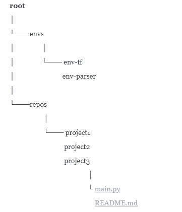

# 通过 pyCharm 在远程服务器上编码

> 原文：<https://medium.com/analytics-vidhya/connecting-remote-server-via-pycharm-53414d0da93f?source=collection_archive---------1----------------------->

约翰·穆切特在 [Unsplash](https://unsplash.com/s/photos/barcelona?utm_source=unsplash&utm_medium=referral&utm_content=creditCopyText) 上拍摄的照片

作为数据爱好者，我们经常需要在远程服务器上运行代码，因为我们需要计算能力和足够的内存。据我所知，人们在远程服务器上用来编码的最流行的工具是 Jupyter lab 和 notebook。虽然 Jupyter 很令人满意，但 pyCharm professional 也有它的优点。
以下是 pyCharm Professional 的一些方面促使我写这篇文章。

*   不用说，我喜欢 JetBrains 的产品，多年来我对他们非常熟悉。
*   PyCharm 不仅仅是一个笔记本，它还提供了一个完整的 IDE，其中包含了使编码更容易、更舒适的工具。
*   如果你正在开发一个实际的项目，而不仅仅是做一些分析，你必须马上测试你的代码，为此调试工具是至关重要的。虽然 Jupyter 接受调试机制，如 PDB，但在 PyCharm 中调试感觉更可靠。
*   我刚才提到的所有工具也出现在 pyCharm 社区中，但是 pyCharm Professional 的特别之处在于它支持 Jupyter 笔记本。
*   通过 Jupyter 的远程连接不会在您的本地机器上留下任何物理线索，这意味着，如果服务器出现故障，您可能会丢失您的数据和代码，如果您没有备份它们的话。尽管如此，pyCharm Professional 可以将远程目录与本地机器上的目录同步。所以你不必担心服务器运行不良。

凯西·霍纳在 [Unsplash](https://unsplash.com/s/photos/train?utm_source=unsplash&utm_medium=referral&utm_content=creditCopyText) 上的照片

如果你注意到了，我们继续吧。

# 设置 PyCharm 连接的方法

*   打开 PyCharm **文件** > **设置** > **构建、执行、部署**
*   在右侧选项卡中，选择 ***部署***
*   点击最左侧出现的 **+** 。
*   我们现在定义一个新的连接，一个 SFTP 连接应该可以，所以选择 ***SFTP***
*   输入**主机**信息，这是远程机器的 IP 地址，如 xx.xx.xx.xx
*   将端口加注为 22
*   输入用户名，是*ssh***用户名** *@xx.xx.xx.xx* (当你尝试通过终端连接时记住这个命令)
*   如果使用密码访问服务器，选择 ***认证*** 作为 ***密码*** 。在密码部分输入您的 ***密码*** 。
*   如果您使用 PEM 访问，请选择适当的选项并映射您的 PEM 路径。
*   现在*测试连接*，如果成功，就可以开始了。
*   现在我们将指定根路径，这里有一些根映射的提示:

在这个阶段要小心，因为我们构建的所有映射都将建立在 root 之上。这是至关重要的，因为 pyCharm 是关于同步 ***右*** *文件夹的。*

*>如果你的解释器驻留在项目之外的一个文件夹中(这是正确的方法)，你可能想把这个文件夹，也就是* ***父*** *映射到你的项目和解释器。下面是一个带有实际项目结构的样例根。*

*   所以映射适合自己的根路径。
*   将 **web 服务器**的网址填写为 [http://xx.xx.xx](http://xx.xx.xx/)

## 设置映射

不要关闭最近的窗口，我们将继续操作。

*   打开下一个选项卡**映射**
*   填充部署路径。部署路径是 remote 中项目的根文件夹，它是上面项目根的相对路径。
*   本地路径是绝对路径，它是本地计算机中的目录，这是您将与远程路径同步的位置。
*   我们将增加一个映射，它是解释器。我们将把本地解释器的路径映射到远程。我个人的建议是每次都用 virtualenvs。关于 virtuelanvs 的更多信息，你可以阅读我的博客文章。所以你唯一要做的就是将本地路径(`C:\\Users\imauser\someplace\envs|env-of-the-project`)映射到远程解释器(`\envs\env-of-the-project-on-remote`)。回想一下，本地路径是绝对路径，远程路径是相对路径。

> *映射解释器将使包管理变得更加容易，
> 因此您不必通过 ssh 连接服务器并在那里安装包，您可以简单地使用 pyCharm 的包管理接口来这样做。*

# 你在皮查姆之后的生活

*   因此，现在您可以轻松地在 remote 上使用 pyCharm，就像在本地机器上编码一样。
*   每次您在文件中进行更改并保存(Ctrl+s)时，pyCharm 会自动将您的本地更改上传到遥控器。
*   如果您认为自动上传功能不正常，您可以使用**工具** > **部署**部分中的 ***部署*** 实用程序。
*   如果你想在 remote 上看看你的项目里面有什么，你可以使用**工具** > **部署** > **浏览 Remote Hos** t，就像一个文件浏览器一样舒适。
*   此外，您可以通过在左侧的 ***项目浏览器*** 和右侧的 ***浏览远程主机工具箱*** 之间拖动文件来下载/上传文件。

这很容易。

# 如何通过 pyCharm 远程运行 Jupyter 笔记本

这个标题对我来说是梦想成真。如果你正在进行一次性分析，并且你急着处理数据，笔记本是很好的选择。它们也非常适合为你的项目制作原型。对于前面提到的所有东西，Jupyter 接受你混乱的代码，并且不会批评它所有的逻辑错误、打字错误等等。但是当涉及到基于你的原型从零开始实现一个项目时，事情可能会变得很糟糕，事实证明 pyCharm 责备你的方式毕竟是必需的。Jupyter lab 和 notebook 都没有为您提供 pyCharm 能够呈现和编辑的指导。用他们的 py 文件真的很尴尬。从 web 浏览器复制+粘贴到 pyCharm 会让人不舒服，而且 Jupyter 不允许您在依赖项之间跳转，这使您无法高效地构建项目。虽然我觉得我雄心勃勃地试图说服你使用 pyCharm，但我相信那些遭受同样问题的人会有同感。

那么，让我们把手弄脏吧。

# 通过 pyCharm 运行 Jupyter 笔记本的方法

最初的几个步骤将与您尝试使用 Jupyter 进行远程连接时完全相同。

*   连接到远程服务器，如果给你用户名、密码和 IP 地址，你可以使用 ssh。
*   `$ ssh username@xx.xx.xx.xx`
*   激活你的虚拟环境。对于 python-virtualenv，您可以使用:
*   `$ source ~/envs/env-myenv/bin/activate`
*   有关环境的更多信息，请参考我的[博客文章](/@pinareceaktan/what-is-this-virtual-environments-in-python-and-why-anyone-ever-needs-them-7e3e682f9d2)。
*   Cd 放入项目的工作目录。
*   `$ cd ~/repos/my_project`
*   启用 jupyter 连接
*   `$ jupyter lab --no-browser --port=8890`

您可以使用任何有效的端口。我就是喜欢 8890。

*   建立连接后，复制连接令牌和 URL。类似于下面的例子:
    `http://127.0.0.1:8890/?token=lalalalalalallalalalalallalalalalalallalalalalal`
*   打开一个额外的终端窗口，从您的本地机器只需输入
*   `$ ssh -N -f -L localhost:8888:localhost:8890 username@xx.xx.xx.xx`
*   打开 pyCharm 并创建一个。ipynb 文件或只是打开一个现有的。
*   从 ipynb 文件的顶部标签打开`Configure Jupyter Server`。
*   我们现在将创建一个已配置的服务器，因为远程服务器是已配置的服务器，而本地服务器是被管理的服务器。

> 为了在 pyCharm-Jupyter 工具中使用本地解释器，您可以使用托管服务器并选择您的本地解释器。
> 但是请注意，使用本地解释器并不能提供速度或者
> 无论你首先使用远程机器
> 的原因是什么。

*   用刚刚复制的令牌路径填充`configured server`。但是这次写下远程机器的 IP，而不是 127.0.0.1。正如:
    `http://xx.xx.xx.xx:8890/?token=lalalalalalallalalalalallalalalalalallalalalalal`
*   点击**应用**并退出。
*   现在，单击 blob 图标启动服务器。

> pyCharm-Jupyter 中的大多数快捷方式与 Jupyter 笔记本中的相同。
> 例如，为了运行一个单元格你可以使用(shift+enter)。
> 
> 关于快捷方式的更多信息，请使用工具箱或访问 pyCharm 官方文档。