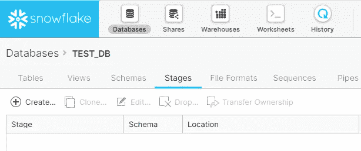
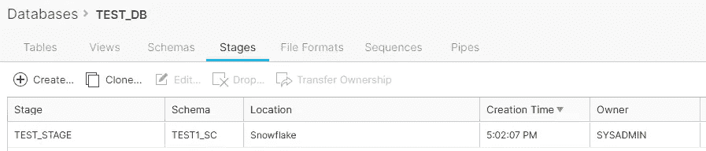

# 使用 Python 和 Java 连接到雪花——第一部分

> 原文：<https://medium.com/analytics-vidhya/connecting-to-snowflake-using-python-and-java-part-i-a6a20dc2771d?source=collection_archive---------12----------------------->

在第一部分中，我们将看到如何使用 Python 连接到雪花。在继续讨论使用编程语言连接到雪花的技术细节之前，让我们先谈一谈雪花。

雪花数据仓库建立在 AWS 之上。雪花中的底层文件系统由 AWS S3 提供支持，其中所有数据都经过加密、压缩和分发，以优化性能。重要的一点是，使用雪花，计算和存储完全分离，存储成本与在 S3 上存储数据相同(每 TB 23 美元)。它提供即时缩放。此外，当在雪花中创建表时，我们不必担心索引，因为索引在雪花中不存在，雪花会完美地处理性能问题。但是，我们可以创建群集来提高 I/O 的性能。

你可以在这里浏览雪花的基础知识和雪花提供的各种选项[。我们可以直接使用雪花 URL，也可以将 SnowSQL 下载到设备上使用。当我们有工具可以使用时，为什么我们必须通过编程来工作？嗯，软件行业变化很快，许多人喜欢尽可能地自动化任务，只要有自动化的空间，就需要避免人工干预。](https://viswan29.medium.com/intro-to-snowflake-data-warehouse-aa887abaf1ed)

从 Python 和 Java 连接到雪花非常容易，我们可以执行不同的命令— DML、DDL 操作。我们将首先演练 python 代码。

1.  为了连接到数据库，我们需要一个包来连接和执行不同的活动，所以我们有一个包“ **snowflake.connector** 来连接 snowflake，可以使用“pip install snowflake.connector”来安装它，然后我们将导入这个包。

导入雪花.连接器

*提示*:如果你在生产环境中工作，有时由于防火墙的限制或其他原因，你不允许连接到 pip。在这种情况下，您需要找到由您的组织提供的存储库，您可以在其中找到软件包。gzip 或者。whl 文件格式(用于 python)。对于需要首先安装的 snowflake.connector，还有其他依赖包。如果您的组织允许您连接到 pip，每个依赖包将会自动安装。

2.一旦安装了软件包，我们将需要以下详细信息来连接到雪花:帐户，密码，用户，仓库，数据库，模式和角色。一旦你有了所有的细节，我们将连接到雪花如下:

snow flake _ conn = snow flake . connector . connect(
account = ' br 37723 . us-central 1 . GCP '，
password = ' * * * * * * '，
user = 'viswan29 '，
warehouse = 'COMPUTE_WH '，
role = 'SYSADMIN'
)

接下来，我们将定义一个光标

雪花 _ 光标=雪花 _ 连接.光标()

3.现在让我们执行一些 DDL(数据定义语言)语句

#创建新数据库

snow flake _ cursor . execute(" CREATE DATABASE IF NOT EXISTS TEST _ DB ")-此执行语句创建一个数据库

#为数据库创建新模式

为了创建一个新的模式，我们需要指定使用哪个数据库，我们需要执行

snow flake _ cursor . execute(" USE TEST _ DB ")，然后执行
snow flake _ cursor . execute(" CREATE SCHEMA IF NOT EXISTS TEST1 _ SC ")

#在数据库和模式中创建新表

' CREATE TABLE IF NOT EXISTS TEST(" NAME " STRING，" EMAIL" STRING，" PHONE " VARCHAR(10))；')

这只是基本语法，我们还可以指定许多其他选项，如“分类依据”、“分段文件格式”、“数据保留时间(天)”等。参考官方雪花[链接](https://docs.snowflake.com/en/sql-reference/sql/create-table.html)来创建不同的选项。

现在，让我们看看 DML(数据操作语言)查询

#向创建的表中插入数据

snow flake _ cursor . execute(" INSERT INTO TEST VALUES(' Viswanath '，' viswanath.thatha@gmail.com '，' 7842768496 ')；")

#将数据更新到创建的表中

snow flake _ cursor . execute(" UPDATE TEST SET NAME = ' Viswa ' WHERE EMAIL = ' Viswa Nath . that ha @ Gmail . com '；")

#删除数据

snow flake _ cursor . execute(" DELETE FROM TEST WHERE EMAIL = ' viswanath . that ha @ Gmail . com '；")

***完整剧本***

导入雪花.连接器

雪花 _conn =雪花.连接器.连接(

account = ' br 37723 . us-central 1 . GCP '，
密码= 'Adgjmptw@270 '，
用户= 'viswan29 '，
仓库= 'COMPUTE_WH '，
角色= 'SYSADMIN'
)

雪花 _ 光标=雪花 _ 连接.光标()

'雪花 _ cursor . execute(" CREATE DATABASE IF NOT EXISTS TEST _ DB ")
雪花 _ cursor . execute(" USE TEST _ DB ")
雪花 _ cursor . execute(" CREATE SCHEMA IF NOT EXISTS TEST1 _ SC ")
雪花 _ cursor . execute(" USE SCHEMA TEST1 _ SC ")
雪花 _ cursor . execute(" CREATE TABLE IF NOT EXISTS TEST(" NAME " STRING，" EMAIL" STRING，" PHONE " VARCHAR(10))；')

snow flake _ cursor . execute(" INSERT INTO TEST VALUES(' Viswanath '，' viswanath.thatha@gmail.com '，' 7842768496 ')；")
snow flake _ cursor . execute(" UPDATE TEST SET NAME = ' Viswa ' WHERE EMAIL = ' Viswa Nath . that ha @ Gmail . com '；")
snow flake _ cursor . execute(" DELETE FROM TEST WHERE EMAIL = ' viswanath . that ha @ Gmail . com '；")

**提示:**如果您在有防火墙问题的环境中工作，或者如果您必须连接到代理，那么您需要在 snowflake.connector.connect 中指定几个其他字段，如 proxy_host、proxy_port、proxy_password、proxy_user。那么代码将变为:

雪花 _conn =雪花.连接器.连接(

account = ' br 37723 . us-central 1 . GCP '，
password = 'Adgjmptw@270 '，
user = 'viswan29 '，
warehouse = 'COMPUTE_WH '，
role = 'SYSADMIN '，
proxy_host = 'XXXXX '，
proxy_port = 80，
proxy_user = 'XXXXX '，
proxy_password = '***** '，

其他代码将保持原样。这里我们指定由网络团队提供的代理信息。

这些是我们在连接到任何数据库时都会遇到的基本 DDL 和 DML 语句。除此之外，雪花通过创建阶段提供了其他装载和卸载选项。我们可以创建用户阶段和表阶段，以便在表中加载和卸载数据。

数据库下的表格阶段见下。我们可以创建阶段，加载数据(csv，xlsx，json 等。)到阶段，然后将数据从阶段加载到表中。

要创建文件类型为“csv”的表阶段，请运行以下语句:

snow flake _ cursor . execute(" CREATE OR REPLACE STAGE TEST _ STAGE file _ format =(type = ' CSV ' field _ delimiter = '，')")

名为 TEST_STAGE 的新阶段已创建。下一步是将数据加载到舞台。要查看呈现的阶段列表，我们可以执行“list @~”。

为了将 csv 文件加载到 stage，我们需要使用类似 snowflake_cursor.execute 的 PUT 命令(" put file:///file_loc/files*。csv @测试阶段”)

要将数据从 stage 加载到表中，stage 环境中的数据应该与表中的数据具有相同的格式。如果是，我们将使用 COPY INTO like snow flake _ cursor . execute(" COPY INTO TEST from @ TEST _ STAGE ")

这就是我们如何使用工作台的。但是，如果您正在处理一些项目，您将无权创建表格阶段。因此，在这种情况下，我们必须使用用户阶段，而不是表阶段。

表阶段和用户阶段的一个区别是，每次将数据加载到阶段时，不需要删除表阶段，但需要删除用户阶段。

对于用户阶段，首先删除现有的用户阶段(如果有):

snow flake _ cursor . execute(" remove @ ~/staged ")—这是用于将数据加载到用户阶段 snow flake _ cursor . execute(" put file:///file _ loc/files *)的用户阶段
。csv @~/staged")
用于将数据从 stage 加载到表 snow flake _ cursor . execute(" COPY INTO TEST from @ ~/staged ")

完成向表的加载后，删除用户阶段。我们可以一次从多个 csv 文件加载数据。如果每个 csv 文件的文件格式不同，我们可以使用 pandas 库将文件连接成一个数据帧，然后将数据帧复制到一个 csv 文件，该文件可用于将数据复制到表中。

我们关于如何用 python 连接雪花的教程到此结束。

嗯，如果你对更详细的工作感兴趣，比如构建 GUI 将数据从 table stage 加载到 snowflake table，请查看我的 GitHub 库[链接](https://github.com/viswan29/Tkinter_Snowflake-load)。在这里，我使用 Python Tkinter 库创建了一个 GUI 来进行身份验证，创建 stage(如果不存在)，将多个 csv 文件加载到 stage，选择适当的表，最后将数据加载到雪花表。

如果你对这个话题有任何问题或者有兴趣了解更多关于雪花的信息，请随时发表评论。