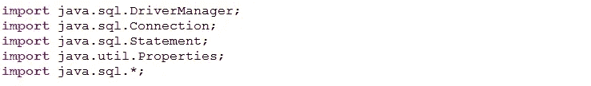
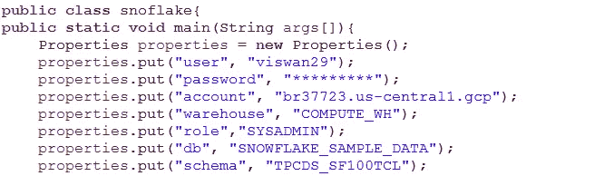
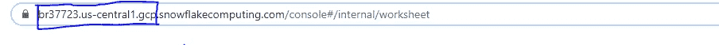
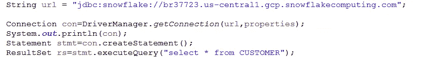

# 使用 Python 和 Java 连接到雪花——第二部分

> 原文：<https://medium.com/analytics-vidhya/connecting-to-snowflake-using-python-and-java-part-ii-e4c8bcb1c84c?source=collection_archive---------4----------------------->

# 用 Java 连接到雪花

有不同的方式可以通过编程连接到雪花数据仓库。我们已经在[第一部分](/analytics-vidhya/connecting-to-snowflake-using-python-and-java-part-i-a6a20dc2771d)中看到了如何使用 Python 和不同的功能连接到雪花数据仓库，在中看到了雪花的基础知识[。](/analytics-vidhya/intro-to-snowflake-data-warehouse-aa887abaf1ed)

现在我们将看到如何使用 Java 连接到雪花。为了使用 Java 连接到雪花，我们需要雪花 JDBC 驱动程序。我用过“**雪花-jdbc-3.10.2.jar** ”，可以从官方文档页面下载。

我们将首先导入所需的库

接下来，我们将声明“snoflake”类，这是一个表示一组持久属性的 properties 类。属性可以保存到流中，也可以从流中加载。基本上是为了维护键值对。下面是相同的代码:

这里，我们将创建一个键-值对，用于连接雪花。用户名和密码是连接到雪花的凭证。您可以从如下所示的 URL 获取帐户(https://和 snowflakecomputing.com 之间的部分被视为帐户):

同样，登录雪花，你会找到仓库和角色。这里和第一部分一样，我没有创建数据库和模式，我只是使用了雪花默认提供的数据库和模式。在 DB/ Schema 下，我们会发现许多公共表。

接下来，我们将使用 DriverManager.getConnection 连接到雪花

使用 JDBC 驱动程序连接到雪花需要如上所示的连接字符串，其格式如下

" JDBC:snow flake://<account_name>. snowflake computing . com "</account_name>

接下来，在 DriverManager.getConnection 下，我们将指定 JDBC 驱动程序和属性，以使用定义的参数连接到雪花。接下来，我们将创建语句，接下来我们将对“CUSTOMER”表执行查询，该表是分别为数据库和模式 SNOWFLAKE_SAMPLE_DATA 和 TPCDS_SF100TCL 提供的公共表。

这只是一个关于如何使用 Java 连接到雪花的简单教程。