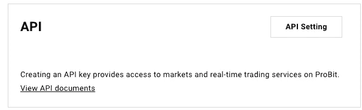
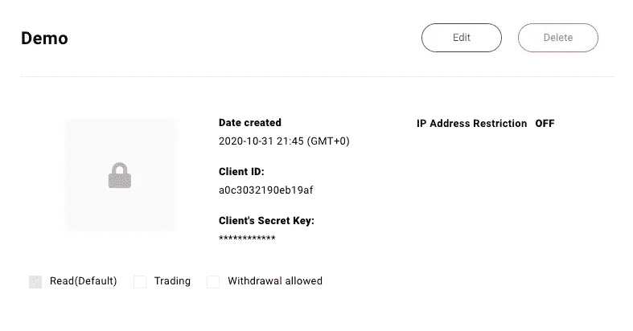

# 使用 Python 连接到 Probit API 入门

> 原文：<https://medium.com/analytics-vidhya/connecting-to-the-probit-api-with-python-getting-started-4bd18740a595?source=collection_archive---------16----------------------->


币安、比特币基地、比特墨西哥……他们都很棒，但有时他们做不到。Crypto 经常奖励那些早期进入的人，Probit 在提供对一些利基令牌和有趣项目的访问方面做得很好。然而，与更流行的交换相比，他们的 API 可能有点棘手，尤其是对初学者而言。不过不要担心，你要找的人已经来了！

在本教程中，我将教你如何用 python 获取 API 密钥并链接到你的账户。我想任何读到这篇文章的人都已经有了一个 Probit 账户。如果没有，可以在这里注册[。](https://www.probit.com/en-us/)

一旦你创建了你的账户，你需要提供一些身份验证信息，这很简单，超出了本指南的范围。

转到“我的页面”:


“我的页面”在最右边。

接下来，转到“API”部分，进入“API 设置”。



现在，让我们创建我们的第一个 API。选择一个名称，然后单击“创建新密钥”。


这一点很重要，您现在应该已经意识到 Probit 非常重视安全性，并且有许多重复的身份验证。您将看到您的“客户 ID ”,它实际上是您的公钥和私钥，在您第一次查看后会被隐藏，所以请将它保存在安全的地方。从“编辑”按钮，您可以更改交易权限，提取资金，知识产权限制等。



您应该将这些键保存为环境变量。这超出了本指南的范围，但是[如果你想学习如何使用这些，这里有](https://www.youtube.com/watch?v=5iWhQWVXosU)一个很好的教程。现在您需要知道的是，在我们的例子中，密钥是作为 PKEY 和 SKEY 导入的。

现在让我们进入一些 python。不幸的是，Probit 指南只为 Javascript 提供了明确的指导。您还需要生成一个不记名令牌，以便发出请求，这与其他不需要这一点的 exchange API 略有不同。

首先，我们需要生成我们的誓言密钥。您可以复制并粘贴下面的代码，只需将您的客户端 ID 替换为 PKEY 所在的位置，将您的密钥替换为 SKEY 所在的位置(不要将这些作为原始字符串输入是一个好习惯，您应该明确使用环境变量)。

这个脚本将打印一个带有我们的访问令牌的响应，以便我们可以读取我们的帐户信息。

```
import requests
import PKEY,SKEY
import base64 
import json def oath_key(): token_url = "[https://accounts.probit.com/token](https://accounts.probit.com/token)"
    data_string = PKEY + ":" + SKEY data_bytes = data_string.encode("utf-8")
    keyz = base64.b64encode(data_bytes)
    base64_string = keyz.decode("utf-8") payload = {"grant_type": "client_credentials"}
    headers = {
        "authorization": "Basic " + base64_string,
        "content-type": "application/json"
    } res = requests.request("POST", token_url, json=payload,     headers=headers)
    data = res.json() json_str = json.dumps(data)
    resp = json.loads(json_str)
    print(resp)
```

现在让我们访问我们的帐户信息并检查我们的余额。首先，我们将脚本指向 API url。接下来，我们需要用我们生成的访问令牌为我们的请求定义我们的头。

我们使用请求库发出“GET”请求，包括 URL 和 headers 变量。我还添加了一点 for 循环来创建两个帐户数据列表，这只是为了演示，但实际上并不需要这样做。恭喜你。您现在已经访问了您的 API！

```
c_list = []
amt_list = []
def account_balance():
        url = "[https://api.probit.com/api/exchange/v1/balance](https://api.probit.com/api/exchange/v1/balance)" headers = {"authorization": "Bearer " +  resp['access_token']} response = requests.request("GET", url, headers=headers)
        coins = response.json()
        coins_json_str = json.dumps(coins)
        coins_resp = json.loads(coins_json_str) for li in coins_resp['data']:
            if float(li['total']) > 1:
                c_list.append(li['currency_id'])
                amt_list.append(li['total']) return li['currency_id'],li['total']
```

不言而喻，访问您的帐户余额并不是最令人兴奋的事情，但是您现在可以做 Probit API 允许您做的任何事情。你可以在这里找到更多[。玩得开心，记住风险管理是关键！](https://docs-en.probit.com/reference#marketdata)