# SQL 和 Python 中的消费者数据分析

> 原文：<https://medium.com/analytics-vidhya/consumer-data-analysis-using-sql-python-2a11beb5446b?source=collection_archive---------5----------------------->

在本帖中，我们将讨论一个**电子商务应用**的业务指标以及他们的 SQL 和 Python 解决方案。

请随时提供反馈，并回复你们作为业务 KPI 一部分跟踪的任何其他指标。

我们开始吧

**注意** :-在这篇文章中，我们将关注市场买方的衡量标准。

**认知/获得**

(关键指标—**#整体应用下载量**、**#跨细分市场的应用下载量**(设备、营销渠道、平台、电子邮件)**#成功注册量**、**#用户到达主页/登录页面前的跳出率**、**#退出率**(#完全退出应用且从未注册的用户数) **LTV** (终身价值)/ **CAC** (成本)

***问题 1:-找出 2019 年获得的整体新用户以及前 5 个月的增长率？***

让我们假设用户表包含以下列:

**客户 id，姓名，登录日期，设备登录**

**在 SQL 数据库中加载数据:-**

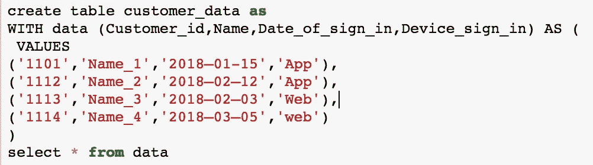

**SQL 解决方案**

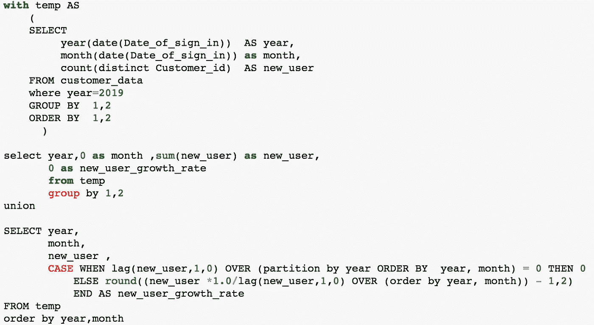

在上面的查询中，我们首先找出我们每个月搭载的不同新用户，并将这些表与新用户总数和增长率结合起来。

**Python 解决方案**

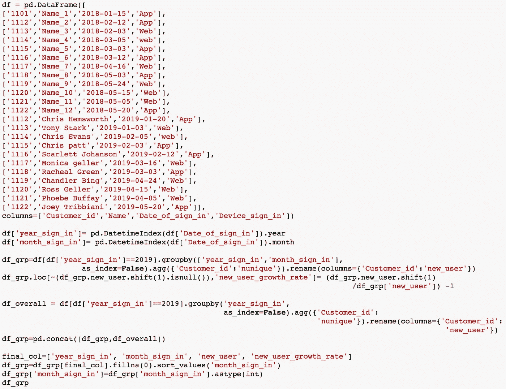

在上面的代码中，我们将数据初始化并加载到 dataframe 中，汇总以找到总体和月度增长率数字，最后将它们组合起来。

**注** :- month_sign_in = 0 指 2019 年整体新用户获取量

**输出**

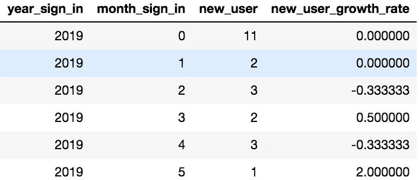

***问题 2:——计算新用户获取的平均 YOY 增长率***

有两种方法可以计算平均值-

1.  平均每月增长率(风险—对异常值/每月波动敏感)
2.  合计每年的新用户总数，然后计算增长率(风险-无法捕捉周期性波动的相关性)

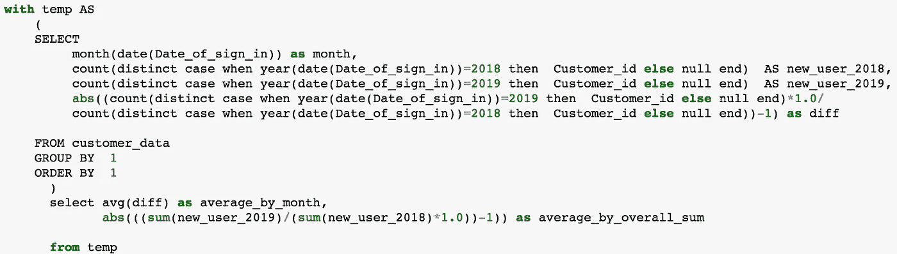

**Python 解决方案**

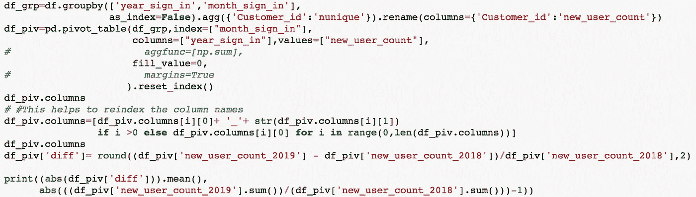

**在上面的 python 代码**中需要注意的关键点:——如何透视一个数据帧？如何展平列名索引？

两种方法得出的结果截然不同，因为在某些月份(2019 年 4 月)波动很大。低音量也是造成差异的原因之一。

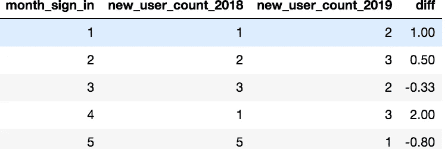

**接合/保持**

(**关键指标** — **、【WAU】、MAU** 、粘性指数( **DAU/MAU** )、**平均花费时间/ DAU** 、**从注册到首次购买的平均时间**、# **订阅率**、# **订单**、$ **平均价值/订单**、**用户购买模式**按**队列**

***问题 3:——找出 X 公司*** 的最投入用户

*首先，我们必须为大多数参与的用户提出一个定义。我们可以考虑 RFM 公制框架:-*

***最近:**——想想那些每天至少登录一次应用的人，或者广为人知的 **DAU** 。为了进一步筛选，我们还可以应用一个阈值来衡量在应用程序中花费的时间或查看/点击的页面数量。为简单起见，我们考虑 DAU。即使每次访问可能不会转化为购买，但那些每天登录的用户比其他用户有更高的意向。*

***频率:** -由于我们的应用程序的目标是激励用户进行交易，我们可以认为参与度最高的用户是那些每周至少订购一件产品的用户。以下是计算频率阈值的定量方法*

1.  *过滤掉在过去几个月中访问过你的应用至少两次的用户。确保时间框架不受季节性影响，如假期、活动、竞争性产品发布。排除任何可能受到前面列出的任何内部/外部因素影响的市场/用户/平台/设备。*
2.  *计算第一次和第二次购买之间的时间*
3.  *绘制每个时差仓中用户的直方图。*
4.  *选择至少 80%的用户至少购买过两次的阈值*

***货币** :-考虑产生最大货币价值的用户。对于这个问题，我考虑过整体购买价值≥50。根据帕累托法则，大约 80%的收入来自 20%的用户。我们可以使用类似于频率的定量方法来得出数据驱动的阈值。*

*满足上述标准的用户被视为**超级用户。***

***SQL 查询:** -*

*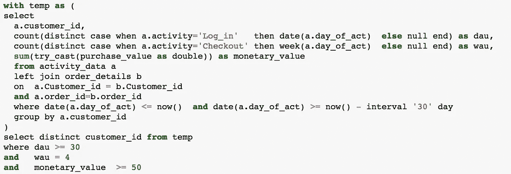*

***Python 解决方案:-***

*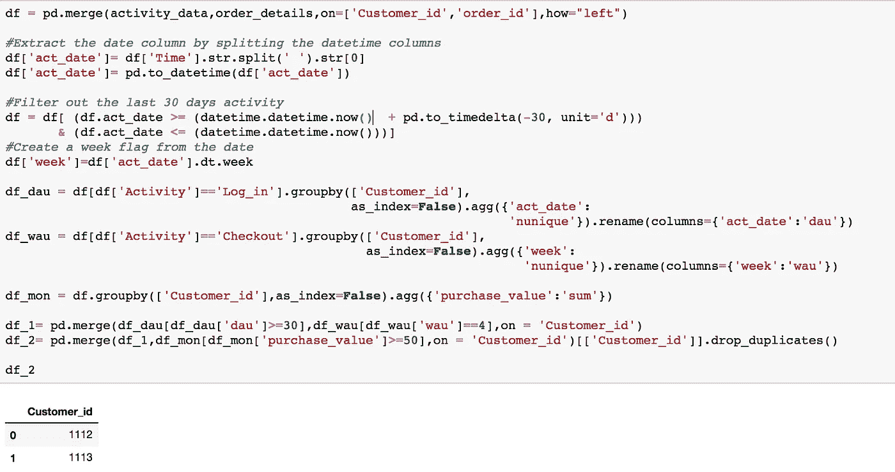*

****问题 4:-评估每个用户在 2019 年 1 月的每日累计购买价值？****

*让我们先来分解一下需求。我们有一个订单历史表，其中存储了每个用户的订单详细信息。我们希望为 2019 年 1 月的每一天生成一个表，其中包含每个用户的累计购买值。*

*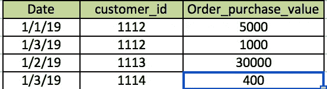*

*为了简单起见，我假设我们的数据库中已经有了下面的表*

1.  ***日历日期表** —存储每年的所有日期*
2.  *2018 年度**累计余额**表*

*SQL 查询-*

*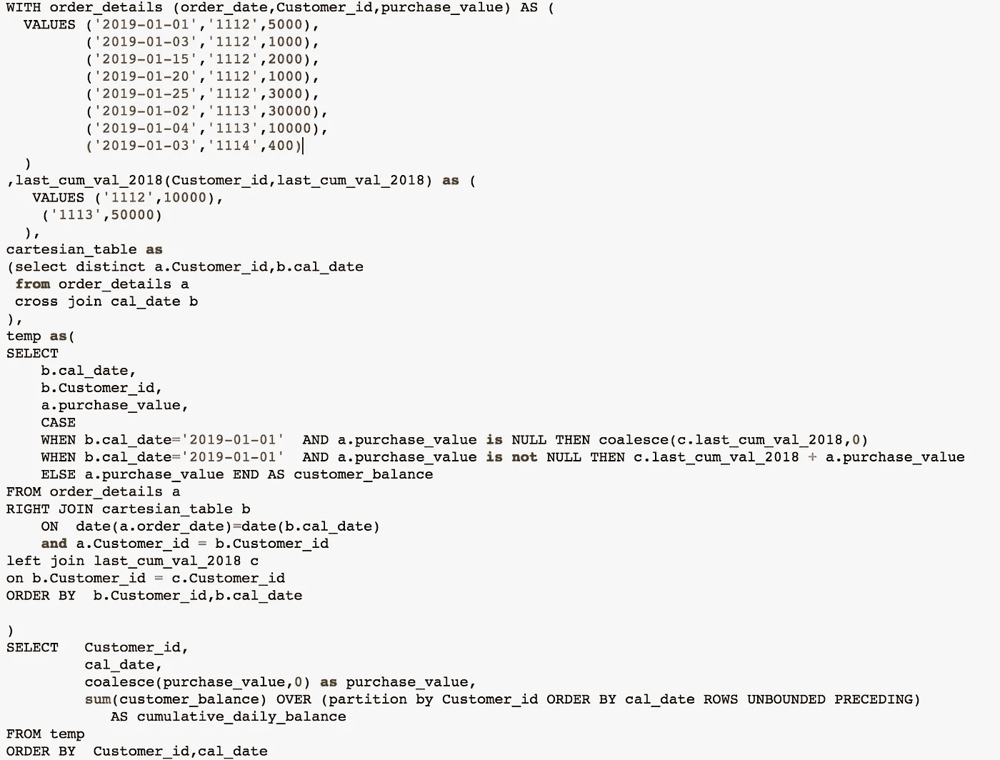*

***对上述查询的解释:-***

***订单 _ 详情:-***

*有 3 个样本用户，其中 1112 在 2019 年 1 月 1 日购买了产品，并且从 2018 年开始有滚动余额。1113 本年度的首次购买是在 2019 年 1 月 4 日，也有 2018 年的滚动余额。1114 是 2019 年获得的新用户，首次购买是在 2019 年 1 月 12 日。*

***笛卡儿 _ 表格:-***

*这个表是在查询中创建的，它是每个用户和日历日期的笛卡尔连接。*

***逻辑** :-*

1.  *如果用户在 2019 年 1 月 1 日进行了购买，则将前一年的余额与第一天的购买量相加*
2.  *如果用户在 2019 年 1 月 1 日没有购买，但有上一年的滚动余额，则填充上一年的余额*
3.  *如果用户在 2019 年 1 月 1 日没有购买，并且没有上一年的滚动余额，请填充 0*
4.  *最后一步是使用无界行的概念计算 cumulative_daily_balance*

***输出** :-我刚刚展示了 2019 年 1 月前 5 天的结果。*

*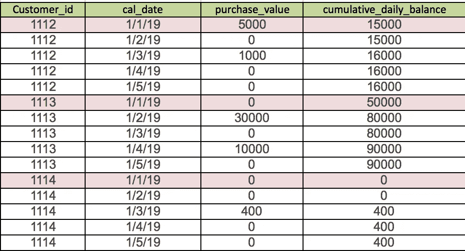*

***Python 解决方案***

*在 python 中使用 **cumsum** ()要容易得多。你自己试试吧。一旦你实现了逻辑的初始步骤，就应该更容易找到累积和。*

****让我知道你对这篇文章的看法。我将创建另一个关于可视化这些指标的帖子。****

*我的 Linkedin 网址:-[https://www.linkedin.com/notifications/](https://www.linkedin.com/in/banani-mohapatra/)*