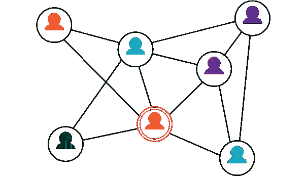
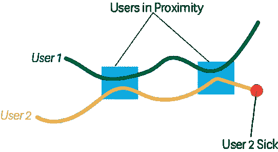
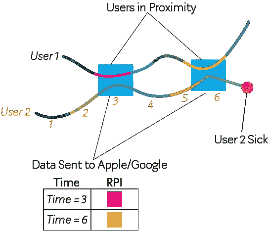

# 使用蓝牙追踪联系人:在获得自由的同时保护隐私

> 原文：<https://medium.com/analytics-vidhya/contact-tracing-using-bluetooth-keeping-privacy-while-gaining-freedom-4261c68571a1?source=collection_archive---------30----------------------->

OVID-19 疫情持续存在并在国家间传播，平衡隐私和跟踪能力的问题变得越来越重要。麻省理工学院的研究人员已经研究了蓝牙联系追踪，谷歌和苹果已经联手发布并创建了一个可实现的蓝牙联系追踪系统。这篇文章将概述蓝牙联系跟踪如何工作，它如何能够维护其用户的隐私和保密性，使用这个系统的好处。

## 为什么要联系寻人？

接触追踪的想法是识别和警告与感染者接触过的人。传统的接触追踪可能包括询问病人“在过去两周内你接触过谁？”但这其中有明显的缺陷。除了家庭成员和一些重要的人，人们会被遗忘，即使他们没有被遗忘，那些和他们接触过的陌生人呢？基于技术的接触追踪使医疗官员能够了解与感染者接触过的所有人。

在韩国，由于政府和 KCDC(韩国疾病控制和预防中心)的努力，新冠肺炎疫情的影响得到了平息和控制，这些努力包括增加检测和各种接触者追踪工作，包括:与手机信号塔、交通信息、信用卡交易和监控录像相关的手机位置追踪。这种级别的个人跟踪需要政府的高度控制和提供信息的意愿，以及政府同意不共享个人数据。

类似于韩国实施的接触者追踪的困难在于将其扩大到更大的国家的能力，以及在个人隐私被过分保护和许多人对政府持怀疑态度的国家。因此，蓝牙联系追踪已经成为明显的领先者，因为它提供了高水平的隐私，并要求个人选择加入该系统。蓝牙联系追踪依赖于蓝牙设备彼此可见的能力。

## 蓝牙设备的背景

在步话机等设备中，设备保持在一个信道上进行通信，因此要相互通话，两个用户必须协调在哪个信道上通话。这也是为什么当你跳上其他人的频道时，你能听到他们的谈话:有干扰。蓝牙设备的工作方式类似，在 2.4 GHz 频段上有 79 个信道，所有设备都可以在此进行通信。当蓝牙设备希望连接到另一个设备时，它在一系列蓝牙信道上通告它的存在。一旦连接到另一个设备，这两个设备使用一种称为 AFH 的通用算法来定义信道跳频序列。信道跳跃用于防止持续干扰，蓝牙设备在信道之间频繁跳跃。这样，两个设备相互干扰的次数被最小化，并且当人们在拥挤的区域中试图与许多也在通信的其他设备连接时不会遇到问题。为了定义这种信道跳变模式，每个蓝牙设备都被赋予一个跟踪密钥，该跟踪密钥是由制造商赋予该设备的唯一标识符，用于创建跳变模式。

## 蓝牙联系人追踪

我先简单描述一下。这不是蓝牙联系追踪的工作方式，但这是理解基础知识的好方法。如果我们假设两个人都有设备，这些设备总是将他们的跟踪密钥传输给彼此，并保存所有观察到的密钥。当一个用户生病时，他将所有保存的密钥的日志上传到一个机构，该机构会找出哪些人与感染者有过接触。图 1 展示了当用户 2 被识别为生病时，可以追溯到用户 1 并将其识别为可能的感染者。

图 1 配对设备的接触追踪

这个系统的缺陷是多而明显的。其中最重要的问题是，两个用户都丧失了他们的隐私，因为通过重复观察来确定用户的身份和他们去过的位置是可能的。例如，所有参加某个事件的人都可以通过他们的持久跟踪密钥来识别，并且稍后在其他位置被识别。

这个问题是可以解决的，这也是苹果和谷歌提出的解决方法。他们将引入随时间变化的标识符，这些标识符将被广播到其他设备，并被其他人用该应用程序记录下来。该识别密钥将包括一个每日 ID 号和一个滚动的邻近识别符，这将允许用户保持他们的隐私，并能够在需要时被识别。每日 ID 号将每 24 小时更改一次，并将从用户的跟踪密钥中获得。同时，每隔十五分钟，128 位滚动邻近标识符将改变，这将使得每部电话在每次改变时对其他电话表现为全新的实体。这样，人们即使在一天内多次互动时也可以保持匿名。在图 2 中，当用户 2 生病时，他可以选择将他的手机应用收集的日志发送到苹果/谷歌。苹果和谷歌将会有一个被感染的用户 2 与之交互的所有 id 的列表。基于苹果和谷歌知道的每日 ID，以及滚动邻近标识符的日志，他们可以导出用户 2 在一天中与谁交互。然后他们可以提醒用户 1 他可能被感染了。

图 2 使用滚动邻近标识符(RPI)的接触追踪

## 蓝牙联系追踪的优势

通过依赖于不断变化的 ID 的蓝牙联系追踪，用户能够对其他人保持匿名，也能对苹果和谷歌保持匿名(他们一开始只从受感染的设备上获取报告)。没有用户知道他们在和谁联系。此外，苹果和谷歌不知道人们的实际位置，只是知道谁见了谁，但不提供位置或分享个人信息。这种追踪方式相对于韩国实施的追踪方式的好处纯粹是用户保密的问题。在韩国，人们很难从公开的信息中被识别出来，这给社交媒体带来了耻辱，但蓝牙联系人追踪甚至不会收集这些信息。

## 结论

如果这样的系统得以实施，政府和州政府将能够更快地重新开放。因此，牺牲一点点隐私，用户可以获得大量的自由。与此同时，经济可以重新启动，生活几乎可以恢复正常。

[1]苹果和谷歌，联系追踪蓝牙规范[https://blog . Google/documents/58/Contact _ Tracing _-_ Bluetooth _ Specification _ v 1.1 _ rygzbkw . pdf](https://blog.google/documents/58/Contact_Tracing_-_Bluetooth_Specification_v1.1_RYGZbKW.pdf)

麻省理工学院消息，来自智能手机的蓝牙信号可以在保护隐私的同时自动追踪新冠肺炎联系人

[2]布鲁金斯，监视技术如何推动韩国的新冠肺炎反应[https://www . Brookings . edu/techstream/How-surveillance-technology-powered-South-Koreas-新冠肺炎-response/](https://www.brookings.edu/techstream/how-surveillance-technology-powered-south-koreas-covid-19-response/)