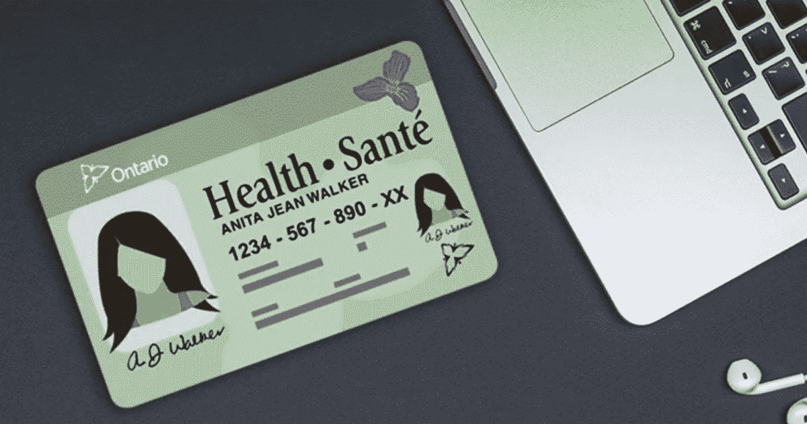
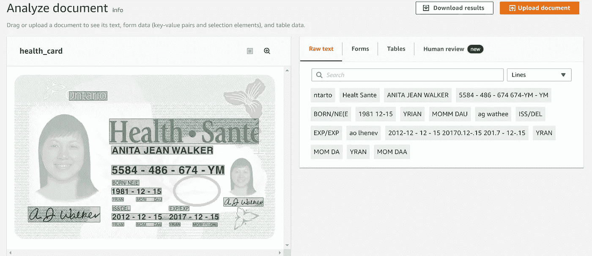

# 非接触式医疗保险卡:一种保护医疗保健用户和一线管理人员的方法

> 原文：<https://medium.com/analytics-vidhya/contactless-health-insurance-cards-an-approach-to-safeguard-healthcare-users-and-frontline-admin-638e484b7043?source=collection_archive---------23----------------------->



图片来源:[https://norbram.ca/the-new-ohip-ontario-ohip](https://norbram.ca/the-new-ohip-ontario-ohip)

非接触式支付是一种通过使用射频识别(RFID)或近场通信(NFC)来促进金融交易的技术，于 2011 年首次引入安卓设备，并于 2014 年引入 iOS 设备。随着客户发现这种支付方式的便捷和高效，这项技术在 T2 的应用稳步增长。2020 年 3 月，非接触式支付达到了有史以来的[使用高峰](https://newsroom.interac.ca/contactless-payments-during-covid-19/)。购物者通过批量购买来应对新冠肺炎疫情，同时，零售商实施了新的措施，包括限制接受现金的通道，并启用额外的非接触式支付机来保护顾客和重要的一线员工免受传染病的传播。

在整个加拿大医疗保健机构中，缺乏 NFC 功能或数字健康保险识别意味着许多一线管理人员目前必须手动记录患者信息。前线医护人员和患者之间的互动增加，给双方都带来了额外的健康风险。在本文中，我描述并演示了一个工具，该工具可用于实现安大略省健康保险计划(OHIP)卡的非接触式扫描，引入了额外的管理效率和安全措施。通过使用 Amazon Textract(一种从扫描的文档中自动检测和提取文本和数据的服务)，该工具可以减少一线医疗保健管理员和患者之间的交互，从而减少双方不必要的暴露和健康风险。

# 上传和分析图像

首先，从安大略省政府网站下载了一张 OHIP 卡样本，并上传到亚马逊 S3 云存储服务。


**图 1 |** 亚马逊 S3 的 OHIP 卡概述

接下来，图像从 S3 上传到亚马逊 Textract。Textract 简化了光学字符识别(OCR ),使开发人员能够轻松启动准确的数据提取应用程序。Textract 分析了图像中的文本、表单和表格，并将每个对象定义为一个*块*。用户可以通过手动将文档上传到[在线控制台](https://aws.amazon.com/textract/)来熟悉 Textract 服务。如下面的图 2 所示，图像的背景是灰色的，每个*块*在前景中高亮显示。



**图 2** |亚马逊 Textract 在 OHIP 卡上的光学字符识别(OCR)演示

Textract 的 API 返回了比上面显示的演示工具更多的细节。除了识别图像中的文字和表格等对象之外，API 调用还返回了以下一些信息:

*   获得的块的类型(例如，键值集、页面、行、字、表格、单元格)
*   置信度(0-100)
*   识别文本
*   表格信息(行索引、列索引、行跨度、列跨度)
*   图像中的对象坐标
*   块尺寸

一旦从 S3 桶中检索到图像，就将其转换为二进制并传递给 Textract 客户端。置信度大于 70%的已识别单词随后被附加到一个数组中以形成一串文本。

```
def get_text_analysis(self,bucket,document):
  # Get the document from S3
  print("Importing Image..........")
  s3_object = self.s3_resource.Object(bucket,document)
  s3_response = s3_object.get()
  stream = io.BytesIO(s3_response['Body'].read())
  image=Image.open(stream)
  image_binary = stream.getvalue()
  print('Extracting words..........')
  response = self.textract_client.analyze_document(Document=   
   {'Bytes': image_binary},FeatureTypes=["TABLES", "FORMS"])

  # Get the text blocks
  blocks=response['Blocks']
  print ('Detected Document Text')

  # Filter words with confidence level > 70%
  top_words = self.filter_top_words(blocks)
  return top_words# Filter word blocks with confidence level > 70%
def filter_top_words(self,blocks):
   print("Filtering top words...........")
   top_words = []
   for block in blocks:
     if 'Confidence' in block:
        print("[DEBUG] confidence = {} \ntext = {}".format(block['Confidence'],block['Text']))
        if(block['Confidence']> 70 and block['Text'] not in top_words): # Remove repeated words
             top_words.append(block['Text']) return top_words
```

在过滤掉低可信度对象之后，例如*签名*字段和非常小的文本，组合的输出文本为:

```
"ntarto Healt Sante ANITA JEAN WALKER 5584 - 486 - 674 674-YM - YM BORN/NE(E 1981 12-15 YRIAN MOMM DAU ag wathee ISS/DEL EXP/EXP 2012-12 - 12 - 15 20170.12-.15 201.7 
- 12-.15 YRAN MOM DA MOM DAA Healt Sante ANITA JEAN WALKER 5584 - 486 674 674-YM YM 1981 12-15 MOMM DAU ag wathee 2012-12 12 15 20170.12-.15 201.7 12-.15 MOM DA"
```

下一步需要解析文本以提取患者的信息。使用了基于预期字段的正则表达式，如表示出生日期的 *"BORN"* 和表示到期日期的 *"EXP"* :

```
def get_ohip_dict(self,text):
   name = re.compile('(?<=[Health] Sante )(.*?)(?= \d)').findall(text)[0]
   ohip_num = re.compile("(\d{4}(( |-){1,3}\d{3})( |-){1,3}\d{3})").findall(text)[0][0]
   ohip_chars = re.compile("[\D]{2}(?= BORN)").findall(text)[0]
   ohip = self.ohip_builder(ohip_num,ohip_chars)
   birth_year = int(re.compile("(?<=BORN\/NE\(E )\d{4}").findall(text)[0])
   birth_month = int(re.compile("(?<=BORN\/NE\(E \d{4}[ -])\d{2}").findall(text)[0])
   birth_day = int(re.compile("(?<=BORN\/NE\(E \d{4}[ -]\d{2}[ -])\d{2}").findall(text)[0])
   birthdate = datetime(birth_year,birth_month,birth_day)
   issue_year = int(re.compile("(?<=EXP\/EXP )\d{4}").findall(text)[0])
   issue_month = int(re.compile("(?<=EXP\/EXP \d{4}-)\d{2}").findall(text)[0])
   issue_day = int(re.compile("(?<=EXP\/EXP \d{4}-\d{2}[ -]{3})\d{2}").findall(text)[0])
   issuedate = datetime(issue_year,issue_month,issue_day)
   expdate = datetime(issue_year+5,birth_month,birth_day)
   ohip_dict={
      "name": name,
      "ohip": ohip,
      "birthdate": birthdate,
      "issuedate": issuedate,
      "expdate": expdate
   }
   return(ohip_dict)
```

最后，感兴趣的字段存储在一个 dictionary 对象中。该对象可以在以后被检索或上传到数据库。

```
**Table 1** | Resulting regions of interest captured from Health Insurance ID

              || **Property** | **Value** ||
              || name           | 'ANITA JEAN WALKER' ||
              || ohip           | '5584486674YM'      ||
              || birthdate      | 15/12/1981          ||
              || issuedate      | 12/12/2012          ||
              || expdate        | 15/12/2017          ||
```

如上表 1 所示，98%的感兴趣字符被准确提取。结果的准确性可以通过诸如增加样本大小和为每个 ID 卡捕获多个图像、增加图像分辨率以及利用块坐标来搜索位于 ID 卡上的空间区域中的预期字段的措施来进一步提高。

移动数字钱包应用程序也可以用来存储健康保险识别卡，并实现非接触式识别。安大略省与 Bluink 合作，数字化并安全存储安大略省的驾照。扩展这一基础设施以数字化 OHIP 可以减少管理人员和患者之间的互动，从而降低传染病传播的风险。

# 结论

据报道，限制客户和重要一线员工之间的实物支付交易可以降低传染病传播的风险。目前，卫生部没有部署非接触式医疗保险卡，患者信息由一线工作人员手工记录。本文演示了一种工具，它可以在不修改现有身份证或实施芯片阅读器等附加基础设施的情况下实现非接触式 ID。该解决方案可以帮助医疗保健用户和一线管理人员，通过健康保险信息的自动化数字化减少交互时间，从而降低不必要的暴露和接触的风险。

*一如既往，感谢您抽出时间阅读本材料。请在下面分享任何评论和想法；感谢所有的反馈。此外，请随时通过 LinkedIn 联系。*

[](https://www.linkedin.com/in/ianovski/) [## Alex Ianovski -高级发布工程师-罗杰斯通信| LinkedIn

### Alex 目前在 Rogers Communication 担任高级发布工程师。亚历克斯在为…开发软件

www.linkedin.com](https://www.linkedin.com/in/ianovski/) 

# 资源

[](https://github.com/ianovski/healthcard-scanner) [## ianovski/健康卡扫描仪

### 概念验证应用程序，支持安大略省健康保险计划卡的非接触式扫描…

github.com](https://github.com/ianovski/healthcard-scanner) 

# 参考

[](https://www.telegraph.co.uk/news/2020/03/02/exclusive-dirty-banknotes-may-spreading-coronavirus-world-health/) [## 世卫组织认为，肮脏的钞票可能会传播冠状病毒

### 然而，世界卫生组织表示，英国公众在处理潜在的传染性疾病时应该小心谨慎。

www.telegraph.co.uk](https://www.telegraph.co.uk/news/2020/03/02/exclusive-dirty-banknotes-may-spreading-coronavirus-world-health/) [](https://www.payments.ca/industry-info/industry-data) [## 行业数据

### 2018 年加拿大支付数据详情请见 2019 年加拿大支付方式和趋势(CPMT)报告。

www.payments.ca](https://www.payments.ca/industry-info/industry-data) [](https://newsroom.interac.ca/contactless-payments-during-covid-19/) [## 新冠肺炎- Interac 报告期间的非接触式支付

### 在今天的新冠肺炎现实中，物理距离和日益重要的手部卫生，非接触式支付是…

newsroom.interac.ca](https://newsroom.interac.ca/contactless-payments-during-covid-19/) [](https://aws.amazon.com/textract/) [## 亚马逊文本摘要|提取文本和数据| AWS

### 从几乎任何文档中轻松提取文本和数据 Amazon Textract 是一种自动提取文本的服务…

aws.amazon.com](https://aws.amazon.com/textract/) [](https://news.ontario.ca/mgs/en/2016/06/gender-on-health-cards-and-drivers-licences.html) [## 健康卡和驾照上的性别

### 安大略省正在改变在医疗卡和驾照上显示性和性别信息的方式。健康卡…

新闻.安大略.加州](https://news.ontario.ca/mgs/en/2016/06/gender-on-health-cards-and-drivers-licences.html) [](https://norbram.ca/the-new-ohip-ontario-ohip) [## OHIP + -来了又走了

### 2019 年 4 月 1 日，安大略省政府将 OHIP+福利的重点转移到优先考虑没有……

诺布拉姆](https://norbram.ca/the-new-ohip-ontario-ohip)  [## eID-Me:远程身份验证和移动数字身份证

### 在家几分钟内远程验证身份，让客户更好地访问您的服务。

bluink.ca](https://bluink.ca/eid-me)