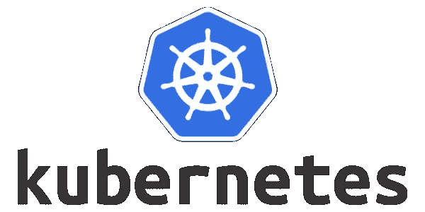

# 使用 Kubernetes (k8)的容器编排—使用 Minikube 从头开始

> 原文：<https://medium.com/analytics-vidhya/container-orchestration-using-kubernetes-k8-from-scratch-using-minikube-9e45f6fba464?source=collection_archive---------23----------------------->

> Kubernetes 是一个开源的容器编排系统，用于自动化计算机应用程序的部署、扩展和管理

使用容器的一个优点是，它可以根据需求按比例放大或缩小。从业务角度来看，这将确保可以满足传入流量的变化，而无需…