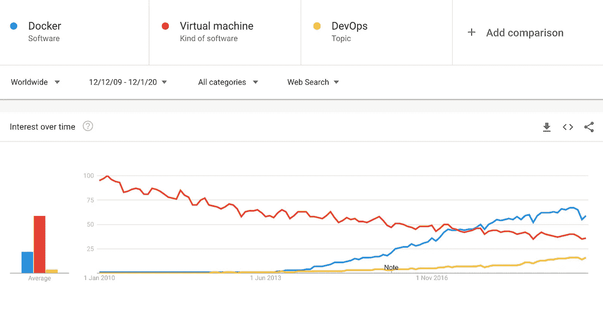

# 实践中的集装箱化

> 原文：<https://medium.com/analytics-vidhya/containerization-in-practice-b5fb135cf2a9?source=collection_archive---------15----------------------->

## 第一部分:为了更好地理解 Docker 和容器编排的关键问答

照片来自[https://www.pexels.com/@suzyhazelwood](https://www.pexels.com/@suzyhazelwood)

让我们来看看关于虚拟化、容器化、Docker 和容器编排的一些重要的*为什么*和*如何*。这篇文章的目的不是解释概念本身，而是回答更好地理解底层技术所需的一些关键问题，并介绍实际的用例。

我在帖子中提出的问题是:

*   容器化和虚拟化之间的关系是什么？
*   什么是容器化，容器与虚拟机有何不同？
*   为什么 Docker 是头号容器化技术？
*   容器编排支持什么，它与 Docker compose 有何不同？

# 虚拟化与容器化

简而言之，虚拟化在系统之上带来了一个额外的抽象级别，允许更有效地利用资源。它还支持创建许多有用的工具和服务，如 Docker containers，这是*操作系统级虚拟化、*或云计算的一个示例，提供不同类型和多个级别的资源虚拟化。

事实上，虚拟化是我们日常接触到的一个非常有用的概念(比容器化抽象得多)。这里有几个其他的例子，可能会敲响警钟:

*   虚拟机是*硬件虚拟化*的一个例子
*   虚拟专用网络(VPN)，它体现了*网络虚拟化*
*   Dropbox 和 Google Drive 等软件，实现了*存储虚拟化*
*   像 Python 的 [virtualenv](https://virtualenv.pypa.io/en/stable/) 这样的工具，它创建了每个项目的语言运行时环境

# 虚拟机与容器

这些是一个非常相似的想法的非常不同的实现——**一个高效、隔离的环境。**在 VM 的情况下，环境是一个完整的 OS。相反，容器更像一个编程环境，它使用主机 OS 内核。两者都是由图像定义的，但是容器有更多轻量级的图像，这使得它们更易于移植。同时，虚拟机实现了更高级别的隔离(仅共享硬件)，从而提供了一个潜在的更安全的环境。

如今，集装箱主要用于

*   轻松应用、共享和重用作为代码实现的基础架构
*   实施类似微服务的架构
*   点击应用/试用软件
*   实施测试环境(沙箱)

总的来说，优化开发和部署过程。同时，应用虚拟机:

*   模仿任何风格的操作系统
*   在*完全*隔离的环境中执行软件测试
*   由云提供商为用户提供隔离的计算环境
*   对于桌面共享

确实，以前由虚拟机执行的一些功能现在是容器的一个明显的用例。但是，正如上面提到的以及将要进一步讨论的，虚拟机有时比容器更受欢迎。查看(1)[Docker 和虚拟机有什么不同？](https://stackoverflow.com/questions/16047306/how-is-docker-different-from-a-virtual-machine)、(2) [流程、容器、VM 有什么区别？](/@jessgreb01/what-is-the-difference-between-a-process-a-container-and-a-vm-f36ba0f8a8f7)和(3) [容器与虚拟机(VM)——安全视角](https://neuvector.com/container-security/containers-vs-virtual-machines-vms/)进行进一步比较。

# 为什么 Docker 是最流行的容器化软件？

回到 2013 年，当 Docker 发布其解决方案*，*时，没有其他公司是直接竞争对手。事实上，其他容器化框架也存在，**但是只有 Docker 软件能够实现技术民主化**。与以前的方法相比，它使得容器的部署和使用更加容易和安全。虽然以前的提供商推出了操作系统虚拟化的概念，但 Docker 实施了它(基于现有的解决方案)，以便每个人都能够将其集成到他们的技术堆栈中。

它也非常适合 DevOps 生态系统(这个想法在 2009 年左右开始传播),作为一种工具来促进开发和测试，并实现更快的发布周期。这是一个完美的时机，让这个工具疯狂地快速集成到公司的技术堆栈中。下图指出了 DevOps 和 Docker 的相关受欢迎程度，并强调了随着 Docker 的出现，对虚拟机的兴趣下降。

用[https://trends.google.com](https://trends.google.com/trends/explore?date=2009-12-12%202020-01-12&q=Docker,DevOps,virtual%20machine)制造

如今，Docker 并不是唯一的解决方案，但迄今为止，它仍然是使用最广泛的解决方案。查看[Linux 容器的发展及其未来](https://dzone.com/articles/evolution-of-linux-containers-future)以了解更多日期和历史事实。

# 什么时候虚拟机比容器更合适？

与虚拟机不同，容器与主机共享操作系统内核。这带来了一些好处，但也有一些缺点。

重要的是，它**缩小了用户在容器操作系统发行版**上的选择。这在 Windows 上不是问题，但是如果你的机器运行在任何其他操作系统上，你只能在 Linux 发行版之间选择。因此，如果您需要更灵活的操作系统首选项，请使用虚拟机。有时候你**不想在你的环境之间共享一个内核**。独立的内核确保了硬件级的隔离，从而增强了安全性**。**还是那句话，Windows 为 Linux 容器提供了一个名为 [Hyper-V 隔离](https://docs.microsoft.com/en-us/virtualization/windowscontainers/manage-containers/hyperv-container)的解决方案，但是据我所知 Linux 上运行的 Docker 没有这个选项。

真正有趣的是，Windows 为其用户实现了上述两种快捷方式的解决方案，使用…虚拟机！查看[技术帖](https://docs.microsoft.com/en-us/virtualization/windowscontainers/deploy-containers/linux-containers)了解更多信息。

照片来自[https://www.pexels.com/@suzyhazelwood](https://www.pexels.com/@suzyhazelwood)

# 什么是容器编排？

作为主要用例之一，容器被应用于实现类似微服务的架构。这样的应用程序被分割成几个松散耦合的组件，它们被独立地开发、版本化、执行和扩展。这些组件协同工作以交付最终结果，但总体上它们表现为独立的应用程序。

现在，容器编排开始发挥作用，帮助您管理和优化这样一个系统。借助流程编排，您可以描述应用程序的理想状态，设置负载平衡和扩展条件，规定出现故障时的行为等等。关于容器编排如何工作的详细解释，请查看[什么是容器编排？](https://www.redhat.com/en/topics/containers/what-is-container-orchestration)帖子。

实际上，它是这样工作的:想象你交付一个 web 应用程序。使用编排，您可以声明无论发生什么情况，您只需要一个容器来托管您的前端。您还可以根据传入流量为后端容器设置自动缩放。根据上下文的不同，伸缩可能是水平的(添加容器实例)或垂直的(向容器添加更多的资源，如 CPU 和内存)。在微服务领域，水平扩展是首选。像 [Kubernetes](https://kubernetes.io/) 这样的编排软件会尽最大努力让应用程序保持在指定的状态。

照片来自[https://www.pexels.com/@suzyhazelwood](https://www.pexels.com/@suzyhazelwood)

# 容器编排与 Docker 合成

虽然这两个工具的功能是交叉的，但它们毕竟服务于不同的目的。

[Docker compose](https://docs.docker.com/compose/) 用于多容器应用程序，描述如何组装和运行应用程序。一个 docker-compose.yml 文件包含您可能在 docker 文件中指定的内容(如环境变量、卷、网络配置等。)，此外还定义了部署配置。例如，它声明是否在容器启动前构建映像，在哪个容器启动前启动哪个容器，以及在失败时是否重启容器。Docker compose 还支持通过一个命令运行整个应用程序，而不是一个接一个地启动容器。

当 Docker compose 在一台*主机*上运行一个应用程序时，容器编排工具，如 [Docker Swarm](https://docs.docker.com/engine/swarm/) 和 Kubernetes，可以(并且通常用于)在多台主机上部署一个应用程序。除了 compose 工具的功能之外，它还提供了容错、按需伸缩、多种负载平衡选项、无缝部署等等。总的来说，它自动化了部署，并将基础设施描述为代码(Docker compose 也是这样做的)，而且优化了资源分配，增加了系统的可靠性。

总的来说，您可能会看到虚拟化是多么强大和广泛，尤其是容器化和 Docker 如何彻底改变了我们思考和开发应用程序的方式。

这些工具(包括 Docker)非常有用，但也很流行。不幸的是，公司在没有深入了解前景的情况下到处应用它们。虽然了解如何从该技术中受益是有用的，但思考什么时候它不合适以及什么情况下您确实需要避免像我们亲爱的 Kubernetes 和 Docker 这样的技术也很重要。这正是我在“集装箱化实践”系列的下一篇文章中要研究的。