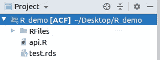
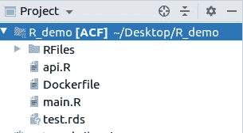

# 用 Docker 封装 R API

> 原文：<https://medium.com/analytics-vidhya/containerize-r-api-with-docker-da3d8f3df110?source=collection_archive---------14----------------------->

通常，数据科学家花大部分时间训练和可视化他们的模型。他们不太重视部署。

但是如果他们不得不将它部署到生产环境中呢？好吧，他们可以部署它，但是如果生产环境不同于他们当前的环境呢？假设，他们正在开发一个 ubuntu 系统，生产环境是 Fedora。因此，在安装时，他们会得到大量的错误，它不会工作。那这个解决办法是什么？有很多解决方法。一种方法是使用 Docker 将其打包。有了 docker，它就变得与环境无关了。

# 码头工人

使用容器可以更快地构建和部署新应用程序。Docker 容器将软件及其依赖项包装成一个标准化的软件开发单元，其中包括运行所需的一切:代码、运行时、系统工具和库。这保证了您的应用程序将总是运行相同的，并使协作像共享容器映像一样简单。

Docker 容器无论是 Windows 还是 Linux 都有 Docker 工具和 API 做后盾，帮助你构建更好的软件。


码头工人

上图显示了这些容器是如何相互独立的。

# 让我们开始吧…

# 先决条件

你需要在你的系统中安装 docker。如果没有，请通过以下链接安装它:

https://docs.docker.com/install/linux/docker-ce/centos/

黛比安:https://docs.docker.com/install/linux/docker-ce/debian/

软呢帽:【https://docs.docker.com/install/linux/docker-ce/fedora/】T4

Ubuntu:[https://docs.docker.com/install/linux/docker-ce/ubuntu/](https://docs.docker.com/install/linux/docker-ce/ubuntu/)

二进制:[https://docs.docker.com/install/linux/docker-ce/binaries/](https://docs.docker.com/install/linux/docker-ce/binaries/)

可选:以非超级用户身份管理 docker。

[](https://docs.docker.com/install/linux/linux-postinstall/) [## Linux 的安装后步骤

### 本节包含配置 Linux 主机以更好地使用 Docker 的可选过程。Docker 守护进程…

docs.docker.com](https://docs.docker.com/install/linux/linux-postinstall/) 

现在，一旦你安装了 docker，让我们开始吧。

假设您的项目目录结构如下:



项目结构

这里 R_demo 是项目根目录。RFiles 是一个目录，可以包含您的 R 文件(rds 对象、R API 等等)。api。r 是包含您想要公开的 API 的 r 文件。

现在，将 Dockerfile 放在项目目录下，如下所示:


放置 Dockerfile 后的项目结构

按如下方式更新 Dockerfile 文件:

```
FROM rocker/r-ver:3.4.1EXPOSE 80ENV WORKON_HOME $HOME/.virtualenvsLABEL version=”1.0"RUN apt-get update -qq && apt-get install -y \default-jre \default-jdk \libssl-dev \libcurl4-gnutls-dev \zlib1g-dev \libssh2–1-dev \libbz2-dev \libicu-dev \liblzma-dev \libxml2-dev \libpcre3-dev && \R CMD javareconf && \R -e ‘install.packages(c(“plumber”,”dplyr”,”stringr”,”jtools”,”forecast”,”tidyverse”,”tidyquant”,”magrittr”,”glmnet”,”e1071",”rpart”,”reshape2",”MLmetrics”,”TSPred”,”sweep”,”bsts”))’COPY . .
```

用 R 模型所需的软件包更新 install.packages。

放置 Dockerfile 后，放置您的主。您的项目目录下的 r 文件如下:



放置干管后的项目结构。r 文件

更新 main。r 文件如下:

```
# This code is just for running that plumber filelibrary(plumber)plumber::plumb(“api.R”)$run(host=”0.0.0.0",port= 8765)
```

这将运行您的服务器。

现在，用入口点更新 Dockerfile 文件。这个入口点告诉 docker，一旦构建了 docker 容器，要运行什么。

```
ENTRYPOINT [“Rscript”,”main.R”]
```

现在，Dockerfile 文件变成了:

```
FROM rocker/r-ver:3.4.1EXPOSE 80ENV WORKON_HOME $HOME/.virtualenvsLABEL version=”1.0"LABEL description=”Group DnA’s AI/ML product for TAF.”RUN apt-get update -qq && apt-get install -y \default-jre \default-jdk \libssl-dev \libcurl4-gnutls-dev \zlib1g-dev \libssh2–1-dev \libbz2-dev \libicu-dev \liblzma-dev \libxml2-dev \libpcre3-dev && \R CMD javareconf && \R -e ‘install.packages(c(“plumber”,”dplyr”,”stringr”,”jtools”,”forecast”,”tidyverse”,”tidyquant”,”magrittr”,”glmnet”,”e1071",”rpart”,”reshape2",”MLmetrics”,”TSPred”,”sweep”,”bsts”))’COPY . .ENTRYPOINT [“Rscript”,”main.R”]
```

一旦设置就绪，就该运行它了。

首先，您必须构建 docker 映像，然后运行它。现在，打开终端，在项目的根目录下运行以下命令:

```
$ docker build -t <image_name> .
```

例如:

```
$ docker build -t r_test .
```

该命令将构建 docker 映像。

一旦 docker 图像形成，就将容器制作成:

```
$ docker run -p 8765:8765 --name <container-name> <image-name>
```

示例:

```
$ docker run -p 8765:8765 --name r_test r_test
```

检查您的 docker 图像:

```
$ docker images
```

您可以看到自己制作的容器:

```
$ docker ps
```

现在，检查 API 结果，如下所示

```
http://127.0.0.1:8765/<your-api-end-point>
```

您也可以使用您的 IP 地址进行检查，如下所示:

```
http://<your-IP>:8765/<your-api-end-point>
```

或者使用 curl 命令:

```
curl http://127.0.0.1:8765/<your-api-end-point>
```