# 使用深度学习的基于内容的自动音乐播放列表生成

> 原文：<https://medium.com/analytics-vidhya/content-based-automated-playlist-generation-using-deep-learning-b892a7de3d3c?source=collection_archive---------17----------------------->

安迪·凯利在 [Unsplash](https://unsplash.com/photos/uydt8hNz3hE?utm_source=unsplash&utm_medium=referral&utm_content=creditCopyText) 上的照片

# 目标

本文详细介绍了一个基于内容的音乐推荐系统的逐步实现。完整的代码可以在我的 [GitHub](https://github.com/G-pravin-shankar/Content-based-automated-playlist-generation-using-deep-learning) 中找到。关于推荐系统和深度学习的基础知识是假定的。

# 桌子

1.  理解声音
2.  数字音频
3.  听觉感知
4.  音乐
5.  音乐为什么有娱乐性？
6.  概观
7.  问题陈述
8.  特征化
9.  现有解决方案
10.  数据
11.  首次切割法
12.  最终特征
13.  示例建议
14.  特征分析
15.  失败的实验
16.  未来的工作
17.  参考

# 理解声音

声音是我们对周围空气分子振动的感知(水下音频感知不在本文讨论范围内)。它产生的介质可以是固体、液体或气体。

照片由 [Gentrit Sylejmani](https://unsplash.com/@gentritbsylejmani?utm_source=unsplash&utm_medium=referral&utm_content=creditCopyText) 在 [Unsplash](https://unsplash.com/s/photos/swimming?utm_source=unsplash&utm_medium=referral&utm_content=creditCopyText) 上拍摄

当有人在附近游泳时，我们听到的只是水分子的振动，这反过来又振动了周围的空气分子。

如果我们听到振动的空气分子，有人可能会想，为什么我们在空中挥动双手时听不到呢？这是因为我们的听觉系统只能感知频率在 20 赫兹到 20 千赫兹之间的振动。

当我们扔石头时，只有当它碰到固体或液体表面时，我们才能听到声音。尽管运动中的石头扰乱了空气分子，但频率远低于我们的听觉范围。然而，当它撞击水时，邻近的空气分子以与水分子振动相同的频率振动，使其可以听见。这种声音(或振动)的来源是石头撞击水，它通过空气传播到我们的耳朵。

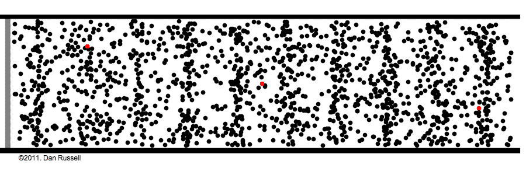

声音通过空气分子从左向右传播【来源:[丹尼尔·a·拉塞尔博士](https://www.acs.psu.edu/drussell/Demos/waves/wavemotion.html)

灰色线代表振动源，红色和黑色的点都是空气粒子(分子)，要了解这些粒子的实际运动，请查看任何一个红点。它们不像放在传送带上的行李那样移动，而是前后移动。只有振动从灰线传播到最右端。

当一个粒子从 A 点移动到 B 点，然后又回到 A 点，我们说它完成了一个循环。每秒的总周期数是赫兹标度的频率，振幅是点“A”和点“B”之间的距离。

> 当物体受到撞击、击打、弹拨、敲击或某种程度的干扰时，物体振动的频率称为物体的固有频率。如果振动的幅度足够大，并且自然频率在人类频率范围内，那么振动的物体将产生可听见的声波。【来源:[物理教室](https://www.physicsclassroom.com/class/sound/Lesson-4/Natural-Frequency)

大多数生物都能感觉到物体的某种振动，这表明声音对生存的重要性。我们通过产生这些从源头向四面八方传播的振动来有效地交流和表达。一般来说，这些振动速度太快，看不到，而且不像视觉，听觉跨度没有限制在一定程度。这就解释了为什么尽管警笛的速度极快，但仍被广泛用于指示紧急情况。

# 数字音频

麦克风包含一个类似于我们耳膜的薄振膜，它是一个将机械能转化为电能的转换器。

用非常简单的话来说，它的振动频率与周围空气粒子的振动频率相同，这种振动的振幅被转换成电能。这种连续(模拟)信息通过以相等的时间间隔每秒采样 44100 个值并以 16 位表示每个值而被转换成数字形式。数字格式便于数据的存储、访问和操作。

扬声器通过执行与麦克风完全相反的操作来再现声音。

# 听觉感知

人类对振幅和频率的解释是响度和音高，但关系不是线性的。这就好比你买房子时，一百万美元和一百一十美元之间的差别并不重要。我们可以很容易地区分 50 赫兹和 100 赫兹的频率，但不能区分 10，000 赫兹和 10，050 赫兹。

Mel 标度接近我们对频率的感知，在 500 Hz 之前大致是线性的，之后是对数的；同样，声压(振幅)用对数单位分贝来表示，以近似我们的感知，0 dB 是人类听觉的阈值。

除了压力，用 phon 测量的响度也依赖于我们的听觉系统放大某些频率的能力。

在 0 dB 时，只能听到 2 kHz 至 5 kHz 之间的频率，而要检测 30 Hz 的频率，则需要 50 dB 以上。对于 1 kHz 的频率，分贝和 phon 是相等的。

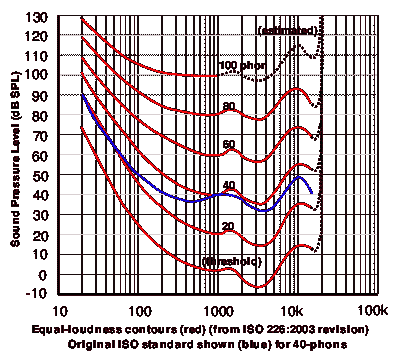

Phon vs 分贝[来源:[维基百科](https://en.wikipedia.org/wiki/Equal-loudness_contour#/media/File:Lindos1.svg)

# 音乐

音乐这种精细的艺术，不过是空气粒子的人为振动，给人以美感，却没有实际用途；然而，它有医疗用途的潜力。大脑听觉皮层处理的每一次振动都会引发生理和心理反应。

音乐建立情绪，影响人们的感知(尤其是视觉感知[ [Jolij J，Meurs M (2011)](https://doi.org/10.1371/journal.pone.0018861) ])、态度和行为。它一直是世界各地仪式不可或缺的一部分，甚至在无声电影时代，音乐也扮演了重要角色。

视频解释了音乐是如何完全改变我们的感知的

从作曲家的角度来看，音乐是一系列的和声。音乐创作的第一步是选择调和音阶，它影响着歌曲的体裁和情感；这决定了可用于创作旋律的音符。音符代表频率(或者更准确地说，音高)及其持续时间。

旋律(或曲调)是通过排列一系列音符组成的，但一次只有一个音符。它是一首歌中最显著、最关键、最重复的部分。

最后一步是调和旋律。旋律中的每一个音符都被添加了例如低频的音符来增强旋律。当多个音符一起演奏时，产生令人满意的效果，我们称之为和声。

视频中的橙色音符代表旋律

需要注意的重要一点是，单频振动在自然界极其罕见。即使是乐器也会产生除预期音符之外的振动频率，这些次要的附加频率以及包络区分了乐器。

例如，“中音 C”的频率为 261.6，在不同的乐器上演奏时听起来不同。

视频显示了不同乐器演奏同一音符时产生的振动

# 音乐为什么有娱乐性？

根据[耶基斯-多德森定律](https://en.wikipedia.org/wiki/Yerkes%E2%80%93Dodson_law)，一项任务的完成依赖于一个有机体的觉醒。随着唤醒的增加，表现会提高，但超过饱和点后，它开始降低或停止增加，这取决于任务的复杂性。

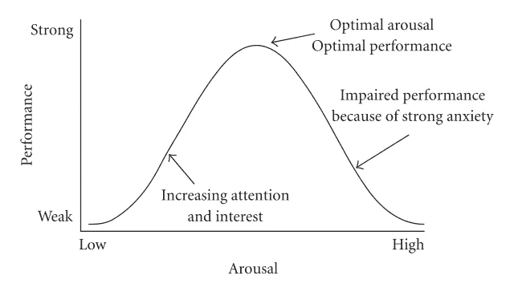

耶基斯-多德森定律的希伯来版本[来源:[戴蒙德·DM 等人(2007)](https://www.ncbi.nlm.nih.gov/pubmed/17641736?dopt=Abstract)

这种“倒 u 型”关系也见于我们的音乐偏好，是由[丹尼尔·埃利斯·柏林](https://en.wikipedia.org/wiki/Daniel_Berlyne)发现的。[来源:[施米尔，a .，&舒伯特，E. (2017)](https://doi.org/10.1177/0305735617697507) ]

音乐的时序性为预测下一个事件创造了机会。这是因为我们有识别和记忆模式的能力。当预测越来越近时，我们会感到厌烦，因为只有很少的信息需要学习(唤醒太少)，当预测很差时，我们会感到烦恼，因为有大量的信息需要学习(唤醒太多)。最大的回报或快乐是在两者之间的某个地方体验到的。

旋律经常在一首歌中重复，而且在我们听后也在我们的脑海中重复，这有助于记忆的过程，并解释了为什么我们最喜欢的歌变得无聊，或者一首无趣的歌在我们听了很多遍后变得有趣。简单地说，我们对音乐的接触决定了我们对音乐的偏好。

> 像专业人士一样学习规则，这样你就可以像艺术家一样打破规则。[巴勃罗·毕加索]

遵循音乐理论并巧妙地打破它有助于音乐家在他们的听众中实现最佳的唤醒。

为了获得更好的理解，请阅读罗伯特·扎托尔的这篇文章。

# 概观

主要的音乐流媒体服务提供商拥有数百万首歌曲的权利，这些歌曲被有吸引力地组织和显示，以简化用户体验。听完整首歌需要一个人一生以上的时间，用户听到某首歌的可能性是双向的，用户的日常体验和公司兑现的算法(或混合算法)。

在这个数据密集的互联网时代，个性化的艺术是最重要的，以吸引和引导观众的追求。

基于内容的过滤所使用的元数据通常不会扩展到高层抽象之外，而是处理新用户。协同过滤是另一种广泛使用且更有效的方法，它需要用户的历史数据和周期性的再训练来克服其假设相似用户相似进化的基本限制。

此外，人们越来越不喜欢在这个过程中个人数据被利用的风险，他们更喜欢其他选择。至少高级用户应该能够方便地使用服务，而无需访问他们的数据。

这是一次尝试，旨在分析音频深度学习方法的范围，其中没有其他数据将用于在资源有限且不损害用户隐私的情况下模拟人类听觉系统。

# 问题陈述

基于给定的查询曲目生成播放列表，而不使用任何元数据，如流派、子流派、艺术家、发行年份等。

# 特征化

如前所述，数字音频文件包含以相等时间间隔采样的气压(振幅)，我们的听觉系统处理这些信息进行推理。

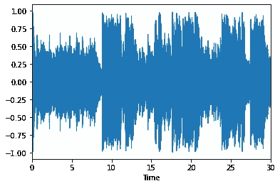

107852.mp3

如果你问我古典音乐和摇滚乐的区别，我会说古典音乐用钢琴和小提琴，而摇滚乐用电吉他和原声鼓。所以，为了区分两种风格，我把歌曲分成简单的声音(例如:钢琴)，然后比较这些声音，找出同一风格的歌曲之间的相似性以及两种风格之间的差异。

傅立叶变换([文章](https://betterexplained.com/articles/an-interactive-guide-to-the-fourier-transform/)和[视频](https://www.youtube.com/watch?v=spUNpyF58BY)讲解)可以用来把一个声音转换成多个基本声音，或者把技术上更复杂的振动转换成多个单一频率的振动。但是，为了表示一个声音序列，我们需要对每个事件进行傅立叶变换，并获得所有频率的振幅(在连续的范围内)，这是不实际的。

我们可以将歌曲分成多个重叠的窗口，假设每个窗口都是一个事件，并应用傅立叶变换，还可以对频率进行分类。对于每个窗口，这将为我们提供每个频率仓的幅度，可以及时对其进行排列以构建频谱图。

频率为梅尔标度、振幅为分贝的声谱图近似于大脑听觉皮层接收的信息。今天，它是深度学习中最广泛使用的音频表示。

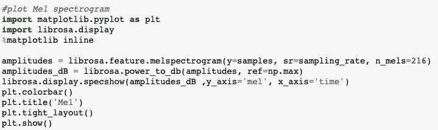

纵轴代表 216 个“Mel 频率”箱，横轴代表以秒为单位的“时间”,颜色代表以分贝为单位的“振幅”(黑色表示无振幅或振幅很低，黄色表示振幅很高)。

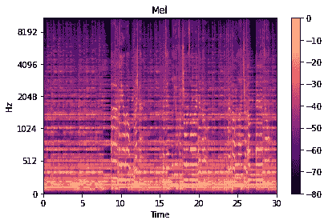

“107852.mp3”的梅尔谱图

# 现有解决方案

## [桑德·迪勒曼](https://benanne.github.io/2014/08/05/spotify-cnns.html)用深度学习在 Spotify 上推荐音乐:

像冷启动和缺乏数据这样的情况为有效的协作过滤提供了可供选择的思路。卷积神经网络、最先进的图像处理模型被用来通过使用基于协作过滤的表示来监督学习过程，从而解决这些限制。潜在表示被标准化以最小化歌曲流行的影响。

分成多个帧的每首歌曲被表示为声谱图，其中对数标度中的振幅和 Mel 标度中的频率垂直堆叠以表示时间。矩形核只在时间上进行卷积。

音频的顺序性质被部分丢弃，取而代之的是提取特征的整体存在。

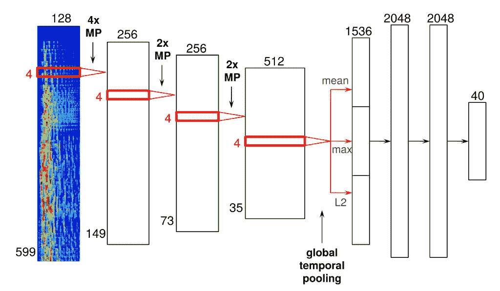

桑德·迪勒曼使用的 CNN 架构之一

经过训练的模型可以直接计算每天添加的所有新曲目(据推测，Spotify 上大约有 4 万首)的特征表示，任何适当的相似性度量都可以用于推荐。然而，在监督中使用的潜在特征需要被重新计算以适应变化的用户偏好，这使得整个神经网络的频繁再训练成为必要。

# 数据

大约 66 小时的音频(8，000 首长度为 30 秒的曲目)构成了数据。元数据和常用功能也可用。【来源: [FMA](https://arxiv.org/abs/1612.01840) 】。

# 首次切割法

[梅尔频率倒谱系数(MFCCs)](https://archive.org/details/SpectrogramCepstrumAndMel-frequency_636522) 是深度学习出现之前音频的最先进表示。这里，MFCC 向量代表歌曲的每个窗口，而不是 216 维向量。最初，比方说，在一个窗口中有 2048 个样本，并且在 Mel 谱图中使用 216 个值来表示。它们在这里进一步减少到 20 个。

MFCCs 是声音被转换成多个中间声音而不是基本声音的表示。中间音是由一组基本音组成的，间隔相等，类似于和声中音符的分离方式。在一种或多种乐器上演奏的音符可以是中间音。

通过对窗口的 Mel 频率仓中的分贝标度相关值应用离散余弦变换来获得 MFCCs。

每首歌加窗 1293 次，总共 20*1293 个值或一个低分辨率灰度声谱图(倒谱图)来表示它们。这些行是标准化的，以避免某些系数的支配，并提高声谱图和不同声谱图中时间窗的区分度。

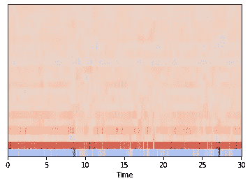

“107852 . MP3”MFCC 彩色声谱图

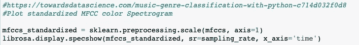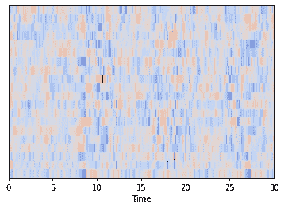

“107852.mp3”标准化 MFCC 彩色声谱图

自动编码器用于从声谱图中提取 n 维矢量表示。基于卷积的模型仅具有比基线模型稍好的均方误差(MSE ),但是该表示在区分歌曲方面是有意义的，而预测零的基线模型的编码将是无用的。

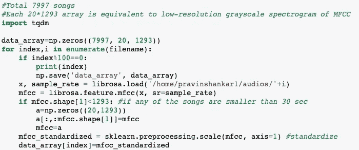

在包含振幅矢量的低分辨率灰度频谱图(大小为 20*1293*1 的矩阵)上，核在时间轴和 MFCC 轴上卷积，而不是在彩色频谱图上卷积，这额外地节省了存储器和计算。

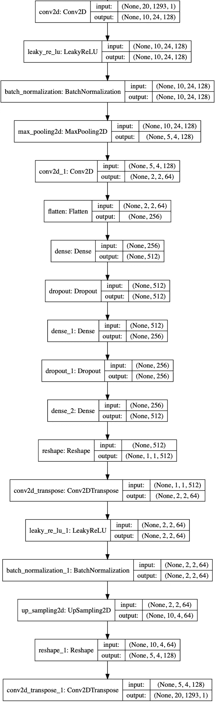

自动编码器型号之一

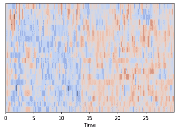

样本输入(X1)

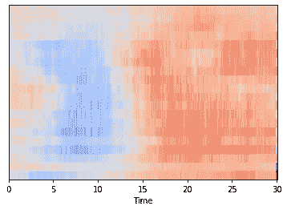

output(Y1^样本)

基于从自动编码器获得的矢量表示的推荐感觉是随机的，并且对于流派预测也不起作用。

# 最终特征

普遍认为，梅尔谱图是最好的代表。在 Imagenet 数据集上预先训练的 VGG16 用于提取轨迹的特征表示。最后一层替换为最大池层，然后输出被展平以获得 25，600 维的稀疏向量。

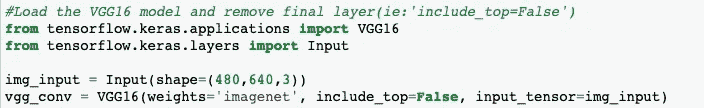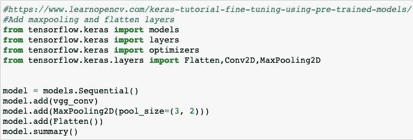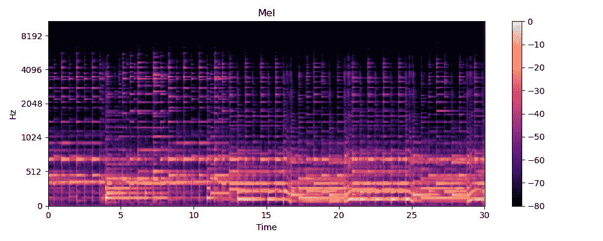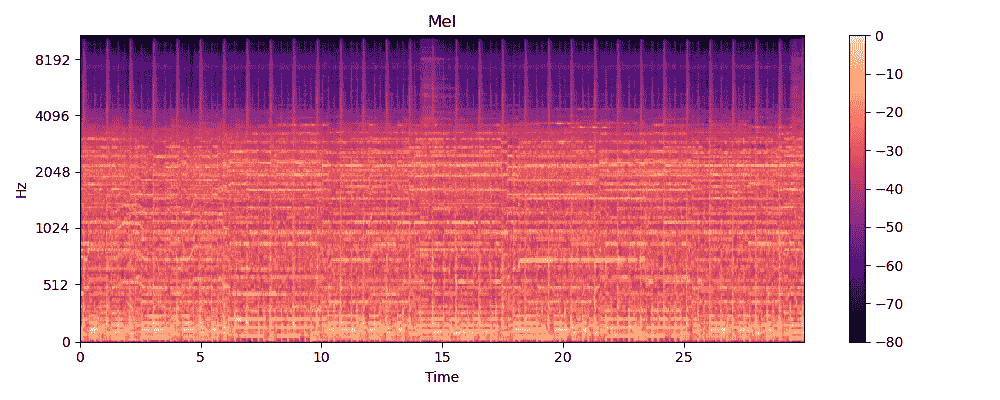

民歌(左)和摇滚歌曲(右)的梅尔谱图

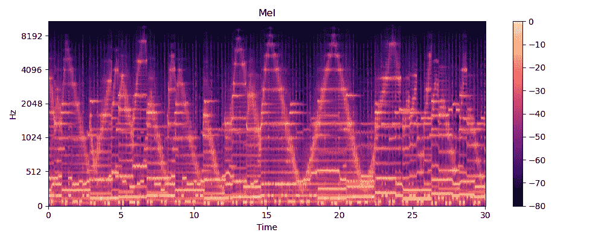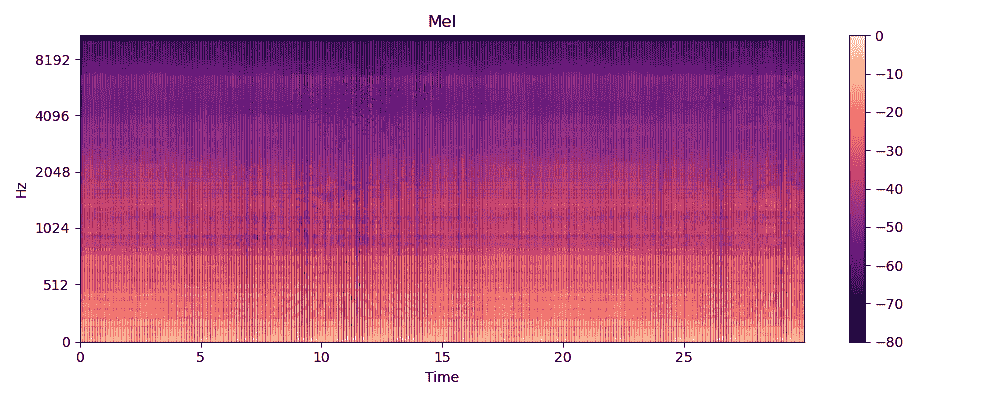

电子歌曲(左)和电子噪音(右)的 Mel 光谱图

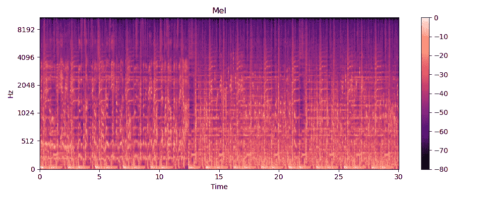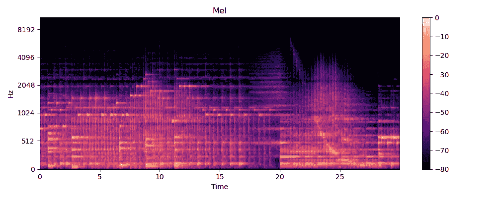

嘻哈歌曲(左)和钢琴器乐歌曲(右)的梅尔谱图

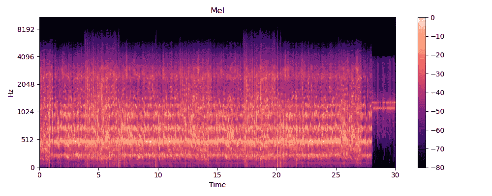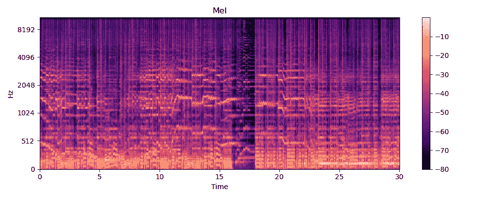

回声演讲(左)和小提琴为基础的流行歌曲(右)的梅尔频谱图

此外，还提取了基于类型预测模型的特征。最初的想法是删除最后一层，冻结 VGG16 模型中的剩余层，并添加层来预测流派。因为冻结层不影响训练过程，所以首先提取 VGG16 模型的输出，并将其作为输入馈送给流派预测模型；这显著降低了 ram 需求，也加快了训练过程。

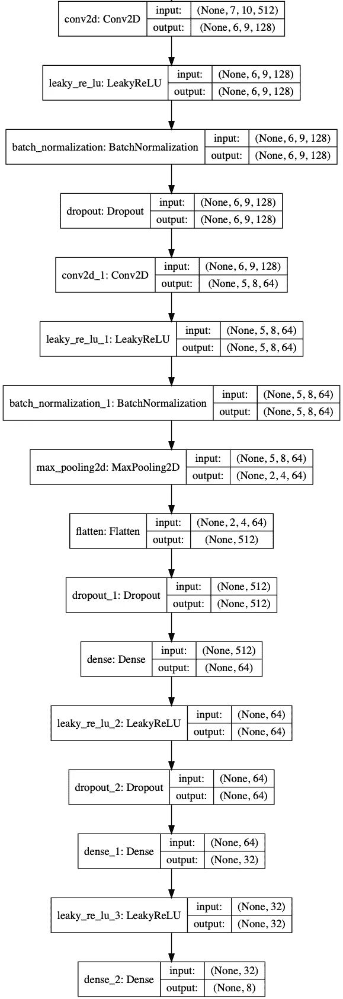

体裁预测模型

1D 卷积常用于频谱图，但 2D 卷积被使用，因为它使浅层的每个神经元对特定的频率范围敏感，这类似于听觉皮层中的频率映射。

这里重要的区别是 VGG16 模型的输出没有变平。在训练流派预测模型之后，去除 softmax 层，提取 32 维向量并乘以 80，以减少 25，600 维向量的支配。

总共 25，632 个特征被用于表示每首歌曲，余弦相似性分数然后被用于推荐。

尽管一些模型达到了 59%的准确度，但是所选模型只有 56%的准确度，但是测井曲线损失更好，并且推荐值也更好。

一旦训练了模型，还可以为新的数据点预测类型，使得这种方法能够自给自足，除了音频本身之外没有任何数据。最终特征优于作为推荐数据集的一部分提供的流派、其他元数据和基于音频的特征。

歌曲或艺术家或语言或发行年份或原产国或标签的受欢迎程度以及用户的年龄或性别或偏好或历史或位置不会影响推荐。不加选择地对待用户，不需要任何个人数据，音乐的普及可能有助于提高效率。

尽管与现有方法相比，该模型在时间上具有鲁棒性，但考虑到现实生活中补充的数据量，它可以通过偶尔的增量再训练来改进。

# 示例建议

每个文件夹包含一个随机选择的查询，剩下的部分(无序的)是推荐。用于监督流派预测模型的“国际”和“实验”等标签很模糊，但西班牙语歌曲和语音的推荐仍然令人满意。

 [## 示例推荐- Google Drive

### 7 首样本查询曲目的音乐推荐

drive.google.com](https://drive.google.com/drive/folders/1mLzr0TnP0YDHtAorOH0A_FHUBNwq4UmQ?usp=sharing) 

# 特征分析

基于流派预测模型的特征易于解释，并且它们中的大多数似乎代表一个流派或子流派。另一方面，基于 VGG16 的特征是稀疏的，并且不是专门为音频声谱图设计的，因此一些特征不存在于任何歌曲中。然而，它们是有效的，并且捕捉了类型之外的低级信息。

特征可以通过激活它们的歌曲来解释。歌曲仅基于特定特征的存在来排列，并且前 5 首歌曲被分组到一个文件夹中。每个文件夹代表一个功能。

 [## 功能分析- Google Drive

### 特征分析

drive.google.com](https://drive.google.com/drive/folders/1-BIrL1E7QhUB3EJac0uSOUzoW3D5-ZGJ?usp=sharing) 

# 失败的实验

## MFCC 光谱图和色谱图

由于 MFCC 的低维表示不起作用，自然下一个选择是使用扁平化的 MFCC 灰度光谱图(20*1293=25，860 维向量),这些建议仍然感觉很随意。

接下来，MFCC 灰度频谱图被馈送到 VGG 16 模型，提取的向量更好，但推荐受歌曲节奏的影响很大。例如，由于 BPM 中的相似性，一些嘻哈和民谣被混淆了。

VGG 16 模型是在彩色图像上训练的，所以尝试了 MFCC 彩色光谱图，但是没有明显的改善。

[色度特征](https://en.wikipedia.org/wiki/Chroma_feature)与 MFCCs 相似，唯一不同的是中间音是 12 个音符(忽略八度音程信息)。色谱图对于检测歌曲的和弦进行和谐波是有用的，并且对于歌曲的基本节拍是鲁棒的。

歌曲 5 的标准化 MfCC 声谱图

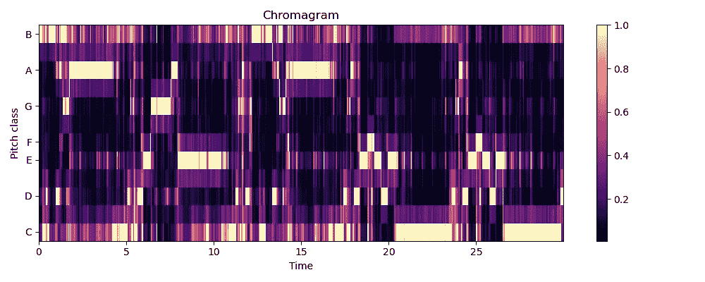

歌曲 5 的色谱图

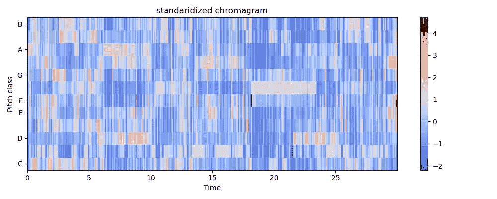

歌曲 5 的标准化色谱图

同样，在色谱图上使用 VGG16，但是其特征比基于 MFCC 的特征稍差。基于 MFCC 光谱图和色谱图的特征被连接，但是推荐没有改进。

## 元数据和其他功能

元数据的可用性是选择 FMA 数据集的主要原因之一。目标是推荐的质量至少应该接近基于元数据的推荐。到目前为止，功能(基于 MFCC 和色谱图)与推荐的类型相比是次等的。

歌曲大致分为 8 种类型，即“嘻哈”、“流行”、“民谣”、“实验”、“摇滚”、“国际”、“电子”和“器乐”。有些归入“国际”一类的歌曲与其他流派的歌曲比同一流派的歌曲更相似。例如，俄语中的摇滚歌曲比宝莱坞歌曲更类似于摇滚风格的歌曲。

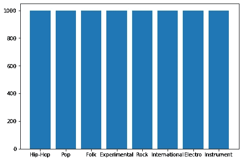

每种类型的 1000 首歌曲

所使用的其他元数据特征是专辑发行日期、艺术家活跃年数、艺术家 id、艺术家纬度和经度、音轨持续时间、最爱数量、收听数量、语言代码、音轨标题和流派 _ 全部(可以是子流派)。

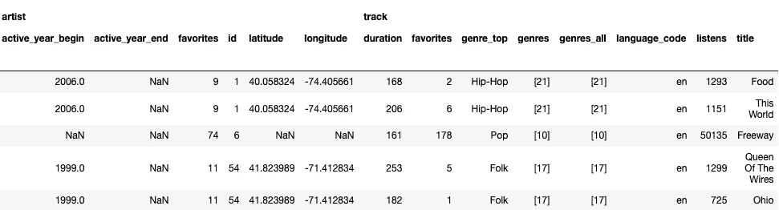

在特征化之后，它们被表现在 2495 个维度中。

在某些情况下，元数据可能是不相关的，因为它们代表整首歌曲，而不是专门用作数据点的 30 秒片段。

使用 [LibRosa](https://librosa.github.io/librosa/_modules/librosa/feature/spectral.html#mfcc) 提取的基于音频的 518 特征在该数据集中也是可用的。其中包括 chroma_cens、tonnetz、spectral_contrast、spectral_centroid、spectral_bandwidth 和 spectral_rolloff。大多数歌曲都没有 Echonest 功能，所以被忽略了。

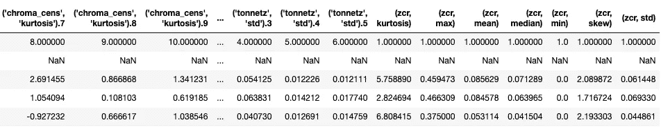

使用基于 MFCC 的 VGG16 特征，流派分类达到了 40%的准确度。连接元数据、基于音频的特征、基于 MFCC 的 VGG16 特征、基于流派预测模型的特征以及流派并没有显著地改善推荐，并且继续劣于基于流派的推荐。

## 标签预测模型

在可从 [musicnn 库](https://arxiv.org/abs/1909.06654)获得的[百万歌曲数据集](http://ismir2011.ismir.net/papers/OS6-1.pdf)上训练的“MSD_musicnn_big”模型将歌曲分成不重叠的 3 秒窗口，并预测每个窗口 50 个标签(例如:古典、合唱、男声等)的可能性。它们被逐列相加并用作特征。

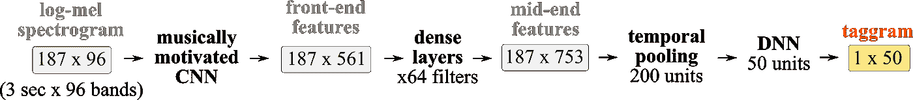

MSD _ musicnn[来源:[文档](https://github.com/jordipons/musicnn/blob/master/DOCUMENTATION.md)

不幸的是，他们也没有改进建议。

# 未来的工作

流派预测模型的准确率仅为 56%，并且可以通过将数据点分成两个 15 秒的片段来增加数据点的数量，从而容易地提高准确率。此外，由于工作特征是已知的，这可以使用包含 106，574 个轨道和 161 个流派的 fma_large 数据集来平滑地放大。除了 VGG16，也可以探索其他预训练的模型。

[小波变换](https://www.coursera.org/lecture/advanced-machine-learning-signal-processing/continous-wavelet-transform-dByZE)，gammatone 滤波器和 bark 尺度是可以进一步考虑的其他想法。

**随时和我联系** [**LinkedIn**](https://www.linkedin.com/in/g-pravin-shankar-825049184) 。

# 参考

*   [https://www . Applied ai course . com/course/11/Applied-Machine-learning-course](https://www.appliedaicourse.com/course/11/Applied-Machine-learning-course)
*   [https://arxiv.org/abs/1612.01840](https://arxiv.org/abs/1612.01840)
*   [https://benanne.github.io/2014/08/05/spotify-cnns.html](https://benanne.github.io/2014/08/05/spotify-cnns.html)
*   [https://arxiv.org/abs/1909.06654](https://arxiv.org/abs/1909.06654)
*   [https://librosa.github.io/librosa/](https://librosa.github.io/librosa/)
*   [https://www . ACS . PSU . edu/drussell/Demos/waves/wave motion . html](https://www.acs.psu.edu/drussell/Demos/waves/wavemotion.html)
*   [https://medium . com/activating-robotic-minds/up-sampling-with-transposed-convolution-9 AE 4 F2 df 52d 0](/activating-robotic-minds/up-sampling-with-transposed-convolution-9ae4f2df52d0)
*   [https://archive . org/details/spectrogramcestrumandmel-frequency _ 636522](https://archive.org/details/SpectrogramCepstrumAndMel-frequency_636522)
*   [http://practical cryptography . com/miscellaneous/machine-learning/guide-Mel-frequency-ceps tral-coefficients-mfccs/](http://practicalcryptography.com/miscellaneous/machine-learning/guide-mel-frequency-cepstral-coefficients-mfccs/)
*   [https://medium . com/s/story/spotifys-discover-weekly-how-machine-learning-finds-your-new-music-19 a 41 ab 76 EFE](/s/story/spotifys-discover-weekly-how-machine-learning-finds-your-new-music-19a41ab76efe)
*   [https://towards data science . com/how-to-apply-machine-learning-and-deep-learning-methods-to-audio-analysis-615 e 286 fcbbc](https://towardsdatascience.com/how-to-apply-machine-learning-and-deep-learning-methods-to-audio-analysis-615e286fcbbc)
*   [https://waitbutwhy.com/2016/03/sound.html](https://waitbutwhy.com/2016/03/sound.html)
*   [https://www . izotope . com/en/learn/digital-audio-basics-sample-rate-and-bit-depth . html](https://www.izotope.com/en/learn/digital-audio-basics-sample-rate-and-bit-depth.html)
*   https://journals.sagepub.com/doi/10.1177/0305735617697507
*   [https://www . zlab . mcgill . ca/publications/docs/2018 _ za Torre _ whywelovemusic . pdf](https://www.zlab.mcgill.ca/publications/docs/2018_zatorre_whywelovemusic.pdf)
*   [http://sites . music . Columbia . edu/CMC/music and computers/chapter 2/02 _ 03 . PHP](http://sites.music.columbia.edu/cmc/MusicAndComputers/chapter2/02_03.php)
*   [https://www . khanacademy . org/science/health-and-medicine/neural-system-and-sensory-infor/sound-audition-topic/v/auditory-structure-part-1](https://www.khanacademy.org/science/health-and-medicine/nervous-system-and-sensory-infor/sound-audition-topic/v/auditory-structure-part-1)
*   [https://www . khanacademy . org/science/in-in-class 9-physics-India/in-in-sound-India/in-in-structure-of-human-ear/v/human-ear-structure-working](https://www.khanacademy.org/science/in-in-class9th-physics-india/in-in-sound-india/in-in-structure-of-human-ear/v/human-ear-structure-working)
*   [https://www . physics class room . com/class/sound/Lesson-4/Natural-Frequency](https://www.physicsclassroom.com/class/sound/Lesson-4/Natural-Frequency)
*   [https://en . Wikipedia . org/wiki/Equal-loudness _ contour #/media/File:lindos 1 . SVG](https://en.wikipedia.org/wiki/Equal-loudness_contour#/media/File:Lindos1.svg)
*   [https://en.wikipedia.org/wiki/Phon](https://en.wikipedia.org/wiki/Phon)
*   [https://doi.org/10.1371/journal.pone.0018861](https://doi.org/10.1371/journal.pone.0018861)
*   [https://en.wikipedia.org/wiki/Mel_scale](https://en.wikipedia.org/wiki/Mel_scale)
*   [https://en.wikipedia.org/wiki/Mel-frequency_cepstrum](https://en.wikipedia.org/wiki/Mel-frequency_cepstrum)
*   [https://en.wikipedia.org/wiki/Bark_scale](https://en.wikipedia.org/wiki/Bark_scale)
*   [https://better explained . com/articles/an-interactive-guide-to-the-Fourier-transform/](https://betterexplained.com/articles/an-interactive-guide-to-the-fourier-transform/)
*   【https://www.youtube.com/watch?v=spUNpyF58BY 号
*   [https://www . coursera . org/lecture/advanced-machine-learning-signal-processing/连续小波变换-dByZE](https://www.coursera.org/lecture/advanced-machine-learning-signal-processing/continous-wavelet-transform-dByZE)
*   [https://en.wikipedia.org/wiki/Chroma_feature](https://en.wikipedia.org/wiki/Chroma_feature)
*   [https://en.wikipedia.org/wiki/Discrete_Fourier_transform](https://en.wikipedia.org/wiki/Discrete_Fourier_transform)