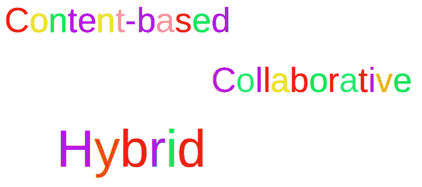
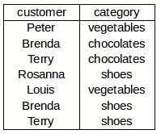
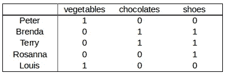
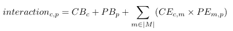
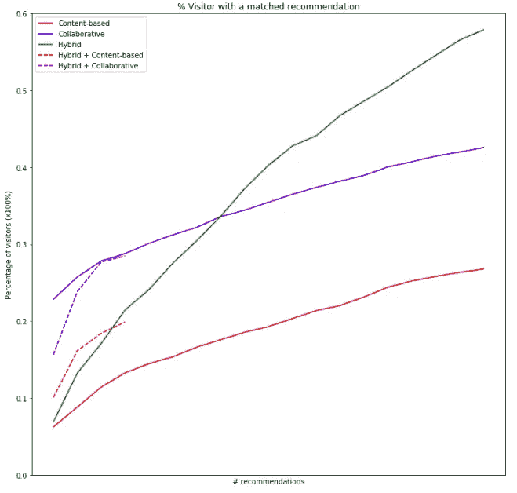

# 电子商务客户推荐系统第二部分(协同过滤)

> 原文：<https://medium.com/analytics-vidhya/content-based-collaborative-and-hybrid-recommender-for-e-commence-customers-part-ii-e0b9e5a8b843?source=collection_archive---------1----------------------->

本系列的第二篇文章介绍了实现构建电子商务推荐系统的协作方法的理论和代码。

第一部分:[基于内容的](/@rmwkwok/content-based-collaborative-and-their-hybrid-approaches-for-recommendation-making-to-e-commence-e2015830a04f)

第二部分:[协同](/@rmwkwok/content-based-collaborative-and-hybrid-recommender-for-e-commence-customers-part-ii-e0b9e5a8b843)

第三部分:[混合动力](/@rmwkwok/content-based-collaborative-and-hybrid-recommender-for-e-commence-customers-part-iii-2e225d2e6d21)



## 基于内容的方法的问题

在上一篇文章中，我们讨论了基于内容的商品推荐方法。总的来说，它利用现有的关于顾客和商品的数据对推荐的商品进行排序，以获得顾客的青睐。

但是，当使用基于内容的方法无法收集关于客户和项目的足够信息时，可能是因为客户和项目增长太快，并且增长不受控制，那么协同过滤可以在这里做出贡献。让我们理解它是如何工作的。

# 协同过滤方法

与基于内容的方法不同，协同过滤方法利用任何客户和项目之间的交互历史来相互推荐。因此，这种方法可以在不深入了解每个客户和每个项目的情况下工作。但是我们仍然需要一些事件历史来告诉我们一个人喜欢另一个人的可能性有多大。让我们开始处理数据。

注意:如[第一篇文章](/@rmwkwok/content-based-collaborative-and-their-hybrid-approaches-for-recommendation-making-to-e-commence-e2015830a04f)中所述，向客户推荐类别，而不是项目。



交互历史:在每一行中，客户查看/添加到购物车/购买某一类别的商品

从事件数据库中，很容易提取一个类似上面的表，列出谁与什么进行了交互。假设客户总是喜欢互动的类别(这是一个弱假设，更强的假设可能是客户如果购买了它就会喜欢它)，可以构建如下的客户-类别互动矩阵。



原始形式的客户类别交互矩阵

如果我们将每一行标准化，那么任意两行(客户)的点积会告诉我们它们有多相似，如果它们非常相似，那么就有可能向一个客户推荐另一个客户也喜欢的看不见的类别。例如，Brenda 和 Terry 有相似的兴趣，Rosanna 和他们很亲近，也许我们可以尝试向 Rosanna 推荐一些“巧克力”?这听起来可能没有说服力，但是如果有更多的列来更全面地描述每个客户呢？

请记住，我们只是在三个方面理解它们，但是随着我们对它们了解得越来越多，我们的建议可能会更有意义。现在，我们可以很快总结出协作过滤实现的基本思想——建议相似的客户喜欢什么。然而，我们将通过开发客户嵌入和类别嵌入来进一步发展这种方法。

## 嵌入

这个原始的客户-类别交互矩阵将客户描述为他们喜欢的类别。然而，客户可能只有机会了解所有类别中的一小部分，这限制了他们在我们的推荐系统中对所有类别的偏好表达。解决这个问题的一个方法是归纳类别，或者找到类别之间最有代表性的共同特征，并观察客户对这些特征的反应。它们是我将在下面的讨论中提到的**嵌入式特性**。

您可能想知道我们如何将它们归纳为嵌入式功能。这个想法是利用所有客户的交互历史。例如，让我们暂时忘记上面我的非常小的顾客表，Aaron 喜欢水果、蔬菜和配料，但是在我们的记录中他从来没有吃过面条。然而，在我们的完整客户圈子中，85%喜欢前三者的人也喜欢面条，那么也许我们可以将这四者结合成一个嵌入式功能，并给这 85%的客户 1 作为该功能的值，给 Aaron 0.6。这里结合的不是它们都是食物的性质，而是顾客的行为——相似的顾客喜欢相似的类别。

当然，人们总是可以尝试将嵌入式功能背后的含义解释为人类可以理解的东西，但是，不能保证存在明确的解释，并且随着客户行为的转变，嵌入式功能中嵌入的内容也会发生变化。因此，分析解释意义不是本次讨论的关注点。

我们不可能自己检查所有的客户和类别交互，而是依靠一些数学算法将交互矩阵转换成嵌入。很多时候它们是成对出现的，这里会有一个客户嵌入，为我们提供客户和嵌入特性之间的关系，还有一个类别嵌入，为我们提供类别和嵌入特性之间的关系。

有多种算法可以做到这一点，如奇异值分解和 WALS，以及任何其他降维技术。其中，我将谈论使用神经网络。

## 用神经网络训练嵌入


在深入研究代码之前，我们将首先了解代码背后的概念。我们最初的相互作用矩阵是上面公式左手边的那个巨大的矩阵。它有 *C* 个客户和 *P* 个类别，总共有 *C* x *P* 个参数，其中大部分为零。神经网络是一个优化过程，它将相互作用矩阵分解成两个主要部分——两个嵌入，以及一些偏差项。

总的来说，嵌入和偏差的参数数量比交互矩阵少得多，这取决于 *E* 的值，即嵌入大小——这告诉我们我们认为有多少嵌入特征足以捕捉或概括出客户行为的最重要属性。

神经网络所做的是不断调整公式右侧的参数，以使两侧之间的差异尽可能小——差异越小，右侧越能更好地捕捉左侧。现在让我们看看代码。

```
from keras.layers import Input, Embedding, Dot, Reshape, Dense, Add, Activation
from keras.models import Model*# input1_dim: total number of customers
# input2_dim: total number of categories
# emb_size: embedding size - How many embedded features to generalize customers' behavior*input1 = Input(name='customer', shape=[1])
input2 = Input(name='category', shape=[1])*# Embedding*
input1_emb  = Embedding(name = 'customer_emb',
                        input_dim  = input1_dim, 
                        output_dim = emb_size)(input1)input2_emb  = Embedding(name = 'category_emb',
                        input_dim  = input2_dim,
                        output_dim = emb_size)(input2)*# Bias*
input1_bias = Embedding(name = 'customer_bias',
                        input_dim  = input1_dim,
                        output_dim = 1)(input1)input2_bias = Embedding(name = 'category_bias',
                        input_dim  = input2_dim,
                        output_dim = 1)(input2)merged = Dot(name='dot', normalize=True, axes=2)\
            ([input1_emb, input2_emb])merged = Add(name='add')\
            ([merged,input1_bias,input2_bias])merged = Reshape(target_shape=[1])(merged)output = Activation('sigmoid')(merged)model  = Model(inputs=[input1, input2], outputs=output)
```

代码建立了一个等效于以下公式的模型。



CB:客户偏差向量。PB:类别偏差向量。CE:客户嵌入矩阵。PE:类别嵌入矩阵。顾客。p:类别。

为了训练模型，`input1`和`input2`分别接受客户和相应类别的列表。因为这些是现有的相互作用，所以模型参数然后被优化算法调整以输出 1 或接近 1。不存在的交互也应该被表示出来，这样模型可以被训练为输出 0 或接近 0。嵌入项是我们需要的，偏差告诉我们客户之间的系统差异，以及项目之间的系统差异，这可以通过其他方式加以利用。

经过训练的嵌入参数可以从模型中提取出来，沿着嵌入特征的轴进行归一化，并使用结果来预测客户在所有类别中欢迎某个类别的可能性。

```
import numpy as np*# customer_embedding: 2d array. 0th axis: customers, 1st: embedded features, normalized along 1st axis
# category_embedding: 2d array. 0th axis: categories, 1st: embedded features, normalized along 1st axis**# matrix multiply the two embedding so it calculates the cosine similarity between each customer and every categories.*
customer_category = np.matmul(customer_embedding,
                              category_embedding)
```

# 摘要

我们已经讨论了协同过滤的实现，以及如何构建一个接受原始历史数据并给出嵌入的模型。

最后一种混合方法利用了基于内容和协作过滤的发现，将在下一篇文章[中介绍。为了显示这些方法在我的数据(非常有限)上的差异，我绘制了访问了推荐类别但没有真正通知他们推荐的客户的百分比。](/@rmwkwok/content-based-collaborative-and-hybrid-recommender-for-e-commence-customers-part-iii-2e225d2e6d21)

x 轴表示推荐的数量。y 轴是客户的百分比。虽然推荐数量越少，百分比越低，这听起来很糟糕，但是，根据商业案例，推荐者不仅要做出准确的预测，还要通过提出合理的建议来拓宽客户的视野，这些建议可能是他们所不知道的。这个情节将在[混合篇](/@rmwkwok/content-based-collaborative-and-hybrid-recommender-for-e-commence-customers-part-iii-2e225d2e6d21)中讨论。



感谢您阅读这篇文章并关注这个系列。请在下面留下您的意见和建议。