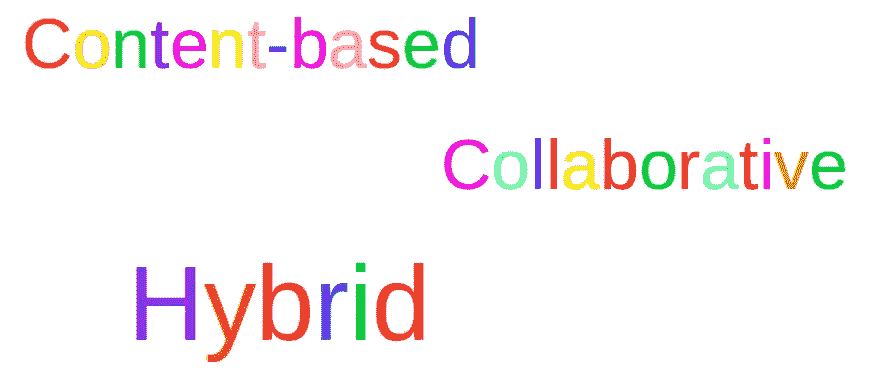
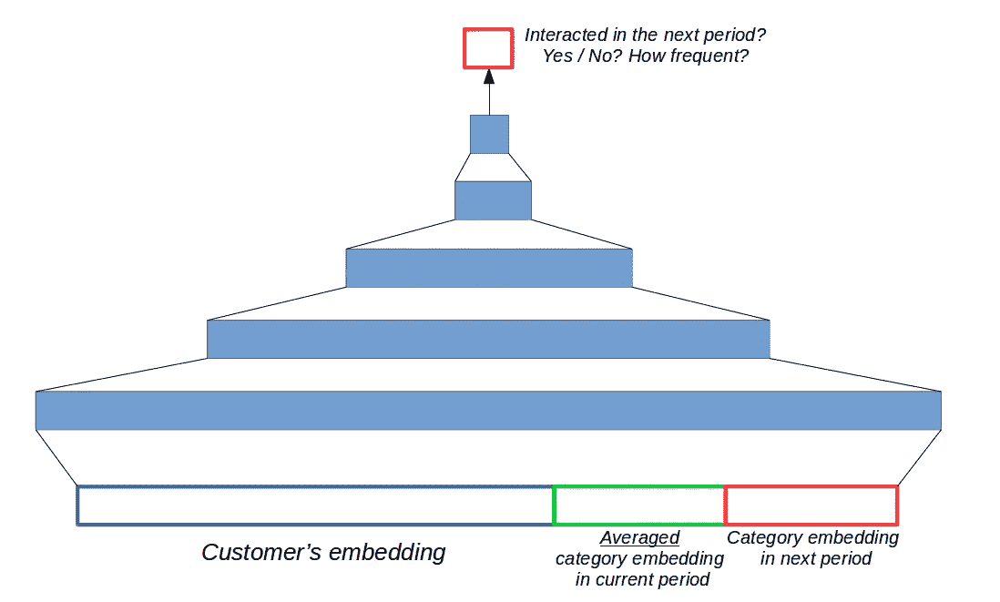
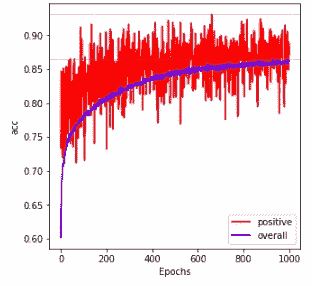
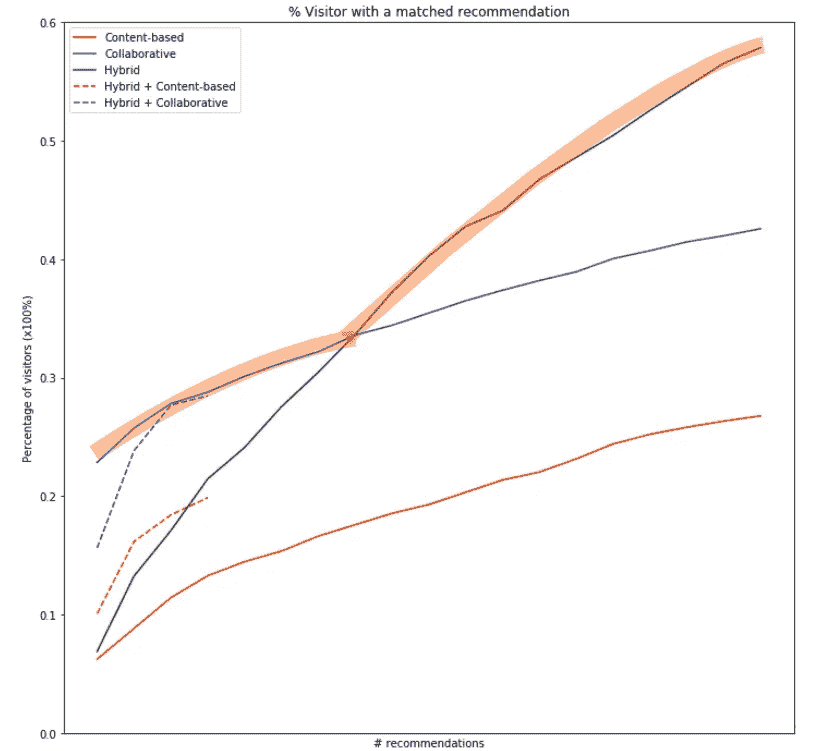

# 电子商务客户推荐系统第三部分(混合推荐)

> 原文：<https://medium.com/analytics-vidhya/content-based-collaborative-and-hybrid-recommender-for-e-commence-customers-part-iii-2e225d2e6d21?source=collection_archive---------2----------------------->

*用代码*解释

第一部分:[基于内容的](/@rmwkwok/content-based-collaborative-and-their-hybrid-approaches-for-recommendation-making-to-e-commence-e2015830a04f)

第二部分:[协同](/@rmwkwok/content-based-collaborative-and-hybrid-recommender-for-e-commence-customers-part-ii-e0b9e5a8b843)

第三部分:[混合动力](/@rmwkwok/content-based-collaborative-and-hybrid-recommender-for-e-commence-customers-part-iii-2e225d2e6d21)



这是这个推荐器系列的第三篇文章，主要关注混合方法。系列中使用的介绍和数据请参考[第一篇](/@rmwkwok/content-based-collaborative-and-their-hybrid-approaches-for-recommendation-making-to-e-commence-e2015830a04f)。

# 混合工艺

在[第一篇文章](/@rmwkwok/content-based-collaborative-and-their-hybrid-approaches-for-recommendation-making-to-e-commence-e2015830a04f)中的基于内容的方法中，每个推荐的项目都用我们对它们的了解来描述，例如对于一个电影项目，描述应该包括它的导演、演员、类型、语言、运行时间、专业评论、诸如计算机图形等效果的使用等等。然后基于顾客在历史中喜欢的东西，可以推荐一些新的但相似的商品。在[第二篇](/@rmwkwok/content-based-collaborative-and-hybrid-recommender-for-e-commence-customers-part-ii-e0b9e5a8b843)的协同过滤中，没有对某个物品的明确描述，而是利用物品与顾客之间的交互历史来发现顾客之间的行为模式，从而向顾客推荐相似顾客喜欢的物品。

构建混合系统没有标准的规则，我认为当你巧妙地结合不同方法的优点时，你可以使用这个术语。这里也是一样，我的尝试是在基于内容的方法中使用类别嵌入，在协作过滤方法中使用客户嵌入。它们将被用作一个新的神经网络的输入，看看这是否有所不同。

经过训练的模型可以用于两种不同的模式—

(1)使用它来重新排序由先前方法排序的建议，以及

(2)用它来做自己的推荐。我们将在最后用一个图来比较所有这些方法的效果。

## 另一个神经网络利用先前准备的嵌入

让我们从代码开始，它实际上是一个简单的顺序 5 层神经网络。

```
from keras.layers import Input, Dense
from keras.models import Model*# nfeats: int, number of features. In our case, this is the size of a user embedding, plus the two times the size of a category's embedding*inputlayer  = Input(name='input', shape=[nfeats])
denselayer  = Dense(int(nfeats*1.5), activation='relu')(inputlayer)
denselayer  = Dense(nfeats//1,       activation='relu')(denselayer)
denselayer  = Dense(nfeats//4,       activation='relu')(denselayer)
denselayer  = Dense(nfeats//16,      activation='relu')(denselayer)
outputlayer = Dense(1, activation='sigmoid')(denselayer)model = Model(inputs=[inputlayer], outputs=outputlayer)
```

这个神经网络的结构可以调整到最佳性能，值得讨论的是输入。客户事件记录大致有 3 个月长，分为几期，每期 18 天。扩展输入数据大小存在重叠周期。

提醒一下，在每个客户记录中都有一个客户 ID，以及他与之交互(查看/添加到购物车/购买)的商品的类别 ID。

在每个周期中，对于每个客户，(1) *获得所有类别嵌入* *互动*的平均值，连同(2) *客户的嵌入*，(3) *他在下一周期互动的类别的嵌入*。



5 层神经网络。输入由三部分组成:(1)蓝色:一个客户的嵌入(2)绿色:本期平均的类别嵌入(3)红色:下一期的类别嵌入。在预测过程中，红框可以用不同的类别代替，以测试客户未来与它互动的可能性。

输入的选择很重要，如果能向神经网络提供更全面的输入，结果会更好！这里所展示的当然只是实现它的一种方式。

这个神经网络告诉我们，给定一个客户的属性(蓝框)和他的记录(绿框)，他有多大可能与红框中的类别进行交互。在训练过程中，不同的类别可以放在红框中，预期输出标签在 0 到 1 之间，取决于他在下一阶段是否与它互动或互动多少次。在训练过程中应提供阳性(标签> 0)和阴性(标签=0)样本。



精确测量的训练曲线。紫色线是模型的实际训练曲线，随着时间的推移有增加的趋势。红线是仅监控阳性样本的准确性。在训练过程中，由于新的阴性样本的加入，其波动很大。

# 所有方法的比较

让我们把上面的神经网络命名为混合模型。基于内容的模式(下图中的红线)、协同过滤模式(紫线)和这种混合模式(绿线)都可以向客户提供自己的推荐。此外，基于内容和协同过滤推荐的类别可以放入混合模型中用于重新排序(红色虚线和紫色虚线)。所有这些方法的结果都是通过绘制客户在没有真正向他们发送推荐的情况下获得匹配的百分比来检验的。x 轴指的是推荐的大小，很自然，当你做更多的推荐时，它可能会得到一个匹配。



在下一个周期中有匹配建议但没有通知他们建议的客户的百分比—本质上这是关于建议的精确度。

虽然可以看出基于内容的(红线)表现最差，因为它总是低于所有其他的，但这不是方法的问题，而是对类别的描述可能不够好，不能突出类别的共同特征(增加真阳性)或使它们易于区分(减少假阳性)。类别的附加功能可能会有所帮助。

由于缺乏一个好的描述，协作(紫色线)总是做得更好约 15%以上，表明客户和类别之间的交互历史本身具有良好的预测能力。

混合(绿线)模型在一个临界点上击败了协作(紫线)模型，这是一个令人鼓舞的结果，我们可以在不同的情况下在这两种模型之间切换，以达到最佳匹配！

虚线是通过使用混合模型对基于内容和协作方法的推荐进行重新排序。在基于内容的情况下可以看到改进，因为混合模型更好，但在协作的情况下则相反。因此，如果我们想要向客户提供更安全(这是基于内容的方法的本质)但更好的推荐，我们可以选择混合+基于内容的模式。

最后，在这个结果中，客户没有被告知建议，所以如果不是这样，它可以做得更好。不要忘记，推荐不仅仅是做出精确的预测(当然，这也非常重要，因为用非常糟糕的推荐打扰客户是不必要的)，在我看来，它也是让客户发现。

# 摘要

提出并比较了三种推荐方法。值得注意的是，它们只是我们所了解的客户数据的不同用途，而不是唯一的方法。

有时，这种方法会受到对客户和推荐项目的理解程度的限制，有时会受到数据和计算资源的大小的限制，有时会受到业务案例或保守性预期水平的限制，要使用的正确方法是在所有这些约束条件下做得更好的方法。

这些话听起来太常识了，但它很好地提醒了我们，这是创造力需要发挥作用以使事情顺利发生的时候，所以请永远不要被束缚。

感谢您阅读这篇文章并关注这个系列。请随时分享您的意见和反馈。