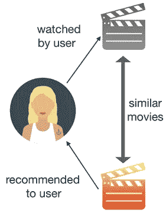
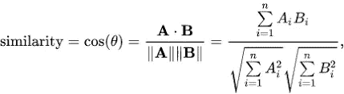
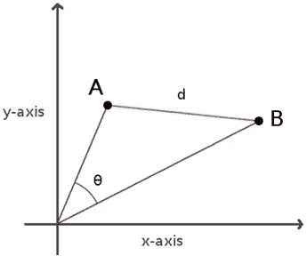
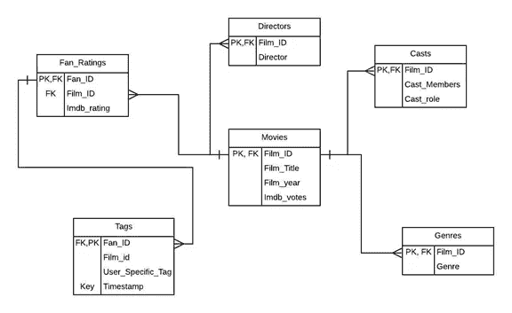
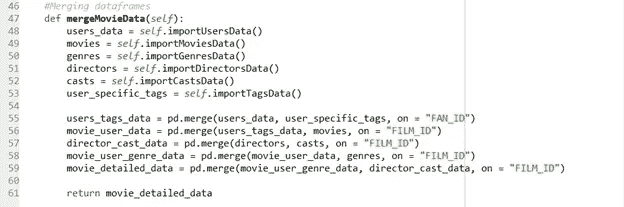
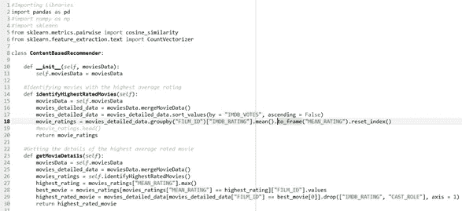
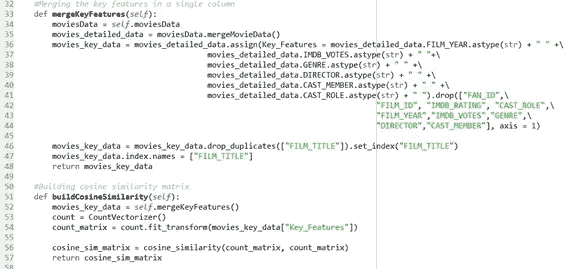
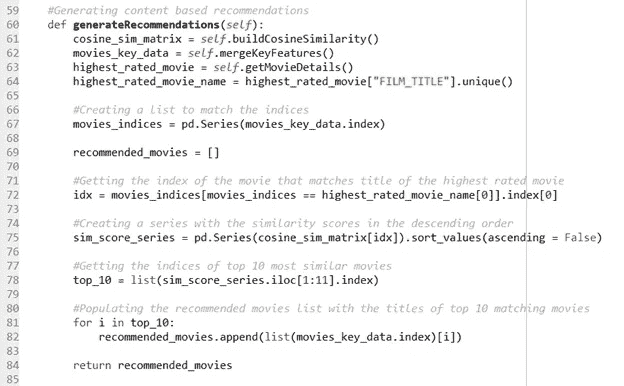
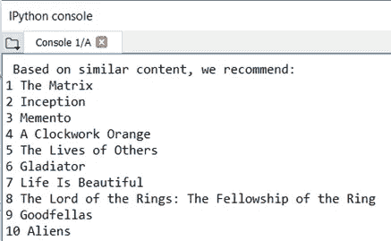
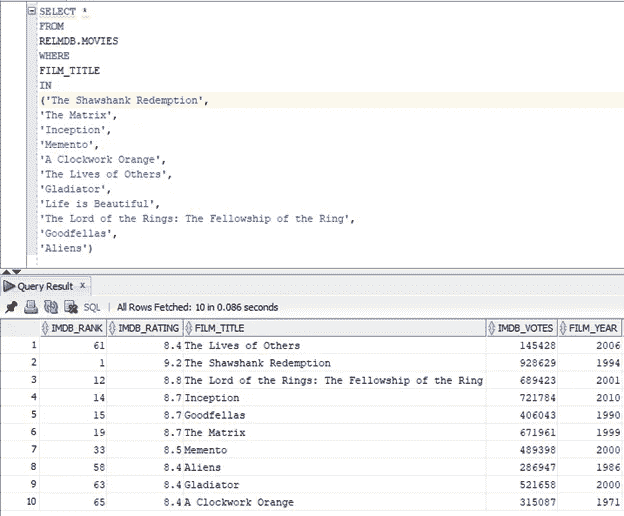

# 基于内容的电影推荐系统

> 原文：<https://medium.com/analytics-vidhya/content-based-movie-recommender-system-c684d663ee38?source=collection_archive---------12----------------------->

**摘要**

利用余弦相似度构建基于内容的电影推荐系统

**目录**

1.行动纲要

2.介绍

3.算法

3.1.基于内容的过滤

3.2.余弦相似性

4.目标

5.方法学

5.1.示例数据库模式

5.2.Python-Oracle 数据库连接

5.3.准备样本数据集

5.4.识别最高评级的电影并获得最佳电影细节

5.5.融合关键特征并构建余弦相似度矩阵

5.6.生成建议

5.7.结果

6.结论

7.项目存储库

8.参考

**1。** **执行摘要**

每当我们访问一个数字平台时，我们不再需要担心接下来要看什么，因为我们有一堆推荐可供选择。而是平台如何决定向特定用户推荐什么，以及用户是否会喜欢。

在这个项目中，我们试图通过扩展 RELMDB oracle 数据库来构建一个特定类型的推荐系统。我们试图建立一个推荐系统，根据 IMDb 投票数和平均 IMDb 评分来识别最佳电影，并向用户推荐内容相似的电影。我们首先从 oracle 数据库中导入和管理数据，以创建我们的基本数据集。然后，我们识别最佳电影，并使用余弦相似性算法向用户推荐前 10 部相似的电影。

**2。** **简介**

推荐系统是一种信息过滤系统，它试图预测用户的偏好，并根据这些偏好提出建议。

推荐系统在我们的生活中变得无处不在，并在我们使用的各种在线平台上实现。无论我们是想在网上购买，在决定接下来听哪首歌或看什么方面有困难，在需要一个新朋友或寻找约会对象时，几乎所有我们需要的在线平台都有推荐。即使是谷歌搜索结果也会考虑用户的偏好，结果也会因用户而异。这些系统通常能够收集关于用户选择的信息，并可以使用这些信息来改进未来的建议。这些推荐系统考虑不同的因素，如受欢迎程度、项目之间的相似性，甚至不同用户选择之间的相似性，并可以使用这些方法在未来改进建议。例如，如果网飞注意到一些用户喜欢在脸书上分享的新推出的网飞原创节目的预告片，它可以利用这些信息在该节目在网飞发布后立即向特定用户推荐该节目。同样，如果网飞注意到一些用户对脸书上分享的一些内容反应消极，它可以拒绝向这些用户推荐这些内容。此外，推荐系统可以基于用户观看或喜欢的节目内容进行推荐。例如，如果 Prime Videos 观察到用户观看了大量高评级的科幻电影，它将寻找其他具有类似内容和评级的科幻电影，并向用户推荐这些电影。

虽然有很多方法可以构建推荐系统，但该项目特别关注一种特殊类型的电影推荐系统，该系统挖掘具有最高 IMDb 票数和最高平均 IMDb 评分的电影的细节，并将其视为最佳电影，它会推荐具有类似内容的前 10 部电影。

**3。** **算法**

对于我们的项目，我们专注于基于内容的过滤来生成推荐。

**3.1。** **基于内容过滤**

**图 3.1。基于内容的过滤**

基于内容的过滤不涉及其他用户，但基于我们的偏好，该算法将简单地挑选具有相似内容的项目，为我们生成推荐。

这种算法提供的推荐不太多样，但不管用户是否对事物进行评价，它都会起作用。

例如，可能有这样一种情况，用户潜在地喜欢科幻动作电影，但他可能永远不会知道，除非他决定自主地尝试一下。所以，这个过滤器所做的，就是不断推荐超级英雄电影或者类似的。我们可以在许多属性上计算这种相似性，但是在我们的情况下，我们基于以下关键特征来构建该推荐系统:

IMDb 投票

平均 IMDb 评级

类型

导演

演职人员和演职角色

电影年

用户特定的标签

现在，让我们继续讨论我们一直提到的术语，相似性，以及它在我们的上下文中的含义。这似乎不是我们可以量化的东西，但它是可以测量的。在我们继续讨论用于构建基于内容的推荐系统的方法之前，让我们简要讨论余弦相似性的概念，余弦相似性是一种可用于计算用户或内容之间相似性的度量标准。

**3.2。** **余弦相似度**

余弦相似度可以定义为一种度量两个非零向量之间差异的方法。在我们的例子中，电影标题和关键电影特征代表电影向量的坐标。因此，为了计算两部电影之间的相似性，如果我们知道两部电影的电影标题和关键特征，我们只需要计算两部电影向量之间的差异。

余弦相似性公式可以数学描述如下。

**图 3.2。余弦相似性公式**

A.B =两个电影向量之间的点积，

||A||||B|| =两个电影矢量的大小的乘积

**图 3.3。** **电影矢量表示法**

如图 3.3 所示。电影向量 A 和 B 下方的区域表示电影的内容，它们之间的角度θ表示电影内容之间的相似性。因此，角度θ越低，电影内容越相似。

余弦相似度值的范围可以在 0 到 1 之间，具体取决于 0 到 90 之间的θ值。

**4。** **目标**

所提出的推荐系统试图使用通过合并从 RELMDB oracle 数据库导入的不同表而创建的详细电影数据集来识别具有与最佳电影相似的内容的电影。目标是基于电影与最佳评级电影的相似性分数来创建电影的推荐。基于相似性得分，推荐系统将能够识别具有最高相似性得分的前 10 部电影，并且将它们作为前 10 个推荐呈现。

**5。** **方法论**

**5.1。** **样本数据库模式**

为了构建基于内容的电影推荐系统，使用 oracle 数据库来扩展 RELMDB 数据库，根据需要修改表，并根据需要添加一些表。下面是我们用来创建详细数据集的最终数据库模式。

**图 5.1。** **电影数据库模式**

**5.2。** **Python-Oracle 数据库连接**

为了将数据库表导入 python 类， **cx_oracle** 库用于创建与 oracle 数据库的连接。

**图 5.2。数据库连接**

**5.3。** **准备样本数据集**

Pandas 库函数用于创建样本数据集。

**图 5.3。数据准备**

**5.4。** **识别评分最高的电影并获得最佳电影细节**

在通过 IMDb 投票的数量对详细的电影数据集进行分类之后，计算电影的平均 IMDb 评级，并且具有最高平均 IMDb 评级的电影被认为是最好的或最高评级的电影。

**图 5.4。确定最佳电影**

**5.5。** **融合关键特征，构建余弦相似度矩阵**

为了拟合 scikit-learn 库的 2D 计数向量，电影的所有关键特征被合并在单个列中，并且 scikit-learn 库的余弦相似性方法被用于创建余弦相似性矩阵，其中计数电影向量被用作输入矩阵。

**图 5.5。余弦相似矩阵**

**5.6。** **生成建议**

然后根据余弦相似性得分对前 10 部电影进行排序，并作为最终推荐返回。

**图 5.6。生成建议**

5.7。结果**结果**

**图 5.7。推荐结果**

为了评估我们的推荐系统生成的前 10 名推荐，我们随后将推荐的电影与评级最高的电影“肖申克的救赎”进行了比较，运行了一个 SQL 脚本来显示 IMDb 评级、IMDb 投票和电影年份等关键特征。

**图 5.8。推荐电影简介之间的比较**

通过观察这些关键特征，我们可以看到基于这些关键特征的推荐电影具有相似的简档。

**6。** **结论**

总之，由使用余弦相似性算法执行的基于内容的过滤提供动力的推荐系统可以通过向用户建议具有类似关键特征的电影来为用户做出更好的推荐，这些关键特征例如 IMDb 投票、平均 IMDb 评级、类型、发行年份、演员、导演、用户标签等。

**7。** **项目资源库**

请访问我的 GitHub 库。

[https://github.com/AnkitRajSri/MovieRecommenderSystem](https://github.com/AnkitRajSri/MovieRecommenderSystem)

**8。**参考文献**参考文献**

[https://pdfs . semantic scholar . org/767 e/ed 55d 61 E3 ABA 4 E1 d 0 e 175d 61 f 65 EC 0 D6 c 08 . pdf](https://pdfs.semanticscholar.org/767e/ed55d61e3aba4e1d0e175d61f65ec0dd6c08.pdf)

[https://medium . com/@ bkexcel 2014/building-movie-recommender-systems-using-cosine-similarity-in-python-eff 2d 4 e 60d 24](/@bkexcel2014/building-movie-recommender-systems-using-cosine-similarity-in-python-eff2d4e60d24)

[https://link . springer . com/chapter/10.1007/978-3-642-21793-7 _ 63](https://link.springer.com/chapter/10.1007/978-3-642-21793-7_63)

[https://www . kdnugges . com/2019/04/building-recommender-system . html](https://www.kdnuggets.com/2019/04/building-recommender-system.html)